Marcin Ziemba 15.05.2025
Sprawozdanie 2

## 1. Przygotowanie Jenkins

Zaczynamy od stworzenia kontenera z jenkinsem, następnie uruchomiamy go z dind.

```
docker network create jenkins
```

<<<<<<< HEAD
![**!\[\]\[image1\]**](../Sprawozdanie1/lab4_ss/ss26.png)
=======
![**!\[\]\[image1\]**](../Sprawozdanie1/lab4_ss/ss26.png)
>>>>>>> refs/remotes/origin/MZ417749
```

FROM jenkins/jenkins:2.492.2-jdk17
USER root
RUN apt-get update && apt-get install -y lsb-release ca-certificates curl && \
    install -m 0755 -d /etc/apt/keyrings && \
    curl -fsSL https://download.docker.com/linux/debian/gpg -o /etc/apt/keyrings/docker.asc && \
    chmod a+r /etc/apt/keyrings/docker.asc && \
    echo "deb [arch=$(dpkg --print-architecture) signed-by=/etc/apt/keyrings/docker.asc] \
    https://download.docker.com/linux/debian $(. /etc/os-release && echo \"$VERSION_CODENAME\") stable" \
    | tee /etc/apt/sources.list.d/docker.list > /dev/null && \
    apt-get update && apt-get install -y docker-ce-cli && \
    apt-get clean && rm -rf /var/lib/apt/lists/*
USER jenkins
RUN jenkins-plugin-cli --plugins "blueocean docker-workflow"

```

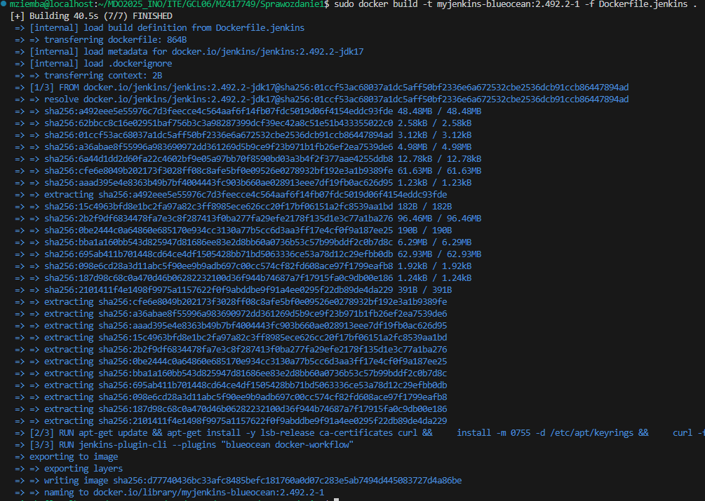

Kolejno uruchamiamy kontenery.

```
sudo docker run  
--name jenkins-blueocean   
--restart=on-failure   
--detach   
--network jenkins   
--env DOCKER_HOST=tcp://docker:2376   
--env DOCKER_CERT_PATH=/certs/client
--env DOCKER_TLS_VERIFY=1   
--publish 8080:8080   
--publish 50000:50000   
--volume jenkins-data:/var/jenkins_home   
--volume jenkins-docker-certs:/certs/client:ro   
myjenkins-blueocean
```

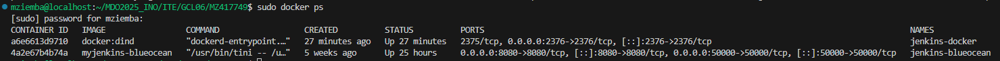

Efekt działąjącego jenkinsa przez http, następnie zaainstalowano wtyczki.

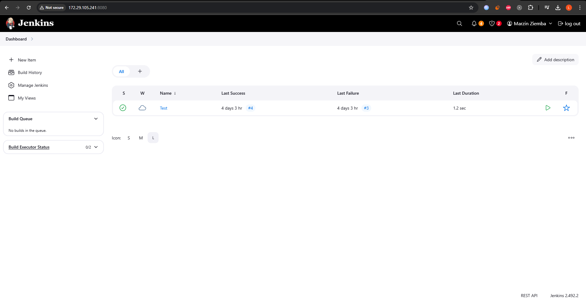

### Stworzenie pipeline wyświetlający uname 

Po wejściu w zakładkę Daskboard tworzymy pierwszy projekt i konfigurujemy w zakładce Configure dodając Build Steps z funkcją execute shell. Pierwsze polecenie ma za zadanie pokazać podstawowe informacje o systemie.

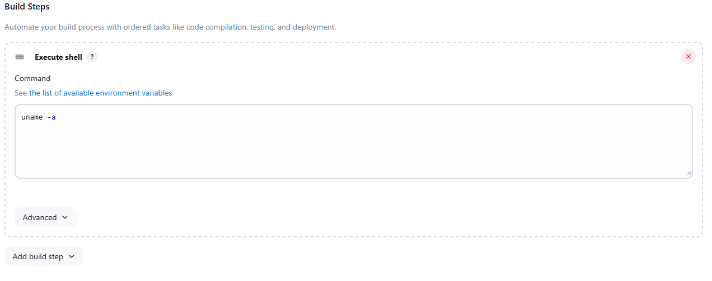
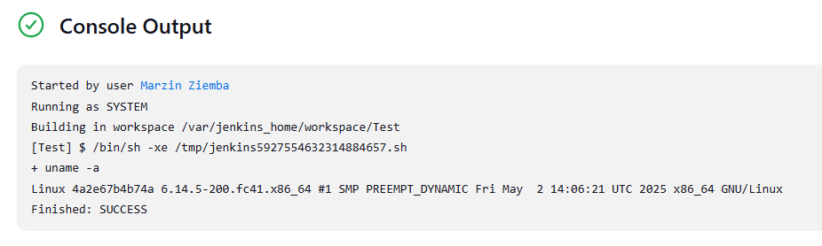

### Stworzenie pipeline sprawdzającego godzine

Program informuje nas czy godzina jest parzysta lub nieparzysta.

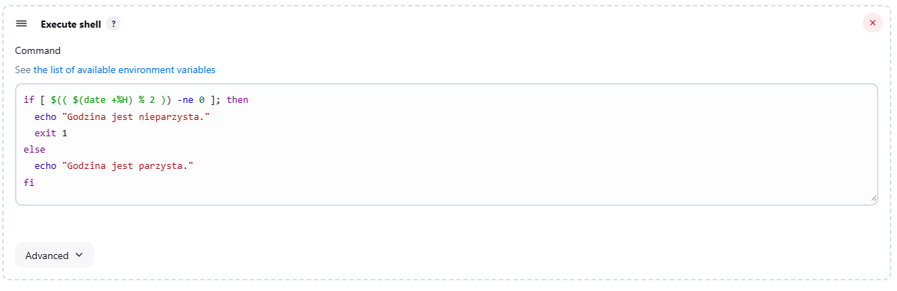
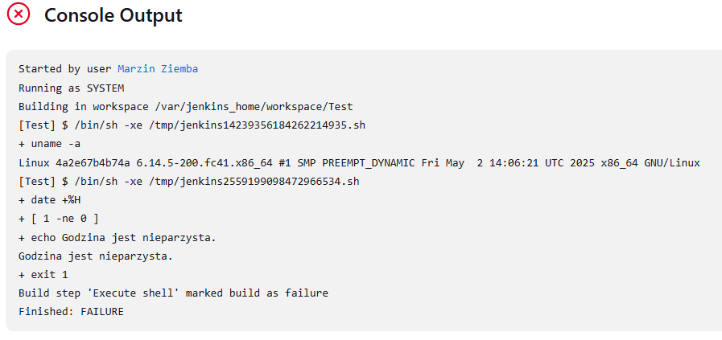

### Stworzenie pipeline pobierający obraz kontenera ubuntu

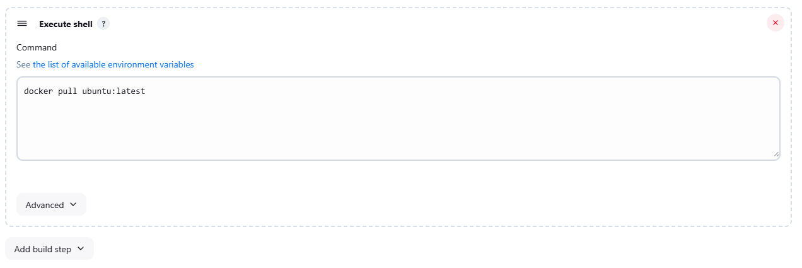
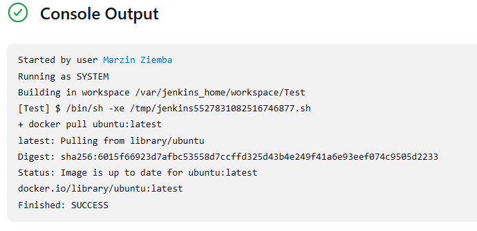

### Stworzenie pipeline klonującego nasze repozytorium (MDO2025_INO)

```
pipeline {
    agent any

    stages {
        stage('Clone') {
            steps {
                git branch: 'MZ417749', url: 'https://github.com/InzynieriaOprogramowaniaAGH/MDO2025_INO.git'
            }
        }

        stage('Build Dockerfile') {
            steps {
                sh 'docker build -t my-builder-image -f ITE/GCL06/MZ417749/Sprawozdanie2/Dockerfile.nodeBuild ITE/GCL06/MZ417749/Sprawozdanie2'
            }
        }
    }

    post {
        success {
            echo 'OK'
        }
        failure {
            echo 'ERROR'
        }
    }
}
```

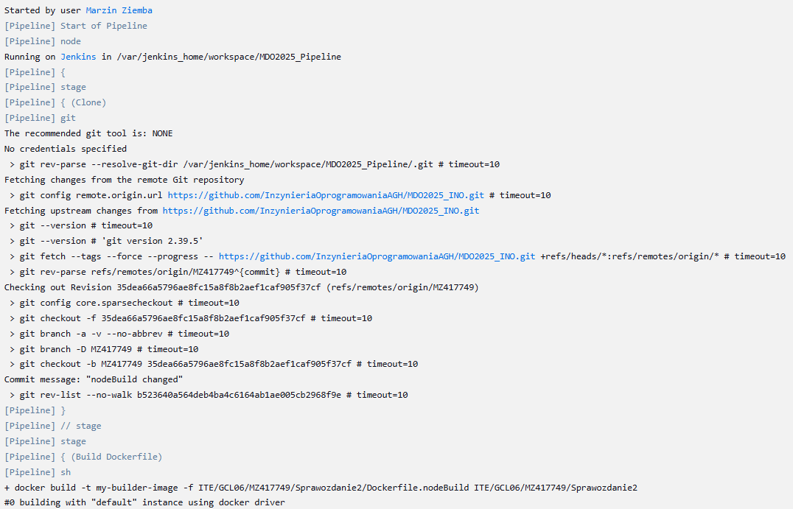
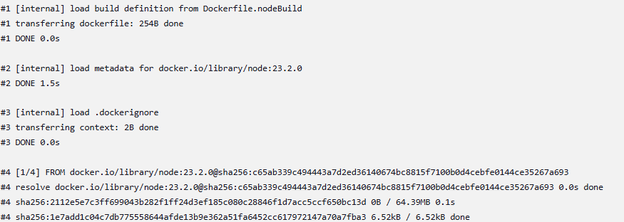
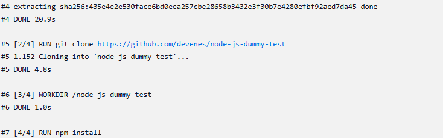
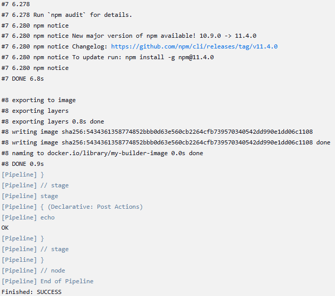

Build wykonał się 2 razy bez problemu

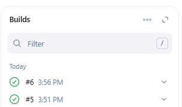

## 2. Stworzenie pipeline projektu

Jako projekt do stworzenia pipeline wybranu [node-js-dummy](https://github.com/devenes/node-js-dummy-test/tree/master). Został wybrany ze względu na prostote i mały rozmiar i znajome środowisko Node.js.

Diagram UML całego procesu:

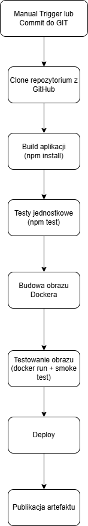

Jenkins script projektu: 
```
pipeline {
    agent any

    environment {
        IMAGE_NAME = "node-js-dummy"
        PATH_PREFIX = "MDO2025_INO/ITE/GCL06/MZ417749/Sprawozdanie2"
    }

    stages {
        stage('Clone Repository') {
            steps {
                echo 'Klonoowanie repozytorium...'
                sh '''
                    rm -rf MDO2025_INO
                    git clone -b MZ417749 --single-branch https://github.com/InzynieriaOprogramowaniaAGH/MDO2025_INO.git
                '''
            }
        }

        stage('Build Image') {
            steps {
                echo 'Budowanie obrazu build...'
                sh "docker build -t ${IMAGE_NAME}:build -f ${PATH_PREFIX}/Dockerfile.build ${PATH_PREFIX}"
            }
        }

        stage('Test Image') {
            steps {
                echo 'Budowanie obrazu testowego i uruchamianie testów...'
                sh "docker build -t ${IMAGE_NAME}:test -f ${PATH_PREFIX}/Dockerfile.test ${PATH_PREFIX}"
                sh "docker run --rm ${IMAGE_NAME}:test npm test"
            }
        }

        stage('Build Deploy Image') {
            steps {
                echo 'Budowanie obrazu do deploy...'
                sh "docker build -t ${IMAGE_NAME}:deploy -f ${PATH_PREFIX}/Dockerfile.deploy ${PATH_PREFIX}"
            }
        }

        stage('Deploy Application') {
            steps {
                echo 'Tworzenie sieci i uruchamianie kontenera deploy...'
                sh '''
                    docker network create ci || true
                    docker run -d --rm --network ci --name deploy -p 3000:3000 ${IMAGE_NAME}:deploy
                '''
            }
        }

        stage('Smoke Test Deploy') {
            steps {
                echo 'Sprawdzanie, czy aplikacja działa na porcie 3000...'
                sh '''
                    sleep 5
                    docker run --rm --network ci curlimages/curl curl -s deploy:3000 || echo "Curl failed"
                '''
            }
        }

        stage('Archive Artifact') {
            steps {
                echo 'Tworzenie archiwum ZIP z kodem aplikacji...'
                    sh '''
                        cd ${PATH_PREFIX}/node-js-dummy-test
                        tar -czf ${WORKSPACE}/node-js-dummy-test.tar.gz .
                    '''
                archiveArtifacts artifacts: 'node-js-dummy-test.tar.gz', fingerprint: true
            }
        }

        stage('List Docker Images') {
            steps {
                sh 'docker images'
            }
        }
    }

    post {
        always {
            echo 'Sprzątanie: zatrzymywanie kontenera i usuwanie sieci...'
            sh '''
                docker stop deploy || true
                docker network rm ci || true
            '''
        }
    }
}
```

### Klonowanie repozytorium

Etap klonowania zdalnego repozytorium Git, ograniczony do jednej gałęzi (MZ417749). Przed klonowaniem usuwana jest lokalna kopia katalogu MDO2025_INO, aby uniknąć konfliktów. Repozytorium zawiera kod źródłowy aplikacji oraz pliki Dockerfile potrzebne do dalszych etapów.

```
        stage('Clone Repository') {
            steps {
                echo 'Klonoowanie repozytorium...'
                sh '''
                    rm -rf MDO2025_INO
                    git clone -b MZ417749 --single-branch https://github.com/InzynieriaOprogramowaniaAGH/MDO2025_INO.git
                '''
            }
        }
```

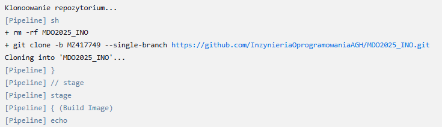

### Budowanie Image

Etap budowania obrazu Docker, który kompiluje aplikację w specjalnie przygotowanym środowisku na podstawie pliku Dockerfile.build. W tym kroku tworzony jest tymczasowy obraz node-js-dummy:build.

```
        stage('Build Image') {
            steps {
                echo 'Budowanie obrazu build...'
                sh "docker build -t ${IMAGE_NAME}:build -f ${PATH_PREFIX}/Dockerfile.build ${PATH_PREFIX}"
            }
        }
```
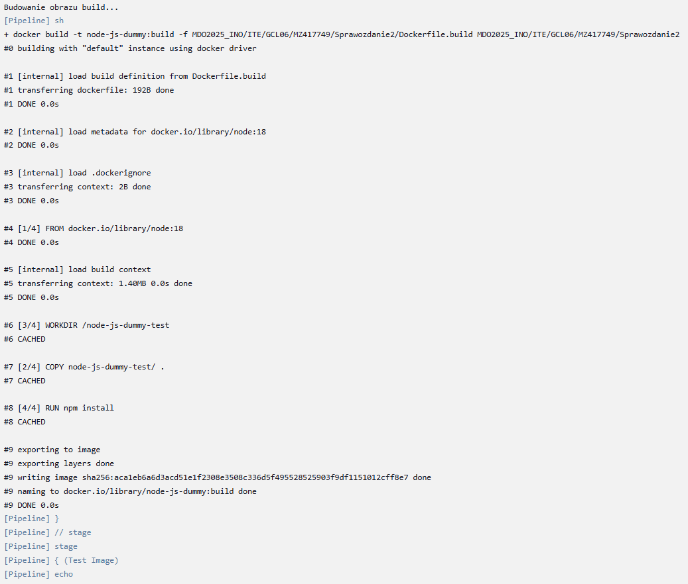

### Test Image

Etap tworzenia obrazu testowego, uruchamiania testów jednostkowych i weryfikacji działania aplikacji. Budowany jest obraz na podstawie Dockerfile.test, po czym testy są uruchamiane wewnątrz kontenera za pomocą polecenia npm test. Błąd na tym etapie oznacza nieprawidłowe działanie aplikacji.

```
        stage('Test Image') {
            steps {
                echo 'Budowanie obrazu testowego i uruchamianie testów...'
                sh "docker build -t ${IMAGE_NAME}:test -f ${PATH_PREFIX}/Dockerfile.test ${PATH_PREFIX}"
                sh "docker run --rm ${IMAGE_NAME}:test npm test"
            }
        }
```
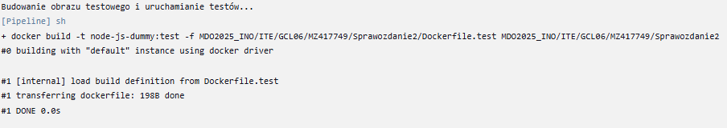
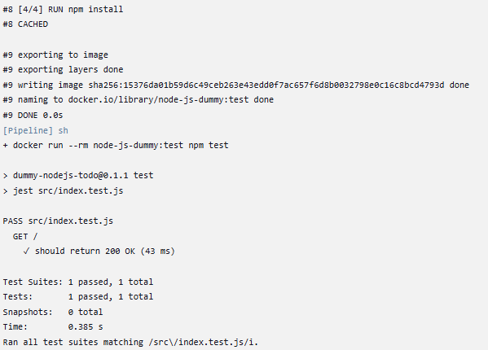

### Build Deploy Image

Etap budowania końcowego obrazu aplikacji przeznaczonego do uruchomienia (deploju). Obraz powstaje z wykorzystaniem Dockerfile.deploy, a jego rezultatem jest gotowy kontener node-js-dummy:deploy.

```
        stage('Build Deploy Image') {
            steps {
                echo 'Budowanie obrazu do deploy...'
                sh "docker build -t ${IMAGE_NAME}:deploy -f ${PATH_PREFIX}/Dockerfile.deploy ${PATH_PREFIX}"
            }
        }
```

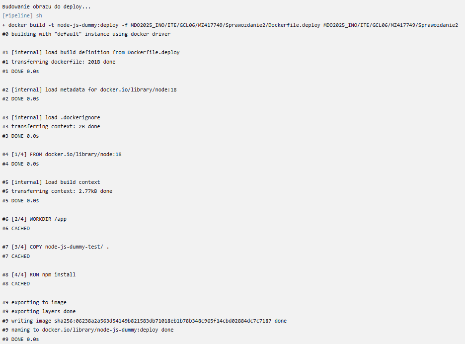

###  Deploy Application

Etap wdrożenia aplikacji. Tworzona jest wewnętrzna sieć Docker (ci), a następnie uruchamiany jest kontener z aplikacją, dostępny na porcie 3000. Kontener działa w trybie odłączonym i może być testowany przez kolejne etapy.

```
        stage('Deploy Application') {
            steps {
                echo 'Tworzenie sieci i uruchamianie kontenera deploy...'
                sh '''
                    docker network create ci || true
                    docker run -d --rm --network ci --name deploy -p 3000:3000 ${IMAGE_NAME}:deploy
                '''
            }
        }
```

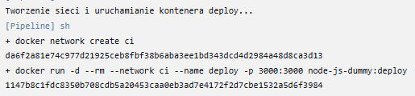

### Smoke Test Deploy
Etap sprawdzający podstawowe działanie aplikacji po wdrożeniu. Używany jest tymczasowy kontener z obrazem curl, który wysyła zapytanie HTTP do aplikacji przez wewnętrzną sieć Docker. Odpowiedź HTML świadczy o poprawnym uruchomieniu aplikacji.

```
        stage('Smoke Test Deploy') {
            steps {
                echo 'Sprawdzanie, czy aplikacja działa na porcie 3000...'
                sh '''
                    sleep 5
                    docker run --rm --network ci curlimages/curl curl -s deploy:3000 || echo "Curl failed"
                '''
            }
        }
```

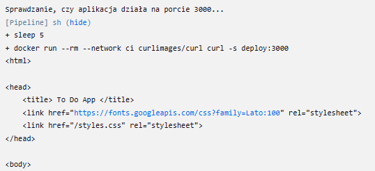

### Archive Artifact

Etap tworzenia archiwum z kodem źródłowym aplikacji. Katalog node-js-dummy-test jest pakowany do pliku tar.gz, który zapisywany jest w głównym katalogu WORKSPACE. Plik ten jest następnie archiwizowany przez Jenkinsa jako artefakt buildu, do pobrania.

Format .tar został wybrany ponieważ jego obsługa jest wbudowana w większość systemów i narzędzi CI/CD, co czyni go wygodnym wyborem w automatycznych pipeline'ach.

```
        stage('Archive Artifact') {
            steps {
                echo 'Tworzenie archiwum ZIP z kodem aplikacji...'
                    sh '''
                        cd ${PATH_PREFIX}/node-js-dummy-test
                        tar -czf ${WORKSPACE}/node-js-dummy-test.tar.gz .
                    '''
                archiveArtifacts artifacts: 'node-js-dummy-test.tar.gz', fingerprint: true
            }
        }
```        

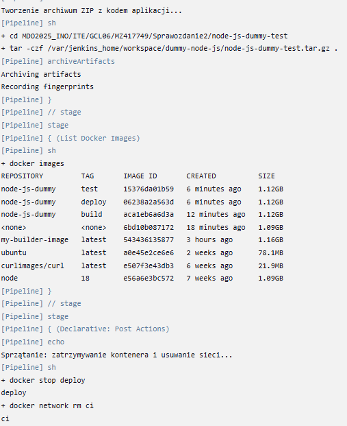

Pipline został uruchomiony 2 razy żeby upewnić się że działa poprwanie.

<<<<<<< HEAD
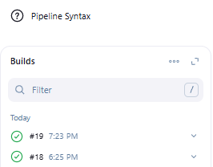
=======

>>>>>>> refs/remotes/origin/MZ417749
