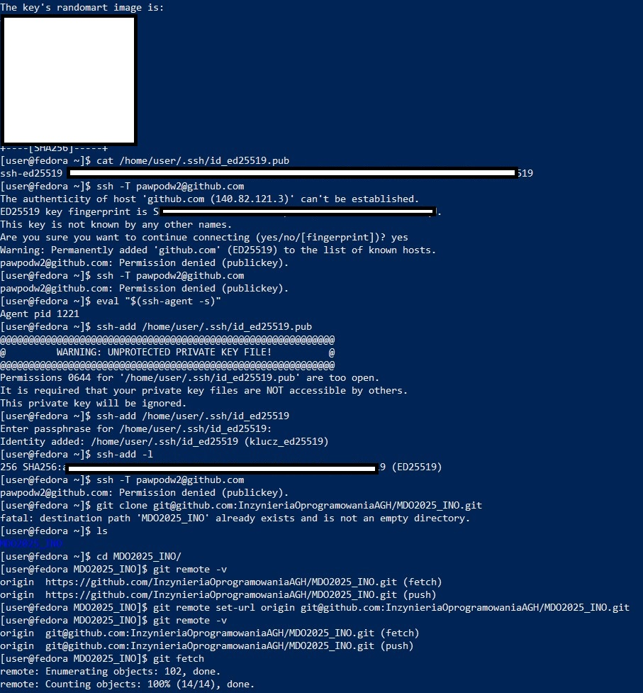
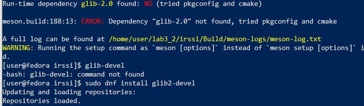

# Zajęcia 1

## 1. Instalacja git i obsługa SSH. Klonowanie repozytorium za pomocą HTTPS oraz SSH.


- Połączono się z maszyną wirtualną za pomocą SSH.
- Sklonowano repozytorium za pomocą HTTPS.
- Wygenerowao dwa klucze SSH różnymi algorytmami.
 



- Uruchomiono agenta SSH
- Dodano klucz ```klucz_ed25519``` do agenta SSH
- Sklonowano repozytorium za pomocą SSH


- Dowód na umieszczenie klucza na GitHub'ie


- Dowód na włączenie uwierzytelniania dwuskładnikowego (2FA)

## 2. Utworzenie gałęzi z inicjałami i numerem indeksu


- Utworzenie gałęzi w odpoiwednim folderze grupy oraz jej wypchnięcie

## 3. Utworzenie odpowiedniego Git hooka weryfikującego czy każdy mój commit message zaczyna się od "PP417835"

```
#!/bin/bash

EXPECTED_PREFIX="PP417835"

COMMIT_MSG_FILE="$1"
COMMIT_MSG=$(head -n 1 "$COMMIT_MSG_FILE")

if [[ "$COMMIT_MSG" != "$EXPECTED_PREFIX"* ]]; then
    echo "ERROR mistake"
    exit 1
fi
```

- Treść git hooka


- Napisano git hook oraz umieszczono go pod ścieżką ```./git/hooks/commit-msg``` gdzie git hooki powinny się znajdować aby działać poprawnie
- Nadanie odpowiednich uprawnień dla hooka aby działał prawidłowo 


- Dokonanie dalszej konfiguracji (np. ustawienie globalnej nazwy użytkownika w git) aby commitowanie działało poprawnie
- Przetestowanie działania git hooka


- Push'nięcie utworzonej gałęzi oraz utworzenie próbnego pull request

# Zajęcia 2

## 1. Uruchomienie docker'a w systemie i pobranie obrazów


- Uruchomiono docker'a w systemie oraz pobrano obrazy z docker hub

## 2. Rejestracja w Docker Hub


## 3. Uruchomienie kontenera z busybox


- Uruchomiono docker ```my_busybox``` za pomocą polecenia ```run``` i zastosowano uspienie aby docker nie znikał od razu po uruchomieniu
- Połączono się z uruchomionym docker'em poprzez shell i uruchomiono polecenie wyświetlające wersję ```busybox``` aby sprawdzić poprawne działanie dockera
- Wyswietlono działające dokcery poleceniem ```docker ps```

## 4. Usprawnienie kozystania z dockera poprzez wyeliminowanie konieczności używania ```sudo``` podczas korzystania z dockera


- Dodanie dockera do odpowiedniej grupy aby przy każdym użyciu dockera nie było potrzeby użycia ```sudo```

## 5. Utworzenie Dockerfile i kopiowanie repozytorium przy uruchamianiu dockera z obrazu 

```
FROM ubuntu:latest

WORKDIR /app

RUN apt update && apt install -y git

RUN git clone https://github.com/InzynieriaOprogramowaniaAGH/MDO2025_INO.git

CMD ["bash"]
```

- Utworzono ```Dockerfile``` do budowania obrazu, który to będzie służył do kopiowania repozytorium. Obraz ten bazuje na ```ubuntu```


- Zbuildowanie obrazu dockera oraz jego uruchomienie

## 6. Usuwanie obrazów


- Usunięcie utworzonych obrazów za pomocą polecenia ```docker rmi```(remove image)

# Zajęcia 3

- Do wykonania laboratorium użyto repozytoriów pokazanych na zajęciach tj. ```irssi``` oraz ```node-js-dummy-test```

## 1. Budowanie i kompilacja oraz testowanie aplikacji pobranej w postacji kodu źródłowego w systemie operacyjnym


- Pobrano repozytorium ```irssi``` oraz rozpoczęto próbę budowania która się nie powiodła z powodu brakujących zależności

## 2. Doinstalowywanie kolejnych zależności




- Po zainstalowaniu wszystkich potrzebnych zależności udało się zbuildować aplikację oraz ją zainstalować.
- Wykonano testy aplikacji ```irssi```

## 3. Automatyzacja powyższego procesu w kontenerze

### Dockerfiles użyte do automatyzacji kompilowania i testowania aplikacji ```irssi```

```
FROM fedora:42

RUN dnf -y update && \
	 dnf -y install meson gcc glib2-devel openssl-devel ncurses-devel utf8proc-devel perl-ExtUtils*
RUN dnf -y install git
RUN git clone https://github.com/irssi/irssi


WORKDIR /irssi

RUN mkdir Build
RUN meson setup Build
RUN ninja -C Build
```

```
FROM irssi_kont

RUN ninja -C Build test
```

### Dowód na poprawne tworzenie obrazów za pomocą Dockerfile'ów


## 4. Automatyzacja buildowania, kompilacji i testów aplikacji opartej o NodeJS

### Dockerfiles użyte do automatyzacji kompilowania i testowania aplikacji ```node-js-dummy-test```

```
FROM node:22.14.0

RUN git clone https://github.com/devenes/node-js-dummy-test
WORKDIR node-js-dummy-test
RUN npm install
```

```
FROM js_dummy
RUN npm test
```

### Dowód na poprawne tworzenie obrazów za pomocą Dockerfile'ów


## 5. Wyjaśnienie celu automatyzacji boildowania i kompilacji powyższych aplikacji

- Celem powyższych przykładów było unaocznienie przewagi łatwości jaką daje buildowanie aplikacji wykożystującej środowisko uruchomieniowe takie jak ```NodeJS``` w powrównaniu do "klasycznej" aplikacji napisanej w C. Pokazuje jak ważne jest zarządzanie zależnościami oraz zapewnianie do nich dostępu na każdym etapie rozwoju aplikacji oraz jej dostarczania jako gotowy produkt. W przypadku ```irssi``` twórca programu musi dbać na każdym kroku o zapewnienie dostępu do zależności, natomiast w przypadku ```NodeJS``` proces jest w pewnym stopniu ułatwiony. Należy dbać poprzez na przykład dobre tworzenie Dockerfile'i aby proces kontaktu z aplikacją był jak najbardziej bezproblemowy.

## 6. Dowody na działanie aplikacji po ich uruchomieniu w kontenerach


## 7. Instalacja docker compose


## 8. Automatyzacja budowania i uruchamiania kontenerów ```irssi``` za pomocą docker compose

```
services:
  irssi_compose:
    build:
      context: .
      dockerfile: Dockerfile
    image: irssi_compose
    container_name: irssi_compose_run

  irssi_compose_test:
    build:
      context: .
      dockerfile: Dockerfile.test
    depends_on:
    - irssi_compose
    image: irssi_compose_test
    container_name: irssi_compose_test_run
```


## 8. Automatyzacja budowania i uruchamiania kontenerów ```node-js-dummy-test``` za pomocą docker compose

```
services:
  node-js-dummy-test_compose:
    build:
      context: .
      dockerfile: Dockerfile
    image: node-js-dummy-test_compose
    container_name: node-js-dummy-test_compose_run

  node-js-dummy-test_compose_test:
    build:
      context: .
      dockerfile: Dockerfile.test
    depends_on:
    - node-js-dummy-test_compose
    image: node-js-dummy-test_compose_test
    container_name: node-js-dummy-test_compose_test_run
```


# Zajęcia 4

# a) Zachowanie stanu 

## 1. Przygotowanie kontenera (bez git'a) do buildowania ```irssi``` oraz utworzenie woluminów

```
FROM fedora:42

RUN dnf -y update && \
	 dnf -y install meson gcc glib2-devel openssl-devel ncurses-devel utf8proc-devel perl-ExtUtils*
```


## 2. Przygotowanie obrazu kontenera który posłuży do pobrania repozytorium (do późniejszego budowania w innym kontenerze) na podpięty do niego wolumin

```
FROM fedora:42

RUN dnf -y update&& \ 
    dnf -y install git 

WORKDIR /repo
```


## 3. Kopiowanie repozytorium na wolumin, który będzie wykorzystany w innym kontenerze


## 4. Podpięcie woluminów do kontenera bez git'a oraz proces buildowania i kopiowania zbuildowanej aplikacji na volumin 2


### Powodem dla którego dołączony docelowy wolumin raz jest podpinany do folderu ```/build``` a raz do folderu ```/buildvolume``` jest to, że wolumin 2 nazwałem ```volumine2``` zamiast ```volume2``` przez co długo błądziłem próbując znaleźć skopiowane pliki na różne sposoby czego wynikiem jest zmiana folderu na ```/buildvolume```. Jednak nie mam screenów błędnych kroków ale to one doprowadziły do tej zmiany nazwy.

## 5. Wykonanie powyższego buildowania tym razem na kontenerze z zainstalowanym gitem. Jedyną różnicą jest proces pobierania repozytorium (screen). Reszta kroków jest identyczna jak powyżej, więc nie powtarzam ich.


# b) Eksponowanie portu

## 1. Sprawdzenie ruchu pomiędzy kontenerami serwera i klienta


## 2. Przygotowanie pomocniczego obrazu kontenera, który ułatwi późniejsze testy oraz utworzenie sieci ```test_network```


## 3. Sprawdzenie ruchu pomiezy kontenerami serwera i klienta podłączonymi do sieci ```test_network```. Użyto nazwy konmtenera do badania zamiast adresu IP.


# 4. Badanie połączenia pomiędzy kontenerem a hostem z wykorzystaniem przekierowania portów


# 5. Badanie połączenia z poza maszyny wirtualnej


- W tym wypadku została wykorzystana druga maszyna wirtualna z ```Ubuntu Server``` a połączenie było możliwe dzięki przekierowaniu portów

# c) Instancja Jenkins

## 1. Utworzenie nowej sieci oraz pull'owanie ```docker:dind```


## 2. Instalacja Jenkinsa poprzez dosłowne przekopiowywanie poleceń/Dockerfile z instrukcji


## 3. Dowód istnienia kontenera z Jenkins'em


## 4. Przekierowanie portów w Visual Studio Code aby istniała możliwość łączenia z Jenkinsem za pomocą ```localhost``` bez wpisywania adresu IP do przeglądarki


## 5. Logowanie do Jenkins'a


