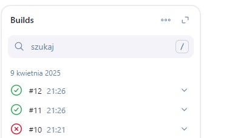
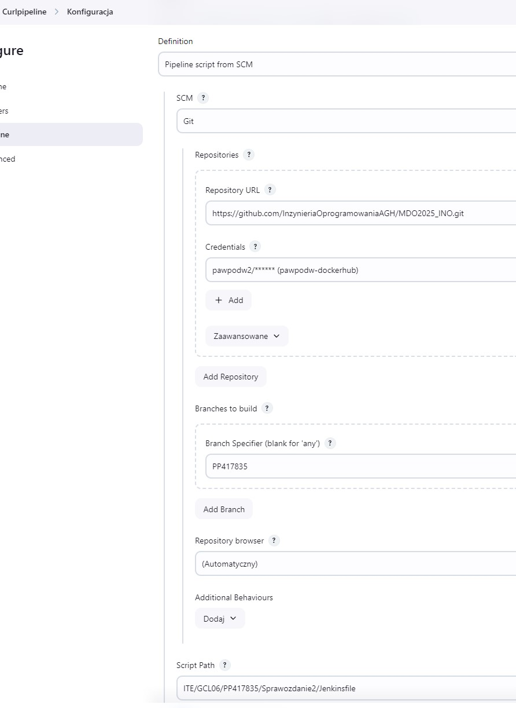
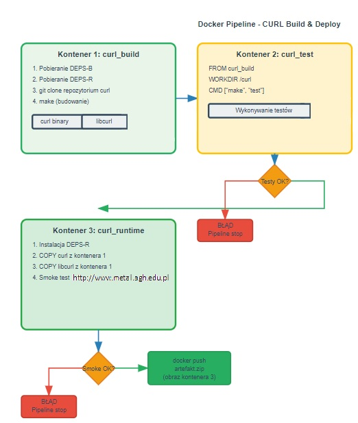

# Sprawozdanie 2 

Instalacja jenkinsa odbyła się w poprzednim sprawozdaniu

# Tworzenie projektów w Jenkins'ie

## uname

Zkonfigurowane projektu tak aby wykonywał polecenie ```uname -a```


Logi konsoli co wykonaniu polecenia ```uname -a```


## godzina

Script mający za zadanie sprawdzić czy godzina jest parzysta


Script zwraca prawdę gdy godzina jest parzysta


Natomiast gdy godzina jest nieparzysta to fałsz


## pobranie ubuntu 


## pipeline irssi




# Właściwy pipeline 


## ustawienia 




## diagram



## dockerfiles

```
FROM fedora:41

RUN dnf -y update && \
	 dnf -y install git autoconf libtool openssl openssl openssl-devel libpsl-devel perl-I18N-Langinfo perl-Digest-SHA perl-Memoize perl-Time-HiRes

RUN git clone https://github.com/curl/curl.git

WORKDIR /curl

RUN autoreconf -fi 
RUN ./configure --with-openssl
RUN make 
RUN make install
```

Powyższy Dockerfile pobiera wszystkie potrzebne zależności, klonuje repozytorium z plikami potrzebnymi do budowy oraz na końcu dokonuje samej budowy

```
FROM curl_build
WORKDIR /curl
CMD ["make", "test"]
```

Powyższy dockerfile jest bardzo prosty i służy tylko do uruchomienia ```make test```

```
FROM fedora:41
COPY --from=curl_build /usr/local/bin/curl /usr/local/bin/curl
COPY --from=curl_build /usr/local/lib /usr/local/lib
ENV LD_LIBRARY_PATH=/usr/local/lib
CMD ["curl", "--version"]
```

Powyższy dockerfile kopiuje zbudowaną aplikację z kontenera do buildowania na kontener przeznaczony do wdrożenia po czym wypisuje wersję skopiowanej aplikacji. Początkowo chciałem zastosować kopiowanie poprzez volumin jednak dowiedziałem się, że volumin można podpiąć do kontenera na etapie ```docker run``` a nie na etapie ```docker build``` co skomplikowało by cały pipeline więc postanowiłem dokonać kopii za pomocą niewyrafinowanego ```COPY```.


## opis pipeline


```
environment {
        IMAGE_CURL_BUILD = 'curl_build'
        IMAGE_CURL_TEST = 'curl_test'
        IMAGE_CURL_DEPLOY_SMOKE_PUBLISH = 'curl_deploy_smoke_publish'
        VERSION = "v${BUILD_NUMBER}"
        ZIP_NAME = "curl_${BUILD_NUMBER}.tar"
    }
```
Zmienne środowiskowe które mają za zadanie umożliwienie numeracji kolejnych artefaktów oraz uniknięcia powtarzania tych samych nazw w trakcie pipeline a także minimalizują prawdopodobieństwo literówki.


```
stage('Clone Repository') {
            steps {
                echo 'Klonowanie repozytorium z Dockerfiles'
                sh '''
                rm -rf MDO2025_INO
                git clone --branch PP417835 --single-branch https://github.com/InzynieriaOprogramowaniaAGH/MDO2025_INO.git
                '''
            }
        }
```
Klonowanie repozytorium na którym znajdują się Dockerfiles lub ewentualnie inne pliki potrzebne do przeprowadzenia pipeline

```
stage('Build') {
            steps {
                echo 'Budowanie obrazu/aplikacji'
                sh """
                    docker build \
                        -f MDO2025_INO/ITE/GCL06/PP417835/Sprawozdanie2/Dockerfiles/Dockerfile.curlbld \
                        -t ${IMAGE_CURL_BUILD} \
                        MDO2025_INO/ITE/GCL06/PP417835/curl
                """
            }
        }
```
Budowanie obrazu kontenera z aplikacją na podstawie 

```
stage('Test') {
            steps {
                echo 'Testowanie'
                sh """
                    docker build \
                        -f MDO2025_INO/ITE/GCL06/PP417835/Sprawozdanie2/Dockerfiles/Dockerfile.curltest \
                        -t ${IMAGE_CURL_TEST} \
                        MDO2025_INO/ITE/GCL06/PP417835/curl

                    docker run --rm ${IMAGE_CURL_TEST}
                """
            }
        }
```
Przeprowadzenie testów ```make test``` zbudowanej aplikacji w poprzednim kroku


```
stage('Deploy') {
            steps {
                echo 'Deploy'
                sh """
                    docker build \
                        -f MDO2025_INO/ITE/GCL06/PP417835/Sprawozdanie2/Dockerfiles/Dockerfile.deploy \
                        -t ${IMAGE_CURL_DEPLOY_SMOKE_PUBLISH}:${VERSION} \
                        MDO2025_INO/ITE/GCL06/PP417835/curl

                    docker run --rm ${IMAGE_CURL_DEPLOY_SMOKE_PUBLISH}:${VERSION} curl --version
                """
            }
        }
```
Przeniesie zbudowanej aplikacji z kontenera służącego do budowania na kontener przeznaczony do deploy'owania oraz wypisanie wersji curl'a

```
stage('Smoke Test') {
            steps {
                echo 'Smoke test do www.metal.agh.edu.pl'
                sh """
                    docker run --rm ${IMAGE_CURL_DEPLOY_SMOKE_PUBLISH}:${VERSION} curl -s --fail http://www.metal.agh.edu.pl \
                        && echo "SMOKE TEST PASSED" \
                        || echo "SMOKE TEST FAILED"
                """
            }
        }
```
Smoke test polegający na "pobraniu" pliku ```html``` strony http://www.metal.agh.edu.pl

```
stage('Publish') {
            steps {
                echo 'Utworzenie archiwum i publikacja w Docker Hub'
                
                sh """
                    docker save ${IMAGE_CURL_DEPLOY_SMOKE_PUBLISH}:${VERSION} -o ${ZIP_NAME}
                """

                archiveArtifacts artifacts: "${ZIP_NAME}", onlyIfSuccessful: true

                withCredentials([usernamePassword(
                    credentialsId: 'pawpodw-dockerhub',
                    usernameVariable: 'DOCKER_USER',
                    passwordVariable: 'DOCKER_PASS'
                )]) {
                    sh """
                        echo "$DOCKER_PASS" | docker login -u "$DOCKER_USER" --password-stdin
                        docker tag ${IMAGE_CURL_DEPLOY_SMOKE_PUBLISH}:${VERSION} pawpodw2/curl_publish:${VERSION}
                        docker push pawpodw2/curl_publish:${VERSION}
                    """
                }
            }
        }
```
Zapisanie obrazu wdrożeniowego do paczki ```ZIP``` nadanie jej numeru oraz umiejszczenie jej na ```Dockerhub```


```
post {
        always {
            echo 'Czyszczenie kontenerów i obrazów'
            sh '''
                docker container prune -f
                docker image prune -f
            '''
        }
    }
```

Usuwa pewstałe w trakcie pipeline kontenery i obrazy aby mieć pewność, że kolejny pipeline wykona się w pełni od nowa a nie skopiuje poprostu plików z cashu oraz aby nie zajmować zbędnego miejsca


## potwierdzenie działania

umieszczenie na docker huba


dowód że dwa razy


