# Sprawozdanie 3

# Ansible

nie mam instalacji ansibla maszyny wirtualnej bo instalowałem z Panem na zajęciach i nie robiłem screenów w tym czasie

Działająca nowa maszyna do ansible

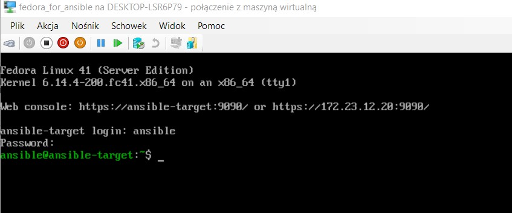

Utworzenie migawki

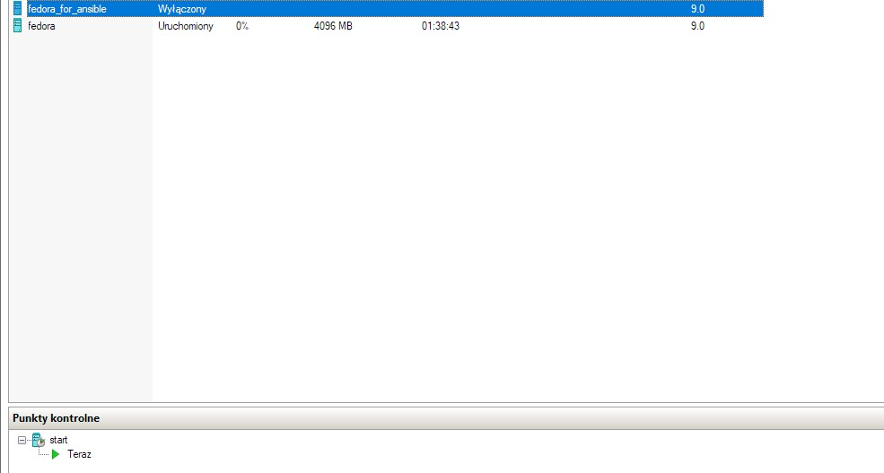

Utworzenie nowego klucza i jego przesłanie do nowej maszyny co zapewni łączność ssh bez użycia hasła

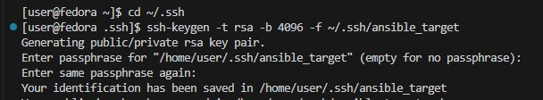

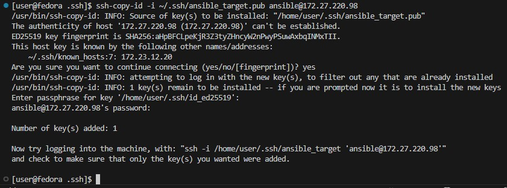

zmiany w pliku config w katalogu ssh aby wskazać na klucz za pomocą którego mają być ustanawiane połączenia z nową maszyną

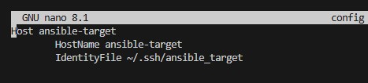

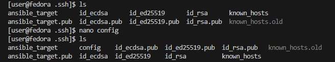

logowanie za pomocą ssh do nowej maszyny bez użycia hasła

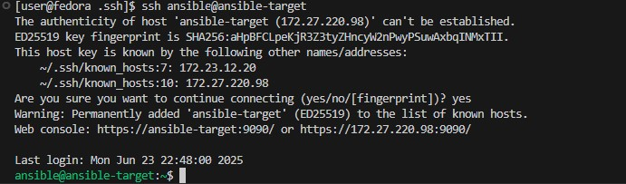

## inwentaryzacja

zmiana nazwy hosta maszyny głównej i dowód na zmianę po restarcie

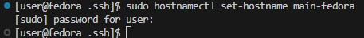


dodanie na maszynie głównej skojarzenia nazwy słownej z adresem IP nowej maszyny dzięki czemu będzie możliwe odnoszenie się do nowej maszyny po nazwie słownej która jest wygodniejsza od adresu IP
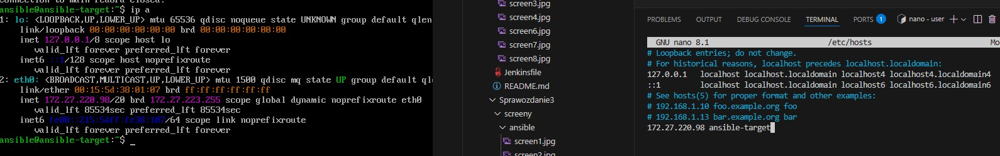

Identycznie skojarzenie słowne tylko w drugą stronę

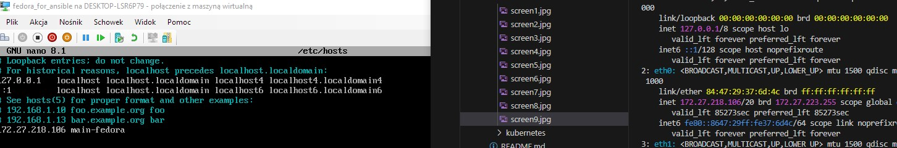

Pingowanie dwóch maszyn nawzajem aby sprawdzić czy połączenie zostało poprawnie ustanowione

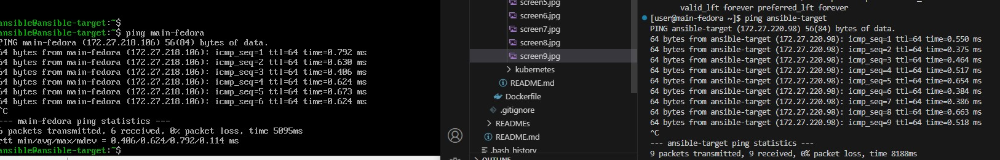

utworzenie pliku inventory.ini
```
[Orchestrators]
main-fedora ansible_user=user ansible_ssh_private_key_file=~/.ssh/ansible_target

[Endpoints]
ansible-target ansible_user=ansible ansible_ssh_private_key_file=~/.ssh/ansible_target
```

oraz wpisanie klucza publicznego który służy do łączenia się między maszynami do pliku kluczy autoryzowanych oraz nadanie odpowiednich uprawnień plikowi kluczy autoryzowanych aby możliwe było dokonanie pingu ansiblowego

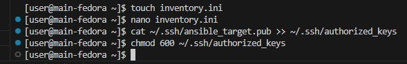

udany ping ```ansible```, który różni się od "normalnego" pingu 

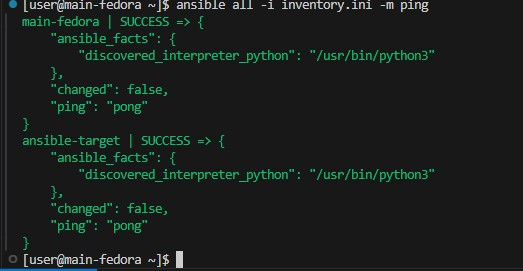

Utworzenie playbooka, który ma za zadanie określenie parametrów i wywołanie procedur na nowych maszynach

Przepraszam za wpis po polsku w playbooku ale wspomagałem się AI przy napisaniu tego playbooka i nie zauważyłem aby przetłumaczyć wyrażenie na angielski

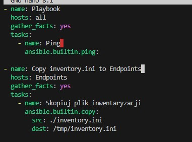

"Uruchomienie" playbooka, który poprawnie skopiował plik inwentarza co jest oznaczone przez napis ```changed=1``` 

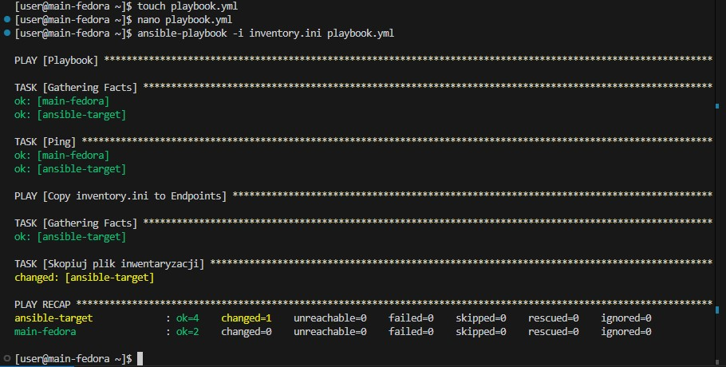

Ponowne uruchomienie nie wykazuje już żadnych zmian co znaczy, że wszystko działa poprawnie

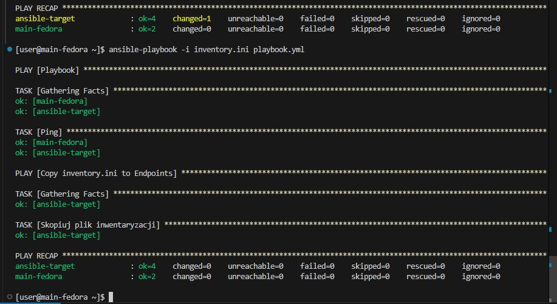

Połączenie się z nową maszyną i zainstalowanie na niej ```rngd```

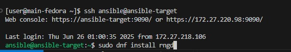

Rozbudowanie playbooka o część odpowiedzialną za aktualizacje i restart usług

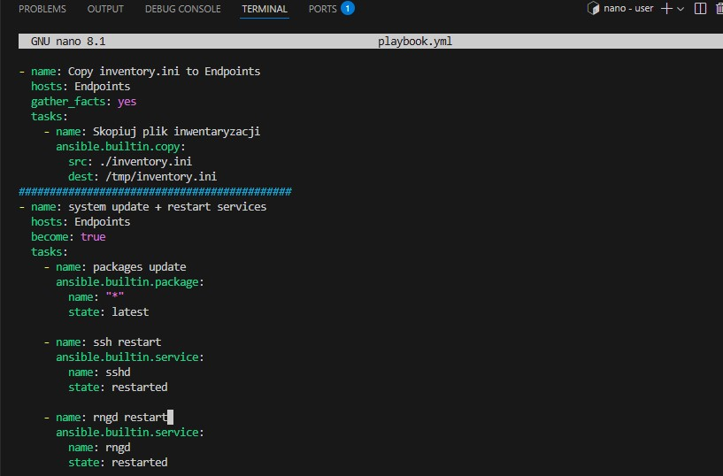

Uruchomienie playbooka po rozbudowaniu, który aktualizuje pakiety i uruchamia usługi co jest znowu potwierdzone wartością change większą od 0


Zatrzymanie usługi ssh na nowej maszynie

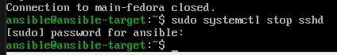

Po zatrzymaniu usługi nie ma połączenia więc playbook nie "przechodzi" co jest porządanym i logicznym działaniem


Po ponownym włączeniu ssh wszystko wróciło do normy

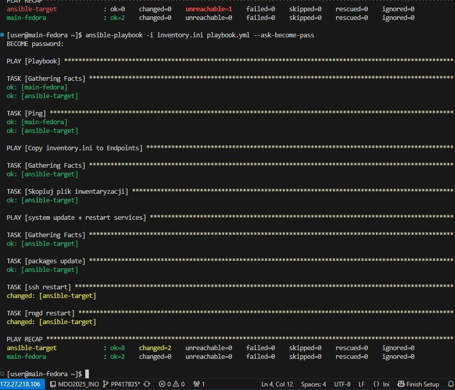

Uruchomienie ```ansible-galaxy init user``` co utworzyło szkielet roli

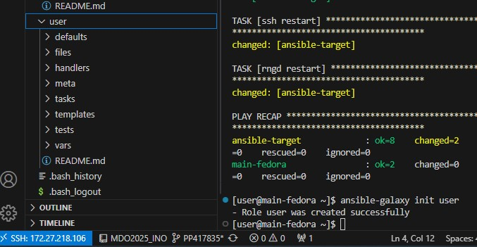

Dalsza rozbudowa playbooka w katalogach stworzonych przez ```ansible-galaxy``` mająca za zadanie wdrożenie na nowej maszynie obrazu dockera stworzonego w poprzednim sprawozdaniu

```
---
- name: is docker installed?
  ansible.builtin.package:
    name: docker
    state: latest

- name: run docker service
  ansible.builtin.systemd:
    name: docker
    state: started
    enabled: yes

- name: pull image from DockerHub
  community.docker.docker_image:
    name: pawpodw2/curl_publish
    tag: v15
    source: pull

- name: run container curl_publish
  community.docker.docker_container:
    name: vercheck
    image: pawpodw2/curl_publish:v15
    state: started
    restart_policy: unless-stopped
    command: tail -f /dev/null

- name: wait to stabilize
  pause:
    seconds: 5

- name: test connectivity with AGH Metal
  command: docker exec vercheck curl -s --fail http://www.metal.agh.edu.pl
  register: result
  ignore_errors: true

- name: results of test
  debug:
    msg: "{{ 'success of conectivity' if result.rc == 0 else 'fail of conectivity' }}"

- name: stop container
  community.docker.docker_container:
    name: vercheck
    state: stopped

- name: delete container
  community.docker.docker_container:
    name: vercheck
    state: absent

```

```
- name: Deploy curl to hosts
  hosts: Endpoints
  become: yes
  roles:
    - user

```

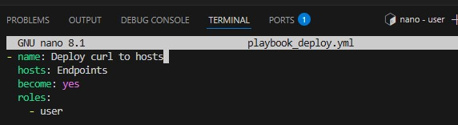

Błąd działania nowego rozbudowanego playbooka wynikający z tego, że na dockerhubie nie miałem obrazu ```latest``` 

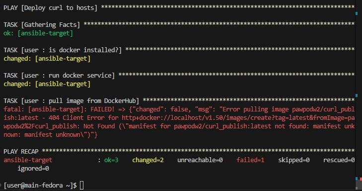

Dopiero wpisanie konkretnej wersji rozwiązało ten problem. 

Wpisywanie konkretnej wersji jest mieczem obosiecznym ponieważ z jednej strony mamy pewność której wersji aplikacji używamy co uodparnia nas na potencjalne niestabilności w naszych zastosowaniach które mogą pojawić się przy nowych wersjach. Z drugiej jednak strony ręczne zmienianie wersji może być uciążliwe i może prowadzić do "zapomnienia" o aktualizacjach co w dłuższej perspektywie może mieć znaczące konsekwencje
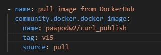


Po zmianie na stałą wersję playbook wykonuje się poprawnie

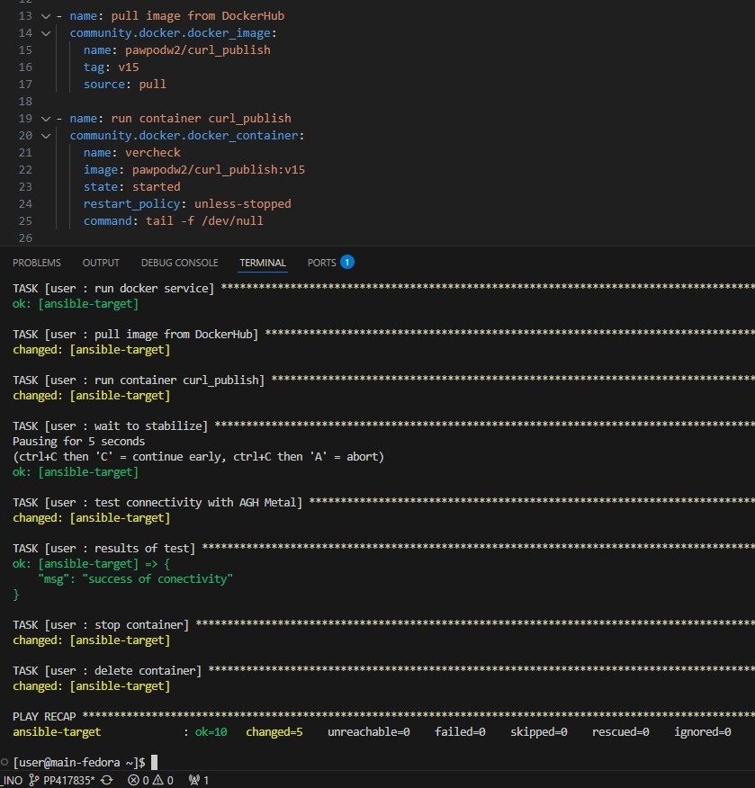


# Masowe wdrożenia (lab 9) 

Plik odpowiedzi pozyskałem kilka tygodni temu ale niestety nie zrobiłem screenów. O prawdziwości moich słów może świadczyć fakt, że w katalogu ITE/GCL06/PP417835/lab9/ ostatni commit jest sprzed miesiąca

Kreator nowej maszyny która skorzysta z pliku odpowiedzi


Początkowo chciałem korzystać z fedory 42 jednak przez...

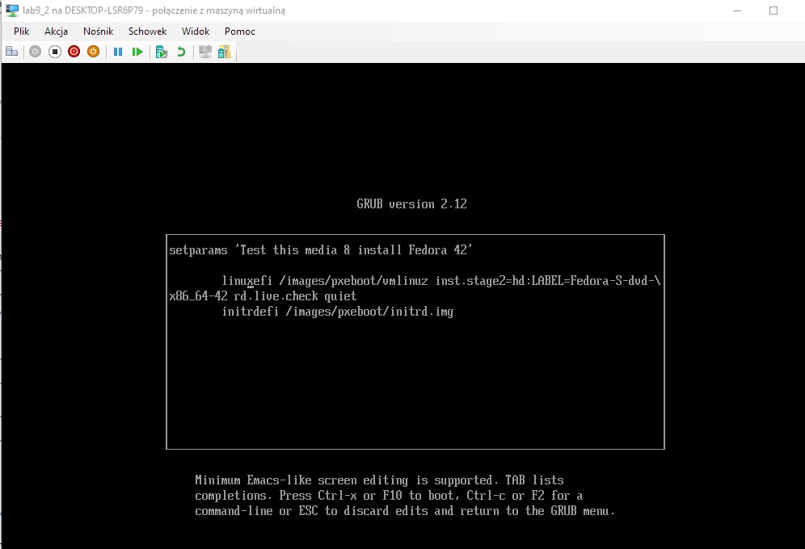

taki oraz inne błędy zdecydowałem się pracować dalej na fedorze 41 

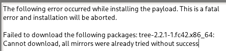


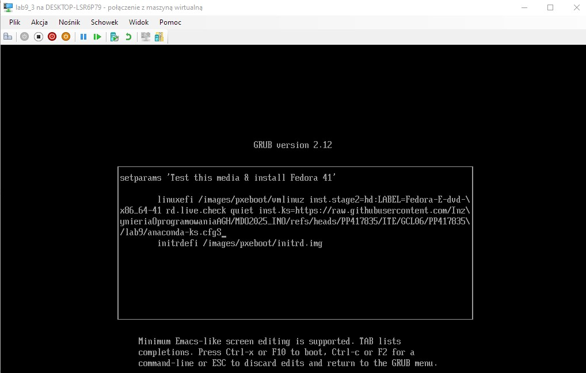

Instalacja zakończona sukcesem

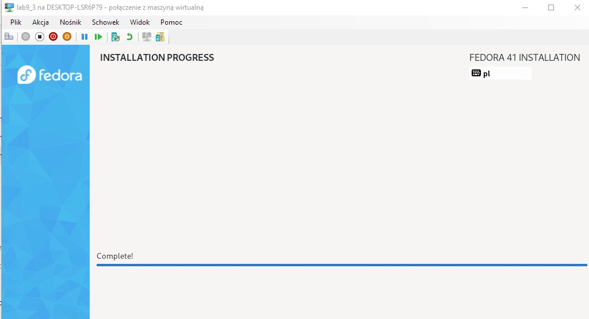

plik odpowiedzi dzięki któremu powyższa instalacja się dokonała. Hasło wpisałem tymczasowo na stałe ponieważ zapomniałem starego ale wiem, że to bardzo zła praktyka
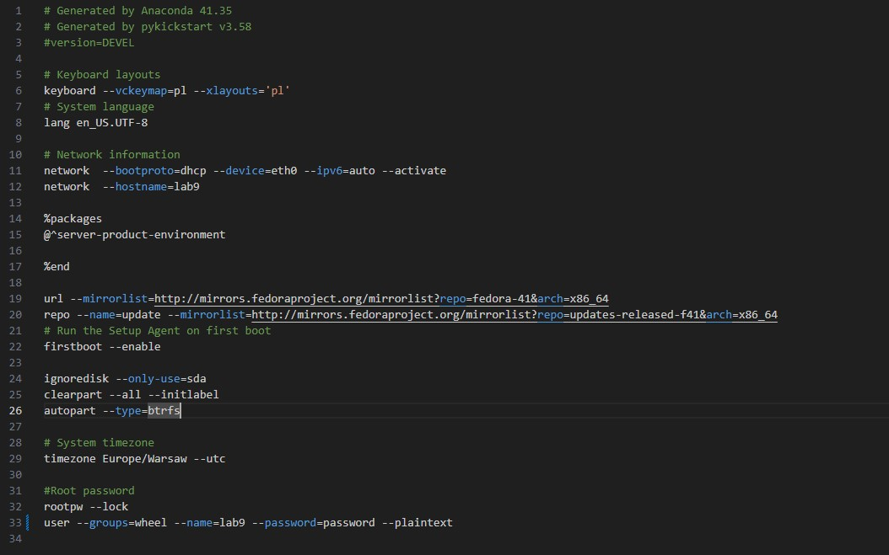

Plik odpowiedzi który od razu przy pierwszym uruchomieniu nowej maszyny wirtualnej zapisuje na niej docker z programem ```curl```, który był celem pipeline z poprzedniego sprawozdania
```
# Generated by Anaconda 41.35
# Generated by pykickstart v3.58
#version=DEVEL

# Keyboard layouts
keyboard --vckeymap=pl --xlayouts='pl'
# System language
lang en_US.UTF-8

# Network information
network  --bootproto=dhcp --device=eth0 --ipv6=auto --activate --hostname=curlfinal

url --mirrorlist=http://mirrors.fedoraproject.org/mirrorlist?repo=fedora-41&arch=x86_64
repo --name=update --mirrorlist=http://mirrors.fedoraproject.org/mirrorlist?repo=updates-released-f41&arch=x86_64

repo --name=docker-ce-stable --baseurl=https://download.docker.com/linux/fedora/41/x86_64/stable

# Run the Setup Agent on first boot
firstboot --enable

ignoredisk --only-use=sda
clearpart --all --initlabel
autopart --type=btrfs

# System timezone
timezone Europe/Warsaw --utc

#Root password
rootpw --lock
user --groups=wheel --name=lab9 --password=password --plaintext

%packages
@^server-product-environment

docker-ce
docker-ce-cli
containerd.io
wget
%end

%post --log=/root/kickstart-post.log


DOCKER_IMAGE_NAME="pawpodw2/curl_publish"
DOCKER_IMAGE_TAG="v15" 
FULL_DOCKER_IMAGE="${DOCKER_IMAGE_NAME}:${DOCKER_IMAGE_TAG}"


systemctl enable docker
systemctl start docker


echo "download Docker Image: ${FULL_DOCKER_IMAGE}" >> /root/kickstart-post.log
docker pull "${FULL_DOCKER_IMAGE}" >> /root/kickstart-post.log 2>&1


echo "Test" >> /root/kickstart-post.log
docker run --rm "${FULL_DOCKER_IMAGE}" curl --version || echo "Test curl --version fail ${FULL_DOCKER_IMAGE}" >> /root/kickstart-post.log


echo "systemd container ${FULL_DOCKER_IMAGE}" >> /root/kickstart-post.log
cat > /etc/systemd/system/curl_final.service <<EOF
[Unit]
Description=Curl Final Container
Requires=docker.service network-online.target
After=docker.service network-online.target

[Service]
Restart=always
ExecStartPre=-/usr/bin/docker rm -f curl_final

ExecStart=/usr/bin/docker run --name curl_final "${FULL_DOCKER_IMAGE}" tail -f /dev/null
ExecStop=/usr/bin/docker stop curl_final

[Install]
WantedBy=multi-user.target
EOF


echo "run service" >> /root/kickstart-post.log
systemctl enable curl_final.service
systemctl start curl_final.service

%end

reboot


```

Potwierdzenie, że instalacja nowej maszyny przebiegła zgodnie z założeniami
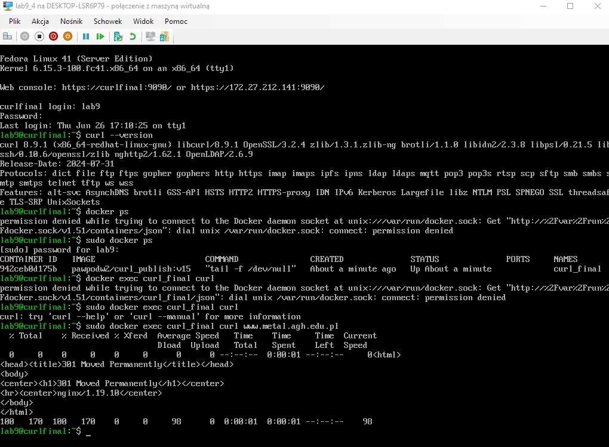

# Kubernetes
Na zajęciach nie miałem jeszcze zrobionego pipeline, więc zacząłem ćwiczenie na nginx’ie i postanowiłem dokończyć cały temat kubernetesa na nginx’ie

## lab 10

uruchomienie kubernetesa
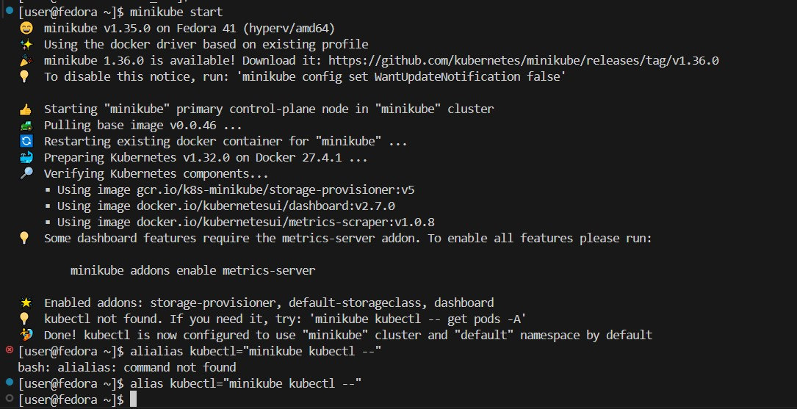

uruchomienie obrazu nginx'a w kubernetesie oraz przekierowanie portu mającego na celu umożliwienie połączenia z nginx'em "odpalonym" w kubernetesie
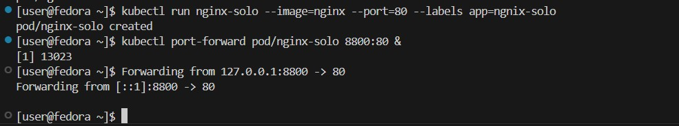

Dowód na połącznie się z nginx
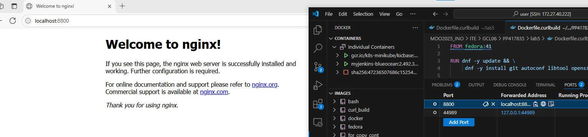

Przekierowanie portu mające za zadanie umożliwienie łączenia się z podem oraz utworzenie deploymentu
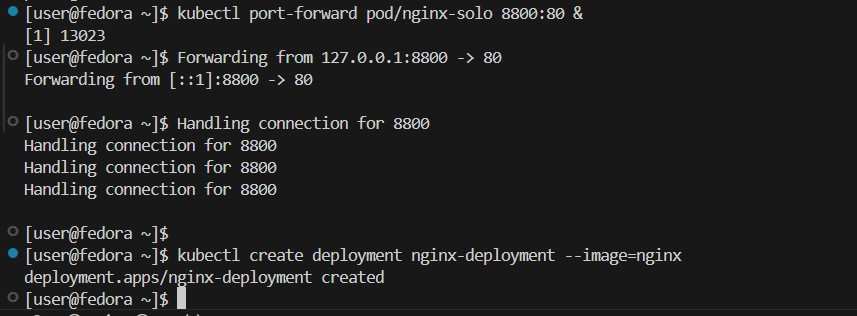

Utworzony deployment widoczny w dashboardzie
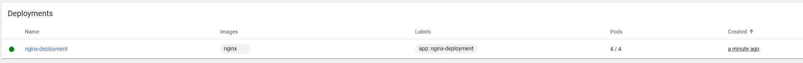

Dalsze przekierowanie portu mające za zadanie umożliwienie łączenia się z deploymenetem ze świata z poza maszyny wirtualnej 
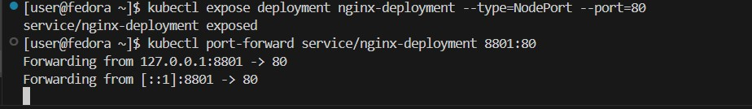

Przekierowane porty oraz udane połączenie z nginx'em
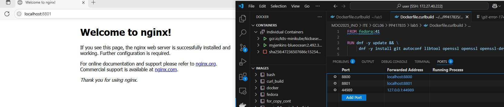

Plik za pomocą którego tworzony był deployment

```
apiVersion: apps/v1
kind: Deployment
metadata:
  annotations:
    deployment.kubernetes.io/revision: "2"
    kubectl.kubernetes.io/last-applied-configuration: |
      {"apiVersion":"apps/v1","kind":"Deployment","metadata":{"annotations":{"deployment.kubernetes.io/revision":"2"},"creationTimestamp":"2025-05-29T15:42:42Z","generation":7,"labels":{"app":"nginx-deployment"},"name":"nginx-deployment","namespace":"default","resourceVersion":"6455","uid":"41ab3a2b-104c-4ab9-8e4d-221168a3e481"},"spec":{"progressDeadlineSeconds":600,"replicas":6,"revisionHistoryLimit":10,"selector":{"matchLabels":{"app":"nginx-deployment"}},"strategy":{"rollingUpdate":{"maxSurge":"25%","maxUnavailable":"25%"},"type":"RollingUpdate"},"template":{"metadata":{"creationTimestamp":null,"labels":{"app":"nginx-deployment"}},"spec":{"containers":[{"image":"nginx:1.27.5","imagePullPolicy":"Always","name":"nginx","resources":{},"terminationMessagePath":"/dev/termination-log","terminationMessagePolicy":"File"}],"dnsPolicy":"ClusterFirst","restartPolicy":"Always","schedulerName":"default-scheduler","securityContext":{},"terminationGracePeriodSeconds":30}}}}
  creationTimestamp: "2025-05-29T15:42:42Z"
  generation: 8
  labels:
    app: nginx-deployment
  name: nginx-deployment
  namespace: default
  resourceVersion: "6986"
  uid: 41ab3a2b-104c-4ab9-8e4d-221168a3e481
spec:
  progressDeadlineSeconds: 600
  replicas: 4
  revisionHistoryLimit: 10
  selector:
    matchLabels:
      app: nginx-deployment
  strategy:
    rollingUpdate:
      maxSurge: 25%
      maxUnavailable: 25%
    type: RollingUpdate
  template:
    metadata:
      creationTimestamp: null
      labels:
        app: nginx-deployment
    spec:
      containers:
      - image: nginx:1.27.5
        imagePullPolicy: Always
        name: nginx
        resources: {}
        terminationMessagePath: /dev/termination-log
        terminationMessagePolicy: File
      dnsPolicy: ClusterFirst
      restartPolicy: Always
      schedulerName: default-scheduler
      securityContext: {}
      terminationGracePeriodSeconds: 30
```

Utworzenie deployment'u z pliku .yml
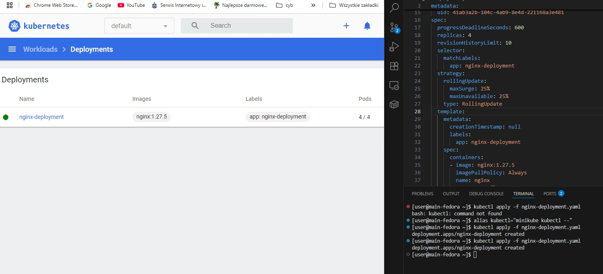


## lab 11

11

Pliki Dockerfile

```
FROM nginx:latest

COPY nginx.conf /etc/nginx/nginx.conf
COPY index.html /usr/share/nginx/html/index.html
```

```
FROM nginx:latest

COPY nginx.conf /etc/nginx/nginx.conf
COPY index2.html /usr/share/nginx/html/index.html
```

```
FROM nginx:latest

COPY nginx.conf /etc/nginx/nginx.conf
COPY index.html /usr/share/nginx/html/index.html
CMD [ "false" ]
```


Pliki yml do deploymentów: 

```
apiVersion: apps/v1
kind: Deployment
metadata:
  name: nginx-deployment1
spec:
  replicas: 3

  selector:
    matchLabels:
      app: nginx1
  template:
    metadata:
      labels:
        app: nginx1
    spec:
      containers:
        - name: nginx1
          image: nginx1
          imagePullPolicy: Never
          ports:
            - containerPort: 80
```

```
apiVersion: apps/v1
kind: Deployment
metadata:
  name: nginx-deployment2
spec:
  replicas: 7

  selector:
    matchLabels:
      app: nginx2
  template:
    metadata:
      labels:
        app: nginx2
    spec:
      containers:
        - name: nginx2
          image: nginx2
          imagePullPolicy: Never
          ports:
            - containerPort: 80
```


Wersja z obrazem 2.0 ale poza obrazem identyczna jak pierwotna
```
apiVersion: apps/v1
kind: Deployment
metadata:
  name: nginx-deployment-fail
spec:
  replicas: 2

  selector:
    matchLabels:
      app: nginx-fail
  template:
    metadata:
      labels:
        app: nginx-fail
    spec:
      containers:
        - name: nginx-fail
          image: nginx-fail:2.0
          imagePullPolicy: Never
          ports:
            - containerPort: 80
```

Utworzenie własnych obrazów nginx które posłużą do dalszej części ćwiczenia
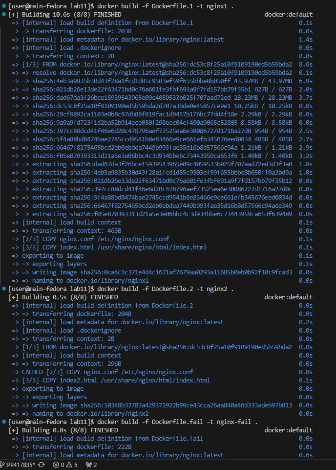


Tworzenie deploymentów z plików 
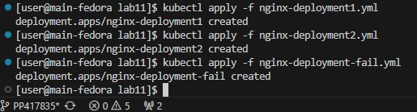


Zabawa ilością podów:

Jedynym ciekawym i zaskakującym przypadkiem jest deployment zawierający błędny obraz ponieważ on w odróżnieni od pozostałych zachowujących się przewidywalnie gdy ma zero podów to świeci się na zielono mimo iż jest błędny to dopiero przy zwiększeniu liczby podów pokazuje kolorem czerwonym, że jest błędny. Po zmniejszeniu podów do zera wraca zpowrotem do koloru zielonego 
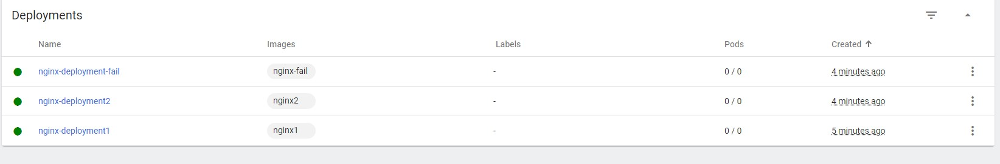

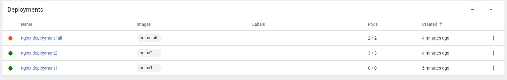

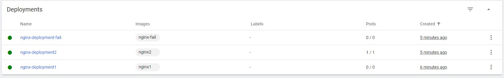

Wdrożenie nowej wersji nginx'a aby można było dokonać później rollback'u
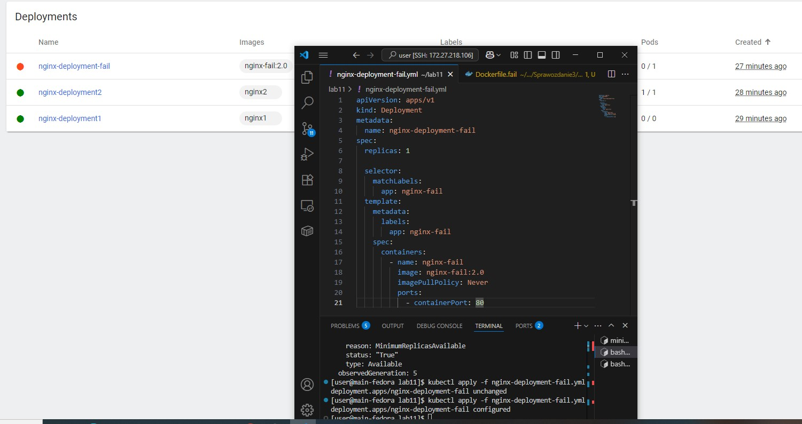

Dokonanie rolback'u
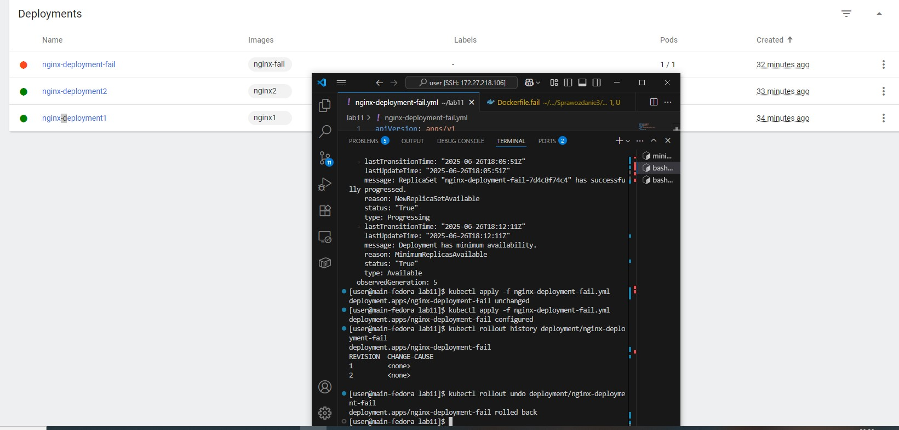

Skrypt sprawdzający czy wdrożenie dokonało się poniżej 60 sekund

```
#!/bin/bash


DEPLOYMENT_NAME="nginx-deployment1"
TIMEOUT_SECONDS=60

echo "Weryfikuję status wdrożenia '$DEPLOYMENT_NAME' z limitem czasu $TIMEOUT_SECONDS sekund..."


minikube kubectl -- rollout status deployment/"$DEPLOYMENT_NAME" --timeout="${TIMEOUT_SECONDS}s"


if [ $? -eq 0 ]; then
    echo ""
    echo "✅ Wdrożenie '$DEPLOYMENT_NAME' zakończyło się pomyślnie w ciągu $TIMEOUT_SECONDS sekund."
else
    echo ""
    echo "❌ Wdrożenie '$DEPLOYMENT_NAME' NIE zakończyło się pomyślnie w ciągu $TIMEOUT_SECONDS sekund."

    exit 1
fi

exit 0
```

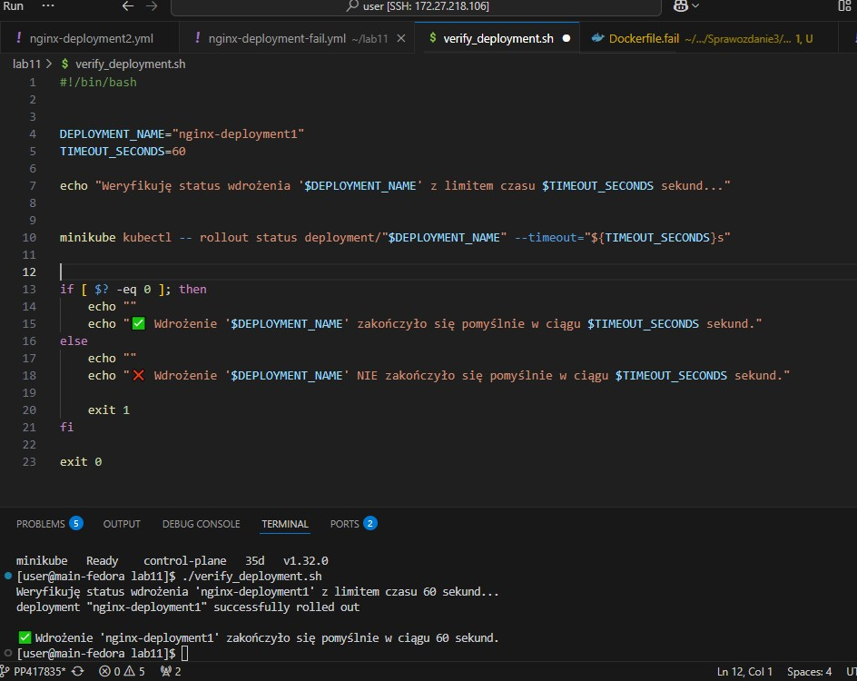


Tworzenie recreate deploymentu oraz zabawa nim

```
apiVersion: apps/v1
kind: Deployment
metadata:
  name: nginx-recreate-deployment 
  labels:
    app: nginx-recreate
spec:
  replicas: 6 
  selector:
    matchLabels:
      app: nginx-recreate
  strategy: 
    type: Recreate 
  template:
    metadata:
      labels:
        app: nginx-recreate
    spec:
      containers:
      - name: nginx-recreate-container
        image: nginx:1.24.0
        ports:
        - containerPort: 80
```


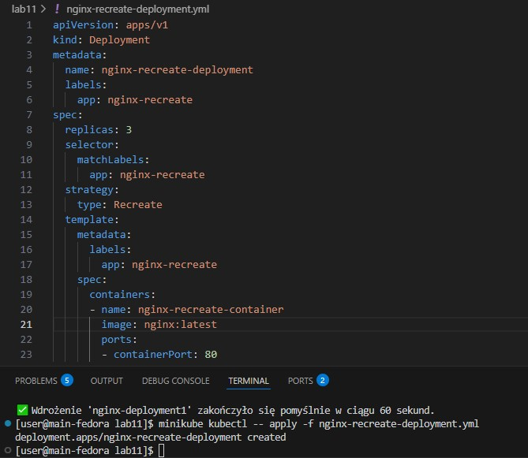

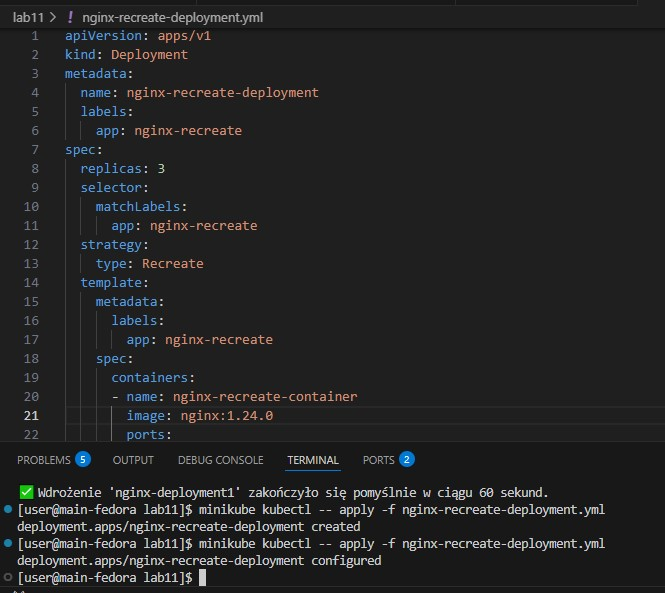

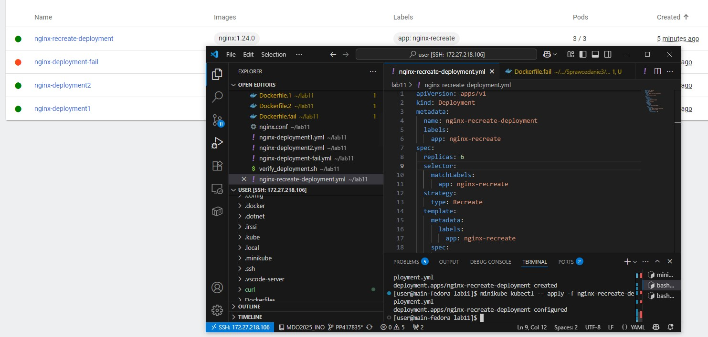

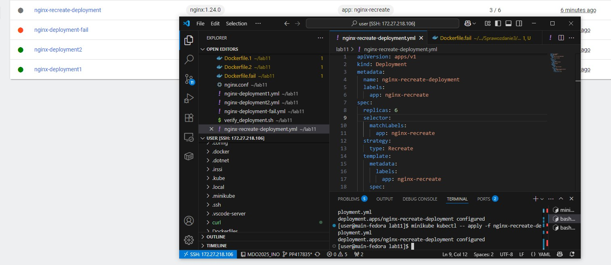

Różnice pomiędzy różnymi strategiami deploymentu:

Rolling Update:

Opis: To jest domyślna i najczęściej używana strategia. Kubernetes stopniowo zastępuje stare Pody nowymi. Robi to, tworząc nowe Pody z aktualną wersją aplikacji i usuwając stare Pody, gdy nowe są już zdrowe i gotowe.
-Brak przestojów (Zero Downtime): Aplikacja pozostaje dostępna przez cały proces aktualizacji, ponieważ zawsze jest wystarczająca liczba działających Podów.
-Łatwy Rollback: W razie problemów można szybko wrócić do poprzedniej, stabilnej wersji.
-Proces może być wolniejszy niż Recreate. Nowa i stara wersja mogą współistnieć przez pewien czas, co wymaga kompatybilności wstecznej.

Recreat:

Opis: To najprostsza, ale najbardziej brutalna strategia. Kubernetes najpierw usuwa wszystkie istniejące Pody z poprzednią wersją aplikacji, a dopiero potem tworzy wszystkie nowe Pody z nową wersją.
-Prosta do zrozumienia i implementacji.
-Gwarantuje, że stara i nowa wersja nigdy nie działają jednocześnie (brak problemów z kompatybilnością wsteczną).
-Powoduje przestój (Downtime): Aplikacja jest niedostępna przez cały czas trwania aktualizacji (między usunięciem starych a uruchomieniem nowych Podów).

Canary Deployment 

Opis: Zaawansowana strategia, która polega na wprowadzeniu nowej wersji aplikacji tylko do niewielkiego podzbioru użytkowników (np. procentu ruchu) lub do niewielkiej liczby Podów. Jeśli nowa wersja działa stabilnie i nie powoduje błędów (monitorujesz ją), stopniowo zwiększasz ruch kierowany do niej, aż wszystkie Pody zostaną zaktualizowane.
-Minimalne ryzyko: W przypadku problemów, błąd dotyka tylko małej grupy użytkowników, a wdrożenie można szybko cofnąć.
-Umożliwia testowanie nowej wersji na rzeczywistym ruchu produkcyjnym.
-Bardziej złożona w implementacji (wymaga inteligentnego routingu ruchu, często z użyciem Service Mesh, Ingress Controllerów lub ręcznych podziałów w serwisach).
-Wymaga monitorowania i narzędzi do analizy ruchu.


