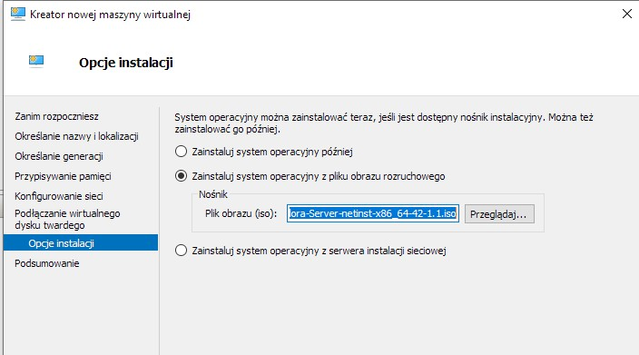

# sprawko 3

## ansible

nie mam instalacji ansibla bo instalowałem z Panem na zajęciach i nie robiłem screenów w tym czasie


Działająca nowa maszyna do ansible


Utworzenie migawki


Utworzenie nowego klucza i jego przesłanie do nowej maszyny co zapewni łączność ssh bez użycia hasła


zmiany w pliku config w katalogu ssh aby wskazać na klucz za pomocą którego mają być ustanawiane połączenia z nową maszyną


logowanie za pomocą ssh do nowej maszyny bez użycia hasła


# inwentaryzacja

zmiana nazwy hosta maszyny głównej i dowód na zmianę po restarcie


# sass

10

dodanie na maszynie gównej skojarzenia nazwy słownej z adresem IP nowej maszyny dzięki czemu będzie możliwe odnoszenie się do nowej maszyny po nazwie słownej która jest wygodniejsza od adresu IP

11

Identycznie skojarzenie słowne tylko w drugą stronę


12
Pingowanie dwóch maszyn nawzajem aby sprawdzić czy połączenie zostało poprawnie ustanowione


13
utworzenie pliku inventory.ini
```
miejsce na inventor
```

oraz wpisanie klucza publicznego który służy do łączenia się między maszynami do pliku kluczy autoryzowanych oraz nadanie odpowiednich uprawnień plikowi kluczy autoryzowanych aby możliwe było dokonanie pingu ansiblowego

14

udany ping ```ansible```, który różni się od "normalnego" pingu 

15

Utworzenie playbooka, który ma za zadanie określenie parametrów i wywołanie procedur na nowych maszynach

Przepraszam za wpis po polsku w playbooku ale wspomagałem się AI przy napisaniu tego playbooka i nie zauważyłem aby przetłumaczyć wyrażenie na angielski

16

"Uruchomienie" playbooka, który poprawnie skopiował plik inwentarza co jest oznaczone przez napis ```changed=1``` 

17

Ponowne uruchomienie nie wykazuje już żadnych zmian co znaczy, że wszystko działa poprawnie

18

Połączenie się z nową maszyną i zainstalowanie na niej ```rngd```

19

Rozbudowanie playbooka o część odpowiedzialną za aktualizacje i restart usług

20

Uruchomienie playbooka po rozbudowaniu, który aktualizuje pakiety i uruchamia usługi co jest znowu potwierdzone wartością change większą od 0

21

Zatrzymanie usługi ssh na nowej maszynie

22

Po zatrzymaniu usługi nie ma połączenia więc playbook nie "przechodzi" co jest porządanym i logicznym działaniem

23

Po ponownym włączeniu ssh wszystko wróciło do normy

24

Uruchomienie ```ansible-galaxy init user``` co utworzyło szkielet roli

25

Dalsza rozbudowa playbooka mająca za zadanie wdrożenie na nowej maszynie obrazu dockera stworzonego w poprzednim sprawozdaniu

```
miejsce na play booka
```

```
miejsce na playbooka deploy
```


26

Błąd działania nowego rozbudowanego playbooka wynikający z tego, że na dockerhubie nie miałem obrazu ```latest``` 

27

Dopiero wpisanie konkretnej wersji rozwiązało ten problem. 

Wpisywanie konkretnej wersji jest mieczem obosiecznym ponieważ z jednej strony mamy pewność której wersji aplikacji używamy co uodparnia nas na potencjalne niestabilności w naszych zastosowaniach które mogą pojawić się przy nowych wersjach. Z drugiej jednak strony ręczne zmienianie wiersji może być uciążliwe i może prowadzić do "zapomnienia" o aktualizacjach co w dłuższej perspektywie może mieć znaczące konsekwencje

28

Po zmianie na stałą wersję playbook wykonuje się poprawnie


## masowe wdrożenia 

Plik odpowiedzi pozyskałem kilka tygodni temu ale niestety nie zrobiłem screenów. O prawdziwości moich słów może świadczyć fakt, że w katalogu ITE/GCL06/PP417835/lab9/ ostatni commit jest sprzed miesiąca
1

Kreator nowej maszyny która skorzysta z pliku odpowiedzi


2

Początkowo chciałem kożystać z fedory 42 jednak przez...


taki oraz inne blędy zdecydowałem się pracować dalej na fedorze 41 

3


Instalacja zakończona sukcesem
5

6

plik odpowiedzi dzięki któremu powyższa instalacja się dokonała. Hasło wpisałem tymczasowo na stałe ponieważ zapomniałem starego ale wiem, że to bardzo zła praktyka

7

Plik odpowiedzi który od razu przy pierwszym uruchomieniu nowej maszyny wirtualnej zapisuje na niej docker z programem ```curl```, który był celem pipeline z poprzedniego sprawozdania
```
miejsce na ostateczny plik wdrożenia
```

Potwierdzenie, że isntalacja nowej maszyny przebiegła zgodnie z założeniami


# kubernetes
1

2

3

4

5

6

7

8

9

10

11

12

13

14

15

16

17

18

19

20

21

22


