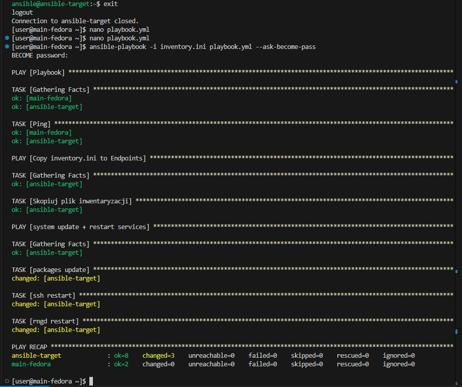
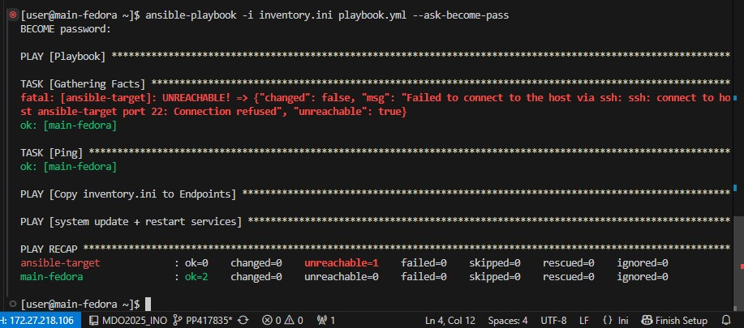

# sprawko 3

## ansible

nie mam instalacji ansibla bo instalowałem z Panem na zajęciach i nie robiłem screenów w tym czasie


Działająca nowa maszyna do ansible


Utworzenie migawki


Utworzenie nowego klucza i jego przesłanie do nowej maszyny co zapewni łączność ssh bez użycia hasła


zmiany w pliku config w katalogu ssh aby wskazać na klucz za pomocą którego mają być ustanawiane połączenia z nową maszyną


logowanie za pomocą ssh do nowej maszyny bez użycia hasła


# inwentaryzacja

zmiana nazwy hosta maszyny głównej i dowód na zmianę po restarcie


# sass

10

dodanie na maszynie gównej skojarzenia nazwy słownej z adresem IP nowej maszyny dzięki czemu będzie możliwe odnoszenie się do nowej maszyny po nazwie słownej która jest wygodniejsza od adresu IP

11

Identycznie skojarzenie słowne tylko w drugą stronę


12
Pingowanie dwóch maszyn nawzajem aby sprawdzić czy połączenie zostało poprawnie ustanowione


13
utworzenie pliku inventory.ini
```
miejsce na inventor
```

14

15

16

17

18

19

20

21

22

23

24

25

26

27

28


## masowe wdrożenia 


# kubernetes