# Zajęcia 01

Celem poniższych kroków jest zapoznanie się i konfiguracja środowiska `git` oraz łączenie z usługą ssh.

Niestety nie robiłem na bierząco zrzutów ekranu do pierwszych zajęć, więc wiekszość zrzutów to fragmenty historii poleceń.

## 1. Instalacja git i obsługi ssh

Usługi zainstalowano za pomocą `dnf intall` + nazwa uługi (jak na zrzucie).

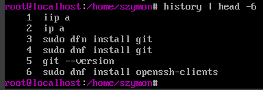

## 2. Sklonowanie repozytorium przedmiotowego

Repozytorium można sklonować dzięki poleceniu `git clone`.

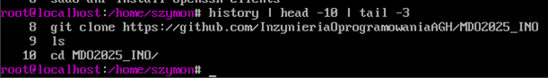

## 3. Tworzenie kluczy ssh i konfiguracja ssh jako metodę dostępu do GitHuba

Utworzone klucze ssh zabezpieczone hasłem za pomocą 'ssh-keygen':

```
ssh-keygen -t ed25519 -C "szpolak@student.agh.edu.pl"
ssh-keygen -t ecdsa -b 521 -C "szpolak@student.agh.edu.pl"
```

Jako komentarz: email - dodanie komentarza pomaga zidentyfikować włściciela, gdybyśmy przechowywali kluczy innych użytkowników.

Klucze domyślnie tworzą się w katalogu `~/.ssh`.

### Utworzone klucze

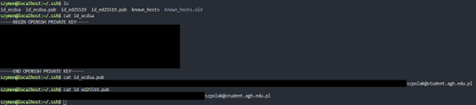

### SSH jako metoda dostępu do githuba

Teraz możemy dodać wygenerowany klucz jako metodę dostępu do w githubie: 

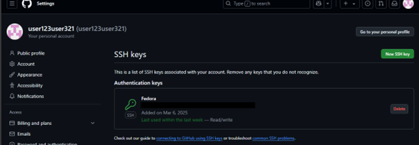

## 4. Przełączenie gałęzi na main -> grupową -> utworzenie nowej gałęzi

Do przełącznia gałęzi wykorzystujemy polecenie `git checkout`.

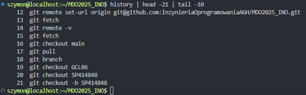

('-b' przy 'git checkout' oznacza utworzenie gałęzi i przełączenie się na nią)

## 5. Praca na nowej gałęzi

Utworzono katalog "SP414848" za pomocą 'mkdir' oraz napisano git hooka, który wyrzuca błąd jeśli wiadomość commita nie rozpoczyna się zadanym ciągiem znaków (SP414848).

### Treść hooka:
```
#!/bin/bash

commit_msg=$(cat $1)
pattern="^SP414848"
if ! [[ $commit_msg =~ $pattern ]]; then
  echo "ERROR: commit message must begin with 'SP414848'"
  exit 1
fi
```

Skopiowano hooka do odpowiedniego katalogu (.git/hooks) za pomocą 'cp', wynik działania:

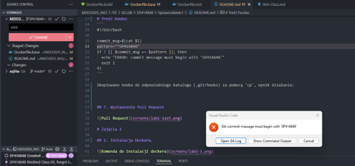

Git poprawnie wyrzuca błąd gdy wiadomość się nie zgadza z ustawionym wzorcem.


## 6. Wystawienie Pull Request

Pull Request wystawiamy z zakładki `Pull requests` na githubie, następnie przycisk `New pull request`.

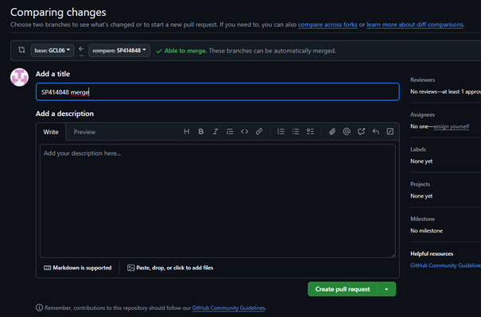

(wybrano gałąź grupową jako 'base' - lewy górny róg)

# Zajęcia 2

Celem poniższych kroków jest zapoznanie się z podstawowym działaniem docker (pobieranie obrazów, uruchamianie kontenerów, zapoznanie się z Dockerfile).

## 1. Instalacja Dockera

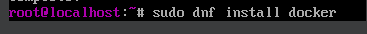

## 2. Rejestracja w Docker Hub

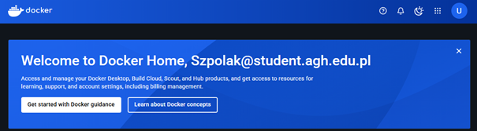

## 3. Pobieranie obrazów

Obrazy pobrano za pomocą 'docker pull':
```
  143  docker pull hello-world
  144  docker pull busybox
  145  docker pull ubuntu
  146  docker pull mysql
```
## 4. Uruchomienie obrazu `busybox`

Obraz uruchamiamy poleceniem 'docker run':

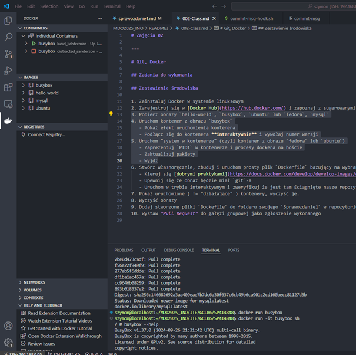

(-it uruchamia obraz w trybie interaktywnym oraz przydziela terminal, sh na końcu polecenia uruchamia powłokę)


## 5. Uruchomienie obrazu `ubuntu`

Uruchomiono interaktywnie obraz `ubuntu`, uruchomiono aktualizację menedżera pakietów 'apt' - połączenie sieciowe działa bez problemów.


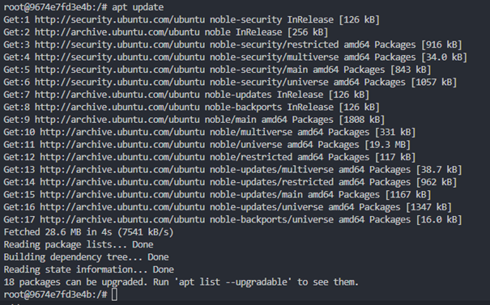

## 6. Utworzenie pliku Dockerfile i sklonowanie repozytorium

Utworzono plik Dockerfile, jest plik konfiguracyjny używany do automatycznego tworzenia obrazów Dockera.

Poniższy plik Dockerfile jest oparty na ubuntu i służy do klonowania repozytorium oraz uruchamia powłokę (oczywiście najpierw instaluje git'a). 

### Kod Dockerfile:
```Dockerfile
FROM ubuntu:latest
RUN apt update && apt install -y git
WORKDIR /app
RUN git clone https://github.com/InzynieriaOprogramowaniaAGH/MDO2025_INO
CMD ["/bin/bash"]
```

Zbudowanie obrazu - 'docker build' ('-t' - nadaje wprowadzoną nazwę, '.' - wskazuje na katalog z plikiem Dockerfile, czyli obecny katalog), oraz uruchomienie 'docker run'.

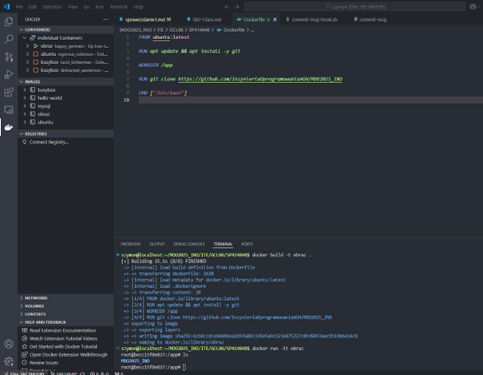

Repozytorium poprawnie się sklonowało.

## 7. Uruchomienie kontenerów i usunięcie ich

Kontenery po uruchomieniu:

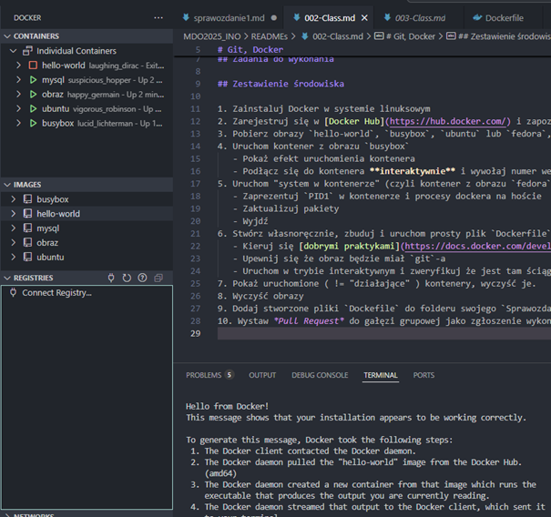

Usunięcie za pomocą 'docker rm' (podajemy nazwę kontenera, bądź id lub jego fragment)

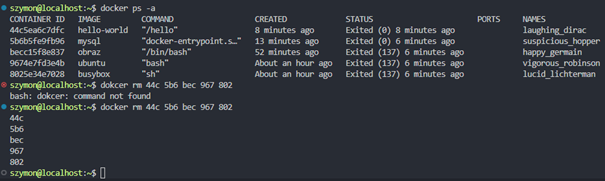

## 8. Usunięcie obrazów

Do usuwania obrazów - 'docker rmi' z nazwą obrazu

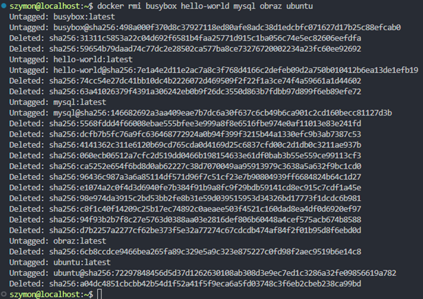

# Zajęcia 03

Celem poniższych kroków jest przprowadzenie procesu budowania i testowania aplikacji w kontenerze oraz automatyzajca procesu za pomocą Dockerfile.

## 0. Wybór repozytorium

Do przeprowadzenia poniższych zadań użyto repozytorium `sqlite`: https://github.com/sqlite/sqlite 

Wybrałem to repozytorium ponieważ SQLite jest lekki i nie wymaga konfiguracji serwera.
Budowanie – mało zależności, proces budowania to tylko 2 polecenia. Testy – wiele różnorodnych testów z użyciem bazy w pamięci.

## 1. Proces budowania i testowania w kontenerze

Pierwszym krokiem przy budowaniu aplikacji jest zainstalowanie zależności, w przypadku sqlite można je znaleźć w dokumentacji repozytorium.

Następnym krokiem jest przygotowanie środowiska do kompilacji, w sqlite aby to zrobić należy uruchomić skrypt './configure'.

Ostatnim krokiem jest sama kompilacja, w sqlite aby zbudować większość komponentów wystarczy zwyczajnie uruchomić make na domyślny target (all) - 'make', ewentualnie 'make all'.

### Zrzut przedstawiający polecenia potrzebne do poprawnego zbudowania sqlite (instalacja zależności, klonowanie repozytorium i proces budowania)

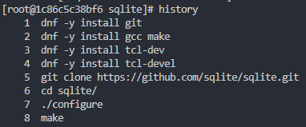

Do przeprowadzenia standardowych testów sqlite potrzebujemy jeszcze utworzyć nowego użytkownika, testy nie uruchamiają się na użytkowniku root.

### Zrzut przedstawiający tworzenie użytkownika oraz przyznanie mu uprawnień

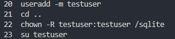

Następnie możemu już przejść do testów - sqlite posiada wiele targetów do testowania, ja tutaj użyłem domyślnego 'make test'.

### Uruchomienie testów

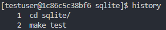

### Raport z testów (brak błędów)

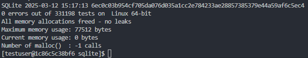

## 2. Automatyzacja budowania i testów za pomocą Dockerfile

Proces można zautomatyzować dzięki plikom Dockerfile, jeden do budowania, drugi do testów.

### Kod Dockerfile.build:
```Dockerfile
FROM fedora:40

RUN dnf install -y git gcc make tcl-devel

RUN git clone https://github.com/sqlite/sqlite.git
WORKDIR /sqlite

RUN ./configure
RUN make
```

### Zrzut przedstawiający kod oraz poprawne budowanie obrazu za pomocą pliku Dockerfile.build

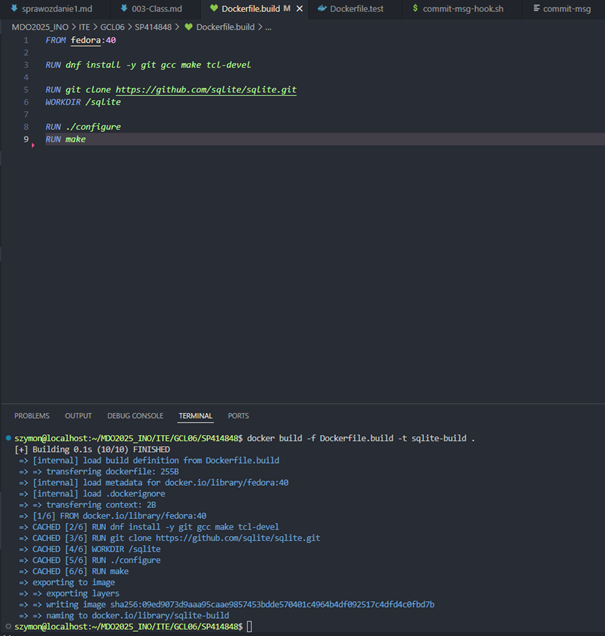

('-f' pozwala wskazać na konkretny plik Dockerdile)

### Kod Dockerfile.test:
```Dockerfile
FROM sqlite-build

RUN useradd -m testuser
RUN chown -R testuser:testuser /sqlite

USER testuser

WORKDIR /sqlite

CMD ["make", "test"]
```

Jako bazę Dockerfile do testów wskazujemy na obraz zbudowany na bazie Dockerfile.build.

### Zrzut przedstawiający kod oraz poprawne budowanie obrazu za pomocą pliku Dockerfile.test

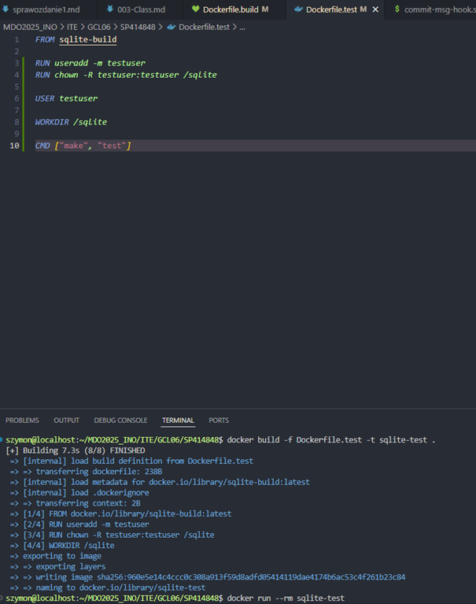

### Zrzut przedstawiający uruchomienie kontenera do testów ('--rm' usuwa kontener po zakończeniu testów)

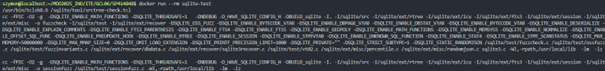

### Raport z testów - brak błędów, kontener poprawnie się wdrożył i działa

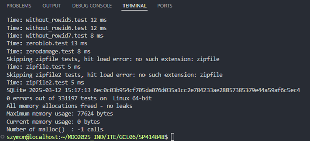

## 3. Różnica pomiędzy kontenerem a obrazem

Obraz jest to stały 'przepis' na kontener, zawiera wszytsko co jest potrzebne do jego uruchomienia - kod aplikacji, zależności, biblioteki oraz inne elementy bez których nie możemy uruchomić poprawnie aplikacji. Obraz budujemy raz i możemy z niego korzystać. Z jednego obrazu możemy uruchomić wiele kontenerów.

Kontener to natomiast dynamiczne środowisko uruchomione na bazie obrazu w którym działa nasza aplikacja, środowisko to jest mocno odizolowane od systemu hosta i nie wpływa na niego.

## 4. Co pracuje w kontenerze

Kontener sam w sobie jest to widoczny w systemie hosta proces, jest on jednak mocno odizolowany - nie ma dostępu do procesów, ustawień, plików etc. hosta, jednakże korzysta z jego zasobów (CPU, RAM, sieć etc.).

W kontenerze pracuje środowisko ustalone według obrazu, na podstawie którego uruchomiono kontener, zazwyczaj jest to minimalne środowisko potrzebne do uruchomienia danej aplikacji.

# Zajęcia 04 - Zachowanie stanu

Celem poniższych kroków jest zapoznanie się z działaniem woluminów i ich wykorzystaniem w dockerze.

## 1. Obraz bazowy (bez gita)

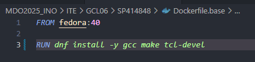

## 2. Tworzenie nowych woluminów

Woluminy to trwałe magazyny danych dla kontenerów Docker, które nie zależą od ich cyklu życia, oznacza to że kontener może pracować na podpiętym woluminie, a po jego wyłączeniu/usunięciu wszystko co zostało zapisane na woluminie dalej tam będzie.

Woluminy tworzymy na pomocą `docker volume create` + nazwa woluminu.

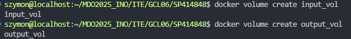

## 3. Kopiowanie repozytorium na wolumin

### Podejście do kopiowania

Kopiowanie wykonano za pomocą polecenia 'docker cp' (docker copy), w tym celu utworzono tymczasowy kontener z podpiętym woluminem wejściowym, następnie sklonowano repozytorium na hoście i użyto odpowiedniego polecenia (jak na zrzucie).

Uruchomino jeszcze kontener testowy z podpiętym wolumiem wejściowym aby zobaczyć czy kopiowanie rzeczywiście się powiodło.

### Wykonanie

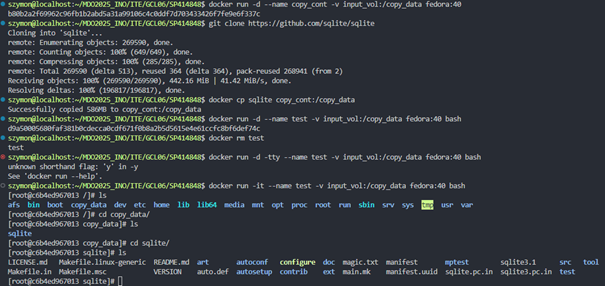

Usunięto niepotrzebne kontenery.

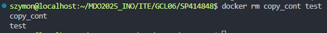

## 4. Uruchomienie kontenera bazowego z podpiętymi woluminami (wejściowym i wyjściowym)

Woluminy podpinamy flagą '-v', po niej podajemy odpowiednie mapowanie ({nazwa woluminu}:{ścieżka w kontenerze}).

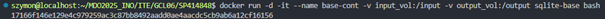

## 5. Przeprowadzenie budowania na wolumienie wejściowym, kopiowanie zbudowanej aplikacji do kontenera

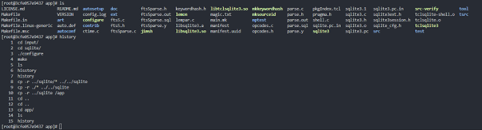

## 6. Kopiowanie zbudowanej aplikacji na wolumin wyjściowy

Z uwagi na to że sqlite buduje się bezpośrednio do katalogu repozytorium (brak folderu na zbudowane pliki np. /build) 
najprościej będzie skopiować cały katalog ze zbudowanymi plikami.

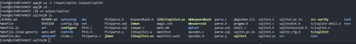

## 7. Klonowanie w kontenerze

Aby wykonać klonowanie w kontenerze wystarczy doinstalować git'a, można dodać jego instalację w Dockerfile lub po prostu zainstalować w kontenerze bazowym ręcznie,
następnie w kontenerze z podpiętymi woluminami wystarczy sklonować repozytorium z katalogu woluminu wejściowego (jak na zrzucie ekranu).

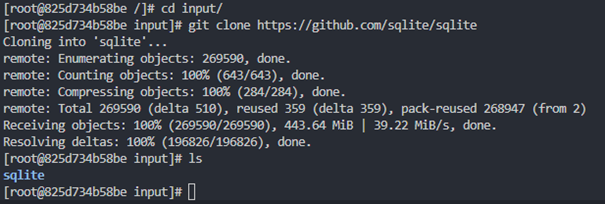

Budowanie i kopiowanie na wolumin wyjściowy - bez zmian.

## 8. Dyskusja o wykonaniu kroków za pomocą 'docker build' i Dockerfile

Przeprowadzono próby wykonania kroków za pomocą Dockerfile i 'docker build'.

Próbowano za pomocą 'RUN --mount=type=bind' połączyć uprzednio utworzone katalogi z hosta na kontener (jak w poniższym Dockerfile).

### Dockerfile z 'RUN --mount'

```Dockerfile
FROM fedora:40

RUN dnf install -y git gcc make tcl-devel

RUN mkdir /app

WORKDIR /input

RUN --mount=type=bind,source=./input-host,target=/input,rw \
    --mount=type=bind,source=./output-host,target=/output,rw \
    git clone https://github.com/sqlite/sqlite /input/sqlite && \
    cd /input/sqlite && \
    ./configure && make && \
    cp -r ./* /app && \
    cp -r ./* /output

```

Jednak pomimo tego że w kontenerze znajduje się poprawnie zbudowana aplikacja (w /app), to na hoście nie zaszły zmiany.

Z dokumentacji wyczytałem że:

https://docs.docker.com/build/cache/optimize/#use-bind-mounts

`Bind mounts are read-only by default. If you need to write to the mounted directory, you need to specify the rw option. However, even with the rw option, the changes are not persisted in the final image or the build cache. The file writes are sustained for the duration of the RUN instruction, and are discarded after the instruction is done.`

Oznaczało by to że na etapie budowania nie jest możliwe zapisanie danych na maszynie hosta za pomocą bind mount'ów,
również inne typy mount'ów nie wydają się pomocne. Także nie znalazłem możliwości przeprowadzenia kroków za pomocą 'docker build' i Dockerfile.

Również wyczerpująca rozmowa z `dockerdocsAI` nie przyniosła lepszych rezultatów.

# Zajęcia 04 - Eksponowanie portu

Kroki mają na celu:

- Instalację iPerf3 - uruchomienie serwera i testowanie jego działania w kontenerze.

- Test komunikacji - między kontenerami w domyślnej sieci Dockera.

- Tworzenie własnej sieci - konfiguracja dedykowanej sieci mostkowanej.

- Uruchomienie kontenerów - w dedykowanej sieci dla testów przepustowości.

- Eksponowanie portów - umożliwienie komunikacji z serwerem z hosta i spoza hosta.

## 1. Instalacja iperf3, uruchomienie na kontenerze w trybie serwera ('-s')

`iperf3` standardowo instalowano 'dnf install'.

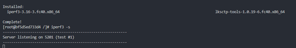

## 2. Uruchomienie iperf3 na drugim kontenerze w trybie klienta ('-c'), komunikacja z serwerem

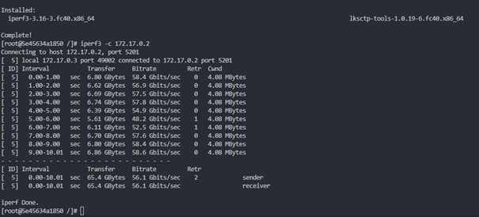

Bardzo wysoka przepustowość (średnio ponad 50 gigabitów/s), jest tak wysoka ponieważ kontenery działają w tej samej sieci wewnętrznej (krótka ścieżka pakietów).

### Ruch na serwerze:

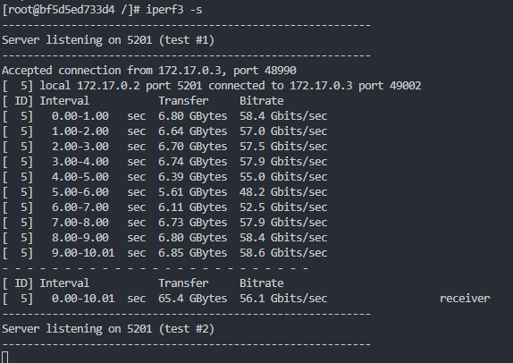

## 3. Utworzenie własnej sieci mostkowanej

Sieć tworzymy poleceniem `docker network create` + nazwa sieci.

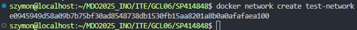

## 4. Uruchomienie kontenerów w sieci

Aby uruchomić kontener w naszej sieci przy uruchamianiu dodajemy '--network' + nazwa sieci.

### Kontener serwerowy

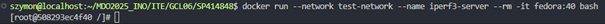

### Kontener kliencki


## 5. Komunikacja z serwerem za pomocą nazwy kontenera

### Od storny klienta - użyto nazwy zamiast IP

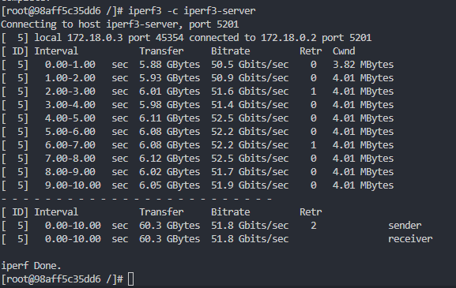

### Od storny serwera

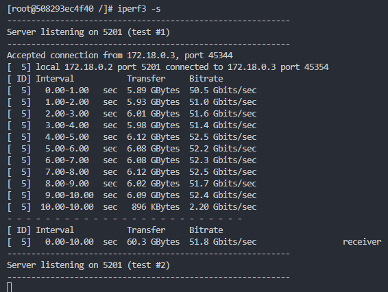

Również bardzo wysoka przepustowość - kontenery działają w tej samej sieci wewnętrznej (krótka ścieżka pakietów).

## 5. Komunikacja z serwerem - z hosta i spoza hosta

### Uruchomienie kontenera serwera z mapowaniem portu (domyślny dla iperf3 - 5201) - aby był widoczny poza siecią dockera


### Połączenie z hosta na konkretny (zmapowany) port ('-p')

Łączymy się na `localhost` gdyż host sam udostępnia port.

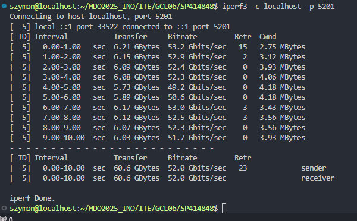

Również bardzo wysoka przepustowość - ścieżka pakietów dalej jest krótka, kontener serwera działa bezpośrednio na hoście.


### Połączenie spoza hosta

Łączymy się na ip hosta (adres ip maszyny wirtualnej) wraz z udostępnianym przez hosta portem (5201).

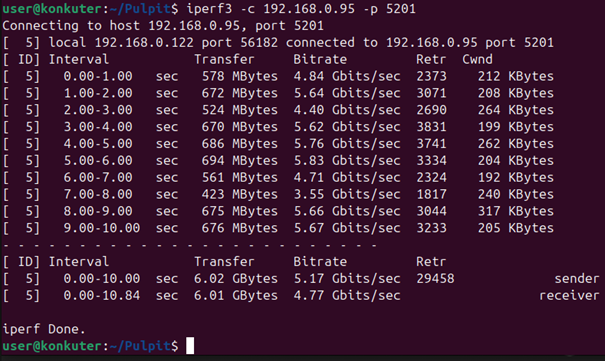

Dużo niższa przepustowość - wynika z tego, że połączenie przeprowadzano z maszyny wirtualnej (ubuntu) na maszynę wirtualną (host - fedora).

Pakiety musiały przejść z jednej maszyny wirtualnej na drugą i jeszcze dodatkowo na sieć wewnętrzną dockera.

# Zajęcia 04 - Instancja Jenkins

### Wszytkie kroki przeprowadzono krok po kroku z dokumentacją: https://www.jenkins.io/doc/book/installing/docker/

Poniższe kroki pozwolą przeprowadzić instalację skonteneryzowanej instancji Jenkinsa z pomocnikiem DIND, oraz uruchomić jego instancje i zalogować się do panelu. 

## 1. Tworzenie sieci dla jenkins'a

```
docker network create jenkins
```

## 2. Pobranie obrazu docker:dind i uruchomienie kontenera

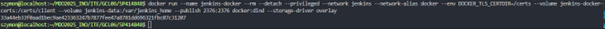

## 3. Dockerfile dla jenkinsa (Dockerfile.jenkins)

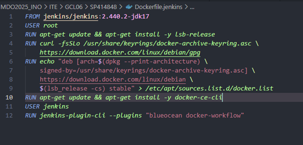

## 4. Build: Dockerfile.jenkins

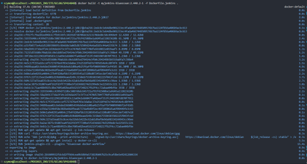

## 5. Działająca instancja

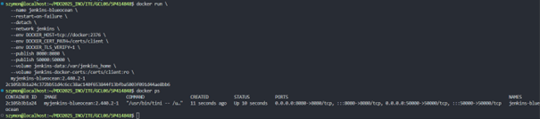

## 6. uzyskanie hasła do logowania

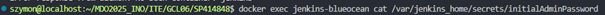

## 7. Panel Jenkinsa

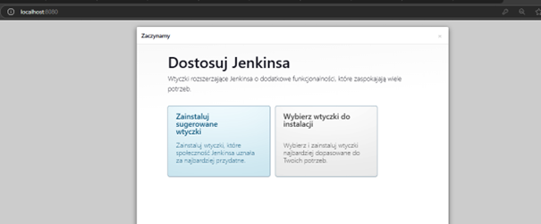

---
