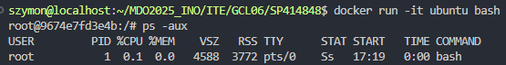

# Zajęcia 01

## 1. Instalacja git i obsługi ssh

## 2. Sklonowanie repozytorium przedmiotowego

## 3. Tworzenie kluczy ssh i konfiguracja ssh jako metodę dostępu do GitHuba.

## 4. Przełączenie gałęzi na grupową.

## 5. Uwtorzenie nowej gałęzi.

## 6. Praca na nowej gałęzi

Utworzono katalog "SP414848" za pomocą 'mkdir' oraz napisano git hooka.

# Treść hooka:
```
#!/bin/bash

commit_msg=$(cat $1)
pattern="^SP414848"
if ! [[ $commit_msg =~ $pattern ]]; then
  echo "ERROR: commit message must begin with 'SP414848'"
  exit 1
fi
```

Skopiowano hooka do odpowiedniego katalogu (.git/hooks) za pomocą 'cp', wynik działania:


## 7. Wystawienie Pull Request


# Zajęcia 2

## 1. Instalacja Dockera.


## 2. Rejestracja w Docker Hub.


## 3. Pobieranie obrazów.


## 4. Uruchomienie obrazu `busybox`.


## 5. Uruchomienie obrazu `ubuntu`.




## 6. Utworzenie pliku Dockerfile i sklonowanie repo


## 7. Uruchomienie kontenerów i usunięcie ich.


## 8. Usunięcie obrazów.


Kod Dockerfile:
```
FROM ubuntu:latest
RUN apt update && apt install -y git
WORKDIR /app
RUN git clone https://github.com/InzynieriaOprogramowaniaAGH/MDO2025_INO
CMD ["/bin/bash"]
```

## 9. Uruchomienie i usunięcie wszytskich kontenerów.

## 10. Wyczyszczenie obrazów.

# Zajęcia 03

## 1.

## 2.

## 3.

### Kod Dockerfile.build:
```
FROM fedora:40

RUN dnf install -y git gcc make tcl-devel

RUN git clone https://github.com/sqlite/sqlite.git
WORKDIR /sqlite

RUN ./configure
RUN make
```

### Kod Dockerfile.test:
```
FROM sqlite-build

RUN useradd -m testuser
RUN chown -R testuser:testuser /sqlite

USER testuser

WORKDIR /sqlite

CMD ["make", "test"]
```

# Zajęcia 04

## 1.

## 2.

## 3.
