# Instancja Jenkins (powtórzone z poprzedniego sprawozdania)

### Wszytkie kroki przeprowadzono krok po kroku z dokumentacją: https://www.jenkins.io/doc/book/installing/docker/

Poniższe kroki pozwolą przeprowadzić instalację skonteneryzowanej instancji Jenkinsa z pomocnikiem DIND, oraz uruchomić jego instancje i zalogować się do panelu. 

## 1. Tworzenie sieci dla jenkins'a

```
docker network create jenkins
```

## 2. Pobranie obrazu docker:dind i uruchomienie kontenera

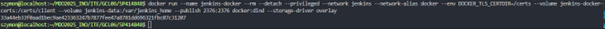

## 3. Dockerfile dla jenkinsa (Dockerfile.jenkins)

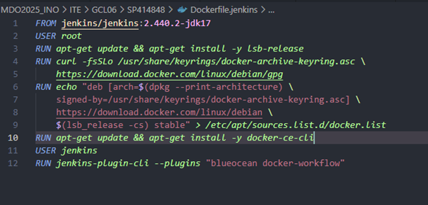

## 4. Build: Dockerfile.jenkins

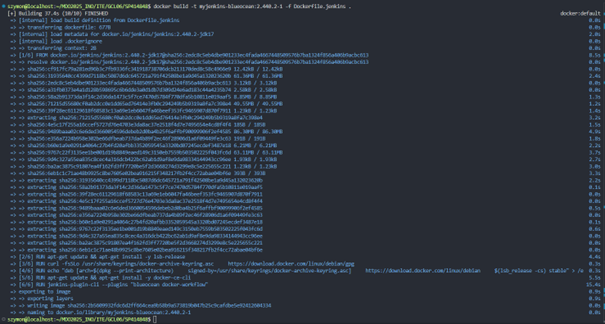

## 5. Działająca instancja

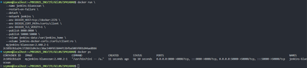

## 6. Uzyskanie hasła do logowania

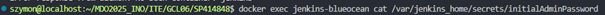

## 7. Panel Jenkinsa

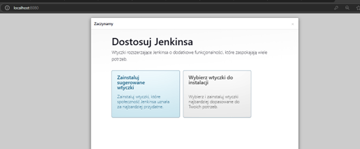


(Aby dostać się do panelu z poziomu hosta na którym uruchomiona jest wirtualna maszyna należy przekierować port 8080, w zależności od wybranego IDE może on zostać przekierowany automatycznie, w vsCode do przekierowania portu wystarczy przejść do zakładki PORTS (obok terminala) i wprowadzić odpowiedni port)

---

# Tworzenie projektów Jenkins

## 1. Dodawanie nowego projektu (wypisanie uname)

Z panelu głównego wybieramy `Nowy Projekt`.

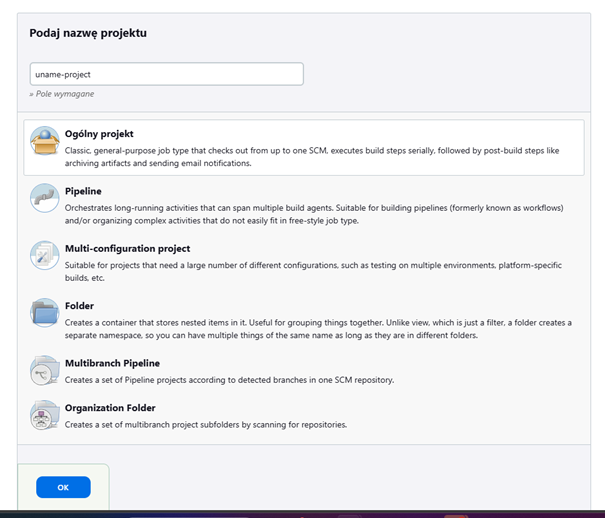

Podajemy nazwę projektu oraz jego typ (w przypadku projektu wypisującego uname będzie to `Ogólny projekt`).

## 2. Dodanie funkcjonalności

Przechodzimy do zakładki `Kroki budowania` i wybieramy z listy interesującą nas funckje (w wypadku uname będzie to "Uruchom Powłokę").

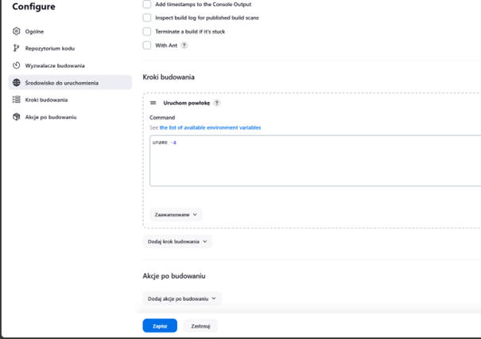

Pozostało wpisać polecenie do wykonania:

```
uname -a
```

## 3. Panel projektu

Zapisujemy - zostaniemy przeniesieni do głównego panelu projektu z poziomu którego możemy uruchamiać zadania (zadanie to pojedyncze zbudowanie projektu, w przypadku naszego projektu jest to wywołanie ustawionego polecenia), aby uruchomić zadanie należy przycisnąć przycisk `Uruchom`.

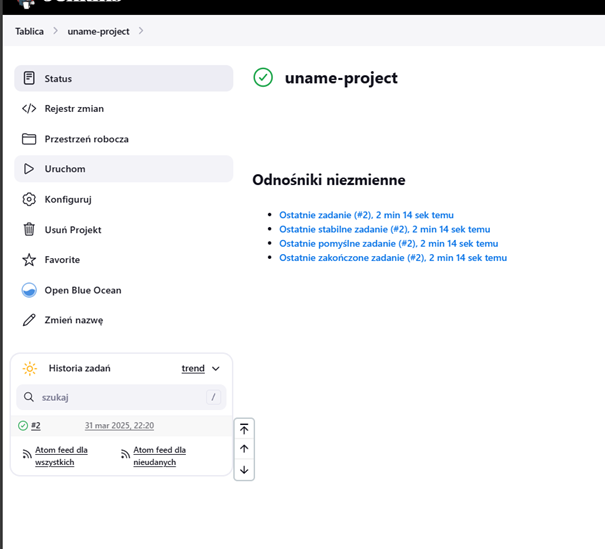

Zielony check mark - poprawne wykonanie (brak błędów), analogicznie czerwony 'x' będzie oznaczał napotkanie błędu przy wykonywaniu zadania.

## 4. Wyświetlenie logów konsoli

Aby wyświetlić logi konsoli zadania najpierw przechodzimy do zadania (klikając w zadanie), a następnie wybieramy `Logi konsoli`.

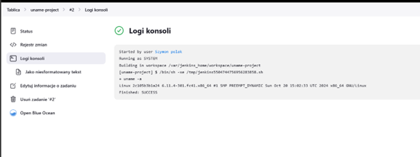

Jak widać w logach pojawiło się wywołanie podanego polecenia (uruchomienie uname) oraz jego output.

## 5. Kolejny projekt - wyświetlenie komunikatu błędu przy nieparzystej godzinie

Podobnie tworzymy ogólny projekt

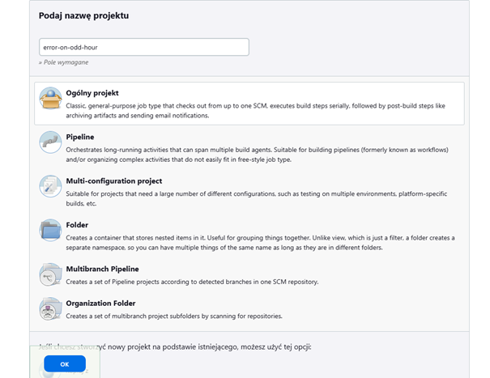

Znowu w krokach budowania uruchamiamy powłokę i wpisujemy odpowiedni skrypt.

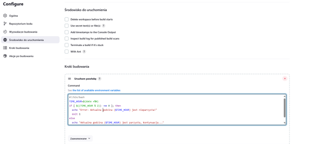

### Skrypt do wyświetlania błędu o nieparzystej godzinie

``` bash
#!/bin/bash
TIME_HOUR=$(date +%H)
if [ $((TIME_HOUR % 2)) -ne 0 ]; then
  echo "Error: Aktualna godzina ($TIME_HOUR) jest nieparzysta!"
  exit 1
else
  echo "Aktualna godzina ($TIME_HOUR) jest parzysta, kontynuacja..."
fi
```

## 6. Logi konsoli

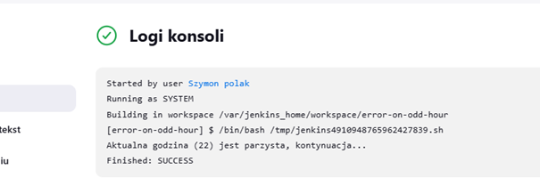

Godzina 22 - parzysta, więc sukces.

## 7. Projekt - pobranie obrazu ubuntu

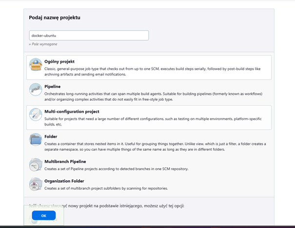

(Kolejny raz typem projektu będzie ogólnt projekt)

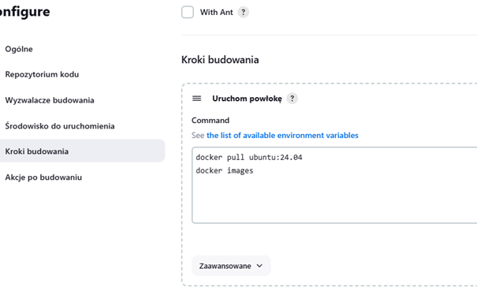

(Wpisujemy polecenia `pull` do pobrania obrazu i `images` do wyświetlenia obrazów)

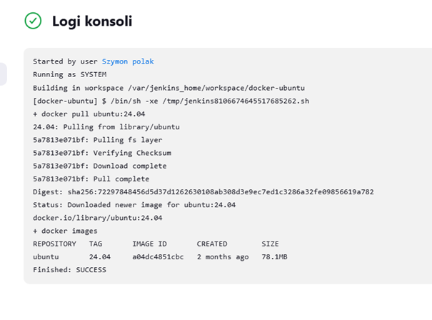

(Obraz został poprawnie pobrany i jest widoczny)

## 8. Projekt typu Pipeline

Pipeline to wieloetapowy, zautomatyzowany proces zarządzania aplikacją - od budowania przez testy po wdrażanie.

W poniższym kroku utworzono pipeline odpowiadający za budowanie aplikacji sqlite (oraz obrazu testującego) na podstawie Dockerfile'ów z repozytorium github.

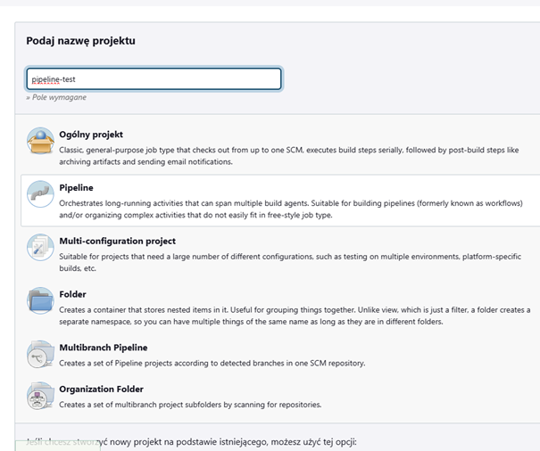

(Wybieramy `Pipeline` jako typ projektu)


W konfiguracji projektu pod sekcją `Pipeline` wybieramy `Pipeline script` i wrowadzamy skrypt tworzący kolejne etapy pipeline'u - skrypt ten jest definiowany za pomocą języka opartego na Groovy.

### Treść pipeline'u

```Groovy
pipeline {
    agent any
    environment {
        REPO_URL = 'https://github.com/InzynieriaOprogramowaniaAGH/MDO2025_INO.git'
        BRANCH = 'SP414848'
        IMAGE_NAME_BUILD = 'sqlite-build'
        IMAGE_NAME_TEST = 'sqlite-test'
    }
    stages {
        stage('Clean Up Existing Docker Image') {
            steps {
                script {
                    sh "docker rmi -f ${IMAGE_NAME_BUILD}"
                    sh "docker rmi -f ${IMAGE_NAME_TEST}"
                }
            }
        }
        stage('Clone Repository') {
            steps {
                script {
                    sh 'rm -rf MDO2025_INO'
                    sh "git clone ${REPO_URL}"
                }
            }
        }
        stage('Checkout Personal Branch') {
            steps {
                dir('MDO2025_INO') {
                    script {
                        sh "git checkout ${BRANCH}"
                    }
                }
            }
        }
        stage('Build Docker Image') {
            steps {
                dir('MDO2025_INO/ITE/GCL06/SP414848') {
                    script {
                        sh "docker build --no-cache -t ${IMAGE_NAME_BUILD} -f Dockerfile.build ."
                        sh "docker build --no-cache -t ${IMAGE_NAME_TEST} -f Dockerfile.test ."
                    }
                }
            }
        }
    }
}
```

### Krótki opis skryptu

W sekcji environment dodajemy zmienne środowiskowe, które będą widzialne w całym obiekcie.

Skrypt składa się z 4 etapów (stages):
1) Odpowiada za czyszczenie po poprzednim zadaniu - usuwa utworzone w poprzednim zadaniu obrazy (pipeline powienien być 'czysty' i nie zależeć od poprzednich zadań).
2) Odpowiada za klonowanie repozytorium na którym znajdują się potrzebne Dockerfile (najpierw usuwamy zkatalog repozyturium gdyby już istniał np. z poprzedniego zadania).
3) Odpowiada za zmianę gałęzi na odpowiednią.
4) Buduje obrazy z plików Dockerfile - obrazy budowane z opcją `--no-cache` aby docker nie korzystał z zapisanych w pamięci podręcznej podczas budowania obrazów (znowu chcemy żeby pipeline był niezależny od poprzednich zadań).

(dir() {} - definiuje w jakim katalogu wykonane zostaną polecenia - lepsze to niż pisanie pełnych ścieżek lub ciągłe zmienianie katalogów)

### Poprawne wykonanie dwóch zadań - jedno po drugim


---

# Jenkinsfile z repozytorium

Pisanie całego skryptu naszego pipeline'u w panelu Jenkinsa nie jest idealnym rozwiązaniem - znacznie lepszym rozwiązaniem będzie dodanie do repozytorium pliku Jenkinsfile, a następnie skonfigurowanie projektu Jeninsa.

Aby Jenkins sam pobierał z repozytorium najnowszy skrypt z Jenkinsfile zamaist w konfiguracji projektu zamiast opcji `Pipeline script` wybieramy `Pipeline script from SCM` (SCM - Source Code Management), podajemy nasz SCM (czyli git), adres URL naszego repozytorium, interesującą nas gałąź, oraz ścieżkę do Jenkinsfile (relatywną do bazowego katalogu repozytorium).

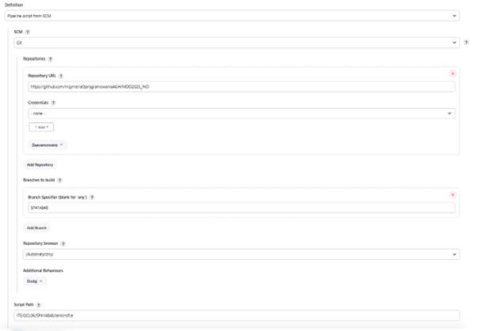

Konfiguracja Jenkinsfile z SCM.

---

# Zaprojektowanie Pipeline'u CI/CD dla sqlite

## Diagram planowanego pipeline'u

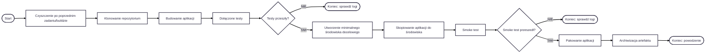

Diagram wykonano w mermaid - powinien bez problemu się wyświetlać w Githubie, gdyby się nie wyświetlał to daję również zrzut ekranu:

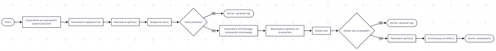

## Poszczególne etapy

### Parametry, zmienne środowiskowe

```Groovy
    parameters {
        string(name: 'VERSION', defaultValue: '0', description: '')
    }
    environment {
        REPO_URL = 'https://github.com/InzynieriaOprogramowaniaAGH/MDO2025_INO.git'
        BRANCH = 'SP414848'
        BASE_DIR = 'MDO2025_INO/ITE/GCL06/SP414848'
        IMAGE_NAME_BUILD = 'sqlite-build'
        IMAGE_NAME_TEST = 'sqlite-test'
        IMAGE_NAME_SMOKE = 'sqlite-smoke'
        PACKAGE_NAME = 'sqlite_linux'
    }
```

W sekcji `parameters` dodano parametr typu string, który będzie określał wersję aplikacji (parametr ten musi zostać podany przed uruchomieniem każdego zadania w panelu Jenkins).

W sekcji `enviroment` umieszczono wszytskie potrzebne zmienne środowiskowe.

### Clean, Clone - czyszczenie po poprzednich zadaniach, klonowanie repozytorium

```Groovy
        stage('Clean') {
            steps {
                script {
                    sh 'rm -rf MDO2025_INO'
                    sh 'docker system prune -a --volumes -f'
                }
            }
        }
        stage('Clone') {
            steps {
                script {
                    sh "git clone -b SP414848 --single-branch ${REPO_URL}"
                }
            }
        }
```

Usuwamy nasze repozytorium pozostałe po poprzednich zadaniach oraz czyścimy zasoby dockera (pozostałe obrazy, kontenery i woluminy).

Następnie klonujemy repozytorium (tylko interesującą nas gałąź - oszczedność w zasobach).

### Build - budowanie aplikacji

```Groovy
        stage('Build') {
            steps {
                dir("${BASE_DIR}") {
                    script {
                        sh "docker build --no-cache -t ${IMAGE_NAME_BUILD} -f Dockerfile.build ."
                    }
                }
            }
        }
```

Build - buduje aplikację na podstawie przygotowanego wcześniej Dockerfile.build:

```Dockerfile
FROM fedora:41

RUN dnf install -y git gcc make tcl-devel

RUN git clone https://github.com/sqlite/sqlite.git
WORKDIR /sqlite

RUN ./configure

RUN make
```

W opraciu o fedorę 41, instalujemy potrzebne zależności, klonujemy repozytorium z kodem źródłowym, ustawiamy katalog roboczy, konfigurujemy środowisko i budujemy aplikację `sqlite`.

### Test - pakiet testów kodu źródłowego
```Groovy
        stage('Test') {
            steps {
                dir("${BASE_DIR}") {
                    script {
                        sh "docker build --no-cache -t ${IMAGE_NAME_TEST} -f Dockerfile.test ."
                        sh "docker run --rm ${IMAGE_NAME_TEST} > test_logs_${PACKAGE_NAME}_${params.VERSION}.txt 2>&1"
                        archiveArtifacts artifacts: "test_logs_${PACKAGE_NAME}_${params.VERSION}.txt", onlyIfSuccessful: false 
                    }
                }
            }
        }
```

Test - budujemy obraz w opraciu o Dockerfile.test, uruchamiamy kontener: '2>&1' pozwoli zwrócić output testów, dzięki czemu możemy zapisać wyniki do pliku.

W przypadku niepowodzenia pipeline się zakończy, w logach w panelu Jenkinsa będziemy mogli zobaczyć przebieg testów.

W przypadku powodzenia ustawiamy logi z testów jako artefakt - dzięki temu mamy 'dowód' na to że testy przeszły, a nie zostały w jakiś sposób pominięte.

Dockerfile.test:

```Dockerfile
FROM sqlite-build

RUN useradd -m testuser
RUN chown -R testuser:testuser /sqlite

USER testuser

WORKDIR /sqlite

CMD ["make", "test"]
```

Wykorzystujemy obraz build który zbudował już aplikację, następnie tworzymy użytkownika na którym przeprowadzone zostaną testy i uruchamiamy cały pakiet testów.

### Deploy - smoke test w środowisku docelowym

```Groovy
        stage('Deploy - smoke') {
            steps {
                dir("${BASE_DIR}") {
                    script {
                        sh "docker build --no-cache -t ${IMAGE_NAME_SMOKE}:${params.VERSION} -f Dockerfile.smoke ."

                        echo "Staring smoke test..."
                        def testResult = sh(script: "docker run --name sqlite-smoke-cont ${IMAGE_NAME_SMOKE}:${params.VERSION}", returnStatus: true)

                        sh "docker logs sqlite-smoke-cont > smoke_test_logs_${PACKAGE_NAME}_${params.VERSION}.txt || true"
                        sh "docker rm sqlite-smoke-cont || true"

                        archiveArtifacts artifacts: "smoke_test_logs_${PACKAGE_NAME}_${params.VERSION}.txt", onlyIfSuccessful: false 

                        if(testResult != 0) {
                            error "Smoke test error! Logs: smoke_test_logs.txt"
                        } else {
                            echo "Smoke test passed"
                        }
                    }
                }
            }
        }
```

W celu przeprowadzenia smoke testu budujemy (na podstawie Dockerfile.smoke) minimalne środowisko docelowe, uruchomimy na nim skrypt testujący działąnie aplikacji.

linijka:

```
def testResult = sh(script: "docker run --name sqlite-smoke-cont ${IMAGE_NAME_SMOKE}:${params.VERSION}", returnStatus: true)
```

odpowiada za uruchomienie kontenera testowego w taki sposób, aby nie zakończyć od razu testów po failu, ale żeby zachować zwracany kod statusu, dzięki temu możemy zapisać logi testu do pliku i dołączyć je jako artefakt, później sprawdzamy kod zwrócony przez kontener i w zależności od wyniku kończymy pipeline lub idziemy dalej.

Skrypt smoke-test.sh:

```Bash
#!/bin/sh
# Skrypt smoke testu dla sqlite

set -e  # Przerwij w przypadku błędu

echo "=== Starting smoke tests for sqlite3 ==="

TEST_DB="/tmp/sqlite_smoke_test.db"

echo "=== Test 0: sqlite3 version ==="
sqlite_version=$(/sqlite/sqlite3 --version)
if [ -n "$sqlite_version" ]; then
    echo "Test 0 passed - sqlite3 version: ${sqlite_version}"
else
    echo "Test 0 failed - no information on sqlite3 version"
    exit 1
fi

echo "=== Test 1: creating a table ==="
/sqlite/sqlite3 "${TEST_DB}" "CREATE TABLE test_table (id INTEGER PRIMARY KEY, name TEXT, value REAL, timestamp DATETIME DEFAULT CURRENT_TIMESTAMP);"
if [ $? -eq 0 ]; then
    echo "Test 1 passed"
else
    echo "Test 1 failed"
    exit 1
fi

echo "=== Test 2: inserting data ==="
/sqlite/sqlite3 "${TEST_DB}" "INSERT INTO test_table (id, name, value) VALUES (1, 'Test Row 1', 10.5);"
/sqlite/sqlite3 "${TEST_DB}" "INSERT INTO test_table (id, name, value) VALUES (2, 'Test Row 2', 20.75);"
/sqlite/sqlite3 "${TEST_DB}" "INSERT INTO test_table (id, name, value) VALUES (3, 'Test Row 3', 30.25);"
if [ $? -eq 0 ]; then
    echo "Test 2 passed"
else
    echo "Test 2 failed"
    exit 1
fi

echo "=== Test 3: reading data ==="
result=$(/sqlite/sqlite3 "${TEST_DB}" "SELECT COUNT(*) FROM test_table;")
if [ "$result" = "3" ]; then
    echo "Test 3 passed - found correct number of rows: 3"
else
    echo "Test 3 failed - expected 3 rows, got: ${result}"
    exit 1
fi

echo "=== Test 4: query with a condition ==="
result=$(/sqlite/sqlite3 "${TEST_DB}" "SELECT value FROM test_table WHERE id='2';")
if [ "$result" = "20.75" ]; then
    echo "Test 4 passed - found correct value: 20.75"
else
    echo "Test 4 failed - expected value: 20.75, got: ${result}"
    exit 1
fi

echo "=== All Tests Passed! ==="
exit 0
```

Skrypt testuje podstawowe funkcje sqlite i informuje o przebiegu testów, w przypadku niepowodzenia skrypt kończy pracę i i zwraca 1 (błąd), w przypdaku powodzenia zwraca 0 (sukces).

Kod minimalnego środowiska docelowego Dockerfile.smoke:

```Dockerfile
FROM fedora:41

RUN dnf -y update && \
    dnf clean all

RUN useradd -m appuser

COPY --from=sqlite-build /sqlite/sqlite3 /sqlite/sqlite3

COPY smoke-test.sh /smoke-test.sh
RUN chmod +x /sqlite/sqlite3 /smoke-test.sh

USER appuser

CMD ["./smoke-test.sh"]
```

Znowu fedora 41, natomiast moża tu skorzystać z innych dystrybucji.
Najpierw aktualizujemy wszystkie pakiety w systemie, potem usuwamy zbęde pliki tymczasowe i cache, aby zapewnić jak najbardziej czyste śrdowisko.

Dodajemy użytkownika, testów nie powinniśmy przeprowadzać na root'cie, kopiujemy z obrazu budującego TYLKO potrzebne do działąnia aplikacji pliki, w przypadku sqlite jest to jeden plik (duża/skumulowana prekompilowana binarka) z poziomu którego uruchamiamy aplikację.

Kopiujemy również nasz smoke test, nadajemy uprawnienia wykonywania, zmieniamy na zwykłego użytkownika i uruchamiamy test.

### Deploy - pakowanie aplikacji

```Groovy
        stage('Deploy - package') {
            steps{
                dir("${BASE_DIR}") {
                    script {
                        sh "docker create --name build-cont ${IMAGE_NAME_BUILD}"

                        sh "docker cp build-cont:/sqlite/sqlite3 ./"

                        sh "docker rm build-cont"

                        sh "tar -czf ${PACKAGE_NAME}_${params.VERSION}.tar.gz ./sqlite3"
                    }
                }
            }
        }
```

Aplikacja działa poprawnie, pozostało ją spakować:
1) Tworzymy tymczasowy kontener oparty na obrazie build, z niego będziemy kopiować naszą binarkę (podobnie jak w środowisku docelowym)
2) Kopiujemy plik `sqlite3` z kontenera
3) Usuwamy kontener
4) Pakujemy plik z odpowiednią nazwą {NAZWA_PACZKI}_{WERSJA} (z podobnego nazwenictwa korzystają oficjalne paczki sqlite)

### Publish - smoke test w środowisku docelowym, pakowanie artefaktu

```Groovy
        stage('Publish') {
            steps {
                dir("${BASE_DIR}") {
                    script{
                        archiveArtifacts artifacts: "${PACKAGE_NAME}_${params.VERSION}.tar.gz", fingerprint: true
                    }
                }
            }
        }
```

Krok Publish w naszym przypadku dodaje jedynie paczkę do artefaktów pipeline'u, dzięki paczka będzie łątwo dostępna z panelu Jenkinsa i można już ją rozprowadzać do użytkowników (np. przez stronę internetową). Artefakty będą zawsze dostępne nawet gdy uruchomimy kolejne zadania, zbudujemy inne wersje aplikacji, dzięki czemu nie tracimy dostepu do poprzednich wersji.

Opcja `fingerprint` nadaje na artefakt tak zwany 'odcisk palca', pozwala on na śledzenie wersji i zależności między różnymi etapami budowania oprogramowania.

Fingerprint działa poprzez:
1) Generowanie unikatowego hash (np. SHA-1) dla każdego artefaktu
2) Powiązanie artefaktu z konkretnym buildem w Jenkinsie
3) Umożliwienie śledzenia, które wersje artefaktów były używane w kolejnych etapach pipeline'u

### Dyskusja o krokach Deploy i Publish

Z uwagi na sam charakter wybranego artefaktu:
1) Prekompilowana binarka.
2) Brak zależności aplikacji - działa od razu, bez instalowania zależności.
3) Czesto jest używana jako lekka implementacja bazy danych SQL w innych projektach.
4) Pojedynczy skumulowany plik.

Zdecydowano się jedynie na dystrybucję w postaci paczki z plikiem, instalator nie ma tutaj sensu - plik jest sam w sobie w pełni działającą aplikacją.
Również dystrybucja jako obraz docker nie ma wiekszego sensu, sqlite jest dostępny w bazowych obrazach dockera (fedora, ubuntu) w systemowym menedżerze pakietów (dnf, apt), więc tworzenie obrazu nie miało by większego sensu.

Jako dowód: Oficjalnie sqlite jest rozprowadzane również jako zapakowane prekompilowane binarki, nie ma oficjalnego obrazu na sqlite na DockerHub'ie.

Jeżeli chodzi o smoke test i środowisko docelowe - sama binarka sqlite nie ma zależności, więc środowiskiem docelowym jest dowolna dystrybucja linuxa bez dodatkowych pakietów, testy są uruchamiane na zwykłym użytkowniku - mało kto korzysta na codzień z komputera na root'cie (i słusznie), testy sprawdzają proste funckje: wyświetlenie wersji, utworzenie tabeli, wprowadzanie danych, działanie funkcji COUNT() oraz zapytanie warunkowe.

### Wyniki

Uruchomienie dwóch zadań pipeline jeden po drugim:

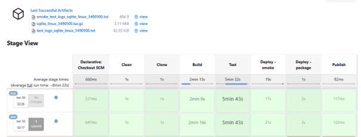

Widok poprawnie zakończonego zadania/builda:

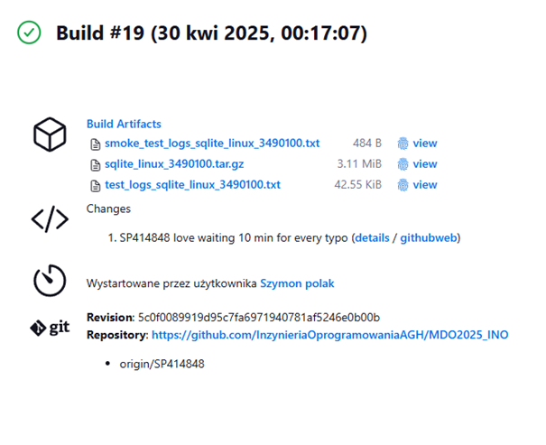

Logi z testu:

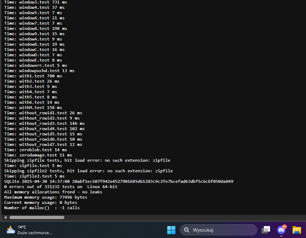

Logi ze smoke testu:

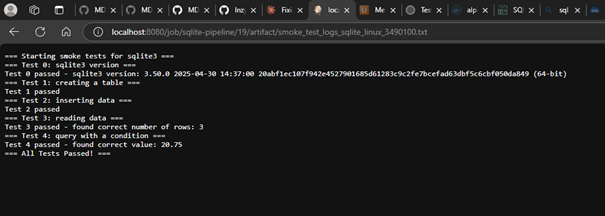

Pobrany paczka sqlite:

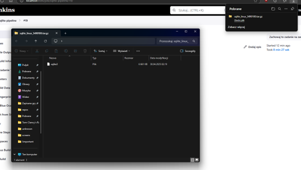

## Test powstałego artefaktu

Paczkę pobrano na maszynę wirtualną na której pracuje kontener jenkinsa (fedora) oraz na niezwiązaną maszynę wirtualną (ubuntu), uruchomiono `sqlite`: wypisano wersję, dodano tabelę, wprowadzono dane oraz wykonano proste zapytanie.

### Test artefaktu na fedorze:

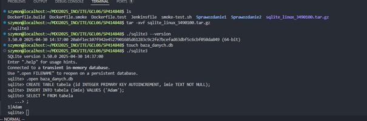

### Test artefaktu na ubuntu:

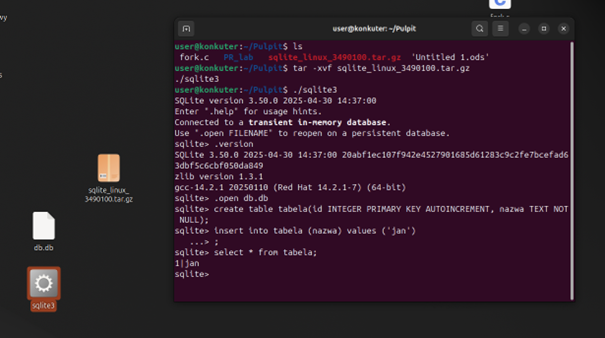

Aplikacja działa bez problemu, jedyne wymagane do korzystania z niej narzędzie to dowolny program pozwalający na rozpakowanie archiwum.

Pipleine jest niemal identyczny z planowanym (z diagramu).
