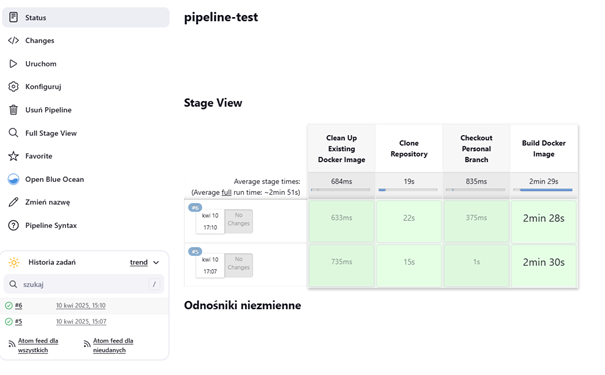

# Instancja Jenkins (powtórzone z poprzedniego sprawozdania)

### Wszytkie kroki przeprowadzono krok po kroku z dokumentacją: https://www.jenkins.io/doc/book/installing/docker/

Poniższe kroki pozwolą przeprowadzić instalację skonteneryzowanej instancji Jenkinsa z pomocnikiem DIND, oraz uruchomić jego instancje i zalogować się do panelu. 

## 1. Tworzenie sieci dla jenkins'a

```
docker network create jenkins
```

## 2. Pobranie obrazu docker:dind i uruchomienie kontenera


## 3. Dockerfile dla jenkinsa (Dockerfile.jenkins)


## 4. Build: Dockerfile.jenkins


## 5. Działająca instancja


## 6. Uzyskanie hasła do logowania


## 7. Panel Jenkinsa


(Aby dostać się do panelu z poziomu hosta na którym uruchomiona jest wirtualna maszyna należy przekierować port 8080, w zależności od wybranego IDE może on zostać przekierowany automatycznie, w vsCode do przekierowania portu wystarczy przejść do zakładki PORTS (obok terminala) i wprowadzić odpowiedni port)

---

# Tworzenie projektów Jenkins

## 1. Dodawanie nowego projektu (wypisanie uname)

Z panelu głównego wybieramy `Nowy Projekt`.


Podajemy nazwę projektu oraz jego typ (w przypadku projektu wypisującego uname będzie to `Ogólny projekt`).

## 2. Dodanie funkcjonalności

Przechodzimy do zakładki `Kroki budowania` i wybieramy z listy interesującą nas funckje (w wypadku uname będzie to "Uruchom Powłokę").


Pozostało wpisać polecenie do wykonania:

```
uname -a
```

## 3. Panel projektu

Zapisujemy - zostaniemy przeniesieni do głównego panelu projektu z poziomu którego możemy uruchamiać zadania (zadanie to pojedyncze zbudowanie projektu, w przypadku naszego projektu jest to wywołanie ustawionego polecenia), aby uruchomić zadanie należy przycisnąć przycisk `Uruchom`.


Zielony check mark - poprawne wykonanie (brak błędów), analogicznie czerwony 'x' będzie oznaczał napotkanie błędu przy wykonywaniu zadania.

## 4. Wyświetlenie logów konsoli

Aby wyświetlić logi konsoli zadania najpierw przechodzimy do zadania (klikając w zadanie), a następnie wybieramy `Logi konsoli`.


Jak widać w logach pojawiło się wywołanie podanego polecenia (uruchomienie uname) oraz jego output.

## 5. Kolejny projekt - wyświetlenie komunikatu błędu przy nieparzystej godzinie

Podobnie tworzymy ogólny projekt


Znowu w krokach budowania uruchamiamy powłokę i wpisujemy odpowiedni skrypt.


### Skrypt do wyświetlania błędu o nieparzystej godzinie

``` bash
#!/bin/bash
TIME_HOUR=$(date +%H)
if [ $((TIME_HOUR % 2)) -ne 0 ]; then
  echo "Error: Aktualna godzina ($TIME_HOUR) jest nieparzysta!"
  exit 1
else
  echo "Aktualna godzina ($TIME_HOUR) jest parzysta, kontynuacja..."
fi
```

## 6. Logi konsoli


Godzina 22 - parzysta, więc sukces.

## 7. Projekt - pobranie obrazu ubuntu


(Kolejny raz typem projektu będzie ogólnt projekt)


(Wpisujemy polecenia `pull` do pobrania obrazu i `images` do wyświetlenia obrazów)


(Obraz został poprawnie pobrany i jest widoczny)

## 8. Projekt typu Pipeline

Pipeline to wieloetapowy, zautomatyzowany proces zarządzania aplikacją - od budowania przez testy po wdrażanie.

W poniższym kroku utworzono pipeline odpowiadający za budowanie aplikacji sqlite (oraz obrazu testującego) na podstawie Dockerfile'ów z repozytorium github.


(Wybieramy `Pipeline` jako typ projektu)


W konfiguracji projektu pod sekcją `Pipeline` wybieramy `Pipeline script` i wrowadzamy skrypt tworzący kolejne etapy pipeline'u - skrypt ten jest definiowany za pomocą języka opartego na Groovy.

### Treść pipeline'u

```Groovy
pipeline {
    agent any
    environment {
        REPO_URL = 'https://github.com/InzynieriaOprogramowaniaAGH/MDO2025_INO.git'
        BRANCH = 'SP414848'
        IMAGE_NAME_BUILD = 'sqlite-build'
        IMAGE_NAME_TEST = 'sqlite-test'
    }
    stages {
        stage('Clean Up Existing Docker Image') {
            steps {
                script {
                    sh "docker rmi -f ${IMAGE_NAME_BUILD}"
                    sh "docker rmi -f ${IMAGE_NAME_TEST}"
                }
            }
        }
        stage('Clone Repository') {
            steps {
                script {
                    sh 'rm -rf MDO2025_INO'
                    sh "git clone ${REPO_URL}"
                }
            }
        }
        stage('Checkout Personal Branch') {
            steps {
                dir('MDO2025_INO') {
                    script {
                        sh "git checkout ${BRANCH}"
                    }
                }
            }
        }
        stage('Build Docker Image') {
            steps {
                dir('MDO2025_INO/ITE/GCL06/SP414848') {
                    script {
                        sh "docker build --no-cache -t ${IMAGE_NAME_BUILD} -f Dockerfile.build ."
                        sh "docker build --no-cache -t ${IMAGE_NAME_TEST} -f Dockerfile.test ."
                    }
                }
            }
        }
    }
}
```

### Krótki opis skryptu

W sekcji environment dodajemy zmienne środowiskowe, które będą widzialne w całym obiekcie.

Skrypt składa się z 4 etapów (stages):
1) Odpowiada za czyszczenie po poprzednim zadaniu - usuwa utworzone w poprzednim zadaniu obrazy (pipeline powienien być 'czysty' i nie zależeć od poprzednich zadań).
2) Odpowiada za klonowanie repozytorium na którym znajdują się potrzebne Dockerfile (najpierw usuwamy zkatalog repozyturium gdyby już istniał np. z poprzedniego zadania).
3) Odpowiada za zmianę gałęzi na odpowiednią.
4) Buduje obrazy z plików Dockerfile - obrazy budowane z opcją `--no-cache` aby docker nie korzystał z zapisanych w pamięci podręcznej podczas budowania obrazów (znowu chcemy żeby pipeline był niezależny od poprzednich zadań).

(dir() {} - definiuje w jakim katalogu wykonane zostaną polecenia - lepsze to niż pisanie pełnych ścieżek lub ciągłe zmienianie katalogów)

### Poprawne wykonanie dwóch zadań - jedno po drugim



# Zaprojektowanie Pipeline'u CI/CD dla sqlite