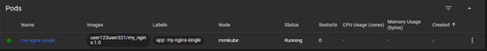
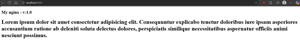
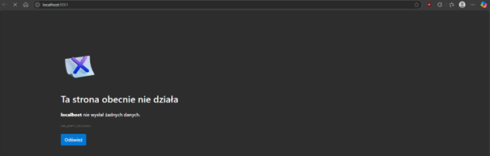

# Automatyzacja i zdalne wykonywanie poleceń za pomocą Ansible

## Instalacja zarządcy Ansible

W poniższych krokach przeprowadzono instalację i konfigurację systemu na nowej maszynie wirtualnej oraz zapeniono komunikację ssh pomiędzy maszynami. Na nowej maszynie będziemy wykonywać zdalne polecenia za pomocą ansible.

### Ustawienie nazwy hosta przy instalacji

W polu `Nazwa komputera:` (zakładka `SIEĆ I NAZWA KOMPUTERA`) wpisujemy nazwę unikalną hosta (np. na 'ansible-target') - w późniejszych krokach będziemy komunikować się pomiędzy hostami za pomocą nazw a nie adresów IP.


Również utworzono nowego użytkownika o nazwie `ansible` podczas instalacji.

### Utworzenie migawki

Sprawdzono obecność programu `tar` i usługi `sshd` (najzwyczajniej wpisując nazwę w terminalu), następnie utworzono migawkę maszyny wirtualnej.

Migawka to zapisany stan maszyny w określonym momencie - dzięki czemu możemy zapewnić że maszyna uruchomi się zawsze w tym samym stanie i z tą samą konfiguracją.

W VirtualBox'ie migawkę tworzymy pod zakładką `Maszyna`->`Zrób migawkę...`. Dalej podajemy nazwę migawki i klikamy `Ok`.


Widoczna migawka przy uruchomieniu maszyny:


### Zapewnienie komunikacji bezhasłowej ssh.

Aby umożliwić sshd zdalne logowanie bez hasła należy wymienić się kluczami ssh pomiędzy maszynami, w tym celu utworzono klucz rsa poleceniem `ssh-keygen`:


Następnie kopiujemy klucz na nową maszynę poleceniem `ssh-copy-id` wywołanym z hostem w formacie nazwa_użytkownika@adres_ip, po tagu `-i` podajemy ścieżkę do klucza.


Należy jeszcze dodać odpowiedni wpis do pliku konfiguracyjnego ssh (.ssh/config), który będzie wskazywał na utworzony klucz dla danego hosta.


Po `Host` podajemy adres IP i/lub nazwę dns hosta, po `User` nazwę użytkownika, a po `IdentityFile` - ścieżkę do klucza.

---

Pomyślne logowanie ssh bez podawania hasła:


## Inwentaryzacja

### Zapewnienie komunikacji za pomocą nazw DNS

Najpierw wypadałoby zmienić nazwę hosta głównej maszyny z localhost na unikalną nazwe (np. 'fedora-main'). Nazwę możemy zmienić poleceniem `hostnamectl set-hostname`:


Po zresetowaniu maszyny widzimy nową nazwę:


Kolejnym krokiem będzie dopisanie nazwy domenowej do usługi DNS - najprostszym sposobem na zrobienie tego będzie edycja pliku `/etc/hosts`, należy go otworzyć jakimś edytorem tekstowym (np. vi) i dopisać adres IP, a zaraz po nim nazwę domenową na którą tłumaczone będzie podany adres.

Tutaj plik hosts na maszynie głównej (fedora-main) tłumaczący adres nowej maszyny (ansible-target):


Na maszynie ansible-target również należy dodać wpis tłumaczący adres maszyny głównej (fedora-main) w taki sam sposób.

---

Udane pingi na nazwy dns:


Należy również dodać wpis z nazwą dns do pliku konfiguracyjnego ssh:


(ze względu na nieoczekiwaną zmianę adresu ip maszyny fedora-target zmieniono adres na aktualny w tym pliku oraz w pliku /etc/hosts)

### Plik inwentaryzacjii

Plik inwentaryzacji zawiera listę zarządzanych hostów z podziałem na grupy, to właśnie z tymi hostami będzie łączyło się ansible.

Plik inwentaryzacji `inventory.ini`: (podział na dwie grupy: Orchestrators, w której znajduje się główna maszyna oraz Endpoints, w której znajduje się nowa maszyna. Do grupy Endpoints będzie wysyłana większość zdalnych zadań)


(`ansible_user` - wskazuje na użytkownika z którym ansible będzie się łączyć, natomiast `ansible_connection=local` wskazuje że host 'fedora-main' jest maszyną na której ansible będzie działać)

Wywołanie żadania ping do wszystkich maszyn:


(`all` oznacza wszystkich hostów, po tagu `-i` podajemy ścieżkę do pliku inwentaryzacji)

## Playbook ansible

Playbook to plik w formacie `YAML`, jest on zbiorem zadań z podziałem na grupy. Playbook jest wywoływany w odniesieniu do pliku inwentaryzacji, następnie na odpowiednich hostach wywołuje po kolei odpowiednie zadania z playbooka.

### Prosty playbook - ping do wszytskich hostów oraz skopiowanie pliku inwentaryzacji do hostów z grupy Endpoints.


Pierwsze uruchomienia:


(status `changed` oznacza że zadanie wprowadziło zmianę na systemie hosta, w tym wypadku jest to przesłanie pliku)

Drugie uruchomienie:


(tym razem nie mamy statusu `changed` tylko same `ok`, wynika to z tego że plik jest już na maszynie docelowej, więc ansible nie przesyła go ponownie tylko zwraca status `ok`)

### Dodanie nowych zadań do playbooka - aktualizacja pakietów systemowych i restart usług sshd oraz rngd:


Używamy wbudowanych funkcji ansible do zarządzania pakietami i serwisami (`ansible.builtin...`). W `name:` podajemy nazwę pakietu/usługi którą chcemy zmienić ('*' wskazuje na wszystkie), następnie w `state:` stan do jakiego chcemy doprowadzić ten pakiet/usługę.
Opcja `become: yes/true` oznacza że dane żądanie będzie wykonywane z urawnieniami super użytkownika (sudo).

---

Uruchomnienie playbooka: (playbooka uruchamiamy poleceniem `ansible-playbook`, wskazujemy na plik playbooka oraz po tagu `-i` na plik inwentaryzacji)


(ponieważ korzystamy z urawnień super użytkownika (become: yes) musimy podać do niego hasło, żeby ansible nas o nie zapytało dodajemy tag `-K`, który jest skrótem od `--ask-become-pass`)

Zatrzymanie usługi ssh na maszynie andible-target:


Uruchomienia playbooka bez usługi ssh na maszynie docelowej:


Gdy nie mamy łączności ansible zwraca unikalny status `unreachable`, dzięki niemu możemy odróżnić błędy wykonywanych poleceń od braku łączności.

### Playbook ze stworzonym artefaktem, role ansible.

Role w ansible to sposób organizacji kodu automatyzacji oraz wszytkich potrzebnych do jego uruchomienia zasobów. Pozwalają one na grupowanie zadań, plików, zmiennych, handlerów i innych zasobów.

Struktura katalogów roli ansible:

- tasks – główne zadania wykonywane przez rolę.

- handlers – akcje wywoływane po zmianach w systemie.

- templates – pliki szablonów do dynamicznej konfiguracji.

- files – statyczne pliki kopiowane na maszyny docelowe.

- vars – zmienne specyficzne dla roli.

- defaults – domyślne wartości zmiennych.

- meta – informacje o zależnościach roli.

Szkielet roli tworzymy poleceniem `ansible-galaxy init` z nazwą roli:


Utorzony został katalog o podanej w poleceniu nazwie roli, w którym znajdują się katalogi jak opisano powyżej:


---

Artefaktem jest paczka sqlite z pojedynczym plikiem binarnym, utworzona rola będzie odpowiadała za wysłanie do hostów docelowych binarki oraz przeprowadzeniu na niej testów w kontenerze docker.

template/Dockerfile.j2: (definuje obraz do testów)


files/: (potrzebne pliki: artefakt i skrypt testowy)


defaults/main.yml: (zmienne roli z domyśloną wartością)


tasks/main.yml: (główne kod playbooka, zadania do wykonania)

```yaml
- name: Ensure Docker is installed
  ansible.builtin.package:
    name: docker
    state: present
  become: yes

- name: Ensure Docker service is running
  ansible.builtin.service:
    name: docker
    state: started
    enabled: yes
  become: yes

- name: Create a directory for sqlite package
  ansible.builtin.file:
    path: "/tmp/sqlite"
    state: directory
    mode: '0755'

- name: Extract sqlite package
  ansible.builtin.unarchive:
    src: "{{ sqlite_package_name }}"
    dest: "/tmp/sqlite"

- name: Copy test script to the container
  ansible.builtin.copy:
    src: "{{ test_script }}"
    dest: "/tmp/sqlite/{{ test_script }}"
    mode: '0755'

- name: Template for Dockerfile
  ansible.builtin.template:
    src: Dockerfile.j2
    dest: "/tmp/sqlite/Dockerfile"

- name: Build Docker image
  community.docker.docker_image:
    name: "{{ image_name }}"
    build:
      path: "/tmp/sqlite"
      dockerfile: "Dockerfile"
    source: build
    
- name: Run Docker container and capture test results
  ansible.builtin.command:
    cmd: "docker run --rm --name {{ container_name }} {{ image_name }}"
  register: container_result

- name: Show test results
  ansible.builtin.debug:
    msg: "{{ container_result.stdout }}"

- name: Check if the test script executed successfully
  ansible.builtin.fail:
    msg: "Test script failed"
  when: container_result.rc != 0
```

Po kolei:

- zapewniamy obecność dockera i go uruchamiamy,

- tworzymy folder roboczy na hoście docelowym (`mode:` nadaje uprawnienia podobnie jak `chmod`),

- wypakowywujemy archiwum do folderu roboczego,

- kopiujemy skrypt destowy,

- z pliku template/Dockerfile.j2 tworzymy plik Dockerfile w folderze roboczym,

- budujemy obraz docker z utworzonego Dockerfile (używamy funkcjonalności z modułu community.docker),

- uruchamiamy kontener i za pomocą `register:` przechwytujemy wynik polecenia (kontener uruchomiono jako komendę ansible, a nie za pomocą community.docker.docker_container, aby prostym sposobem przechwycić kod zwracany z kontenera i usunąć ten kontener w jednym poleceniu),

- wypisujemy wynik testów (można tutaj popracować aby wyniki były czytelniej wyświetlane, jednak na potrzeby ćwiczenia uznano to za wystarczające),

- sprawdzamy kod z polecenia - jeżeli nie jest 0 to wyrzucamy błąd.

---

Należy jeszcze utworzyć prostego playbooka, który będzie korzystał z roli (playbook_role.yaml):

```yaml
- name: Deploy sqlite
  hosts: Endpoints
  become: yes
  collections:
    - community.docker
  roles:
    - deploy_sqlite
```

(w `collections:` podajemy używane moduły, w `roles:` używane role)

Uruchomienie: (wskazujemy na utworzony playbook_role.yaml oraz na plik inwentaryzacji)


Wszystko przebiegło pomyślnie - program przeszedł testy więc ostatni krok jest pomijany.

Folder roboczy na maszynie ansible-target:


# Pliki odpowiedzi dla wdrożeń nienadzorowanych

## Instalacja nienadzorowana systemu Fedora z pliku odpowiedzi z repozytorium

Instalacja nienazdzorowana to typ wdrażania systemu bez konieczności interakcji użytkownika, instalacja ta odbywa się automatycznie wykorzystując plik odpowidzi.

Plik odpowiedzi to plik który zawiera predefiniowane ustawienia, które instalator wykorzystuje do konfiguracji systemu, mogą to być np. konfiguracja sieci i hostów, instalowane pakiety, partycjonowanie, czy chociażby automatyczne uruchamianie aplikacji.

### Pobranie i przygotowanie pliku odpowiedzi

Do instalacji wykorzystano instniejący plik odpowiedzi z głównej maszyny (`anaconda-ks.cfg`), plik ten jest tworzony po instalacji systemu w katalogu /root i zawiera ustawienia użyte podczas tej instalacji.

Do skopiowania pliku odpowiedzi wykorzystano polecenie:

```bash
sudo cp /root/anaconda-ks-cfg ./
```

Następnie nadano pełne uprawnienia do tego pliku dla wszystkich użytkowników:


Treść pliku:

```bash
# Generated by Anaconda 41.35
# Generated by pykickstart v3.58
#version=DEVEL

# Keyboard layouts
keyboard --vckeymap=pl --xlayouts='pl'
# System language
lang pl_PL.UTF-8

url --mirrorlist=http://mirrors.fedoraproject.org/mirrorlist?repo=fedora-41&arch=x86_64
repo --name=update --mirrorlist=http://mirrors.fedoraproject.org/mirrorlist?repo=updates-released-f41&arch=x86_64

network --hostname=fedora-auto

%packages
@^server-product-environment
@headless-management

%end

# Run the Setup Agent on first boot
firstboot --enable

# Generated using Blivet version 3.11.0
ignoredisk --only-use=sda
autopart
# Partition clearing information
clearpart --all --initlabel

# System timezone
timezone Europe/Warsaw --utc

# Root password
rootpw --iscrypted --allow-ssh $y$j9T$WehfzHiccsNY05aOKXE9Snay$EoU1yOBQbvMZ3unfxI4RCbQUaOkDZc/.2/BOw6hEgHD
```

Ponieważ plik odpowiedzi pierwotnie nie miał infomracji o potrzbnych repozytoriach, dodano te informacje (pod `url` i `repo`), wskazują one skąd instalator ma je pobrać.

Zmieniono również nazwę hosta (`network --hostname=fedora-auto`) na 'fedora-auto'.

Ostatnią zmianą w pliku była zmiana opcji `--none` na `--all` w poleceniu clearpart - zapewnia to formatowanie całego dysku.

---

Plik umieszczono w zdalnym repozytorium, z którego pobierze go instalator.

### Wskazanie instalatorowi pliku odpowiedzi

Utworzono nową maszynę wirtualną z płyty ISO i ją uruchomiono.

Widzimy menu GRUB, wybieramy opcję instalacji, ale NIE KLIKAMY ENTER, tylko E (input: e) na klawiaturze.

Następnie w parametrach należy wskazać na plik odpowiedzi - w lini rozpoczynającej się od 'linux' zaraz po 'quiet' dodajemy parametr `inst.ks=...` w miejsce kropek należy umieścić ścieżkę do pliku odpowiedzi, u nas plik znajduję się na publicznym zdalnym repozytorium github, więc wystarczy podać do niego link, jednak musi to być link w wersji raw (w githubie jak mamy wybrany plik klikamy przycisk `Raw`, otworzy nam się nowy link który kopiujemy).


Teraz można uruchomić instalację - F10.

### Instalacja

Po uruchomieniu instalacji po chwili czekania wyświetli się gui instalatora, nic nie ruszamy i po kilku sekundach instalacja sama się zaczyna:


### Uruchomienie systemu po instalacji

Logujemy się na roota (inni użytkownicy na głównej maszynie byli dodawani po instalacji więc nie będą zawarci w pliku odpowiedzi), hasło identyczne jak na maszynie głównej.


Instalacja powiodła się, od razu widzimy też odpowiedni hostname.

## Rozszerzenie pliku odpowiedzi o instalację oprogramowania z pipeline'u.

### Instalacja zależności

Artefaktem pipeline'u jest binarka sqlite zapakowana do archiwum, ogólnie sama aplikacja nie ma żadnych zależności, ale będziemy potrzebować curla do pobrania artefaktu oraz tara do wypakowania archiwum, stąd seksję `%packages` rozszerzono o wymagane programy:

```bash
%packages
@^server-product-environment
@headless-management
# Additional packages for sqlite3
curl
tar

%end
```

### Ponowne uruchomienie systemu po instalacji

Wystarczy dodać dyrektywę `reboot` na końcu głównej części pliku (poza sekcjami %post, %packages itd.), może być umieszczona przed sekcją %post, ta sekcja i tak wykona się po instalacji, ale przed rebootem:

```bash
# Root password
rootpw --iscrypted --allow-ssh $y$j9T$WehfzHiccsNY05aOKXE9Snay$EoU1yOBQbvMZ3unfxI4RCbQUaOkDZc/.2/BOw6hEgHD

# Reboot after installation
reboot

%post
cd /tmp
```

### Pobranie i instalacja programu

Działania te wykonujemy w sekcji %post.

```bash
%post
cd /tmp
curl -u "szpolak:11609846bc14759df93bce4006ab0c8dbd" http://192.168.0.95:8080/job/sqlite-pipeline/lastSuccessfulBuild/artifact/sqlite_linux_3490101.tar.gz --output sqlite_linux_3490101.tar.gz
tar -xzf sqlite_linux_3490101.tar.gz
chmod +x sqlite3
cp sqlite3 /usr/local/bin/

/usr/local/bin/sqlite3 --version > /var/log/sqlite3_version.txt
    
%end
```

Co robimy ?

1) Przechodzimy do katalogu tymczasowego aby nie zostawiać śmieci.
2) Pobieramy artefakt z jenkinsa za pomocą curla - należy dodać dane logowania po `-u`, można podać hasło (nazwa_użytkownika:hasło) ale nie jest to najlepszy pomysł więc zamiast hasła można podać wygenerowany wcześniej token dostępu (w tablicy jenkinsa: użytkownik -> Konfiguracja -> API Token -> Dodaj nowy token) - oczywiście token usunąłem chwilę po instalacji. Należy jeszcze wskazać plik po `--output` oraz umieścić adres serwera a nie `localhost` w linku.
3) Wypakowanie archiwum.
4) Nadanie uprawnień wykonywania binarki.
5) Skopiowanie do /usr/local/bin/ - binarki z tego katalogu są automatycznie dodawane do PATH i można z nich korzystać bez konieczności wskazywania całej ścieżki do pliku.
6) Zapisanie wersji programu do pliku tesktowego (dla pewności używam pełnej ścieżki)

### Pełny plik odpowiedzi
```bash
# Generated by Anaconda 41.35
# Generated by pykickstart v3.58
#version=DEVEL

# Keyboard layouts
keyboard --vckeymap=pl --xlayouts='pl'
# System language
lang pl_PL.UTF-8

url --mirrorlist=http://mirrors.fedoraproject.org/mirrorlist?repo=fedora-41&arch=x86_64
repo --name=update --mirrorlist=http://mirrors.fedoraproject.org/mirrorlist?repo=updates-released-f41&arch=x86_64

network --hostname=fedora-auto

%packages
@^server-product-environment
@headless-management
# Additional packages for sqlite3
curl
tar

%end

# Run the Setup Agent on first boot
firstboot --enable

# Generated using Blivet version 3.11.0
ignoredisk --only-use=sda
autopart
# Partition clearing information
clearpart --all --initlabel

# System timezone
timezone Europe/Warsaw --utc

# Root password
rootpw --iscrypted --allow-ssh $y$j9T$WehfzHiccsNY05aOKXE9Snay$EoU1yOBQbvMZ3unfxI4RCbQUaOkDZc/.2/BOw6hEgHD

# Reboot after installation
reboot

%post
cd /tmp
curl -u "szpolak:11609846bc14759df93bce4006ab0c8dbd" http://192.168.0.95:8080/job/sqlite-pipeline/lastSuccessfulBuild/artifact/sqlite_linux_3490101.tar.gz --output sqlite_linux_3490101.tar.gz
tar -xzf sqlite_linux_3490101.tar.gz
chmod +x sqlite3
cp sqlite3 /usr/local/bin/

/usr/local/bin/sqlite3 --version > /var/log/sqlite3_version.txt
    
%end
```

### Weryfikacja instalacji


Program uruchamia się poprawnie oraz w pliku tekstowym znajduje się poprawny wpis - instalacja przebiegła pomyślnie.

# Wdrażanie na zarządzalne kontenery: Kubernetes

Kubernetes to platforma do zarządzania kontenerami, automatyzuje wdrażanie, skalowanie i zarządzanie kontenerami.

## Wybór oprogramowania

Z uwagi na charakter aplikacji na której pracowano - sqlite, na potrzeby tej części ćwiczenia zdecydowano się na zmianę aplikacji na `nginx` z dorzuconą własną konfiguracją.

### Dockerfile aplikacji `my_nginx`

```Dockerfile
FROM nginx:alpine
COPY nginx.conf /etc/nginx/nginx.conf
COPY html /usr/share/nginx/html
EXPOSE 80
```

Aplikacja posiada własny plik konfiguracyjny i własną stronę html, nasłuchuje na porcie 80.

Aplikacja została opublikowana w docker hub'ie pod: user123user321/my_nginx

### Działanie aplikacji:


## Instalacja klastra Kubernetes

### Instalacja minikube

Minikube to narzędzie, które pozwala na lokalne uruchomienie klastra Kubernetes, bez potrzeby korzystania z pełnej infrastruktury chmurowej.

Instalacja zgodnie z dokumentacją:


### Uruchomienie minikube - `minikube start`


### Uruchomienie dashboard'a - `minikube dashboard`


W przeglądarce:


## Uruchamianie oprogramowania

### Uruchomienie pojedynczego poda: 

Pod to podstawowa jednostka w Kubernetes, zawiera w sobie kontenery.


Korzystamu z polecenia `kubectl run`, podajemy:

- nazwę poda,

- obraz (z docker huba),

- port na którym będzie działała aplikacja,

- nazwę aplikacji.

---

Pod widoczny w panelu:



### Przekierowanie portu

Pod działa ale żeby był widoczny poza środowikiem Kubernetes należy jeszcze przekierować port:


Wykorzystujemy polecenie `kubectl port-forward`, podajemy nazwę poda poprzedzoną `/pod` oraz porty, gdzie drugi port to port na którym działa aplikacja.

---

Dodatkowo należy jeszcze przekierować port w VS Code, aby był on widoczny poza maszynę wirtualną.

Przechodzimy do zakładki `PORTS` (zaraz obok terminala), klikamy `Add Port` i wprowadzamy interesujący nas port (8800).


### Działająca aplikacja



## Wdrożenie

Wdrożenie (deployment) to obiekt Kubernetes zarządzający zestawem podów, główne funkcje wdrożeń to:

- skalowanie liczby instacji aplikacji,

- automatyczne zastępowanie starszych wersji aplikacji nowymi,

- rollback - możliwość wycofania zmian, jeżeli nowa wersja nie działa poprawnie.

### Plik wdrożenia (oparty na przykładzie z dokumentacji Kubernetes)

```yaml
apiVersion: apps/v1
kind: Deployment
metadata:
  name: my-nginx-deploy
  labels:
    app: my-nginx
spec:
  replicas: 4
  selector:
    matchLabels:
      app: my-nginx
  template:
    metadata:
      labels:
        app: my-nginx
    spec:
      containers:
      - name: my-nginx
        image: user123user321/my_nginx:1.0
        ports:
        - containerPort: 80
```

W nagłówku definiujemy wersję api kubernetesa oraz typ zasobu, następnie w metadanych podajemy nazwę wdrożenia i etykiety do identyfikacji.

Pod `spec:` znajduje się specyfikacja wdrożenia, są to np. `replicas:` - liczba instancji podów, `selector:` - etykiety do indentyfikacji podów, `template:` - struktura podów, w tym meta dane oraz ich specyfikacja, w której podajemy poszczególne kontenery.

### Uruchomienie wdrożenia

Wdrożenie uruchamiamy komendą `kubectl apply` i po tagu `-f` podajemy ścieżkę do pliku wdrożenia.


Status wdrożenia możemy sprawdzić z poziomu terminala komendą `kubectl rollout status` + zasób kubernetesa, czyli dla wdrożeń 'deployments/nazwa_wdrożenia'.


Wdrożenia możemy też kontrolować z poziomu panelu gui:


Pody dla wdrożenia mają wspólną podobną nazwę, ale różnią się indentyfikatorem na końcu nazwy.


Aby dostęp do aplikacji był możliwy musimy expose'ować aplikację na zewnątrz klastra, jednak tym razem nie wystarczy tylko port forwarding na konkretny pod gdyż mamy wiele podów.

Rozwiązaniem tego problemu jest użycie serwisu - serwis w Kubernetes to obiekt który zapewnia punkt dostępu do grupy podów i automatycznie dystrybuuje ruuch między nimi.

Aby szybko expose'ować wdrożenie jako serwis możemy skorzystać z komendy `kubectl expose deployment` + nazwa deploymentu + typ serwisu: `type=` (tutaj w przykładzie użyto `NodePort`) + port: `--port=`.

Po utowrzeniu serwisu należy go jeszcze przekierować na jakiś port aby był widoczny poza klastrem, robimy to podobnie jak w przypadku pojedynczego poda, ale podajemy serwis zamiast konkretnego poda.


Serwis w dashboardzie:


Działanie aplikacji pod nowym portem: (użytkownik nie jest w stanie określić do którego konkretnego poda jest podłączony)


## Kontrolowanie wdrożeń

### Przygotowanie nowych wersji obrazu

Na potrzeby ćwiczenia przygotowano nowe wersję obrazu:

- 2.0, różni się od wersji 1.0 jedynie zawartością strony html,

- err, obraz którego uruchomienie kończy się błędem poprzez wywołanie polecenia `false`, wystarczyło dodać pojedynczą linijkę w Dockerfile: `CMD["false"]`.

Tutaj uruchomienie obrazu err, z widocznym zwracanym kodem wyjścia (pod State.ExitCode), kod jest równy 1, co oznacza błąd - tak jak oczekiwano:


Obraz z wersjami na dockerhubie:


### Zmiany we wdrożeniu

W tym kroku przedstawione zostaną proste zmiany w pliku wdrożeniowym, po każdej zmianie wdrożenie zostanie ponownie przeprowadzone - identycznie jak przy pierwszym uruchomieniu wdrożenia korzystamy z polecenia `kubectl apply -f` + plik wdrożenia, kubernetes sam porówna aktualny stan wdrożenia z plikiem i zastosuje zmiany:


Domyślnie kubernetes działa wesług strategii `Rolling Update`, oznacza to że gdy zajdzie jakaś zmiana to kubernetes najpierw utworzy nowe pody z nową instancją aplikacji, następnie będzie jest stopniowo podmieniał ze starymi podami, aby nie zatrzymać aplikacji - w trakcie aktualizacji ruch kierowany jest do działających podów, dodatkowo kubernetes sprawdza czy nowe pody działają zanim będzie usuwał stare pody.

---

Zwiększenie liczby replik do 8: (w pliku wdrożenia: `replicas: 4` -> `replicas: 8`)


(widzimy nowo utworzone pody, stare pody dalej działają)

Zmniejszenie liczby replik do 1: (w pliku wdrożenia: `replicas: 8` -> `replicas: 1`)


(został jeden pod - należy on do oryginalnych 4 podów, kubernetes najpierw usuwa nowsze pody i preferuje te starsze)

Zmniejszenie liczby replik do 0: (w pliku wdrożenia: `replicas: 1` -> `replicas: 0`)




(brak podów - aplikacja nie działa, ale deployment dalej istnieje)


Utrata aktywnego połączenia z podem - error:


Powrót do 4 replik: (w pliku wdrożenia: `replicas: 0` -> `replicas: 4`)


(aplikacja znowu działa)

Zastosowanie nowej wersji obrazu: (w pliku wdrożenia `image: user123user321/my_nginx:1.0` -> `image: user123user321/my_nginx:2.0`)


Zastosowanie wadliwej wersji obrazu: (w pliku wdrożenia `image: user123user321/my_nginx:2.0` -> `image: user123user321/my_nginx:err`)


Możemy zauważyć 2 wadliwe pody oraz 3 działające, dzieje się tak ponieważ kubernetes próbował zaktualizować/podmienić poda, ale ponieważ kontener na nim uruchomiony zwrócił kod błędu kubernetes zatrzymał wdrożenie nowego obrazu i podtrzymał starą wersję na reszcie podów, aplikacja dalej działa bo pozostałe pody działają na poprzedniej wersji (2.0):


Jednak wadliwe pody dalej widnieją i wypadałoby cofnąć poprzednie wdrożenie, aby to zrobić najpierw należy sprawdzić numer rewizji do której chcemy się cofnąć, aby zobaczyć historię wdrożeń korzystamy z polecenia: `kubectl rollout history deployment` + nazwa wdrożenia.

Następnie cofamy się do poprzedniej rewizji poleceniem: `kubectl rollout undo deployment` + nazwa wdrożenia + `--to-revision=...` <- w miejsce kropek numer rewizji do której chcemy się cofnąć.


Dashboard:


### Historia wdrożenia

Jeżeli chcemy podpatrzeć historię wycofanego wdrożenia najpierw sprawdzamy jego numer rewizji (podobnie jak poprzednio), następnie wywołujemy to samo polecenie ale wskazujemy na konkretną rewizję: `--revision` + numer rewizji:


Z wypisanych informacji możemy odczytać szablon nazewnictwa podów z tej rewizji (pod `pod-template-hash=`).

Znając hash podów możemy wypisać wszystkie zdarzenia z nimi związane: (polecenie: `kubectl get events` + ewentualne sortowanie + grep z hashem aby wypisać tylko interesujące nas pody).


Widzimy że po pobraniu nowego obrazu na nowych podach replikach wystąpił błąd, a pody te są wycofywane (linijki ze statusem 'Warning' i sąsiednie).

### Skrypt weryfikujący, czy dane wdrożenie wdrożyło się w 60 sekund.

Treść:

```bash
#!/bin/bash

DEPLOYMENT_NAME="$1"
TIMEOUT=60s

if [[ -z "$DEPLOYMENT_NAME" ]]; then
    echo "Użycie: $0 <nazwa-deployment>"
    exit 1
fi

echo "Sprawdzam wdrożenie: $DEPLOYMENT_NAME"
START_TIME=$(date +%s)

timeout $TIMEOUT kubectl rollout status deployment/"$DEPLOYMENT_NAME" --timeout=$TIMEOUT

if [[ $? -eq 0 ]]; then
    END_TIME=$(date +%s)
    DURATION=$((END_TIME - START_TIME))
    echo "✅ Wdrożenie ukończone w ${DURATION} sekund"
    
    if [[ $DURATION -gt 60 ]]; then
        echo "❌ Przekroczono limit ${TIMEOUT}"
        exit 1
    fi
    exit 0
else
    echo "❌ Wdrożenie nie ukończone w ${TIMEOUT}"
    exit 1
fi
```

Skrypt używa polecenia `kubectl rollout status`, aby sprawdzić, czy rollout (wdrożenie) zakończył się sukcesem, `timeout` przerywa polecenie jeżeli nie ukończyło się w ustalonym czasie. Następnie sprawdzamy ile czasu upłynęło, jeżeli więcej niż 60 sekund to wdrożenie przekroczyło limit czasu.

Użycie skryptu:

- zaraz po uruchomieniu wdrożenia,

- albo lepiej - jednoczesne uruchomienie wdrożenia i skryptu za pomocą operatora `&&`, dzięki temu całe polecenie zwróci kod błędu, również eliminujemy czas pomiędzy uruchomieniem poleceń.

Warto wspomnieć że wdrożenie i tak będzie dalej się wdrażało po wykonaniu skryptu - skrypt działa tylko jako narzędzie obserwacyjne i nie ingeruje w samo wdrożenie.

Skrypt z czasem ustawionym na 1s - błąd:


Skrypt z czasem ustawionym na 60s - sukces:


## Strategie wdrożeń

### Recreate

Recreate polega na usuwaniu starych podów przed uruchomieniem nowych.

```yaml
apiVersion: apps/v1
kind: Deployment
metadata:
  name: my-nginx-recreate
  labels:
    app: my-nginx
    strategy: recreate
spec:
  replicas: 3
  strategy:
    type: Recreate
  selector:
    matchLabels:
      app: my-nginx
  template:
    metadata:
      labels:
        app: my-nginx
    spec:
      containers:
        - name: app
          image: user123user321/my_nginx:2.0
          ports:
            - containerPort: 80
---
apiVersion: v1
kind: Service
metadata:
  name: my-nginx-recreate-service
spec:
  selector:
    app: my-nginx
  ports:
    - protocol: TCP
      port: 80
      targetPort: 80
```

Uruchomienie wdrożenia (ze skryptem):


Szybki czas wdrożenia - pody znikają zanim pojawią się nowe - prosta startegia. Minusem brak kontroli ruchu, aplikacja na chwilę przestaje całkowicie działać.

### Rolling Update

Rolling Update polega na stopniowym uruchamianiu nowych podów wraz z usuwaniem starych.

```yaml
apiVersion: apps/v1
kind: Deployment
metadata:
  name: my-nginx-rollingupdate
  labels:
    app: my-nginx
    strategy: rolling
spec:
  replicas: 4
  strategy:
    type: RollingUpdate
    rollingUpdate:
      maxUnavailable: 2
      maxSurge: 25%
  selector:
    matchLabels:
      app: my-nginx
  template:
    metadata:
      labels:
        app: my-nginx
    spec:
      containers:
        - name: my-nginx
          image: user123user321/my_nginx:2.0
          ports:
            - containerPort: 80
---
apiVersion: v1
kind: Service
metadata:
  name: my-nginx-rollingupdate-service
spec:
  selector:
    app: my-nginx
  ports:
    - protocol: TCP
      port: 80
      targetPort: 80
```

Uruchomienie wdrożenia (ze skryptem):


Wdrożenie zajmuje trochę dłużej ze względu na zastosowanie bardziej skomplikowanej strategii, ruch jest przekirowywany do działających podów, aplikacja dalej działa.

### Canary Deployment workload

Canary Deployment polega na stopniowym wdrażaniu nowej wersji obok starej - tylko część ruchu idzie do nowych podów.

```yaml
# Deployment - v1 (stable)
apiVersion: apps/v1
kind: Deployment
metadata:
  name: my-nginx-canary-v1
  labels:
    app: my-nginx
    version: v1
spec:
  replicas: 9
  selector:
    matchLabels:
      app: my-nginx
      version: v1
  template:
    metadata:
      labels:
        app: my-nginx
        version: v1
    spec:
      containers:
        - name: app
          image: user123user321/my_nginx:1.0
          ports:
            - containerPort: 80

---
# Deployment - v2 (canary)
apiVersion: apps/v1
kind: Deployment
metadata:
  name: my-nginx-canary-v2
  labels:
    app: my-nginx
    version: v2
spec:
  replicas: 1
  selector:
    matchLabels:
      app: my-nginx
      version: v2
  template:
    metadata:
      labels:
        app: my-nginx
        version: v2
    spec:
      containers:
        - name: app
          image: user123user321/my_nginx:2.0
          ports:
            - containerPort: 80

---
apiVersion: v1
kind: Service
metadata:
  name: my-nginx-canary-service
spec:
  selector:
    app: my-nginx
  ports:
    - protocol: TCP
      port: 80
      targetPort: 80
```

Uruchomienie wdrożenia: (ze skryptem, z uwagi na to że skrypt obsługuje jedno pojedyncze wdrożenie, uruchomiono go równolegle w 2 terminalach - najszybciej jak się dało)


Najbardziej skomplikowana strategia z tych 3, ale zapewnia najwięcej bezpieczeństwa, większość użytkowników dalej będzie korzystać ze stabilnej wersji aplikacji podczas gdy część z nich zobaczy nową wersję.

---

Wszystkie wdrożenia w dashboardzie:

