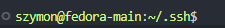

# Automatyzacja i zdalne wykonywanie poleceń za pomocą Ansible

## Instalacja zarządcy Ansible

W poniższych krokach przeprowadzono instalację i konfigurację systemu na nowej maszynie wirtualnej oraz zapeniono komunikację ssh pomiędzy maszynami. Na nowej maszynie będziemy wykonywać zdalne polecenia za pomocą ansible.

### Ustawienie nazwy hosta przy instalacji

W polu `Nazwa komputera:` (zakładka `SIEĆ I NAZWA KOMPUTERA`) wpisujemy nazwę unikalną hosta (np. na 'ansible-target') - w późniejszych krokach będziemy komunikować się pomiędzy hostami za pomocą nazw a nie adresów IP.


Również utworzono nowego użytkownika o nazwie `ansible` podczas instalacji.

### Utworzenie migawki

Sprawdzono obecność programu `tar` i usługi `sshd` (najzwyczajniej wpisując nazwę w terminalu), następnie utworzono migawkę maszyny wirtualnej.

Migawka to zapisany stan maszyny w określonym momencie - dzięki czemu możemy zapewnić że maszyna uruchomi się zawsze w tym samym stanie i z tą samą konfiguracją.

W VirtualBox'ie migawkę tworzymy pod zakładką `Maszyna`->`Zrób migawkę...`. Dalej podajemy nazwę migawki i klikamy `Ok`.


Widoczna migawka przy uruchomieniu maszyny:


### Zapewnienie komunikacji bezhasłowej ssh.

Aby umożliwić sshd zdalne logowanie bez hasła należy wymienić się kluczami ssh pomiędzy maszynami, w tym celu utworzono klucz rsa poleceniem `ssh-keygen`:


Następnie kopiujemy klucz na nową maszynę poleceniem `ssh-copy-id` wywołanym z hostem w formacie nazwa_użytkownika@adres_ip, po tagu `-i` podajemy ścieżkę do klucza.


Należy jeszcze dodać odpowiedni wpis do pliku konfiguracyjnego ssh (.ssh/config), który będzie wskazywał na utworzony klucz dla danego hosta.


Po `Host` podajemy adres IP i/lub nazwę dns hosta, po `User` nazwę użytkownika, a po `IdentityFile` - ścieżkę do klucza.

---

Pomyślne logowanie ssh bez podawania hasła:


## Inwentaryzacja

### Zapewnienie komunikacji za pomocą nazw DNS

Najpierw wypadałoby zmienić nazwę hosta głównej maszyny z localhost na unikalną nazwe (np. 'fedora-main'). Nazwę możemy zmienić poleceniem `hostnamectl set-hostname`:


Po zresetowaniu maszyny widzimy nową nazwę:



Kolejnym krokiem będzie dopisanie nazwy domenowej do usługi DNS - najprostszym sposobem na zrobienie tego będzie edycja pliku `/etc/hosts`, należy go otworzyć jakimś edytorem tekstowym (np. vi) i dopisać adres IP, a zaraz po nim nazwę domenową na którą tłumaczone będzie podany adres.

Tutaj plik hosts na maszynie głównej (fedora-main) tłumaczący adres nowej maszyny (ansible-target):


Na maszynie ansible-target również należy dodać wpis tłumaczący adres maszyny głównej (fedora-main) w taki sam sposób.

---

Udane pingi na nazwy dns:


Należy również dodać wpis z nazwą dns do pliku konfiguracyjnego ssh:


(ze względu na nieoczekiwaną zmianę adresu ip maszyny fedora-target zmieniono adres na aktualny w tym pliku oraz w pliku /etc/hosts)

### Plik inwentaryzacjii

Plik inwentaryzacji zawiera listę zarządzanych hostów z podziałem na grupy, to właśnie z tymi hostami będzie łączyło się ansible.

Plik inwentaryzacji `inventory.ini`: (podział na dwie grupy: Orchestrators, w której znajduje się główna maszyna oraz Endpoints, w której znajduje się nowa maszyna. Do grupy Endpoints będzie wysyłana większość zdalnych zadań)


(`ansible_user` - wskazuje na użytkownika z którym ansible będzie się łączyć, natomiast `ansible_connection=local` wskazuje że host 'fedora-main' jest maszyną na której ansible będzie działać)

Wywołanie żadania ping do wszystkich maszyn:


(`all` oznacza wszystkich hostów, po tagu `-i` podajemy ścieżkę do pliku inwentaryzacji)

## Playbook ansible

Playbook to plik w formacie `YAML`, jest on zbiorem zadań z podziałem na grupy. Playbook jest wywoływany w odniesieniu do pliku inwentaryzacji, następnie na odpowiednich hostach wywołuje po kolei odpowiednie zadania z playbooka.

### Prosty playbook - ping do wszytskich hostów oraz skopiowanie pliku inwentaryzacji do hostów z grupy Endpoints.


Pierwsze uruchomienia:


(status `changed` oznacza że zadanie wprowadziło zmianę na systemie hosta, w tym wypadku jest to przesłanie pliku)

Drugie uruchomienie:


(tym razem nie mamy statusu `changed` tylko same `ok`, wynika to z tego że plik jest już na maszynie docelowej, więc ansible nie przesyła go ponownie tylko zwraca status `ok`)

### Dodanie nowych zadań do playbooka - aktualizacja pakietów systemowych i restart usług sshd oraz rngd:


Używamy wbudowanych funkcji ansible do zarządzania pakietami i serwisami (`ansible.builtin...`). W `name:` podajemy nazwę pakietu/usługi którą chcemy zmienić ('*' wskazuje na wszystkie), następnie w `state:` stan do jakiego chcemy doprowadzić ten pakiet/usługę.
Opcja `become: yes/true` oznacza że dane żądanie będzie wykonywane z urawnieniami super użytkownika (sudo).

---

Uruchomnienie playbooka: (playbooka uruchamiamy poleceniem `ansible-playbook`, wskazujemy na plik playbooka oraz po tagu `-i` na plik inwentaryzacji)


(ponieważ korzystamy z urawnień super użytkownika (become: yes) musimy podać do niego hasło, żeby ansible nas o nie zapytało dodajemy tag `-K`, który jest skrótem od `--ask-become-pass`)

Zatrzymanie usługi ssh na maszynie andible-target:


Uruchomienia playbooka bez usługi ssh na maszynie docelowej:


Gdy nie mamy łączności ansible zwraca unikalny status `unreachable`, dzięki niemu możemy odróżnić błędy wykonywanych poleceń od braku łączności.

### Playbook ze stworzonym artefaktem, role ansible.

Role w ansible to sposób organizacji kodu automatyzacji oraz wszytkich potrzebnych do jego uruchomienia zasobów. Pozwalają one na grupowanie zadań, plików, zmiennych, handlerów i innych zasobów.

Struktura katalogów roli ansible:

- tasks – główne zadania wykonywane przez rolę.

- handlers – akcje wywoływane po zmianach w systemie.

- templates – pliki szablonów do dynamicznej konfiguracji.

- files – statyczne pliki kopiowane na maszyny docelowe.

- vars – zmienne specyficzne dla roli.

- defaults – domyślne wartości zmiennych.

- meta – informacje o zależnościach roli.

Szkielet roli tworzymy poleceniem `ansible-galaxy init` z nazwą roli:


Utorzony został katalog o podanej w poleceniu nazwie roli, w którym znajdują się katalogi jak opisano powyżej:


---

Artefaktem jest paczka sqlite z pojedynczym plikiem binarnym, utworzona rola będzie odpowiadała za wysłanie do hostów docelowych binarki oraz przeprowadzeniu na niej testów w kontenerze docker.

template/Dockerfile.j2: (definuje obraz do testów)


files/: (potrzebne pliki: artefakt i skrypt testowy)


defaults/main.yml: (zmienne roli z domyśloną wartością)


tasks/main.yml: (główne kod playbooka, zadania do wykonania)

```yaml
- name: Ensure Docker is installed
  ansible.builtin.package:
    name: docker
    state: present
  become: yes

- name: Ensure Docker service is running
  ansible.builtin.service:
    name: docker
    state: started
    enabled: yes
  become: yes

- name: Create a directory for sqlite package
  ansible.builtin.file:
    path: "/tmp/sqlite"
    state: directory
    mode: '0755'

- name: Extract sqlite package
  ansible.builtin.unarchive:
    src: "{{ sqlite_package_name }}"
    dest: "/tmp/sqlite"

- name: Copy test script to the container
  ansible.builtin.copy:
    src: "{{ test_script }}"
    dest: "/tmp/sqlite/{{ test_script }}"
    mode: '0755'

- name: Template for Dockerfile
  ansible.builtin.template:
    src: Dockerfile.j2
    dest: "/tmp/sqlite/Dockerfile"

- name: Build Docker image
  community.docker.docker_image:
    name: "{{ image_name }}"
    build:
      path: "/tmp/sqlite"
      dockerfile: "Dockerfile"
    source: build
    
- name: Run Docker container and capture test results
  ansible.builtin.command:
    cmd: "docker run --rm --name {{ container_name }} {{ image_name }}"
  register: container_result

- name: Show test results
  ansible.builtin.debug:
    msg: "{{ container_result.stdout }}"

- name: Check if the test script executed successfully
  ansible.builtin.fail:
    msg: "Test script failed"
  when: container_result.rc != 0
```

Po kolei:

- zapewniamy obecność dockera i go uruchamiamy,

- tworzymy folder roboczy na hoście docelowym (`mode:` nadaje uprawnienia podobnie jak `chmod`),

- wypakowywujemy archiwum do folderu roboczego,

- kopiujemy skrypt destowy,

- z pliku template/Dockerfile.j2 tworzymy plik Dockerfile w folderze roboczym,

- budujemy obraz docker z utworzonego Dockerfile (używamy funkcjonalności z modułu community.docker),

- uruchamiamy kontener i za pomocą `register:` przechwytujemy wynik polecenia (kontener uruchomiono jako komendę ansible, a nie za pomocą community.docker.docker_container, aby prostym sposobem przechwycić kod zwracany z kontenera i usunąć ten kontener w jednym poleceniu),

- wypisujemy wynik testów (można tutaj popracować aby wyniki były czytelniej wyświetlane, jednak na potrzeby ćwiczenia uznano to za wystarczające),

- sprawdzamy kod z polecenia - jeżeli nie jest 0 to wyrzucamy błąd.

---

Należy jeszcze utworzyć prostego playbooka, który będzie korzystał z roli (playbook_role.yaml):

```yaml
- name: Deploy sqlite
  hosts: Endpoints
  become: yes
  collections:
    - community.docker
  roles:
    - deploy_sqlite
```

(w `collections:` podajemy używane moduły, w `roles:` używane role)

Uruchomienie: (wskazujemy na utworzony playbook_role.yaml oraz na plik inwentaryzacji)


Wszystko przebiegło pomyślnie - program przeszedł testy więc ostatni krok jest pomijany.

Folder roboczy na maszynie ansible-target:


# Pliki odpowiedzi dla wdrożeń nienadzorowanych

## Instalacja nienadzorowana systemu Fedora z pliku odpowiedzi z repozytorium

Instalacja nienazdzorowana to typ wdrażania systemu bez konieczności interakcji użytkownika, instalacja ta odbywa się automatycznie wykorzystując plik odpowidzi.

Plik odpowiedzi to plik który zawiera predefiniowane ustawienia, które instalator wykorzystuje do konfiguracji systemu, mogą to być np. konfiguracja sieci i hostów, instalowane pakiety, partycjonowanie, czy chociażby automatyczne uruchamianie aplikacji.

### Pobranie i przygotowanie pliku odpowiedzi

Do instalacji wykorzystano instniejący plik odpowiedzi z głównej maszyny (`anaconda-ks.cfg`), plik ten jest tworzony po instalacji systemu w katalogu /root i zawiera ustawienia użyte podczas tej instalacji.

Do skopiowania pliku odpowiedzi wykorzystano polecenie:

```bash
sudo cp /root/anaconda-ks-cfg ./
```

Następnie nadano pełne uprawnienia do tego pliku dla wszystkich użytkowników:


Treść pliku:

```bash
# Generated by Anaconda 41.35
# Generated by pykickstart v3.58
#version=DEVEL

# Keyboard layouts
keyboard --vckeymap=pl --xlayouts='pl'
# System language
lang pl_PL.UTF-8

url --mirrorlist=http://mirrors.fedoraproject.org/mirrorlist?repo=fedora-41&arch=x86_64
repo --name=update --mirrorlist=http://mirrors.fedoraproject.org/mirrorlist?repo=updates-released-f41&arch=x86_64

network --hostname=fedora-auto

%packages
@^server-product-environment
@headless-management

%end

# Run the Setup Agent on first boot
firstboot --enable

# Generated using Blivet version 3.11.0
ignoredisk --only-use=sda
autopart
# Partition clearing information
clearpart --all --initlabel

# System timezone
timezone Europe/Warsaw --utc

# Root password
rootpw --iscrypted --allow-ssh $y$j9T$WehfzHiccsNY05aOKXE9Snay$EoU1yOBQbvMZ3unfxI4RCbQUaOkDZc/.2/BOw6hEgHD
```

Ponieważ plik odpowiedzi pierwotnie nie miał infomracji o potrzbnych repozytoriach, dodano te informacje (pod `url` i `repo`), wskazują one skąd instalator ma je pobrać.

Zmieniono również nazwę hosta (`network --hostname=fedora-auto`) na 'fedora-auto'.

Ostatnią zmianą w pliku była zmiana opcji `--none` na `--all` w poleceniu clearpart - zapewnia to formatowanie całego dysku.

---

Plik umieszczono w zdalnym repozytorium, z którego pobierze go instalator.

### Wskazanie instalatorowi pliku odpowiedzi

Utworzono nową maszynę wirtualną z płyty ISO i ją uruchomiono.

### Instalacja

W gui instalatora wystarczy włączyć instalacje bez żadnych zmian:


### Uruchomienie systemu po instalacji

Logujemy się na roota (inni użytkownicy na głównej maszynie byli dodawani po instalacji więc nie będą zawarci w pliku odpowiedzi), hasło identyczne jak na maszynie głównej.


Instalacja powiodła się, od razu widzimy też odpowiedni hostname.