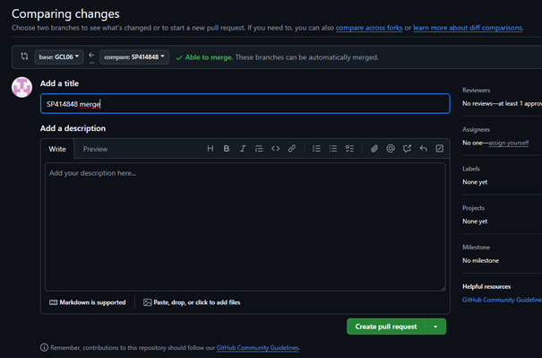

# Zajęcia 01

1. Instalacja git i obsługi ssh
[TODO]
2. Sklonowanie repozytorium przedmiotowego
[TODO]
3. Tworzenie kluczy ssh i konfiguracja ssh jako metodę dostępu do GitHuba.
[TODO]
4. Przełączenie gałęzi na grupową.
[TODO]
5. Utwórz nowej gałęzi.
[TODO]
6. Praca na nowej gałęzi

Treść hooka:
```
#!/bin/bash

commit_msg=$(cat $1)
pattern="^SP414848"
if ! [[ $commit_msg =~ $pattern ]]; then
  echo "ERROR: commit message must begin with 'SP414848'"
  exit 1
fi
```
[TODO]
7. Wystawienie Pull Request


# Zajęcia 2

1. Instalacja Dockera.

2. Rejestracja w Docker Hub.

3. Pobieranie obrazów.

4. Uruchomienie obrazu `busybox`.

5. Uruchomienie obrazu `ubuntu`.

6. Utworzenie pliku Dockerfile i sklonowanie repo

7. Uruchomienie kontenerów i usunięcie ich.

8. Usunięcie obrazów.

Kod Dockerfile:
```
FROM ubuntu:latest
RUN apt update && apt install -y git
WORKDIR /app
RUN git clone https://github.com/InzynieriaOprogramowaniaAGH/MDO2025_INO
CMD ["/bin/bash"]
```

7. Uruchomienie i usunięcie wszytskich kontenerów.

8. Wyczyszczenie obrazów.

# Zajęcia 03

1.

2.

3.
