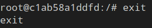
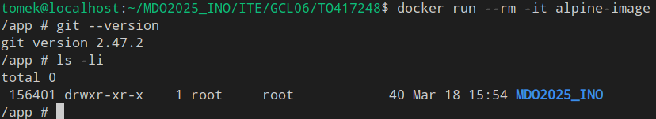
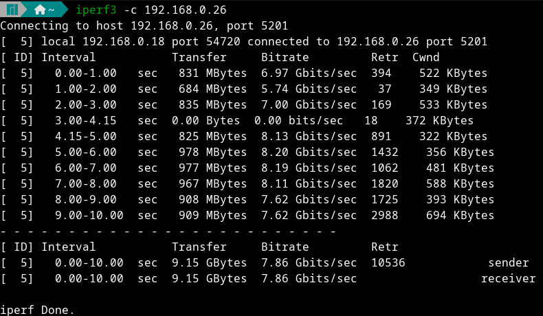
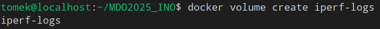
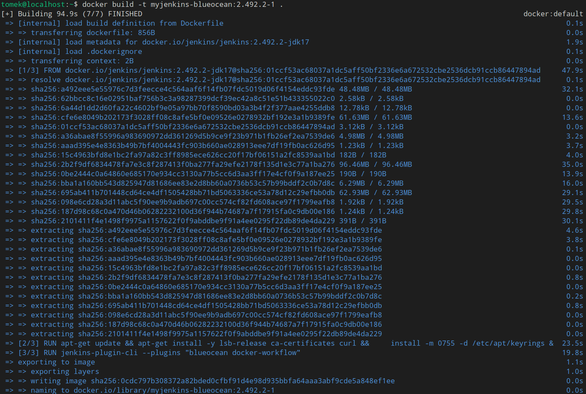

# Sprawozdanie 1
#### Tomasz Oszczypko

Wszystkie użyte polecenia na maszynie wirtualnej dostępne są w plikach `bash_history` w katalogach `00[1-4]-Class`. Historia jest wyczyszczona ze zbędnych poleceń/ Tworzone w trakcie laboratoriów pliki (np. Dockerfile) również są dostępne w tych samych katalogach.

## Zajęcia 01
Celem laboratorium było skonfigurowanie usługi SSH umożliwiającej połączenie z GitHubem oraz zapoznanie się i przygotowanie własnej gałęzi w repozytorium git.

### DLACZEGO NA ZRZUTACH EKRANU WIDOCZNY JEST LOCALHOST?

Podczas instalacji systemu maszyna domyślnie przyjęła nazwę localhost.localdomain, co widoczne jest na poniższym zrzucie.


### 1. Instalacja klienta git i obsługi kluczy SSH

Instalacja została przeprowadzona przy użyciu menadżera paczek dnf:
```bash
sudo dnf install git
```

Instalacja klienta oraz serwera SSH nie była konieczna, gdyż Fedora Server domyślnie ma zainstalowany OpenSSH.

W celu weryfikacji poprawnej instalacji gita sprawdzono jego wersję:
```bash
git --version
```


### 2. Sklonowanie repozytorium przedmiotowego za pomocą HTTP

Ponieważ repozytorium jest publiczne, klonowanie mogło się odbyć poprzez HTTP bez konieczności tworzenia <i>personal access token</i>:


### 3. Konfiguracja klucza SSH, klonowanie repozytorium przez SSH

Wygenerowane zostały 2 klucze SSH - jeden z hasłem, drugi bez hasła.

- klucz zabezpieczony hasłem:


- klucz bez hasła:


Klucz prywatny zabezpieczony hasłem został dodany do agenta SSH:


Zawartość publicznego klucza zabezpieczonego hasłem została odczytana przy użyciu polecenia <i>cat</i>:
```bash
cat ~/.ssh/password.pub
```

Na koncie GitHub został dodany nowy klucz SSH przy użyciu uprzednio odczytanego klucza publicznego:


Pobrane repozytorium zostało usunięte, a następnie ponownie sklonowane - tym razem z wykorzystaniem protokołu SSH:


Na koncie na GitHubie został skonfigurowany Two-Factor Authentication (2FA). Jako metodę autentykacji wybrano aplikację uwierzytelniającą (Authenticator od firmy Microsoft):


### 4. Zmiana gałęzi

Przełączono gałąż na main, a następnie na gałąź grupy - GCL06:


### 5. Utworzenie własnej gałęzi

Od brancha grupy została utworzona własna gałąź o nazwie "inicjały & nr indeksu":


### 6. Praca na nowej gałęzi

W katalogu grupy został utworzony własny katalog o nazwie takiej samej, jak nazwa gałęzi:


Następnie został napisany git hook weryfikujący, czy każdy commit message zaczyna się od "inicjały & nr indeksu". Plik został zapisany jako commit-msg:

```bash
#!/bin/sh

# This hook checks if commit message starts with proper prefix,
# which is my initials and index number.

COMMIT_MESSAGE_FILE=$1
COMMIT_MESSAGE=$(head -n1 "$COMMIT_MESSAGE_FILE")

PREFIX="TO417248"

if ! echo "$COMMIT_MESSAGE" | grep -q "^$PREFIX"; then
    echo "Error: Commit message must start with '$PREFIX'"
    exit 1
fi

exit 0
```

Plikowi ustawiono możliwość wykonywania:


Plik następnie został przeniesiony z katalogu GCL06 do własnego katalogu oraz skopiowany do katalogu .git/hooks w celu instalacji:


Wszelnie wprowadzone zmiany należało wysłać do zdalnego źródła. Przed tym jednak powinien zostać skonfigurowany git tak, aby autor commita na githubie był widoczny jako poprawny użytkownik. W moim przypadku krok ten został niestety wykonany po commicie, przez co w historii commitów jest widoczny inny, niepowiązany ze mną użytkownik: 


Zmiany zcommitowano w lokalnym repozytorium:


Finalnie wprowadzone zmiany zostały wysłane do zdalnego źródła:


## Zajęcia 02

Celem laboratorium było przygotowanie środowiska umożliwiającego konteneryzację aplikacji przy użyciu Dockera.

### 1. Instalacja Dockera w systemie linuksowym

Instalacja odbyła się przy użyciu menadżera paczek dnf:
```bash
sudo dnf install docker
```

W celu weryfikacji poprawności instalacji sprawdzono wersję Dockera:


Otrzymany komunikat oznacza, że nie jest aktywny demon Dockera, dlatego też został aktywowany oraz uruchomiony:
```bash
sudo systemctl enable docker
sudo systemctl start docker
```

Po aktywacji sprawdzono, czy demon działa:


### 2. Rejestracja w Docker Hub

Utworzone zostało konto na stronie [Docker Hub](https://hub.docker.com):


### 3. Pobieranie obrazów Dockera

W następnym kroku zostały pobrane obrazy - `hello-world`, `busy-box`, `ubuntu` oraz `mysql`:


### 4. Uruchomienie kontenera z obrazu `busybox`

Kontener uruchomiono wraz z automatycznym usuwaniem po zakończeniu działania przy użyciu poniższego polecenia:
```bash
sudo docker run --rm busybox
```

Kontener ten jednak uruchomił się i automatycznie zamknął, gdyż nie miał zadań do wykonania, co przedstawia poniższy zrzut ekranu z listą uruchomionych kontenerów:


Aby kontener nie zakończył działania od razu, należało uruchomić go w trybie interaktywnym. Wersja kontenera obrazu dostępna jest przy wywołaniu `--help` dla dowolnego uniksowego polecenia:


Ciąg znaków `2>&1` przy sprawdzeniu wersji oznacza przekazanie strumienia `stderr` do `stdout`.

### 5. Uruchomienie "systemu w kontenerze"

Wybranym obrazem systemu był ubuntu, dlatego też kontener z tym systemem został uruchomiony, a wewnątrz niego zostały sprawdzony proces z `PID 1`. Jak widać, jest to bash:


Na hoście w kolejnym terminalu sprawdzono również procesy dockera przy użyciu poniższego polecenia:
```bash
ps aux | grep docker
```


Ostatnim zadaniem w tym kroku było zaktualizowanie pakietów w kontenerze: 


Po zaktualizowaniu pakietów opuszczono kontener:



### 6. Utworzenie własnego Dockerfile'a

Obraz tworzony przy użyciu Dockerfile'a bazuje na Alpine Linux, dzięki czemu będzie bardzo lekki. Obraz ma posiadać zainstalowanego gita oraz sklonowane repozytorium przedmiotu:
```Dockerfile
FROM alpine:latest

RUN apk add --no-cache git

WORKDIR /app

RUN git clone https://github.com/InzynieriaOprogramowaniaAGH/MDO2025_INO.git

CMD ["/bin/sh"]
```

Następnie obraz został zbudowany. Jako własną nazwę obrazu ustawiono `apline-image`:


Po zbudowaniu obrazu został uruchomiony kontener bazujący na nim, a następnie wewnątrz zweryfikowano, czy jest zainstalowany git oraz czy zostało ściągnięte repozytorium:



W nowym terminalu na hoście sprawdzono uruchomione kontenery:


W ostatnim kroku wyczyszczono wszystkie zatrzymane kontenery, a następnie obrazy przy użyciu poleceń:
```bash
sudo docker container prune
sudo docker rmi -f $(sudo docker images -aq)
```


Plik Dockerfile umieszczony został w katalogu `002-Class` wewnątrz katalogu `Sprawozdanie1` dla lepszej organizacji plików.


## Zajęcia 03

Celem laboratorium było przygotowanie plików Dockerfile tworzących wersje testową oraz produkcyjną obrazów z dowolnym otwartoźródłowym projektem.

### 1. Wybór oprogramowania

Wybrane przeze mnie oprogramowanie to `toasty` - otwartoźródłowy framework do pisania testów jednostkowych w C mojego autorstwa. Projekt zawiera plik `Makefile` z dwoma targetami - domyślnym do kompilacji jako biblioteki statycznej oraz `test` do kompilacji i uruchomienia wewnętrznych testów jednostkowych.

Repozytorium zostało sklonowane:


Maszyna nie ma wymaganych zależności, dlatego też zostały doinstalowane przy użyciu poniższego polecenia:
```bash
sudo dnf install gcc make
```

Następnie został przeprowadzony build oraz uruchomienie testów:


### 2. Przeprowadzenie buildu w kontenerze

W pierwszym kroku został pobrany obraz ubuntu przy użyciu poniższego polecenia:
```bash
docker pull ubuntu
```

Następnie uruchomiono kontener w trybie interaktywnym:


W kontenerze zostały zainstalowane wymagane zależności:


Po krótkiej chwili możliwe było sklonowanie repozytorium projektu:


Następnie zmieniono katalog na katalog projektu oraz zbudowano go:


Po skończonej budowie możliwe było skompilowanie i uruchomienie testów, które zakończyły się powodzeniem:


W kolejnym kroku zostały przygotowane dwa pliki Dockerfile automatyzujące powyższe kroki:
- `Dockerfile` - build:
```Dockerfile
FROM ubuntu:latest

RUN apt update && apt install -y git gcc make

RUN git clone https://github.com/badzianga/toasty.git

WORKDIR /toasty

RUN make
```

- `Dockerfile.test` - testy:
```Dockerfile
FROM toasty

RUN make test 
```

Pliki te początkowo zostały umieszczone w katalogu domowym. W pierwszej kolejności zbudowano obraz builda:


Następnie zbudowano obraz testów:


W ostatnim kroku uruchomiono kontener oparty na obrazie testów. Jak widać na poniższym zrzucie, wraz z uruchomieniem kontenera automatycznie uruchamiany jest target testów, który działa poprawnie:


### 3. Kompozycja przy użyciu `docker-compose`

W pierwsze kolejności został pobrany `docker-compose`, gdyż nie był dostępny na maszynie:


Następnie został utworzony plik `docker-compose.yml` w tym samym katalogu, co pliki Dockerfile. Jego treść wygląda następująco:
```yaml
services:
  toasty:
    build:
      context: .
      dockerfile: Dockerfile
    image: toasty
    container_name: toasty

  toasty-test:
    build:
      context: .
      dockerfile: Dockerfile.test
    depends_on:
      - toasty
    image: toasty-test
    container_name: toasty-test
```

Finalnie możliwe jest zbudowanie i uruchomienie kontenera z testami przy użyciu przygotowanego pliku:


## Zajęcia 04

Celem laboratorium było nauczenie się pracy z woluminami i sieciami w Dockerze, a także zainstalowanie Jenkinsa wymaganego na kolejne laboratoria.

### 1. Zachowywanie stanu

W pierwszej kolejności przygotowane zostały dwa woluminy - wejściowy i wyjściowy o nazwach `input-volume` oraz `output-volume`:


Czyste repozytorium projektu zostało ponownie sklonowane - zawartość znalazła się bezpośrednio w folderze `repo`:


W celu skopiowania sklonowanego repozytorium na wolumin wejściowy z hosta przygotowany został kontener oparty o `hello-world` z podpiętym woluminem `input-volume`. Kontener ten nie był i nie musi być nigdy uruchamiany - służy on tylko do interakcji z woluminem wejściowym poprzez `docker cp`, stąd nadana mu nazwa `input-interface`. Takie rozwiązanie pozwala na oszczędzenie zasobów - obraz `hello-world` jest bardzo lekki, waży tylko nieco ponad 10kB, a także procesor nie jest obciążany przez to, że kontener nie jest uruchamiany. 


Ponieważ na maszynie nie istnieje jeszcze obraz `gcc` (wygodnie posiadający wszystkie wymagane przez projekt zależności), został on pobrany: 


Następnie utworzono i uruchomiono kontener oparty o czysty obraz `gcc`. Do kontenera zostały podłączone woluminy `input-volume` oraz `output-volume`. Kontener uruchomiono bez flagi `--rm`, w razie sytuacji, gdy będzie potrzebne ponowne jego uruchomienie bez tworzenia nowego i powtarzania kolejnych kroków:
```bash
docker run -it --name toasty-builder -v input-volume:/input -v output-volume:/output gcc bash
```


Wewnątrz kontenera oprócz zależności sprawdzono wylistowano również zawartość katalogu `/`. Jak widać, woluminy `input` oraz `output` zostały podłączone:


Repozytorium z woluminu wejściowego skopiowano do kontenera (parametr `-a` oraz `.` na końcu ścieżki wejściowej oznacza skopiowanie całej zawartości włącznie z ukrytymi plikami i katalogami):


W skopiowanym katalogu repozytorium zbudowano projekt oraz testy. `Makefile` jest napiasny tak, że automatycznie uruchomił testy, wynik działania jednego z nich został zawarty na poniższym zrzucie:


Zbudowane pliki - bibliotekę statyczną oraz testy, a także istniejący wcześniej plik nagłówkowy skopiowano na wolumin wyjściowy:


Okazuje się, że w kontenerze opartym na obrazie `gcc` domyślnie dostępny jest też `git`, dlatego też nie musiał być instalowany. Przy jego pomocy zostało ponownie sklonowane repozytorium projektu i umieszczone na woluminie wejściowym:


Po wykonaniu tego zadania rodzi się pytanie - czy można wykonać powyższe czynności za pomocą `docker build` i pliku `Dockerfile`? Otóż można, przy użyciu `RUN --mount`. Taki plik `Dockerfile` wyglądałby mniej więcej tak:
```Dockerfile
FROM gcc

RUN --mount=type=bind,source=input-volume,target=/input \
    git clone https://github.com/badzianga/toasty.git /input

COPY /input .

WORKDIR /toasty

RUN make && make test

RUN --mount=type=bind,source=output-volume,target=/output \
    cp -r build /output && cp src/toasty.h /output/toasty.h
```

Plik ten nie był testowany, jednakże zamysł został przedstawiony.

### 2. Eksponowanie portu

W pierwszej kolejności został pobrany obraz `iperf3`:


Następnie został uruchomiony kontener bazujący na nowo pobranym obrazie:


Dla kontenera `iperf-server` sprawdzony został adres IP:


Znając adres możliwe było połączenie z serwerem, dlatego też utworzono drugi kontener bazujący na `iperf3` o nazwie `iperf-client` (nazwa niepotrzebna, gdyż kontener i tak jest automatycznie usuwany, lecz jest nadawana dla przejrzystości) i połączono się z serwerem:


W następnym kroku została utworzona własna sieć mostkowana, która przede wszystkim umożliwi odwoływanie się do kontenerów po nazwach zamiast adresów IP:


Jak widać na poniższym zrzucie, polecenie zadziałało, a sieć powstała:


Wcześniej utworzony kontener `iperf-server` został wyłączony i usunięty przy użyciu rozszerzenia Docker w VSCodium. Ponownie utworzono kontener o tej samej nazwie, lecz tym razem umieszczając go w sieci `iperf-network`:


Dalej ponownie utworzono kontener `iperf-client` również dołączając go do sieci `iperf-network` i od razu łącząc się z serwerem:


Jak widać, korzystając z własnej sieci możliwe jest używanie nazw zamiast adresów IP dzięki DNS Dockera. Jest to bardzo wygodne ze względu na to, że adresy zmieniają się jeśli kontenery zostaną uruchomione w innej kolejności.

W tym miejscu możliwym byłoby porównanie transferów oraz bitrate'ów, lecz w moim przypadku byłoby to niedokładne, gdyż pomiędzy pierwszym a drugim pomiarem zmuszony byłem zmienić swoją lokalizację tym samym zmieniając sieć.

Przeprowadzono również połączenie z serwerem z hosta. Przed tym jednak konieczna była instalacja `iperf3`:


Ponieważ host nie znajduje się w tej samej sieci co kontener, konieczne było użyciu adresu serwera odczytanego przy użyciu polecenia `docker inspect iperf-server | grep IPAddress`:


Tą samą operację przeprowadzono z urządzenia, na którym uruchomiona jest maszyna wirtualna. Najpierw zainstalowano `iperf3`:


Ponieważ maszyna wirtualna jest w tej samej sieci co urządzenie, na którym jest uruchomiona (poprzez wybranie mostkowanej karty sieciowej podczas tworzenia wirtualnej maszyny), połączenie powinno odbywać się z adresem tejże właśnie maszyny, który odczytano przy użyciu `ip addr show`:



Tutaj może pojawić się pytanie - "Dlaczego powyższe polecenie zadziałało, skoro na maszynie wirtualnej nie jest uruchomiony serwer `iperf3`?". Spowodowane jest to wystawieniem portu (flaga `-p`), które zostało przeprowadzone w trakcie uruchamiania kontenera serwera. Zapytanie przekierowywane jest do kontenera, a maszyna wirtualna jest w tym przypadku pośrednikiem.

Ostatnim zadaniem było przedstawienie komunikacji jako logów z kontenera serwera. W tym celu najpierw utworzony został nowy wolumin `iperf-logs`:



Kontener `iperf-server` ponownie został zatrzymany i usunięty, po czym został utworzony na nowo przy pomocy poniższego polecenia (polecenie w formie tekstu oraz sformatowane dla poprawy czytelności):
```bash
docker run -d --name iperf-server \
  -p 5201:5201 \
  --network iperf-network \
  -v iperf-logs:/logs \
  networkstatic/iperf3 -s --logfile /logs/server.log
```

Poprzednie połączenia z serwerem zostały wykonane ponownie (bez dokumentowania zrzutami ekranu). Na szybko został utworzony kontener oparty o obraz `ubuntu`, do którego podłączono wolumin `iperf-logs`:


Ostatnie polecenie wypisało zawartość pliku z logami, którą dla wygody przedstawiono poniżej w formie tekstu:
```
-----------------------------------------------------------
Server listening on 5201 (test #1)
-----------------------------------------------------------
Accepted connection from 172.19.0.3, port 48524
[  6] local 172.19.0.2 port 5201 connected to 172.19.0.3 port 48540
[ ID] Interval           Transfer     Bitrate
[  6]   0.00-1.00   sec  3.77 GBytes  32.4 Gbits/sec                  
[  6]   1.00-2.00   sec  3.73 GBytes  32.0 Gbits/sec                  
[  6]   2.00-3.00   sec  3.67 GBytes  31.5 Gbits/sec                  
[  6]   3.00-4.00   sec  3.66 GBytes  31.5 Gbits/sec                  
[  6]   4.00-5.00   sec  3.77 GBytes  32.3 Gbits/sec                  
[  6]   5.00-6.00   sec  3.76 GBytes  32.3 Gbits/sec                  
[  6]   6.00-7.00   sec  3.66 GBytes  31.5 Gbits/sec                  
[  6]   7.00-8.00   sec  3.61 GBytes  31.0 Gbits/sec                  
[  6]   8.00-9.00   sec  3.73 GBytes  32.0 Gbits/sec                  
[  6]   9.00-10.00  sec  3.64 GBytes  31.3 Gbits/sec                  
[  6]  10.00-10.00  sec   384 KBytes  25.2 Gbits/sec                  
- - - - - - - - - - - - - - - - - - - - - - - - -
[ ID] Interval           Transfer     Bitrate
[  6]   0.00-10.00  sec  37.0 GBytes  31.8 Gbits/sec                  receiver
-----------------------------------------------------------
Server listening on 5201 (test #2)
-----------------------------------------------------------
Accepted connection from 172.19.0.1, port 38518
[  6] local 172.19.0.2 port 5201 connected to 172.19.0.1 port 38534
[ ID] Interval           Transfer     Bitrate
[  6]   0.00-1.00   sec  3.47 GBytes  29.8 Gbits/sec                  
[  6]   1.00-2.00   sec  3.53 GBytes  30.3 Gbits/sec                  
[  6]   2.00-3.00   sec  3.57 GBytes  30.7 Gbits/sec                  
[  6]   3.00-4.00   sec  3.57 GBytes  30.6 Gbits/sec                  
[  6]   4.00-5.00   sec  3.62 GBytes  31.1 Gbits/sec                  
[  6]   5.00-6.00   sec  3.67 GBytes  31.5 Gbits/sec                  
[  6]   6.00-7.00   sec  3.49 GBytes  30.0 Gbits/sec                  
[  6]   7.00-8.00   sec  3.46 GBytes  29.7 Gbits/sec                  
[  6]   8.00-9.00   sec  3.52 GBytes  30.2 Gbits/sec                  
[  6]   9.00-10.00  sec  3.47 GBytes  29.8 Gbits/sec                  
[  6]  10.00-10.00  sec  3.94 MBytes  25.2 Gbits/sec                  
- - - - - - - - - - - - - - - - - - - - - - - - -
[ ID] Interval           Transfer     Bitrate
[  6]   0.00-10.00  sec  35.4 GBytes  30.4 Gbits/sec                  receiver
-----------------------------------------------------------
Server listening on 5201 (test #3)
-----------------------------------------------------------
Accepted connection from 192.168.0.18, port 34696
[  6] local 172.19.0.2 port 5201 connected to 192.168.0.18 port 34698
[ ID] Interval           Transfer     Bitrate
[  6]   0.00-1.00   sec   817 MBytes  6.85 Gbits/sec                  
[  6]   1.00-2.00   sec   856 MBytes  7.18 Gbits/sec                  
[  6]   2.00-3.00   sec   915 MBytes  7.68 Gbits/sec                  
[  6]   3.00-4.00   sec   892 MBytes  7.48 Gbits/sec                  
[  6]   4.00-5.00   sec   885 MBytes  7.43 Gbits/sec                  
[  6]   5.00-6.00   sec   874 MBytes  7.33 Gbits/sec                  
[  6]   6.00-7.00   sec   879 MBytes  7.37 Gbits/sec                  
[  6]   7.00-8.00   sec   915 MBytes  7.68 Gbits/sec                  
[  6]   8.00-9.00   sec   919 MBytes  7.71 Gbits/sec                  
[  6]   9.00-10.00  sec   872 MBytes  7.31 Gbits/sec                  
[  6]  10.00-10.00  sec  2.05 MBytes  7.61 Gbits/sec                  
- - - - - - - - - - - - - - - - - - - - - - - - -
[ ID] Interval           Transfer     Bitrate
[  6]   0.00-10.00  sec  8.62 GBytes  7.40 Gbits/sec                  receiver
```

Jak widać, komunikacja kontener-kontener przebiegała z największą prędkością - 31.8 Gb/s. Komunikacja host-kontener niewiele gorzej, lecz gorzej - 30.4 Gb/s. Komunikacja urządzenie-host ma już znaczny spadek prędkości w porównaniu do poprzednich - 7.4 Gb/s.

### 3. Instalacja Jenkins

Na początku pobrany został obraz `docker:dind`:


Przed dalszą instalacją utworzona została sieć `jenkins`:


Następnie został utworzony kontener oparty o obraz `docker-dind` przy użyciu poniższego polecenia:
```bash
docker run --name jenkins-docker --rm --detach \
  --privileged --network jenkins --network-alias docker \
  --env DOCKER_TLS_CERTDIR=/certs \
  --volume jenkins-docker-certs:/certs/client \
  --volume jenkins-data:/var/jenkins_home \
  --publish 2376:2376 \
  docker:dind --storage-driver overlay2
```


Kolejną czynnością było przygotowanie pliku Dockerfile tworzącego dostosowany obraz oparty o oficjalny obraz Jenkinsa. Zawartość pliku skopiowano ze strony dokumentacji Jenkinsa:
```Dockerfile
FROM jenkins/jenkins:2.492.2-jdk17
USER root
RUN apt-get update && apt-get install -y lsb-release ca-certificates curl && \
    install -m 0755 -d /etc/apt/keyrings && \
    curl -fsSL https://download.docker.com/linux/debian/gpg -o /etc/apt/keyrings/docker.asc && \
    chmod a+r /etc/apt/keyrings/docker.asc && \
    echo "deb [arch=$(dpkg --print-architecture) signed-by=/etc/apt/keyrings/docker.asc] \
    https://download.docker.com/linux/debian $(. /etc/os-release && echo \"$VERSION_CODENAME\") stable" \
    | tee /etc/apt/sources.list.d/docker.list > /dev/null && \
    apt-get update && apt-get install -y docker-ce-cli && \
    apt-get clean && rm -rf /var/lib/apt/lists/*
USER jenkins
RUN jenkins-plugin-cli --plugins "blueocean docker-workflow"
```

Następnie obraz zbudowano przy użyciu następującego polecenia:
```bash
docker build -t myjenkins-blueocean:2.492.2-1 .
```



Mając obraz utworzono na jego podstawie kontener przy użyciu poniższego polecenia:
```bash
docker run --name jenkins-blueocean --restart=on-failure --detach \
  --network jenkins --env DOCKER_HOST=tcp://docker:2376 \
  --env DOCKER_CERT_PATH=/certs/client --env DOCKER_TLS_VERIFY=1 \
  --publish 8080:8080 --publish 50000:50000 \
  --volume jenkins-data:/var/jenkins_home \
  --volume jenkins-docker-certs:/certs/client:ro \
  myjenkins-blueocean:2.492.2-1
```


Po wykonaniu powyższego polecenia w tle działa utworzony kontener razem z poprzednim (alternatywnie możliwe było użycie `docker ps` w celu sprawdzenia, czy eksponowanie portów działa, jednakże wyjście na konsolę było dosyć nieczytelne z powodu dużej ilości portów kontenera operatego o `myjenkins-blueocean`):


Finalnie możliwe było przejście do ekranu logowania dostępnego pod adresem `localhost:8080`:


