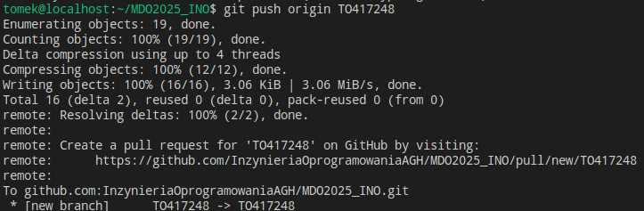
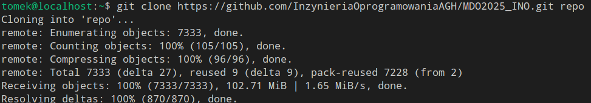

# Sprawozdanie 1
#### Tomasz Oszczypko

## Zajęcia 01
Celem laboratorium było skonfigurowanie usługi SSH umożliwiającej połączenie z GitHubem oraz zapoznanie się i przygotowanie własnej gałęzi w repozytorium git.

### DLACZEGO NA ZRZUTACH EKRANU WIDOCZNY JEST LOCALHOST?

Podczas instalacji systemu maszyna domyślnie przyjęła nazwę localhost.localdomain, co widoczne jest na poniższym zrzucie.


### 1. Instalacja klienta git i obsługi kluczy SSH

Instalacja została przeprowadzona przy użyciu menadżera paczek dnf:
```bash
sudo dnf install git
```

Instalacja klienta oraz serwera SSH nie była konieczna, gdyż Fedora Server domyślnie ma zainstalowany OpenSSH.

W celu weryfikacji poprawnej instalacji gita sprawdzono jego wersję:
```bash
git --version
```


### 2. Sklonowanie repozytorium przedmiotowego za pomocą HTTP

Ponieważ repozytorium jest publiczne, klonowanie mogło się odbyć poprzez HTTP bez konieczności tworzenia <i>personal access token</i>:


### 3. Konfiguracja klucza SSH, klonowanie repozytorium przez SSH

Wygenerowane zostały 2 klucze SSH - jeden z hasłem, drugi bez hasła.

- klucz zabezpieczony hasłem:


- klucz bez hasła:


Klucz prywatny zabezpieczony hasłem został dodany do agenta SSH:


Zawartość publicznego klucza zabezpieczonego hasłem została odczytana przy użyciu polecenia <i>cat</i>:
```bash
cat ~/.ssh/password.pub
```

Na koncie GitHub został dodany nowy klucz SSH przy użyciu uprzednio odczytanego klucza publicznego:


Pobrane repozytorium zostało usunięte, a następnie ponownie sklonowane - tym razem z wykorzystaniem protokołu SSH:


Na koncie na GitHubie został skonfigurowany Two-Factor Authentication (2FA). Jako metodę autentykacji wybrano aplikację uwierzytelniającą (Authenticator od firmy Microsoft):


### 4. Zmiana gałęzi

Przełączono gałąż na main, a następnie na gałąź grupy - GCL06:


### 5. Utworzenie własnej gałęzi

Od brancha grupy została utworzona własna gałąź o nazwie "inicjały & nr indeksu":


### 6. Praca na nowej gałęzi

W katalogu grupy został utworzony własny katalog o nazwie takiej samej, jak nazwa gałęzi:


Następnie został napisany git hook weryfikujący, czy każdy commit message zaczyna się od "inicjały & nr indeksu". Plik został zapisany jako commit-msg:

```bash
#!/bin/sh

# This hook checks if commit message starts with proper prefix,
# which is my initials and index number.

COMMIT_MESSAGE_FILE=$1
COMMIT_MESSAGE=$(head -n1 "$COMMIT_MESSAGE_FILE")

PREFIX="TO417248"

if ! echo "$COMMIT_MESSAGE" | grep -q "^$PREFIX"; then
    echo "Error: Commit message must start with '$PREFIX'"
    exit 1
fi

exit 0
```

Plikowi ustawiono możliwość wykonywania:


Plik następnie został przeniesiony z katalogu GCL06 do własnego katalogu oraz skopiowany do katalogu .git/hooks w celu instalacji:


Wszelnie wprowadzone zmiany należało wysłać do zdalnego źródła. Przed tym jednak powinien zostać skonfigurowany git tak, aby autor commita na githubie był widoczny jako poprawny użytkownik. W moim przypadku krok ten został niestety wykonany po commicie, przez co w historii commitów jest widoczny inny, niepowiązany ze mną użytkownik: 


Zmiany zcommitowano w lokalnym repozytorium:


Finalnie wprowadzone zmiany zostały wysłane do zdalnego źródła:




## Zajęcia 02

Celem laboratorium było przygotowanie środowiska umożliwiającego konteneryzację aplikacji przy użyciu Dockera.

### 1. Instalacja Dockera w systemie linuksowym

Instalacja odbyła się przy użyciu menadżera paczek dnf:
```bash
sudo dnf install docker
```

W celu weryfikacji poprawności instalacji sprawdzono wersję Dockera:


Otrzymany komunikat oznacza, że nie jest aktywny demon Dockera, dlatego też został aktywowany oraz uruchomiony:
```bash
sudo systemctl enable docker
sudo systemctl start docker
```

Po aktywacji sprawdzono, czy demon działa:


### 2. Rejestracja w Docker Hub

Utworzone zostało konto na stronie [Docker Hub](https://hub.docker.com):


### 3. Pobieranie obrazów Dockera

W następnym kroku zostały pobrane obrazy - `hello-world`, `busy-box`, `ubuntu` oraz `mysql`:


### 4. Uruchomienie kontenera z obrazu `busybox`

Kontener uruchomiono wraz z automatycznym usuwaniem po zakończeniu działania przy użyciu poniższego polecenia:
```bash
sudo docker run --rm busybox
```

Kontener ten jednak uruchomił się i automatycznie zamknął, gdyż nie miał zadań do wykonania, co przedstawia poniższy zrzut ekranu z listą uruchomionych kontenerów:


Aby kontener nie zakończył działania od razu, należało uruchomić go w trybie interaktywnym. Wersja kontenera obrazu dostępna jest przy wywołaniu `--help` dla dowolnego uniksowego polecenia:


Ciąg znaków `2>&1` przy sprawdzeniu wersji oznacza przekazanie strumienia `stderr` do `stdout`.

### 5. Uruchomienie "systemu w kontenerze"

Wybranym obrazem systemu był ubuntu, dlatego też kontener z tym systemem został uruchomiony, a wewnątrz niego zostały sprawdzony proces z `PID 1`. Jak widać, jest to bash:


Na hoście w kolejnym terminalu sprawdzono również procesy dockera przy użyciu poniższego polecenia:
```bash
ps aux | grep docker
```


Ostatnim zadaniem w tym kroku było zaktualizowanie pakietów w kontenerze: 


Po zaktualizowaniu pakietów opuszczono kontener:


### 6. Utworzenie własnego Dockerfile'a

Obraz tworzony przy użyciu Dockerfile'a bazuje na Alpine Linux, dzięki czemu będzie bardzo lekki. Obraz ma posiadać zainstalowanego gita oraz sklonowane repozytorium przedmiotu:
```Dockerfile
FROM alpine:latest

RUN apk add --no-cache git

WORKDIR /app

RUN git clone https://github.com/InzynieriaOprogramowaniaAGH/MDO2025_INO.git

CMD ["/bin/sh"]
```

Następnie obraz został zbudowany. Jako własną nazwę obrazu ustawiono `apline-image`:


Po zbudowaniu obrazu został uruchomiony kontener bazujący na nim, a następnie wewnątrz zweryfikowano, czy jest zainstalowany git oraz czy zostało ściągnięte repozytorium:


W nowym terminalu na hoście sprawdzono uruchomione kontenery:


W ostatnim kroku wyczyszczono wszystkie zatrzymane kontenery, a następnie obrazy przy użyciu poleceń:
```bash
sudo docker container prune
sudo docker rmi -f $(sudo docker images -aq)
```


Plik Dockerfile umieszczony został w katalogu `002-Class` wewnątrz katalogu `Sprawozdanie1` dla lepszej organizacji plików.


## Zajęcia 03

Celem laboratorium było przygotowanie plików Dockerfile tworzących wersje testową oraz produkcyjną obrazów z dowolnym otwartoźródłowym projektem.

### 1. Wybór oprogramowania

Wybrane przeze mnie oprogramowanie to `toasty` - otwartoźródłowy framework do pisania testów jednostkowych w C mojego autorstwa. Projekt zawiera plik `Makefile` z dwoma targetami - domyślnym do kompilacji jako biblioteki statycznej oraz `test` do kompilacji i uruchomienia wewnętrznych testów jednostkowych.

Repozytorium zostało sklonowane:


Maszyna nie ma wymaganych zależności, dlatego też zostały doinstalowane przy użyciu poniższego polecenia:
```bash
sudo dnf install gcc make
```

Następnie został przeprowadzony build oraz uruchomienie testów:


### 2. Przeprowadzenie buildu w kontenerze

W pierwszym kroku został pobrany obraz ubuntu przy użyciu poniższego polecenia:
```bash
docker pull ubuntu
```

Następnie uruchomiono kontener w trybie interaktywnym:


W kontenerze zostały zainstalowane wymagane zależności:


Po krótkiej chwili możliwe było sklonowanie repozytorium projektu:


Następnie zmieniono katalog na katalog projektu oraz zbudowano go:


Po skończonej budowie możliwe było skompilowanie i uruchomienie testów, które zakończyły się powodzeniem:


W kolejnym kroku zostały przygotowane dwa pliki Dockerfile automatyzujące powyższe kroki:
- `Dockerfile` - build:
```Dockerfile
FROM ubuntu:latest

RUN apt update && apt install -y git gcc make

RUN git clone https://github.com/badzianga/toasty.git

WORKDIR /toasty

RUN make
```

- `Dockerfile.test` - testy:
```Dockerfile
FROM toasty

RUN make test 
```

Pliki te początkowo zostały umieszczone w katalogu domowym. W pierwszej kolejności zbudowano obraz builda:


Następnie zbudowano obraz testów:


W ostatnim kroku uruchomiono kontener oparty na obrazie testów. Jak widać na poniższym zrzucie, wraz z uruchomieniem kontenera automatycznie uruchamiany jest target testów, który działa poprawnie:


### 3. Kompozycja przy użyciu `docker-compose`

W pierwsze kolejności został pobrany `docker-compose`, gdyż nie był dostępny na maszynie:


Następnie został utworzony plik `docker-compose.yml` w tym samym katalogu, co pliki Dockerfile. Jego treść wygląda następująco:
```yaml
services:
  toasty:
    build:
      context: .
      dockerfile: Dockerfile
    image: toasty
    container_name: toasty

  toasty-test:
    build:
      context: .
      dockerfile: Dockerfile.test
    depends_on:
      - toasty
    image: toasty-test
    container_name: toasty-test
```

Finalnie możliwe jest zbudowanie i uruchomienie kontenera z testami przy użyciu przygotowanego pliku:


## Zajęcia 04

### 1. Zachowywanie stanu

W pierwszej kolejności przygotowane zostały dwa woluminy - wejściowy i wyjściowy o nazwach `input-volume` oraz `output-volume`:


Czyste repozytorium przedmiotu zostało ponownie sklonowane - do folderu `repo`:



W celu skopiowania sklonowanego repozytorium na wolumin wejściowy z hosta przygotowany został kontener oparty o `hello-world` z podpiętym woluminem `input-volume`. Kontener ten nie był i nie musi być nigdy uruchamiany - służy on tylko do interakcji z woluminem wejściowym poprzez `docker cp`, stąd nadana mu nazwa `input-interface`. Takie rozwiązanie pozwala na oszczędzenie zasobów - obraz `hello-world` jest bardzo lekki, waży tylko nieco ponad 10kB. 


