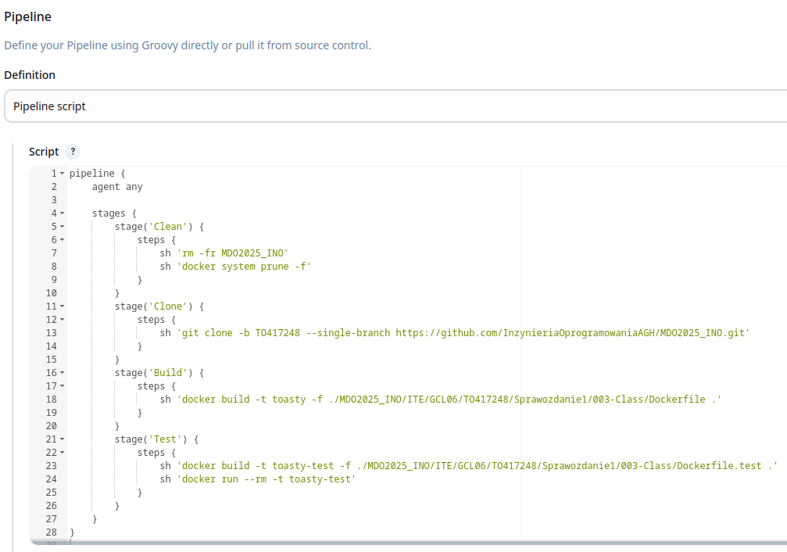
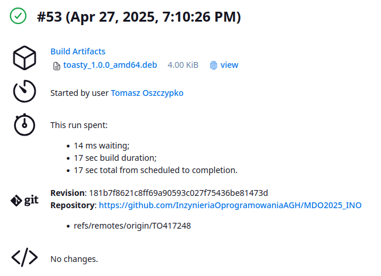

# Sprawozdanie 1
#### Tomasz Oszczypko

### Przygotowanie instancji Jenkins

W celu przygotowania Jenkinsa należało najpierw utworzyć nową sieć mostkowaną `jenkins`, co wykonano przy użyciu poniższego polecenia na poprzednich zajęciach:
```bash
docker network create jenkins
```

Następnie uruchomiono kontener oparty o obraz `dind` w celu korzystania z dockera w Jenkins. Polecenie to będzie wywoływane za każdym razem po restarcie serwera:


W kolejnym kroku przygotowano dostosowany obraz Jenkinsa z dodatkiem `BlueOcean` tworząc plik [Dockerfile](005-Class/Dockerfile):

```Dockerfile
FROM jenkins/jenkins:2.492.2-jdk17
USER root
RUN apt-get update && apt-get install -y lsb-release ca-certificates curl && \
    install -m 0755 -d /etc/apt/keyrings && \
    curl -fsSL https://download.docker.com/linux/debian/gpg -o /etc/apt/keyrings/docker.asc && \
    chmod a+r /etc/apt/keyrings/docker.asc && \
    echo "deb [arch=$(dpkg --print-architecture) signed-by=/etc/apt/keyrings/docker.asc] \
    https://download.docker.com/linux/debian $(. /etc/os-release && echo \"$VERSION_CODENAME\") stable" \
    | tee /etc/apt/sources.list.d/docker.list > /dev/null && \
    apt-get update && apt-get install -y docker-ce-cli && \
    apt-get clean && rm -rf /var/lib/apt/lists/*
USER jenkins
RUN jenkins-plugin-cli --plugins "blueocean docker-workflow"
```

Na podstawie tego obrazu zbudowano kontener:


Po przeprowadzonej budowie możliwe było uruchomienie nowo powstałego kontenera:


Oba kontenery powinny działać w tle:


Wchodząc na adres kontenera (w moim przypadku był to `localhost:8080` przez przekierowanie portów w VSCode) Jenkins zapyta o wstępne hasło administratora dostępne w logach bądź w pliku `initialAdminPassword` w kontenerze `jenkins-blueocean`. Hasło to zostało wypisane przy użyciu poniższego polecenia:


Po wpisaniu hasła możliwe było przejście do konfiguracji Jenkinsa poprzez instalację wtyczek. Wybrano opcję instalacji zalecanych:


Instalacja wtyczek przebiegała automatycznie:


Po zakończeniu instalacji wtyczek należało utworzyć konto administratora, przy użyciu którego będzie odbywać się logowanie do Jenkinsa podczas kolejnych sesji: 


Powyższy krok zamyka proces przygotowywania Jenkinsa do użytkowania:


### Tworzenie projektów

Na tym etapie należało utworzyć trzy proste projekty w Jenkinsie w celu sprawdzenia, czy Jenkins działa poprawnie. Pierwszy z nich polegał na wyświetleniu `uname`:


Uruchomienie projektu przebiegło poprawnie - wypisane zostały informacje o systemie: 


Drugi projekt polegał na zwróceniu błędu, gdy godzina jest nieparzysta. W trakcie tworzenia tego skryptu napotkałem problem z linijką `if (( ${hour} % 2 != 0 ))`. Uruchomienie programu sprawiało, że w konsoli otrzymywałem błąd `22: not found`, gdzie 22 było obecną godziną. Domyślny shell interpretował tę godzinę jako polecenie, dlatego też zmieniłem interpreter `sh` na `bash` w pierwszej linijce:


Uruchomienie tego projektu również przebiegło poprawnie - działanie zakończyło się sukcesem, gdyż było po godzinie 22:


Trzeci projekt polegał na pobraniu obrazu `ubuntu` z repozytorium Dockera:


I tu działanie przebiegło poprawnie, co świadczy o tym, że kontenery Jenkinsa mają dostęp do internetu:


### Tworzenie obiektu typu `pipeline`

Po zweryfikowaniu działania Jenkinsa poprzez utworzenie poprzednich projektów możliwe było przejście do stworzenia obiektu typu `pipeline`. Pipeline ten miał na celu sklonować repozytorium przedmiotu, przejść na moją gałąź i zbudować wybrany wcześniej otwartoźródłowy projekt przy użyciu `Dockerfile`. W obiekcie tym pojawił się następujący kod, będący dostępnym poniżej w formie zrzutu oraz w pliku [Jenkinsfile](005-Class/Jenkinsfile) z możliwością kopiowania:



Pipeline ten nie wykonuje tylko zalecanego w instrukcji. Zamiast tego klonuje tylko moją gałąź w celu skrócenia czasu pobierania. Ze względu na sporą ilość logów poniższy zrzut ekranu przedstawia ostatnie logi pokazujące sukces po poprawnie ukończonych testach:


Zrzut ekranu przedstawiający drugie uruchomienie nie został dołączony, gdyż pokazuje on to samo co poprzedni. Wielokrotne uruchamianie pipeline'u bez błędów spowodowanych już istniejącymi folderami i kontenerami jest możliwe dzięki krokowi `Clean`, który na początku usuwa folder repozytorium jeśli istnieje oraz czyści wszystkie nieużywane kontenery, obrazy i sieci Dockera.

### Opis celu

Projekt, dla którego będę robił pipeline to nadal `Toasty` - biblioteka do tworzenia testów jednostkowych w C mojego autorstwa. W zamyśle pipeline ten ma automatyzować proces budowania i testowania biblioteki, a następnie tworzenia pakietu instalacyjnego dla wybranego systemu Linux - najpewniej dla systemów opartych o Debiana. Diagram UML opisujący przebieg działania tego pipeline'u przedstawiono poniżej:


### Kompletny pipeline

Utworzony, kompletny [pipeline](006-Class/Jenkinsfile) składa się z następujących stage'y:

- **Clean** - usuwa on repozytorium przedmiotu jeśli istnieje (w przypadku nieistniejącego ignoruje błąd poprzez flagę `-f`) oraz usuwa wszystkie istniejące obrazy, woluminy i kontenery w celu zapewnienia czystego builda bez cache'owanych poprzednich wersji obrazów:

```Groovy
stage('Clean') {
    steps {
        echo 'Cleaning...'
        sh 'rm -fr MDO2025_INO'
        sh 'docker system prune --all --force --volumes'
    }
}
```

- **Clone** - klonuje tylko moją gałąź repozytorium przedmiotowego w celu zaoszczędzenia transferu danych i przyspieszenia działania.

```Groovy
stage('Clone') {
    steps {
        echo 'Cloning...'
        sh 'git clone -b TO417248 --single-branch https://github.com/InzynieriaOprogramowaniaAGH/MDO2025_INO.git'
    }
}
```

- **Build** - buduje obraz `toasty` z pliku [Dockerfile](003-Class/Dockerfile) oparty o `gcc` w wersji `15.1`. Obraz ten pobiera repozytorium `toasty` oraz buduje statyczną bibliotekę na podstawie `Makefile`. Obraz z dependencjami nie był tworzony, gdyż `toasty` nie potrzebuje niczego oprócz biblioteki standardowej C oraz kompilatora będących domyślnie dostępnymi w obrazie `gcc`.

```Groovy
stage('Build') {
    steps {
        echo 'Building...'
        sh 'docker build --no-cache -t toasty -f ./MDO2025_INO/ITE/GCL06/TO417248/Sprawozdanie1/003-Class/Dockerfile .'
    }
}
```

- **Test** - buduje obraz `toasty-test` z pliku [Dockerfile.test](003-Class/Dockerfile.test), który z kolei buduje wewnętrzne testy biblioteki `toasty`. Następnie powstaje kontener oparty o ten obraz, którego uruchomienie sprawia, że wywoływane są automatycznie wszystkie wewnętrzne testy. W przypadku niepowodzenia któregoś z testów zwracany jest exit code 1, który przerywa działanie całego pipeline'u. Testy które zakończyły się porażką są wypisywane w logach automatycznie.

```Groovy
stage('Test') {
    steps {
        echo 'Testing...'
        sh 'docker build --no-cache -t toasty-test -f ./MDO2025_INO/ITE/GCL06/TO417248/Sprawozdanie1/003-Class/Dockerfile.test .'
        sh 'docker run --rm -t toasty-test'
    }
}
```

- **Deploy** - uruchamia kontener oparty o builder `toasty` w celu dostępu do zbudowanej biblioteki oraz pliku nagłówkowego. Wewnątrz kontenera tworzony jest dynamicznie plik `test.c` korzystający z biblioteki, a następnie kompilowany i linkowany. Powstały prosty program jest uruchamiany. Krok ten weryfikuje poprawność praktycznego użycia biblioteki - jeśli kompilacja lub uruchomienie zakończyłyby się niepowodzeniem, działanie pipeline'u zostałoby przerwane. Program nie jest dalej pakowany ani dystrybuowany, gdyż miał tylko na celu weryfikację działania. Stage ten korzysta z obrazu `toasty`, gdyż ma tam wszystko, czego potrzebuje - gotowy nagłówek, bibliotekę i kompilator. Nie było więc konieczne tworzenie nowego obrazu i kontenera na jego podstawie.

```Groovy
stage('Deploy') {
    steps {
        echo 'Deploying...'
        sh '''
            docker run --rm toasty bash -c "
                echo '#include <toasty.h>' > test.c
                echo 'TEST(test_example) {' >> test.c
                echo '    TEST_ASSERT_EQUAL(4, 2 + 2);' >> test.c
                echo '}' >> test.c
                echo 'int main() {' >> test.c
                echo '    return RunTests();' >> test.c
                echo '}' >> test.c
                
                gcc test.c -Lbuild -ltoasty -Isrc -o test
                ./test
            "
        '''
    }
}
```

- **Publish** - tworzy debianową paczkę zawierającą nagłówek i bibliotekę statyczną `toasty`, a następnie archiwizuje artefakt w celu umożliwienia pobrania ostatniej wersji z pipeline'u, który zakończył się sukcesem. Tworzona jest paczka `.deb`, gdyż obraz `gcc` jest oparty o Debiana i posiada domyślnie `dpkg`. Uruchomienie całego pipeline'u pyta o parametr w postaci wersji - domyślnie jest to `0.0.0`. Jeśli nie zostanie ustalona inna wersja, to ta podmieniana jest na wersję w postaci `YYYYMMDD`, gdzie zczytywana jest obecna data. Stage ten tworzy wymaganą strukturę katalogów oraz przede wszystkim plik manifestu (niezbędny do utworzenia paczki) dynamicznie, dzięki czemu możliwe jest łatwe ustawienie obecnej wersji.

```Groovy
stage('Publish') {
    steps {
        script {
            def version = params.VERSION
            if (version == '0.0.0') {
                version = new Date().format('yyyyMMdd', TimeZone.getTimeZone('UTC'))
            }
            echo "Publishing version: ${version}..."
            sh """
                docker run --rm -v "\${PWD}:/workspace" --env VERSION=${version} toasty bash -c '
                    mkdir -p /tmp/toasty-pkg/usr/local/include
                    mkdir -p /tmp/toasty-pkg/usr/local/lib
                    mkdir -p /tmp/toasty-pkg/DEBIAN

                    cp /toasty/src/toasty.h /tmp/toasty-pkg/usr/local/include/
                    cp /toasty/build/libtoasty.a /tmp/toasty-pkg/usr/local/lib/

                    echo "Package: toasty" > /tmp/toasty-pkg/DEBIAN/control
                    echo "Version: \${VERSION}" >> /tmp/toasty-pkg/DEBIAN/control
                    echo "Section: libs" >> /tmp/toasty-pkg/DEBIAN/control
                    echo "Priority: optional" >> /tmp/toasty-pkg/DEBIAN/control
                    echo "Architecture: amd64" >> /tmp/toasty-pkg/DEBIAN/control
                    echo "Maintainer: Tomasz Oszczypko <tomekoszczypko@gmail.com>" >> /tmp/toasty-pkg/DEBIAN/control
                    echo "Description: C unit testing framework." >> /tmp/toasty-pkg/DEBIAN/control

                    dpkg-deb --build /tmp/toasty-pkg /workspace/toasty_\${VERSION}_amd64.deb
                '
            """
            archiveArtifacts artifacts: "toasty_${version}_amd64.deb", fingerprint: true
        }
    }
}
```

W trakcie pisania kroku `Publish` napotkałem dwa istotne problemy. Pierwszy z nich polegał na tym, że zmiana wersji z `0.0.0` na `YYYYMMDD` odbywająca się wewnątrz kontenera przypisywała zaktualizowaną wersję w linijce `echo "Version: ...`, oraz `dpkg-deb --build ...` ale próba archiwizacji artefaktu kończyła się niepowodzeniem, gdyż Jenkins nadal próbował wstawić w artefakt wersję sprzed zmiany. Spowodowane to było aktualizacją zmiennej środowiskowej tylko wewnątrz kontenera:
```bash
if [ "${VERSION}" == "0.0.0" ]; then
    VERSION=$(date -u +"%Y%m%d")
fi
```

Poza kontenerem nadal była wersja sprzed zmiany. Rozwiązanie tego problemu polegało na przeniesienie tego kodu do skryptu Jenkinsa - konieczne było umieszczenie całego stage'a `Deploy` w bloku `script` oraz dopisaniu odpowiednika poprzedniego skryptu od zmiany wersji:
```bash
def version = params.VERSION
if (version == '0.0.0') {
    version = new Date().format('yyyyMMdd', TimeZone.getTimeZone('UTC'))
}
```

Drugi problem będący jednocześnie największym spowodowałem nieumyślnie - Groovy oraz bash pozwalają umieszczać tekst w cudzysłowiach `"..."` oraz apostrofach `'...'`. Choć na pierwszy rzut oka nie ma różnicy, tak pojawia się ona gdy chce się korzystać ze zmiennych. Stringi w cudzysłowiach (również w potrójnych - `"""..."""`) interpolują zmienne w momencie tworzenia stringa, jeszcze zanim ten string zostanie przekazany dalej, z kolei stringi w apostrofach pojedynczych/potrójnych mają zawartość dosłowną. W moim przypadku tuż po `sh` należało użyć cudzysłowia potrójnego, gdyż zależy mi na wstawieniu wersji `${version}` do stringa od razu. Zastosowanie `'''...'''` sprawiało, że polecenie było wywoływane postaci, gdzie do zmiennej `VERSION` nie była przypisana żadna wartość:
```bash
docker run --rm -v /var/jenkins_home/workspace/Toasty Pipeline:/workspace --env VERSION= toasty bash -c
```

Po parametrze `-c` w tej linijce należało z kolei użyć apostrofów `'...'`, gdyż Jenkins miał przekazać nietkniętego stringa Dockerowi. Aby Groovy na nie wstawił wartości których jeszcze nie ma, przed znakami `$` umieszczono `\`.

Na pierwszy rzut oka może tu występować paradoks - przecież zostały użyte apostrofy po `-c`, ten string nie powinien być interpolowany, więc `\` nie jest potrzebny. Jest to jednak błędne założenie, gdyż te apostrofy występują wewnątrz bloku `"""..."""`. Groovy zinterpoluje więc całego tego stringa, a tym samym wartości `${}` bez `\` przed.

Może się jeszcze zrodzić kolejne pytanie odnośnie apostrofów po `-c` - nie można ich w takim razie zastąpić cudzysłowiem skoro zabezpieczamy zmienne przy użyciu ukośnika? Otóż nie można, gdyż wtedy shell wywołujący całe polecenie `docker run ...` zinterpolowałby wszystkie odwołania do `VERSION` od razu - a przecież `VERSION` jest definiowane dopiero w `--env VERSION=${version}`. Można od razu sprostować, że `VERSION` było zdefiniowane przez parametr i prawdopodobnie jest przekazywane przez Jenkinsa automatycznie, lecz parametr ten nie zawiera zaktualizowanej wersji (jeśli aktualizowana była), tylko tą począkowo podaną przez użytkownika.

Podsumowując, występuje tu złożone przekazywanie stringów na trzech etapach, gdzie podczas każdego możliwa jest interpolacja stringów, która może być lub nie być pożądana:

1. Groovy
2. Shell wywołujący `docker run ...`
3. Shell wewnątrz kontenera

Mam nadzieję, że dobrze zrozumiałem i rozwiązałem problem oraz dokładnie rozwinąłem opis, aby osoby oddające to sprawozdanie w 2-3 terminie które napotkają ten sam problem i będą *szukać inspiracji* znajdą go właśnie tu.

### Rozbieżność z UML

Zdefiniowany pipeline nie różni się znacząco od tego zaplanowanego. Jedyna różnica to klonowanie tylko jednej gałęzi zamiast całego repozytorium w celu zaoszczędzenia zasobów.

### Konfiguracja obiektu pipeline

Jak było już wspominane, pipeline jest parametryzowany, co oznacza, że przy uruchamianiu należy wprowadzić parametr - w moim przypadku wersję builda:


Skonfigurowany został również SCM, przez co [Jenkinsfile](006-Class/Jenkinsfile) jest pobierany z repozytorium:


### Uruchomienie pipeline'u

Uruchomienie pipeline'u sprawi, że budowa wymaga parametru. Nie wprowadzam parametru aby sprawdzić, czy wersja zostanie poprawnie ustalona na podstawie daty:


Po dłuższej chwili cały pipeline powininen poprawnie przejść i zakończyć się sukcesem, a w artefaktach powinien być dostępny artefakt w postaci pliku `.deb`:


Ponowne uruchomienie również powinno zadziałać. Tutaj z kolei wpisałem własną wersję (`1.0.0`) aby sprawdzić, czy ustawienie jej zadziała:



Logi z przeprowadzanych buildów zapisywane są w panelu Jenkinsa. Przykładowy log z ukończonego buildu `#56` zawarty jest w pliku [build.log.txt](007-Class/build-log.txt).

### Weryfikacja artefaktu

Utworzony artefakt można przetestować czy działa - test będzie polegał na utworzeniu kontenera opartego o Debiana (`gcc` ze względu na dostęp do kompilatora), zainstalowaniu pakietu `toasty_1.0.0_amd64.deb` i stworzeniu prostego pliku źródłowego korzystającego z biblioteki `toasty`, która powinna być dostępna w kontenerze.

W pierwszym kroku konieczne umożliwienie skorzystania z paczki w kontenerze. W tym celu należy ją przerzucić na wolumin. Do tego wykorzystam `input-interface` - kontener oparty o `hello-world` utworzony na jednym z poprzenich laboratoriów. Kontener nie musi być uruchamiany, ma zawsze podpięty wolumin, możliwe jest więc przesyłanie do niego plików. Paczkę pobrałem z panelu Jenkinsa i przesłałem na serwer, z którego następnie przerzuciłem ją na wolumin:


Następnie uruchomiłem kontener oparty o `gcc`:


W kontenerze zainstalowałem paczkę `.deb` przy użyciu `dpkg`:


Przy użyciu `echo` (obraz gcc nie posiada `nano` ani `vi`) stworzyłem prosty plik korzystający z `toasty`:


Następnie plik ten skompilowałem linkując przy tym statyczną bibliotekę `toasty` i uruchomiłem powstały plik wykonywalny:


Kompilacja przebiegła w pełni poprawnie, a w jej trakcie nie było wymagane podawanie ścieżek do bibliotek ani nagłówków, co oznacza, że toasty jest poprawnie zainstalowane i dostępne w katalogach `/usr/lib` oraz `/usr/include`.
