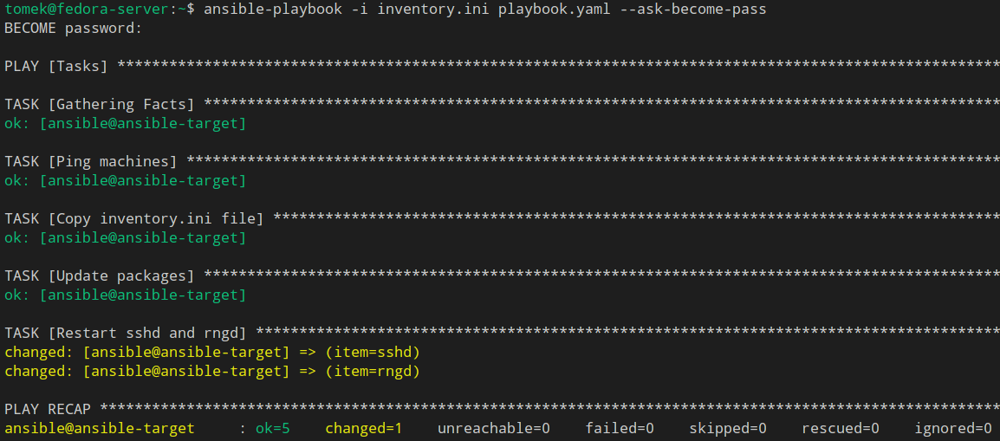
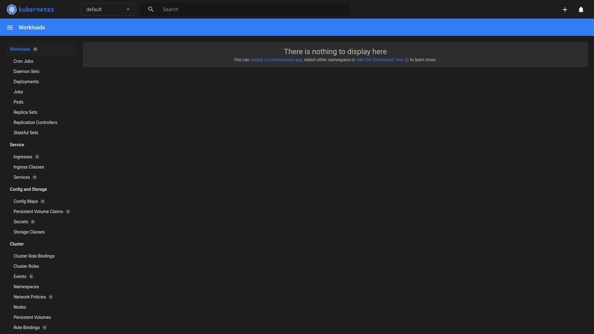
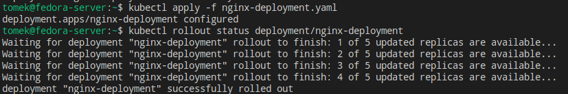

# Sprawozdanie 3
#### Tomasz Oszczypko

## Automatyzacja i zdalne wykonanie poleceń za pomocą Ansible

### Instalacja zarządcy Ansible

W pierwszym kroku utworzona została druga maszyna wirtualna oparta o Fedorę 41 Custom Installation - wersja ta dostarczana jest z minimalną ilością oprogramowania:


Na maszynie zweryfikowano, czy są zainstalowane paczki `tar` oraz `OpenSSH` przy użyciu poleceń:

```bash
tar
sudo systemctl status sshd
```


Maszynie nadano nazwę `ansible-target`, a użytkownikowi nazwę `ansible`, co jest widoczne w `hostnamectl` oraz w prompcie polecenia:


Na głównej maszynie zainstalowano oprogramowanie `ansible` przy użyciu poniższego polecenia:

```bash
sudo dnf install ansible
```

Następnie wymieniono klucze SSH między maszyną serwerową a maszyną `ansible-target` tak, aby możliwe było logowanie na użytkownika `ansible` poprzez SSH bez podawania hasła. Przed tym jednak konieczne było poznanie adresu IP maszyny `ansible-target`:


Adres tej maszyny to `172.17.54.109`. Na serwerze w pliku `etc/hosts` dodano alias maszyny tak, aby możliwe było korzystanie z nazwy hosta zamiast z adresu IP:


Teraz możliwe powinno być logowanie na użytkownika `ansible` - lecz na razie jeszcze poprzez wprowadzenie hasła:


Umożliwiono więc logowanie poprzez klucz SSH - w tym celu skopiowany został klucz utworzony jeszcze na pierwszych laboratoriach `no_password` nie wymagający podawania hasła przy autentykacji: 


Po tym przeprowadzono próbę logowania na użytkownika `ansible@ansible-target` bez użycia hasła:


### Inwentaryzacja

Na początku ustalone zostały przewidywalne nazwy maszyn - nowo powstała maszyna miała ją ustaloną na poprawną w trakcie instalacji. Serwer natomiast od początku zajęć nosił nazwę `localhost`, co zostało zmienione przy użyciu poniższego polecenia:

```bash
sudo hostnamectl set-hostname --static fedora-server
```

Serwer w pliku `/etc/hosts` miał już nazwę DNS nowo powstałej maszyny. Dodano jeszcze tylko w tym pliku nazwę loopbacku:
```bash
127.0.0.1   localhost localhost.localdomain localhost4 localhost4.localdomain4 fedora-server
```

Podobny zabieg przeprowadzono również na maszynie `ansible-target`. Łączność została zweryfikowana w poprzednim kroku.

Następnie został utworzony [plik inwentaryzacji](008-Class/inventory.ini). Ponieważ do połączenia z maszyną korzystam z klucza o nazwie innej niż domyślnie szukana przez agenta SSH, w pliku inwentaryzacji zaznaczam z jakiego klucza serwer ma korzystać przy próbie autentykacji przy użyciu `ansible_ssh_private_key_file`:


Do maszyn zostało wysłane żądanie `ping`:


Podczas realizacji tego polecenia zaobserwowałem ciekawy błąd związany z moim systemem. Ping potrafił trwać bardzo długo lub nie dochodzić w ogóle. Włączenie okienka z maszyną wirtualną `ansible-target` tak, aby była aktywne też niewiele dawało. Dopiero wprowadzenie jakiekolwiek sygnału wejściowego (wciśnięcia przycisku na klawiaturze tak, aby wprowadzić znak do terminala na tejże maszynie) sprawiało, że ping dochodził. Spowodowane to było prawdopodobnie głodzeniem procesu maszyny `ansible-target` przez scheduler. Problem ten planowałem rozwiązać poprzez przeniesienie obrazu maszyny wirtualnej na drugą stację roboczą, lecz zwykły restart systemu naprawił problem na czas realizacji zadań.

### Zdalne wywoływanie procedur

W tym kroku został utworzony [playbook](008-Class/playbook.yaml) Ansible odpowiedzialny za następujące zadania:
- wysłanie żądania `ping` do wszystkich maszyn
- kopiowanie pliku inwentaryzacji na maszyny/ę `Endpoints`
- zaktualizowanie pakietów w systemie
- restart usług `sshd` oraz `rngd`

W pierwszej kolejności należy zaznaczyć, iż na konfiguracji Custom Install nie była dostępna domyślnie usługa `rngd`, dlatego też została zainstalowana ręcznie przy użyciu poniższego polecenia:

```bash
sudo dnf install rng-tools
```

Treść playbooka dostępna jest [tutaj](008-Class/playbook.yaml) oraz poniżej:
```yaml
- name: Tasks
  hosts: Endpoints
  become: yes
  tasks:
    - name: Ping machines
      ansible.builtin.ping:

    - name: Copy inventory file
      ansible.builtin.copy:
        src: ./inventory.ini
        dest: ~/inventory.ini

    - name: Update packages
      ansible.builtin.dnf:
        name: '*'
        state: latest
        update_cache: yes

    - name: Restart sshd and rngd
      ansible.builtin.systemd:
        name: "{{ item }}"
        state: restarted
      loop:
        - sshd
        - rngd
```

Gotowy playbook został następnie uruchomiony, lecz pojawił się pierwszy problem - brak uprawnień użytkownika root (niezbędnych do wykonania niektórych kroków):


Problem ten został rozwiązany poprzez dodanie opcji `--ask-become-pass`, która prosi o podanie hasła użytkownika wykonującego polecenia na maszynie:


Jak widać na powyższym zrzucie, zadanie `Copy inventory.ini file` oraz `Update packages` zwróciło flagę `changed` zamiast `ok` - nie jest to nic złego, oznacza to, że na maszynie docelowej zostały wprowadzone zmiany i jest to oczekiwany efekt.

Następnie playbooka uruchomiono ponownie:



Teraz efekt działania jest inny - w przypadku kopiowania i aktualizacji zwracane są flagi `ok`, ponieważ nie zostały przeprowadzone żadne zmiany na systemie. Jest to teraz oczekiwany efekt, ponieważ plik już istnieje, a wszystkie paczki są aktualne. Warto zaznaczyć, że plik skopiował się do katalogu domowego, lecz użytkownika `root` - spowodowane jest to linijką `become: true` w playbooku, która zmienia użytkownika właśnie na `root`a.

Operacje zostały przeprowadzone jeszcze raz, tym razem z wyłączoną usługą sshd na maszynie docelowej:


Podobny efekt występuje w przypadku maszyny z odpiętą kartą sieciową - wyłączonym interfejsem sieciowym w ustawieniach maszyny wirtualnej. Jedyna różnica to powód failu - zamiast `Connection refused` występuje teraz `Connection timed out`.


### Zarządzanie stworzonym artefaktem

Ponieważ nie doczytałem polecenia i nie zrozumiałem zadania to wykonałem jego znaczną część źle. Myślałem, że moim zadaniem będzie instalacja efektu swojego pipeline'u na nowo powstałej maszynie, co wprowadzało nowe problemy które starałem się rozwiązać. Niemniej jednak pozostawiam omyłkowy fragment poniżej w ramach ciekawostki.

Mój pipeline oparty o autorski projekt [toasty](https://github.com/badzianga/toasty) tworzy paczkę `deb` (zawierającą bibliotekę statyczną oraz nagłówek), gdyż kontener budujący jest oparty o obraz `gcc`, który z kolei bazuje na Debianie. Na maszynie docelowej zainstalowany jest system Fedora. Z tego też powodu konieczne jest przygotowanie paczki `rpm`. Osiągnąć to można na dwa sposoby:
1. Przerobienie całego pipeline'u tak, aby budował paczkę `rpm` (Nie.)
2. Użycie narzędzia konwertującego paczki

Mniej czasochłonne jest drugie rozwiązanie. Narzędziem takim (dostępnym w repozytoriach Fedory) jest `alien`, dlatego też zostanie ono wykorzystane.

Najpierw została przeprowadzona instalacja:

```bash
sudo dnf install alien
```

Następnie wygenerowana została paczka przy użyciu poniższego polecenia:
```bash
sudo alien --to-rpm MDO2025_INO/ITE/GCL06/TO417248/Sprawozdanie2/007-Class/toasty_1.0.0_amd64.deb
```


Gotową paczkę zainstalowano na serwerze w celu weryfikacji, czy będzie ona w stanie działać po konwersji:

```bash
sudo rpm -i toasty-1.0.0-2.x86-64.rpm
```

Ponieważ zainstalowana została biblioteka, konieczne jest napisanie prostego programu w C/C++ linkującego ją:

```C
#include <toasty.h>

TEST(test_example) {
    TEST_ASSERT_EQUAL(4, 2 + 2);
}

int main() {
    return RunTests();
}
```

Plik z powyższym kodem został skompilowany wraz z linkowaniem biblioteki `toasty`, a następnie uruchomiony:


Bibliotekę tę następnie planowałem kopiować na maszyny Endpoints oraz instalować, jednakże ze względu na niedoczytanie pozostanę przy poprawnym rozwiązaniu - instalacji dockera oraz uruchomienia kontenera `gcc` na którym zainstalowana zostanie paczka `deb`. Playbook będzie przebiegał następująco:

1. Skopiuj plik .deb na maszynę
2. Zainstaluj Dockera
3. Pobierz obraz gcc
4. Uruchom kontener oparty o obraz gcc
5. Skopiuj paczkę .deb do kontenera
6. Zainstaluj paczkę w kontenerze
7. Utwórz plik test.c na maszynie
8. Skopiuj plik test.c do kontenera
9. Skompiluj plik test.c wewnątrz kontenera
10. Uruchom plik wewnątrz kontenera

Na podstawie takiego planu napisałem [playbook](008-Class/playbook-toasty.yaml) o następującej treści:

```yaml
- name: Toasty installation in Docker containers
  hosts: Endpoints
  become: yes

  vars:
    local_deb_path: /home/tomek/toasty_1.0.0_amd64.deb
    remote_deb_path: /tmp/toasty_1.0.0_amd64.deb
    container_deb_path: /toasty.deb
    container_name: gcc_toasty
    remote_test_source: /tmp/test.c
    container_test_source: /test.c

  tasks:
    - name: Copy .deb package
      ansible.builtin.copy:
        src: "{{ local_deb_path }}"
        dest: "{{ remote_deb_path }}"
        mode: '0777'

    - name: Install Docker and other packages
      ansible.builtin.dnf:
        name:
          - docker
          - python3-packaging
          - python3-requests
        state: present
        update_cache: yes

    - name: Start Docker services
      ansible.builtin.service:
        name: docker
        state: started
        enabled: yes

    - name: Download gcc Docker image
      ansible.builtin.docker_image:
        name: gcc:15.1
        source: pull
    
    - name: Create gcc container
      community.docker.docker_container:
        name: "{{ container_name }}"
        image: gcc:15.1
        state: started
        command: sleep infinity
    
    - name: Copy package to container
      ansible.builtin.command:
        cmd: "docker cp {{ remote_deb_path }} {{ container_name }}:{{ container_deb_path }}"
    
    - name: Install package in container
      community.docker.docker_container_exec:
        container: "{{ container_name }}"
        command: >
          bash -c "dpkg -i {{ container_deb_path }}"
    
    - name: Create test.c file on host
      ansible.builtin.copy:
        dest: "{{ remote_test_source }}"
        content: |
          #include <toasty.h>

          TEST(test_example) {
              TEST_ASSERT_EQUAL(4, 2 + 2);
          }

          int main() {
              return RunTests();
          }
    
    - name: Copy test.c to container
      ansible.builtin.command:
        cmd: "docker cp {{ remote_test_source }} {{ container_name }}:{{ container_test_source }}"

    - name: Compile test.c
      community.docker.docker_container_exec:
        container: "{{ container_name }}"
        command: gcc {{ container_test_source }} -ltoasty -o /test
    
    - name: Run test
      community.docker.docker_container_exec:
        container: "{{ container_name }}"
        command: ./test
```

Powyższe etapy zostały uruchomione (niejednokrotnie przez błędy napotykane po drodze, dlatego też miejscami jest już flaga `ok`):


Dla pewności zweryfikowano poprawność uruchomienia - w tym celu należało dostać się do kontenera i uruchomić plik:


Jak widać powstały plik istnieje, uruchamia się a test przechodzi, co oznacza, że instalacja paczki przebiegła poprawnie - możliwe jest pisanie programów w C i linkowanie biblioteki `toasty`.

Ostatnim zadaniem tego ćwiczenia było ubranie powyższych kroków w rolę. Na początku utworzyłem nową rolę `install_toasty`:


Powstał nowy katalog roli, w którym usunąłem nieużywane pliki i ścieżki. Następnie zmodyfikowałem następujące pliki:

- [defaults/main.yml](008-Class/install_toasty/defaults/main.yml) - umieściłem tam wszystkie używane zmienne:

```yaml
---
local_deb_path: /home/tomek/toasty_1.0.0_amd64.deb
remote_deb_path: /tmp/toasty_1.0.0_amd64.deb
container_deb_path: /toasty.deb
container_name: gcc_toasty
remote_test_source: /tmp/test.c
container_test_source: /test.c
```

- [tasks/main.yml](008-Class/install_toasty/tasks/main.yml) - umieściłem tam wszystkie zadania:

```yaml
---
- name: Copy .deb package
  ansible.builtin.copy:
    src: "{{ local_deb_path }}"
    dest: "{{ remote_deb_path }}"
    mode: '0777'

- name: Install Docker and other packages
  ansible.builtin.dnf:
    name:
      - docker
      - python3-packaging
      - python3-requests
    state: present
    update_cache: yes

- name: Start Docker services
  ansible.builtin.service:
    name: docker
    state: started
    enabled: yes

- name: Download gcc Docker image
  ansible.builtin.docker_image:
    name: gcc:15.1
    source: pull

- name: Create gcc container
  community.docker.docker_container:
    name: "{{ container_name }}"
    image: gcc:15.1
    state: started
    command: sleep infinity

- name: Copy package to container
  ansible.builtin.command:
    cmd: "docker cp {{ remote_deb_path }} {{ container_name }}:{{ container_deb_path }}"

- name: Install package in container
  community.docker.docker_container_exec:
    container: "{{ container_name }}"
    command: >
      bash -c "dpkg -i {{ container_deb_path }}"

- name: Create test.c file on host
  ansible.builtin.copy:
    dest: "{{ remote_test_source }}"
    content: |
      #include <toasty.h>

      TEST(test_example) {
          TEST_ASSERT_EQUAL(4, 2 + 2);
      }

      int main() {
          return RunTests();
      }

- name: Copy test.c to container
  ansible.builtin.command:
    cmd: "docker cp {{ remote_test_source }} {{ container_name }}:{{ container_test_source }}"

- name: Compile test.c
  community.docker.docker_container_exec:
    container: "{{ container_name }}"
    command: gcc {{ container_test_source }} -ltoasty -o /test

- name: Run test
  community.docker.docker_container_exec:
    container: "{{ container_name }}"
    command: ./test
```

Na samym końcu utworzyłem nowy [playbook](008-Class/install_toasty.yaml) o tej samej nazwie korzystający z roli:

```yaml
---
- name: Toasty installation in Docker containers
  hosts: Endpoints
  become: true

  roles:
    - role: install_toasty
```

Nowo powstały playbook uruchomiłem. Przed tym jednak usunąłem jeszcze kontener `gcc_toasty` na maszynie `ansible_target`:


Jak widać, playbook korzystający z roli przeszedł bez żadnych komplikacji, dlatego też można uznać to ćwiczenie za wykonane.

## Pliki odpowiedzi dla wdrożeń nienadzorowanych

W pierwszym kroku zainstalowałem nowy system Fedora w wersji 42. Z systemu skopiowałem plik `anaconda-ks.cfg` na serwer. Następnie wprowadziłem do niego kilka poprawek:

- Zmieniłem `hostname`.
- Dodałem niezbędne repozytoria.
- Dodałem opcję `reboot` na końcu tak, aby system automatycznie uruchomił się ponownie po instalacji.

Plik z poprawkami wygląda następująco:
```ini
# Generated by Anaconda 41.35
# Generated by pykickstart v3.58
#version=DEVEL

# Keyboard layouts
keyboard --vckeymap=pl2 --xlayouts='pl','us'
# System language
lang en_US.UTF-8

%packages
@^server-product-environment

%end

# Run the Setup Agent on first boot
firstboot --enable

# Generated using Blivet version 3.11.0
ignoredisk --only-use=sda
autopart
# Partition clearing information
clearpart --all --initlabel

# System timezone
timezone Europe/Warsaw --utc

network --hostname=vbox-potezny

# Root password
rootpw --iscrypted $y$j9T$eM1DwTqd36xhKVaL4dQs/aNK$VdMurx2mOKzl8vfwasetpA2MyIWbzWBxvn2FvR4PfAB
user --groups=wheel --name=tomek --password=$y$j9T$n8EtRaoTbc3HYXLpILBLP7Ek$8WmqVfbYvaGRlu6IPmeQyk8g1bGKQ1UW5VsT1gTb5E4 --iscrypted --gecos="Tomasz Oszczypko"

url --mirrorlist=http://mirrors.fedoraproject.org/mirrorlist?repo=fedora-42&arch=x86_64
repo --name=update --mirrorlist=http://mirrors.fedoraproject.org/mirrorlist?repo=updates-released-f42&arch=x86_64

reboot
```

Następnie plik ten dodałem do repozytorium przedmiotowego tak, aby możliwe było pobranie go. Korzystając z `tinyurl` wygenerowałem skróconą wersję [linku](https://raw.githubusercontent.com/InzynieriaOprogramowaniaAGH/MDO2025_INO/refs/heads/TO417248/ITE/GCL06/TO417248/Sprawozdanie3/009-Class/anaconda-ks.cfg) do pliku tak, aby uniknąć popełnienia błędu podczas późniejszego przepisywania:


Mając wygenerowany link przeszedłem do instalacji nienadzorowanej. Utworzyłem nową maszynę wirtualną z obrazem ISO instalatora Fedory 42. Podczas rozruchu wcisnąłem klawisz `E` z kursorem na opcji `Install Fedora 42` tak, aby edytować opcję rozruchu. Dopisałem więc w opcjach `inst.ks=link_do_pliku`:


Po edycji wcisnąłem F10, a po chwili instalacja przebiegała automatycznie:


Po ukończonej instalacji maszyna uruchomiła się ponownie, jednakże konieczne było usunięcie obrazu ISO z maszyny wirtualnej. Ręczne uruchomienie bez obrazu ISO uruchomiło system. Na poniższym zrzucie ekranu można zaobserwować, że logowanie odbyło się na użytkownika, którego zakładałem jeszcze wcześniej podczas ręcznej instalacji systemu, a do którego hasło jest dokładnie takie samo. Dodatkowo, widoczna jest zmieniona nazwa maszyny.


Druga część laboratorium polegała na rozszerzeniu pliku odpowiedzi tak, aby na systemie dostępny był efekt pipeline'u z ostatnich laboratoriów. W ramach przypomnienia - w moim przypadku była to paczka .deb zawierająca bibliotekę `toasty` służącą do pisania testów jednostkowych w C. W pierwszej kolejności konieczne jednak było przekonwertowanie tej paczki na .rpm, co też już zrobiłem omyłkowo na ostatnich laboratoriach.

Paczka sama w sobie nie ma dependencji, lecz warto zapewnić na systemie `glibc` oraz `gcc` tak, aby możliwe było używanie tej biblioteki.

Plik `anaconda-ks.cfg` rozszerzono więc o dwie nowe sekcje dodane tuż przed opcją `reboot`.

Pierwsza z nich instaluje paczki - oprócz wymienionych konieczny jest również `wget` w celu pobrania paczki .rpm z repozytorium przedmiotowego:

```ini
# Necessary packages
%packages
@^server-product-environment
glibc
gcc
wget
%end
```

Druga sekcja odpowiada za instalację paczki `toasty`. W sekcji `%post` jest zatem pobierana paczka do katalogu `/root`, a następnie instalowana przy użyciu `rpm`:

```ini
# Install toasty
%post
wget -O /root/toasty.rpm "https://github.com/InzynieriaOprogramowaniaAGH/MDO2025_INO/raw/refs/heads/TO417248/ITE/GCL06/TO417248/Sprawozdanie3/009-Class/toasty-1.0.0-2.x86_64.rpm"
rpm -ivh /root/toasty.rpm
%end
```

Pełny plik `anaconda-ks.cfg` dostępny jest [tutaj](009-Class/anaconda-ks.cfg).

Instalacja systemu odbyła się tak samo jak poprzednio - utworzyłem nową maszynę, podpiąłem obraz ISO Fedory 42, w menu gruba dodałem opcję z plikiem odpowiedzi, a instalacja odbyła się automatycznie. Na koniec ponownie konieczne było wysunięcie obrazu ISO przed uruchomieniem systemu.

Tak jak wcześniej, logowanie odbywa się na tego samego użytkownika. Hostname jest nadal taki, jaki został skonfigurowany, a dodatkowo na systemie dostępna jest zainstalowana biblioteka `toasty` oraz `gcc` (który mógł być dostępny domyślnie, lecz dla pewności został podany w sekcji `%package`):


Ponieważ jest to biblioteka, nie da się jej uruchomić automatycznie wraz ze startem systemu. Niemniej jednak wykonalne byłoby tworzenie podczas instalacji dowolnego programu korzystającego z biblioteki i uruchamianie go, lecz ze względu na specyfikę projektu pominę ten krok.


## Wdrażanie na zarządzalne kontenery: Kubernetes (1)

### Instalacja klastra Kubernetes

Na samym początku zaopatrzyłem się w `minikube`:


Następnie przeprowadziłem instalację:


Po instalacji zaopatrzyłem się w polecenie `kubectl` poprzez utworzenie aliasu. Alias ten później umieszczę w pliku `.bashrc` bądź `.bash_profile` tak, aby nie musieć wpisywać aliasu po rozpoczynaniu nowej sesji terminala:


Następnie uruchomiłem Kubernetesa (poniższy zrzut ekranu przedstawia kolejne uruchomienie zamiast pierwszego):


Po chwili kontener powinien być uruchomiony:


Po zweryfikowaniu działania kontenera możliwe jest uruchomienie dashboarda:


Wpisanie powyższego polecenia automatycznie otworzyło kartę w przeglądarce z dashboardem:



### Analiza posiadanego kontenera

Ponieważ moja aplikacja nie nadawała się do pracy w kontenerze, wymieniłem projekt na obraz-gotowiec - `nginx`. Sprawdziłem jednak najpierw, czy aplikacja będzie działać sama w sobie jako kontener. Uruchomiłem ją więc w czystym dockerze:


Wchodząc na adres `localhost:8080` widoczna była strona powitalna nginx, zatem kontener działa poprawnie. 


### Uruchamianie oprogramowania

Skoro kontener nginx oraz Kubernetes działają, można przejść od uruchomienia nginx na stosie k8s. Wykonane to zostało przy użyciu poniższego polecenia:

```bash
minikube kubectl run -- nginx-pod-single --image=nginx --port=80 --labels app=nginx-deploy-single
```

Na poniższym zrzucie ekranu popełniłem błąd - wpisałem port `8080` zamiast `80`, co później powodowało crash w przypadku wejścia na stronę. Niemniej jednak pozostawiam zrzut ekranu z błędnym portem:


Po odświeżeniu strony dashboarda widoczny jest nowo powstały pod:


Pod dostępny jest widoczny również przy wywołaniu polecenia `kubectl get pods`:


Na sam koniec należało jeszcze wyeksponować port - na tym zrzucie ekranu poprzedni błąd występuje nadal. Poprawnym przekierowaniem portu powinno być np. `8080:80`:


Mając na uwadze, że nginx pracuje domyślnie na porcie 80 i podmieniając błędne 8080 na 80 możliwe powinno być wejście na ekran powitalny nginx:


### Przekucie wdrożenia manualnego w plik wdrożenia (wprowadzenie)

Ostatnim zadaniem tego laboratorium było utworzenie pliku YAML zawierającego wdrożenie. Deployment miał tworzyć 4 repliki kontenera:

```yaml
apiVersion: apps/v1
kind: Deployment
metadata:
  name: nginx-deployment
  labels:
    app: nginx
spec:
  selector:
    matchLabels:
      app: nginx
  template:
    metadata:
      labels:
        app: nginx
    spec:
      containers:
        - name: nginx
          image: nginx
          ports:
            - containerPort: 80
```

Plik został zapisany jako `nginx-deployment.yaml` oraz jest dostępny [tutaj](010-Class/nginx-deployment.yaml).

Na podstawie pliku utworzyłem deployment:


Następnie sprawdziłem stan wdrożenia:


Również w dashboardzie można zaobserwować, że wdrożenie działa poprawnie:


Deployment wzbogaciłem o 4 dodatkowe repliki, co łącznie da ich 5 (jeśli w pliku wdrożenia nie poda się ilości replik, to domyślnie przyjęta zostaje wartość 1). Zrealizowałem to poprzez dopisanie sekcji `replicas: 5` w pliku wdrożenia:

```yaml
[...]
spec:
  replicas: 5
  selector:
  [...]
```

Po wprowadzonej modyfikacji ponownie wywołałem polecenie `kubectl apply` oraz (w celu zbadania stanu) `kubectl rollout`. Tu zaobserwowałem w terminalu uruchamianie kolejnych replik:



W dashboardzie również widoczne są wprowadzone zmiany:


Ostatnim krokiem tego zadania było wyeksponowanie wdrożenia jako serwis i przekierowanie portu do serwisu. Najpierw eksponowanie, jako porty ustaliłem `80:80`:


Następnie przekierowałem porty, tak jak w przypadku przypadku dla kontenera dockerowego, ustawiłem `8080:80`:


W tym momencie możliwe powinno być wejście na stronę serwisu i sprawdzenie poprawności działania. Jak widać, udało się połączyć z którymś podem - nie wiadomo dokładnie z którym, lecz nie jest to dla użytkownika istotne:


Również w dashboardzie można zauważyć, że serwis działa:


Cały ten zabieg z tworzeniem deploymentu i serwisu pozwala na rozwiązanie dwóch problemów:

1. W przypadku awarii jednej z replik, pozostałe nadal będą działać, dzięki czemu aplikacja powinna nadal poprawnie funkcjonować.
2. Możliwość rozłożenia obciążenia w celu zapewnienia płynnego działania.

## Wdrażanie na zarządzalne kontenery: Kubernetes (2)

### Przygotowanie nowego obrazu

Ze względu na piękną pogodę za oknem i chęć wyjścia aby zaczerpnąć nieco słońca sprawozdanie będzie krótkie.

W pierwszym kroku zostały utworzone dwa nowe pliki Dockerfile:

- [Dockerfile.valid.older](011-Class/Dockerfile.valid.older) tworzący działający customowy obraz nginx w wersji 1.27.5:

```Dockerfile
FROM nginx:1.27.5

COPY index.html /usr/share/nginx/html/index.html
```

- [Dockerfile.valid](011-Class/Dockerfile.valid) tworzący działający customowy obraz nginx w wersji 1.28:

```Dockerfile
FROM nginx:1.28

COPY index.html /usr/share/nginx/html/index.html
```

- [Dockerfile.invalid](011-Class/Dockerfile.invalid) tworzący zepsuty customowy obraz nginx w wersji 1.28:

```Dockerfile
FROM nginx:1.28

COPY index.html /usr/share/nginx/html/index.html

CMD [ "/bin/false" ]
```

Sam plik [index.html](011-Class/index.html) prezentuje się następująco:
```html
<!DOCTYPE html>
<html lang="pl">
<head>
  <meta charset="UTF-8">
  <title>Custon nginx</title>
</head>
<body>
  <h1>Hello there</h1>
  <p>This is a container based on custom nginx image.</p>
</body>
</html>
```

Obrazy te zostały kolejno zbudowane, a ich tagi wersje odpowiadają wersjom samego nginxa:


Dla weryfikacji poprawności działania uruchomiłem kontener na podstawie obrazu `nginx-valid:1.28` przy użyciu poniższego polecenia:

```bash
docker run -d -p 8080:80 nginx-valid:1.28 
```


Sprawdziłem również failujący obraz - nie widać żadnych efektów, ale zauważyć można czerwony krzyżyk z lewej strony oznaczający, że polecenie zwróciło jakiś błąd:


Obrazy dodałem do Kubernetesa i sprawdziłem, czy rzeczywiście zostały dodane:


### Zmiany w deploymencie

Na początek utworzyłem nowy plik (nginx-deploy.yaml)[] będący lekko zmodyfikowaną kopią pliku z poprzedniego laboratorium:

```yaml
apiVersion: apps/v1
kind: Deployment
metadata:
  name: nginx-deploy
  labels:
    app: nginx-custom
spec:
  replicas: 4
  selector:
    matchLabels:
      app: nginx-custom
  template:
    metadata:
      labels:
        app: nginx-custom
    spec:
      containers:
        - name: nginx-custom
          image: nginx-valid:1.27.5
          ports:
            - containerPort: 80
```

Uruchomienie wdrożenia odbyło się tak samo jak ostatnim razem:


Następnie modyfikowałem ten plik i obserwowałem efekty. Wywoływałem to samo polecenie, natomiast jako odpowiedź otrzymywałem `deployment.apps/nginx-deploy configured`:

- zwiększenie liczby replik do 8:

```yaml
replicas: 8
```


- zmniejszenie liczby replik do 1:

```yaml
replicas: 1
```


- zmniejszenie liczby replik do 0:

```yaml
replicas: 0
```


- przeskalowanie w górę do 4 replik:

```yaml
replicas: 4
```


- zastosowanie nowej wersji obrazu:

```yaml
image: nginx-valid:1.28
```


- zastosowanie starszej wersji obrazu:

```yaml
image: nginx-valid:1.27.5
```


- zastosowanie wadliwego obrazu:

```yaml
image: nginx-invalid:1.28
```


Ostatnia, wadliwa wersja została cofnięta przy użyciu `kubectl rollout undo`:


Jak widać, wdrożenie wróciło do ostatniej wersji sprzed wdrożenia wadliwego: 


### Kontrola wdrożenia

Warto przyjrzeć się jeszcze raz poprzedniemu zrzutowi ekranu:


W poleceniu `kubectl rollout history` można zauważyć wpisy, gdzie zmieniany był obraz - revision 2 to zmiana na nowy obraz, revision 3 to zmiana na stary obraz, revision 4 to zmiana na obraz wadliwy.

Jednakże, ponowne wywołanie `kubectl rollout history` sprawi, że revision 3 znika, a pojawia się revision 5.


Nasuwa się pytanie - gdzie podział się revision 3 i dlaczego nie ma revision 1? Otóż revision 1 było tym samym co 3, więc zostało nadpisane - na początku wersja była ustawiona jako 1.27.5, w rewizji nr 3 tak samo. Analogicznie z revision 5 - gdy wykonałem `kubectl rollout undo` wróciłem do wersji obrazu z revision 3, dlatego też to znikło a pojawiło się nowe.

Następnie należało napisać [skrypt](011-Class/verify.sh) weryfikujący, czy wdrożenie "zdążyło" się wdrożyć, jego treść wygląda następująco;

```bash
#!/bin/bash

DEPLOY_NAME=$1
TIMEOUT=60

echo "Waiting for deployment ${DEPLOY_NAME}..."
minikube kubectl -- wait --for=condition=available --timeout=${TIMEOUT}s deployment/${DEPLOY_NAME}
if [ $? -ne 0 ]; then
    echo "Deployment $DEPLOY_NAME did not become available within ${TIMEOUT} seconds"
    exit 1
fi
echo "Deployment $DEPLOY_NAME is available"
```

Przy użyciu tego skryptu sprawdziłem następnie czy wdrożenie rzeczywiście zdążyło się wdrożyć w czasie poniżej 60 sekund. W tym celu ustawiłem stworzenie 16 dodatkowych replik (łącznie 20). Skrypt wywołałem również z poleceniem time aby sprawdzić ile czasu minęło:


### Strategie wdrożenia

- Recreate - wszystkie stare pody zostają zatrzymane, a następnie uruchamiane są nowe. Wadą tej strategii jest brak dostępności aplikacji przez chwilę zanim nastąpi wdrożenie, jednakże gwarantuje to tą samą wersję aplikacji dla wszystkich klientów:

```yaml
spec:
  [...]
  strategy:
    type: Recreate
  [...]
```

- Rolling Update - domyślna strategia wdrożenia która uruchamia nowe pody równolegle wyłączając stare. Gwarantuje to działanie co najmniej kilku działających podów. Parametr `maxUnavailable` służy do określenia maksymalnej liczby wyłączanych replik podczas aktualizowania, `maxSurge` z kolei określa ile podów ponad limit może być utworzonych:
```yaml
spec:
  [...]
  strategy:
    type: RollingUpdate
    rollingUpdate:
      maxUnavailable: 4
      maxSurge: 25%
  [...]
```

- Canary Deployment - nieco bardziej zaawansowana strategia. Polega ona na utworzeniu nowego wdrożenia z nowszą wersją aplikacji i z mniejszą liczbą podów. Pozwala to na udostępnienie nowszej wersji wdrożenia małemu gronu użytkowników (np. testerów) w celu przykładowo wykrycia przedwcześnie błędów. Należy pamiętać o przypisaniu takiej samej etykiety (`app`) jak w przypadku innego wdrożenia tak, aby serwis mógł odnosić się do obu wdrożeń:

```yaml
apiVersion: apps/v1
kind: Deployment
metadata:
  name: nginx-deploy-canary
  labels:
    app: nginx-custom
spec:
  replicas: 4
  strategy:
    type: RollingUpdate
    rollingUpdate:
      maxUnavailable: 2
      maxSurge: 25%
  selector:
    matchLabels:
      app: nginx-custom
  template:
    metadata:
      labels:
        app: nginx-custom
    spec:
      containers:
        - name: nginx-custom
          image: nginx-valid:1.28
          ports:
            - containerPort: 80
```

Tak skonfigurowany deployment należy uruchomić:


Następnie należy utworzyć [serwis](011-Class/nginx-service.yaml), który będzie operował na wszystkich podach o określonej etykiecie:

```yaml
apiVersion: v1
kind: Service
metadata:
  name: nginx-service
spec:
  selector:
    app: nginx-custom
  ports:
    - protocol: TCP
      port: 8080
      targetPort: 80
```

Plik ten wrzuciłem poprzez dashboard. Po chwili w informacjach o serwisie można zauważyć, że operuje on na podach z `nginx-deploy` oraz `nginx-deploy-canary`:


