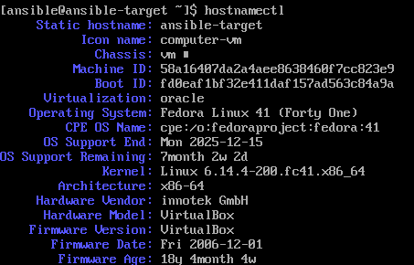

# Sprawozdanie 3
#### Tomasz Oszczypko

## Automatyzacja i zdalne wykonanie poleceń za pomocą Ansible

### Instalacja zarządcy Ansible

W pierwszym kroku utworzona została druga maszyna wirtualna oparta o Fedorę 41 Custom Installation - wersja ta dostarczana jest z minimalną ilością oprogramowania:


Na maszynie zweryfikowano, czy są zainstalowane paczki `tar` oraz `OpenSSH` przy użyciu poleceń:

```bash
tar
sudo systemctl status sshd
```


Maszynie nadano nazwę `ansible-target`, a użytkownikowi nazwę `ansible`, co jest widoczne w `hostnamectl` oraz w prompcie polecenia:



Na głównej maszynie zainstalowano oprogramowanie `ansible` przy użyciu poniższego polecenia:

```bash
sudo dnf install ansible
```

Następnie wymieniono klucze SSH między maszyną serwerową a maszyną `ansible-target` tak, aby możliwe było logowanie na użytkownika `ansible` poprzez SSH bez podawania hasła. Przed tym jednak konieczne było poznanie adresu IP maszyny `ansible-target`:


Adres tej maszyny to `172.17.54.109`. Na serwerze w pliku `etc/hosts` dodano alias maszyny tak, aby możliwe było korzystanie z nazwy hosta zamiast z adresu IP:


Teraz możliwe powinno być logowanie na użytkownika `ansible` - lecz na razie jeszcze poprzez wprowadzenie hasła:


Umożliwiono więc logowanie poprzez klucz SSH - w tym celu skopiowany został klucz utworzony jeszcze na pierwszych laboratoriach `no_password` nie wymagający podawania hasła przy autentykacji: 


Po tym przeprowadzono próbę logowania na użytkownika `ansible@ansible-target` bez użycia hasła:


### Inwentaryzacja

Na początku ustalone zostały przewidywalne nazwy maszyn - nowo powstała maszyna miała ją ustaloną na poprawną w trakcie instalacji. Serwer natomiast od początku zajęć nosił nazwę `localhost`, co zostało zmienione przy użyciu poniższego polecenia:

```bash
sudo hostnamectl set-hostname --static fedora-server
```

Serwer w pliku `/etc/hosts` miał już nazwę DNS nowo powstałej maszyny. Dodano jeszcze tylko w tym pliku nazwę loopbacku:
```bash
127.0.0.1   localhost localhost.localdomain localhost4 localhost4.localdomain4 fedora-server
```

Podobny zabieg przeprowadzono również na maszynie `ansible-target`. Łączność została zweryfikowana w poprzednim kroku.

Następnie został utworzony [plik inwentaryzacji](008-Class/inventory.ini). Ponieważ do połączenia z maszyną korzystam z klucza o nazwie innej niż domyślnie szukana przez agenta SSH, w pliku inwentaryzacji zaznaczam z jakiego klucza serwer ma korzystać przy próbie autentykacji przy użyciu `ansible_ssh_private_key_file`:


Do maszyn zostało wysłane żądanie `ping`:


Podczas realizacji tego polecenia zaobserwowałem ciekawy błąd związany z moim systemem. Ping potrafił trwać bardzo długo lub nie dochodzić w ogóle. Włączenie okienka z maszyną wirtualną `ansible-target` tak, aby była aktywne też niewiele dawało. Dopiero wprowadzenie jakiekolwiek sygnału wejściowego (wciśnięcia przycisku na klawiaturze tak, aby wprowadzić znak do terminala na tejże maszynie) sprawiało, że ping dochodził. Spowodowane to było prawdopodobnie głodzeniem procesu maszyny `ansible-target` przez scheduler. Problem ten planowałem rozwiązać poprzez przeniesienie obrazu maszyny wirtualnej na drugą stację roboczą, lecz zwykły restart systemu naprawił problem na czas realizacji zadań.

### Zdalne wywoływanie procedur

W tym kroku został utworzony [playbook](008-Class/playbook.yaml) Ansible odpowiedzialny za następujące zadania:
- wysłanie żądania `ping` do wszystkich maszyn
- kopiowanie pliku inwentaryzacji na maszyny/ę `Endpoints`
- zaktualizowanie pakietów w systemie
- restart usług `sshd` oraz `rngd`

W pierwszej kolejności należy zaznaczyć, iż na konfiguracji Custom Install nie była dostępna domyślnie usługa `rngd`, dlatego też została zainstalowana ręcznie przy użyciu poniższego polecenia:

```bash
sudo dnf install rng-tools
```

Treść playbooka dostępna jest [tutaj](008-Class/playbook.yaml) oraz poniżej:
```yaml
- name: Tasks
  hosts: Endpoints
  become: yes
  tasks:
    - name: Ping machines
      ansible.builtin.ping:

    - name: Copy inventory file
      ansible.builtin.copy:
        src: ./inventory.ini
        dest: ~/inventory.ini

    - name: Update packages
      ansible.builtin.dnf:
        name: '*'
        state: latest
        update_cache: yes

    - name: Restart sshd and rngd
      ansible.builtin.systemd:
        name: "{{ item }}"
        state: restarted
      loop:
        - sshd
        - rngd
```

Gotowy playbook został następnie uruchomiony, lecz pojawił się pierwszy problem - brak uprawnień użytkownika root (niezbędnych do wykonania niektórych kroków):


Problem ten został rozwiązany poprzez dodanie opcji `--ask-become-pass`, która prosi o podanie hasła użytkownika wykonującego polecenia na maszynie:


Jak widać na powyższym zrzucie, zadanie `Copy inventory.ini file` oraz `Update packages` zwróciło flagę `changed` zamiast `ok` - nie jest to nic złego, oznacza to, że na maszynie docelowej zostały wprowadzone zmiany i jest to oczekiwany efekt.

Następnie playbooka uruchomiono ponownie:


Teraz efekt działania jest inny - w przypadku kopiowania i aktualizacji zwracane są flagi `ok`, ponieważ nie zostały przeprowadzone żadne zmiany na systemie. Jest to teraz oczekiwany efekt, ponieważ plik już istnieje, a wszystkie paczki są aktualne. Warto zaznaczyć, że plik skopiował się do katalogu domowego, lecz użytkownika `root` - spowodowane jest to linijką `become: true` w playbooku, która zmienia użytkownika właśnie na `root`a.

Operacje zostały przeprowadzone jeszcze raz, tym razem z wyłączoną usługą sshd na maszynie docelowej:


Podobny efekt występuje w przypadku maszyny z odpiętą kartą sieciową - wyłączonym interfejsem sieciowym w ustawieniach maszyny wirtualnej. Jedyna różnica to powód failu - zamiast `Connection refused` występuje teraz `Connection timed out`.


### Zarządzanie stworzonym artefaktem

Ponieważ nie doczytałem polecenia i nie zrozumiałem zadania to wykonałem jego znaczną część źle. Myślałem, że moim zadaniem będzie instalacja efektu swojego pipeline'u na nowo powstałej maszynie, co wprowadzało nowe problemy które starałem się rozwiązać. Niemniej jednak pozostawiam omyłkowy fragment poniżej w ramach ciekawostki.

Mój pipeline oparty o autorski projekt [toasty](https://github.com/badzianga/toasty) tworzy paczkę `deb` (zawierającą bibliotekę statyczną oraz nagłówek), gdyż kontener budujący jest oparty o obraz `gcc`, który z kolei bazuje na Debianie. Na maszynie docelowej zainstalowany jest system Fedora. Z tego też powodu konieczne jest przygotowanie paczki `rpm`. Osiągnąć to można na dwa sposoby:
1. Przerobienie całego pipeline'u tak, aby budował paczkę `rpm` (Nie.)
2. Użycie narzędzia konwertującego paczki

Mniej czasochłonne jest drugie rozwiązanie. Narzędziem takim (dostępnym w repozytoriach Fedory) jest `alien`, dlatego też zostanie ono wykorzystane.

Najpierw została przeprowadzona instalacja:

```bash
sudo dnf install alien
```

Następnie wygenerowana została paczka przy użyciu poniższego polecenia:
```bash
sudo alien --to-rpm MDO2025_INO/ITE/GCL06/TO417248/Sprawozdanie2/007-Class/toasty_1.0.0_amd64.deb
```


Gotową paczkę zainstalowano na serwerze w celu weryfikacji, czy będzie ona w stanie działać po konwersji:

```bash
sudo rpm -i toasty-1.0.0-2.x86-64.rpm
```

Ponieważ zainstalowana została biblioteka, konieczne jest napisanie prostego programu w C/C++ linkującego ją:

```C
#include <toasty.h>

TEST(test_example) {
    TEST_ASSERT_EQUAL(4, 2 + 2);
}

int main() {
    return RunTests();
}
```

Plik z powyższym kodem został skompilowany wraz z linkowaniem biblioteki `toasty`, a następnie uruchomiony:


Bibliotekę tę następnie planowałem kopiować na maszyny Endpoints oraz instalować, jednakże ze względu na niedoczytanie pozostanę przy poprawnym rozwiązaniu - instalacji dockera oraz uruchomienia kontenera `gcc` na którym zainstalowana zostanie paczka `deb`. Playbook będzie przebiegał następująco:

1. Skopiuj plik .deb na maszynę
2. Zainstaluj Dockera
3. Pobierz obraz gcc
4. Uruchom kontener oparty o obraz gcc
5. Skopiuj paczkę .deb do kontenera
6. Zainstaluj paczkę w kontenerze
7. Utwórz plik test.c na maszynie
8. Skopiuj plik test.c do kontenera
9. Skompiluj plik test.c wewnątrz kontenera
10. Uruchom plik wewnątrz kontenera

Na podstawie takiego planu napisałem [playbook](008-Class/playbook-toasty.yaml) o następującej treści:

```yaml
- name: Toasty installation in Docker containers
  hosts: Endpoints
  become: yes

  vars:
    local_deb_path: /home/tomek/toasty_1.0.0_amd64.deb
    remote_deb_path: /tmp/toasty_1.0.0_amd64.deb
    container_deb_path: /toasty.deb
    container_name: gcc_toasty
    remote_test_source: /tmp/test.c
    container_test_source: /test.c

  tasks:
    - name: Copy .deb package
      ansible.builtin.copy:
        src: "{{ local_deb_path }}"
        dest: "{{ remote_deb_path }}"
        mode: '0777'

    - name: Install Docker and other packages
      ansible.builtin.dnf:
        name:
          - docker
          - python3-packaging
          - python3-requests
        state: present
        update_cache: yes

    - name: Start Docker services
      ansible.builtin.service:
        name: docker
        state: started
        enabled: yes

    - name: Download gcc Docker image
      ansible.builtin.docker_image:
        name: gcc:15.1
        source: pull
    
    - name: Create gcc container
      community.docker.docker_container:
        name: "{{ container_name }}"
        image: gcc:15.1
        state: started
        command: sleep infinity
    
    - name: Copy package to container
      ansible.builtin.command:
        cmd: "docker cp {{ remote_deb_path }} {{ container_name }}:{{ container_deb_path }}"
    
    - name: Install package in container
      community.docker.docker_container_exec:
        container: "{{ container_name }}"
        command: >
          bash -c "dpkg -i {{ container_deb_path }}"
    
    - name: Create test.c file on host
      ansible.builtin.copy:
        dest: "{{ remote_test_source }}"
        content: |
          #include <toasty.h>

          TEST(test_example) {
              TEST_ASSERT_EQUAL(4, 2 + 2);
          }

          int main() {
              return RunTests();
          }
    
    - name: Copy test.c to container
      ansible.builtin.command:
        cmd: "docker cp {{ remote_test_source }} {{ container_name }}:{{ container_test_source }}"

    - name: Compile test.c
      community.docker.docker_container_exec:
        container: "{{ container_name }}"
        command: gcc {{ container_test_source }} -ltoasty -o /test
    
    - name: Run test
      community.docker.docker_container_exec:
        container: "{{ container_name }}"
        command: ./test
```

Powyższe etapy zostały uruchomione (niejednokrotnie przez błędy napotykane po drodze, dlatego też miejscami jest już flaga `ok`):


Dla pewności zweryfikowano poprawność uruchomienia - w tym celu należało dostać się do kontenera i uruchomić plik:


Jak widać powstały plik istnieje, uruchamia się a test przechodzi, co oznacza, że instalacja paczki przebiegła poprawnie - możliwe jest pisanie programów w C i linkowanie biblioteki `toasty`.

Ostatnim zadaniem tego ćwiczenia było ubranie powyższych kroków w rolę. Na początku utworzyłem nową rolę `install_toasty`:


Powstał nowy katalog roli, w którym usunąłem nieużywane pliki i ścieżki. Następnie zmodyfikowałem następujące pliki:

- [defaults/main.yml](008-Class/install_toasty/defaults/main.yml) - umieściłem tam wszystkie używane zmienne:

```yaml
---
local_deb_path: /home/tomek/toasty_1.0.0_amd64.deb
remote_deb_path: /tmp/toasty_1.0.0_amd64.deb
container_deb_path: /toasty.deb
container_name: gcc_toasty
remote_test_source: /tmp/test.c
container_test_source: /test.c
```

- [tasks/main.yml](008-Class/install_toasty/tasks/main.yml) - umieściłem tam wszystkie zadania:

```yaml
---
- name: Copy .deb package
  ansible.builtin.copy:
    src: "{{ local_deb_path }}"
    dest: "{{ remote_deb_path }}"
    mode: '0777'

- name: Install Docker and other packages
  ansible.builtin.dnf:
    name:
      - docker
      - python3-packaging
      - python3-requests
    state: present
    update_cache: yes

- name: Start Docker services
  ansible.builtin.service:
    name: docker
    state: started
    enabled: yes

- name: Download gcc Docker image
  ansible.builtin.docker_image:
    name: gcc:15.1
    source: pull

- name: Create gcc container
  community.docker.docker_container:
    name: "{{ container_name }}"
    image: gcc:15.1
    state: started
    command: sleep infinity

- name: Copy package to container
  ansible.builtin.command:
    cmd: "docker cp {{ remote_deb_path }} {{ container_name }}:{{ container_deb_path }}"

- name: Install package in container
  community.docker.docker_container_exec:
    container: "{{ container_name }}"
    command: >
      bash -c "dpkg -i {{ container_deb_path }}"

- name: Create test.c file on host
  ansible.builtin.copy:
    dest: "{{ remote_test_source }}"
    content: |
      #include <toasty.h>

      TEST(test_example) {
          TEST_ASSERT_EQUAL(4, 2 + 2);
      }

      int main() {
          return RunTests();
      }

- name: Copy test.c to container
  ansible.builtin.command:
    cmd: "docker cp {{ remote_test_source }} {{ container_name }}:{{ container_test_source }}"

- name: Compile test.c
  community.docker.docker_container_exec:
    container: "{{ container_name }}"
    command: gcc {{ container_test_source }} -ltoasty -o /test

- name: Run test
  community.docker.docker_container_exec:
    container: "{{ container_name }}"
    command: ./test
```

Na samym końcu utworzyłem nowy [playbook](008-Class/install_toasty.yaml) o tej samej nazwie korzystający z roli:

```yaml
---
- name: Toasty installation in Docker containers
  hosts: Endpoints
  become: true

  roles:
    - role: install_toasty
```

Nowo powstały playbook uruchomiłem. Przed tym jednak usunąłem jeszcze kontener `gcc_toasty` na maszynie `ansible_target`:


Jak widać, playbook korzystający z roli przeszedł bez żadnych komplikacji, dlatego też można uznać to ćwiczenie za wykonane.

## Pliki odpowiedzi dla wdrożeń nienadzorowanych

TODO


## Wdrażanie na zarządzalne kontenery: Kubernetes (1)

### Instalacja klastra Kubernetes

TODO

### Analiza posiadanego kontenera

TODO

### Uruchamianie oprogramowania

TODO

### Przekucie wdrożenia manualnego w plik wdrożenia (wprowadzenie)

TODO


## Wdrażanie na zarządzalne kontenery: Kubernetes (2)

### Przygotowanie nowego obrazu

TODO

### Zmiany w deploymencie

TODO

### Kontrola wdrożenia

TODO

### Strategie wdrożenia

TODO
