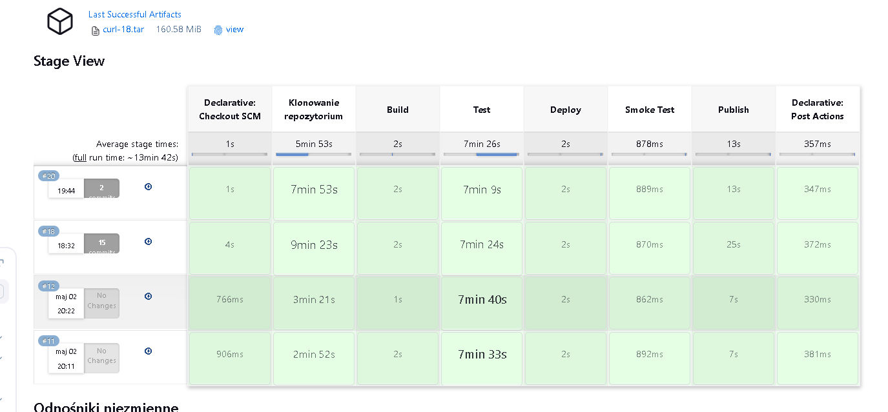
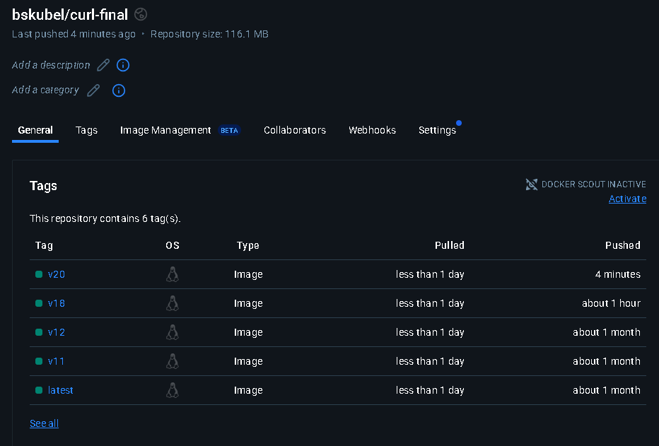

**Sprawozdanie 3**

Bartosz Skubel 416365
ITE Gr. 7

**Zajęcia 08 - Ansible**

Celem laboratorium było zapoznanie się z Ansible do automatycznego zarządzania konfiguracją i wdrażaniem. W trakcie zajęć skonfigurowano 2 maszyny, przygotowano pliki inwentaryzacyjne oraz wymieniono klucze SSH. Uruchomiono playbooki realizujące zadania administracyjne i wdrożeniowe.

**Instalacja zarządcy Ansible**

Utworzono nową maszynę wirtualną

Nową maszynę zgodnie z poleceniem nazwano ansible-target.


Tar i OpenSSH były już zainstalowane w fedora:41.


Następnie stworzono migawkę stanu maszyny.


Zainstalowano Ansible


Wymieniono klucze przy użyciu

```
ssh-keygen -f ~/.ssh/id_rsa_ansible
```


Uzyskano adres nowej maszyny


Zmodyfikowano plik *hosts* do którego dodano poprzedni adres wraz z jego nazwą

```
sudo nano /etc/hosts
```


Maszynie nadano nazwę *ansible-target*


Zapisano klucz SSH na maszynę *ansible-target*

```
ssh-copy-id -i ~/.ssh/id_rsa_ansible.pub ansible@ansible-target
```


Ponieważ nie używamy domyślnej nazwy należy zmienić plik *config*

```
Host ansible-target
    HostName ansible-target
    IdentityFile ~/.ssh/id_rsa_ansible
```


- Host ansible-target - informuje, że dla tego hosta używamy innych ustawień niż domyślnie
- HostName ansible-target - określa, że chodzi o nazwę lub IP ansible-target
- IdentityFile - określa klucz prywatny używany do logowania

Połączono się po ssh z maszyną


**Inwentaryzacja**

Zmieniono nazwę komputera

```
sudo hostnamectl set-hostname fedora-main
exec bash
```


Nazwy DNS

Dla maszyny głównej

Otwieramy plik *id_rsa_ansible.pub* a następnie dopisujemy jego zawartość do *authorized_keys*, dzięki czemu *fedora_main* zaufa temu kluczowi. Druga komenda daje prowo do odczytu i zapisu

```
cat ~/.ssh/id_rsa_ansible.pub >> ~/.ssh/authorized_keys
chmod 600 ~/.ssh/authorized_keys
```


Dla maszyny *ansible-target*

Uzyskano adres IP *fedora-main* i dodanogo do */etc/hosts*

```
sudo nano /etc/hosts
```


Weryfikacja łączności

```
ssh ansible@ansible-target
```


Utworzenie pliku inwentaryzacji

W pliku dodano dwie grupy Orchestrators, która odpowiada za *fedora-main* i Endpoints, w której jest *ansible-target*

```
[Orchestrators]
fedora-main ansible_user=devops ansible_ssh_private_key_file=~/.ssh/id_rsa_ansible

[Endpoints]
ansible-target ansible_user=ansible ansible_ssh_private_key_file=~/.ssh/id_rsa_ansible
```


Wysyłanie żądania *ping*

```
ansible all -i inventory.ini -m ping
```

- all - wszystkie hosty z inwentarza
- -i - plik inwentarza
- -m ping - określenie modułu pingu


**Zdalne wywołanie procedur**

Plik playbook.yaml


```
- name: Playbook
  hosts: all
  gather_facts: yes
  tasks:
    - name: Ping
      ansible.builtin.ping:

- name: Copy to Endpoints
  hosts: Endpoints
  gather_facts: yes
  tasks:
    - name: Copy inventory file
      ansible.builtin.copy:
        src: ./inventory.ini
        dest: /tmp/inventory.ini
```

- name - nazwa operacji
- hosts - host, który wykonuje operację
- gather_facts - pobieranie informacji o systemie
- task - określa zadania do wykonania

Uruchomienie playbooka

```
ansible-playbook -i inventory.ini playbook.yml
```

Komenda skopiowała, więc zmieniła, plik inwentarza na *ansible-target*, co pokazuje status *changed=1*


Ponowne uruchomienie pokazuje brak zmian, czyli *changed=0*


Pakiety i restart usług

Zainstalowano *rngd*

```
sudo dnf install rngd
```


Do playbooka dodano część odpowiedzialną za aktualizacje i restart usług


```
- name: Playbook
  hosts: all
  gather_facts: yes
  tasks:
    - name: Ping
      ansible.builtin.ping:

- name: Copy to Endpoints
  hosts: Endpoints
  gather_facts: yes
  tasks:
    - name: Copy inventory file
      ansible.builtin.copy:
        src: ./inventory.ini
        dest: /tmp/inventory.ini

# Dodane w późniejszym etapie

- name: Update and restart services on Endpoints
  hosts: Endpoints
  become: true
  tasks:
    - name: Update system packages
      ansible.builtin.package:
        name: "*"
        state: latest

    - name: Restart sshd
      ansible.builtin.service:
        name: sshd
        state: restarted

    - name: Restart rngd
      ansible.builtin.service:
        name: rngd
        state: restarted
```

- *become: true* - podnosi uprawnienia do poziomu *root*, aby poprawnie zaktualizować pakiety

Opcja *--ask-become-pass* sprawia, że jesteśmy pytani o hasło roota do poprawnego uruchomienia playbooka

```
ansible-playbook -i inventory.ini playbook.yml --ask-become-pass
```


Operacje z wyłączonym SSH

```
sudo systemctl stop sshd
```

Wyłączono SSH na *ansible-target*


Wykonano ponownie poprzednią komendę

```
ansible-playbook -i inventory.ini playbook.yml --ask-become-pass
```


Włączono ponownie SSH


**Zarządzanie stworzonym artefaktem**

Stworzenie szkieletu roli

```
ansible-galaxy init devops

```


Komenda tworzy szkielet roli *devops*, która tworzy następującą strukturę katalogów


Dodanie zadań

Modyfikujemy plik *task/main.yml* w następujący sposób:

```
- name: Ensure Docker is installed
  package:
    name:
      - docker
    state: present

- name: Ensure Docker service is running
  service:
    name: docker
    state: started
    enabled: true

- name: Pull published Docker image from Docker Hub
  community.docker.docker_image:
    name: bskubel/curl-final
    tag: latest
    source: pull

- name: Run curl-final container
  community.docker.docker_container:
    name: curl-final
    image: bskubel/curl-final:latest
    state: started
    restart_policy: unless-stopped
    command: tail -f /dev/null

- name: Wait for container to initialize
  pause:
    seconds: 5

- name: Test connectivity from container
  command: docker exec curl-final curl -s --fail http://www.metal.agh.edu.pl
  register: curl_test
  ignore_errors: yes

- name: Show result of connectivity test
  debug:
    msg: "Result: {{ curl_test.stdout if curl_test.rc == 0 else 'Connection failed!' }}"

- name: Stop the container
  community.docker.docker_container:
    name: curl-final
    state: stopped

- name: Remove the container
  community.docker.docker_container:
    name: curl-final
    state: absent
```

Utowrzenie playbook_deploy.yml


```
---
- name: Deploy cURL artifact to Endpoints
  hosts: Endpoints
  become: yes
  roles:
    - devops
```

Playbook uruchamiamy poniższą komendą:


```
ansible-playbook -i inventory.ini playbook_deploy.yml --ask-become-pass
```


Playbook uruchomił się poprawnie


**Zajęcia 09 - Pliki odpowiedzi dla wdrożeń nienadzorowanych**

Celem laboratiorium było zapoznanie się z automatyzacją instalacją systemu operacyjmego używając Kickstart. Przygotowano plik odpowidzi umożliwiający instalację systemu i konfigurację użytkowników oraz automatycznym wdrożeniem i uruchomieniem kontenera.

**Zadania do wykonania**

Pobrano plik odpowidzi

```
sudo cat /root/anaconda-ks.cfg
```

Skopiowano Kickstart z głównej maszyny z fedorą


Nadanie uprawnień

Nadano pełne uprawnienia do odczytu, zapisu i wykonywania

```
sudo chmod +777 anaconda-ks.cfg
```


Edycja pliku odpowiedzi

Z pliku usunięto użytkownika, dodano repozytoria, ustawiono hostname oraz założono pusty dysk


```
# Generated by Anaconda 41.35
# Generated by pykickstart v3.58
#version=DEVEL

# Keyboard layouts
keyboard --vckeymap=pl --xlayouts='pl'
# System language
lang pl_PL.UTF-8

# Network information
network  --bootproto=dhcp --device=eth0 --ipv6=auto --activate --hostname=host-p-odpowiedzi

url --mirrorlist=http://mirrors.fedoraproject.org/mirrorlist?repo=fedora-41&arch=x86_64
repo --name=updates --mirrorlist=http://mirrors.fedoraproject.org/mirrorlist?repo=updates-released-f41&arch=x86_64

%packages
@^custom-environment

%end

# Run the Setup Agent on first boot
firstboot --enable

# Generated using Blivet version 3.11.0
ignoredisk --only-use=sda
autopart
# Partition clearing information
clearpart --all --initlabel

# System timezone
timezone Europe/Warsaw --utc

# Root password
rootpw --iscrypted $y$j9T$a246fi5kT/yRXtgXckttNu36$0N4D6CHberfYfkxFU1jCufUWbFkmrsxCAPH..l7Y.R4
```

Zainstalowano system z pliku kickstart


Po włączeniu maszyny wirtualnej wyświetliło się:


Na ekranie GRUB naciśnięto klawisz *e* w celu przejścia w tryb edycji rozruchu


Zmieniono wpis na:


Uruchomiono system poprawnie


**Sekcja %post**

Zmodyfikowano plik *kickstart* tak, aby włączył Dockera, pobrał nasz obraz z poprzednich zajęć i uruchomił kontener z *curl*. Na koniec użyto *reboot*, aby uruchomić ponownie system

```
#version=DEVEL

lang pl_PL.UTF-8
keyboard --vckeymap=pl --xlayouts='pl'
network  --bootproto=dhcp --device=eth0 --ipv6=auto --activate --hostname=curl-final-host

url --mirrorlist=http://mirrors.fedoraproject.org/mirrorlist?repo=fedora-41&arch=x86_64
repo --name=updates --mirrorlist=http://mirrors.fedoraproject.org/mirrorlist?repo=updates-released-f41&arch=x86_64
repo --name=docker-ce-stable --baseurl=https://download.docker.com/linux/fedora/41/x86_64/stable

ignoredisk --only-use=sda
autopart
clearpart --all --initlabel

timezone Europe/Warsaw --utc
firstboot --enable

%packages
@core
docker-ce
docker-ce-cli
containerd.io
wget
%end

%post --log=/root/kickstart-post.log

VERSION=latest
IMAGE=bskubel/curl-final:${VERSION}

systemctl enable docker
systemctl start docker

docker pull ${IMAGE}

docker run --rm ${IMAGE} curl --version || echo "Test curl --version nie powiódł się"

cat > /etc/systemd/system/curl-final.service <<EOF
[Unit]
Description=Curl Final Container
Requires=docker.service network-online.target
After=docker.service network-online.target

[Service]
Restart=always
ExecStartPre=-/usr/bin/docker rm -f curl-final
ExecStart=/usr/bin/docker run --name curl-final ${IMAGE} tail -f /dev/null
ExecStop=/usr/bin/docker stop curl-final

[Install]
WantedBy=multi-user.target
EOF

systemctl enable curl-final.service

%end

reboot

rootpw --iscrypted $y$j9T$a246fi5kT/yRXtgXckttNu36$0N4D6CHberfYfkxFU1jCufUWbFkmrsxCAPH..l7Y.R4
```


Curl w kontenerze działa poprawnie

**Zajęcia 10 - Kubernetes**

Celem laboratorium było zapoznanie się ze Kubernetesem i Minikubem. Podczas laboratorium przygotowano plik wdrożeniowy, uruchomiono aplikacje w kontenerach oraz przeprowadzono komunikację z wdrożoną aplikacją

**Instalacja Kubernetesa**

Ze strony internetowej z polecenia użyliśmy odpowiedniej dla naszego systemu komendy

```
curl -LO https://storage.googleapis.com/minikube/releases/latest/minikube-latest.x86_64.rpm
sudo rpm -Uvh minikube-latest.x86_64.rpm
```


Uruchomienie Kubernetesa

```
minikube start
```

Uruchamiamy Kubernetesa


Uzyskujemy status Kubernetesa


Następnie uruchamiamy Dashboard

```
minikube dashboard
```


Komenda uruchamia przesyłanie portu


Uruchamamiy Dashboard w przeglądarce


Zapoznajemy się z funkcjonalnościami Kubernatesa


**Analiza posiadanego kontenera**

Używamy kontener z obrazem z naszego Pipelinu z poprzednich zajęć


**Uruchomienie oprogramowania**

Uruchamiamy pod z curlem o nazwie *curl-pod*


Sprawdzamy działanie poda


Uruchamiamy naszą aplikację przy użyciu Kubernatesa


**Plik wdrożenia**

```
apiVersion: apps/v1
kind: Deployment
metadata:
  name: curl-deployment
  labels:
    app: curl
spec:
  replicas: 1
  selector:
    matchLabels:
      app: curl
  template:
    metadata:
      labels:
        app: curl
    spec:
      containers:
      - name: curl-container
        image: bskubel/curl-final:latest
        command: ["sleep", "infinity"]
```

Plik yaml definiuje deployment w Kubernatesie

Uruchomienie deploymentu

```
kubecl apply -f curl-deployment.yaml
```


Działanie *curl*

```
kubectl exec -it curl-deployment-788dc68c9b-nr7xc -- curl http://www.metal.agh.edu.pl
```


**Zajęcia 11 - Kubernetes 2**

Celem laboratorium było zapoznanie się z bardziej zaawansowaną wersją wdrażania aplikacji przy użyciu Kubernatesa.

**Przygotowanie nowego obrazu**

Pierwszym obrazem będzie obraz robiony na poprzednich zajęciach, czyli *curl* w wersji *v12*

Drugi obraz oznaczony jako *v18*

W części deploy umieszczono tworzenie Smoke Testu.


Trzeci, niedziałający obraz

W trzeciej wersji obrazu zmieniono *Dockerfile.deploy*, aby program zwracał błąd

```
FROM fedora:41
COPY --from=curl-build /usr/local/bin/curl /usr/local/bin/curl
COPY --from=curl-build /usr/local/lib /usr/local/lib
ENV LD_LIBRARY_PATH=/usr/local/lib
CMD ["/bin/false"]
```

Jenkins:



Dockerhub:



Zmiany w deploymencie

Poniżej będzie wielokrotnie Wdrażany plik `curl-deployment.yaml` w różnych wersjach. Dla każdego będzie wykonywana komenda:

```
kubectl apply -f curl-deployment.yaml
```


Zwiększenie replik do 8

Zmieniono parametr *replicas* na 8


Zmniejszenie replik do 1


Zmniejszenie replik do 0


Zwiększenie replik do 4


Nowe wersje obrazu

Zmieniono *image* w *curl-deployment.yaml* z wersji *v12* na zmodyfikowaną wersję *v18*. Kubernetes tworzy najpierw nowe pody z nową wersją, a dopiero później usuwa stare, żeby zapewnić ciągłą działalność aplikacji.

Oryginalny deployment:


Zmodyfikowany deployment:


Utworzenie nowych podów:


Usunięcie starych podów:


Ponowne zastosowanie starszej wersji obrazu

Tak jak poprzednio modyfikujemy parametr *image*, ale tym razem na wersję *v12*


Tak jak dla wcześniejszego przypadku pody zostają najpierw tworzone, a dopiero potem stare są usuwane

Wadliwy obraz

Dokonano zmiany wersji na *v20*, które powinno się nie zakończyć, ze względu na wspomnianą wyżej modyfikację *Dockerfile.deploy*


Niestety wersja *v20* zakończyła się poprawnie, więc zostały zmienione następujące rzeczy

W Jenkinsfile zmodyfikowano część *Deploy*, aby nie wywoływała błędów podczas części wywoływania Jenkinsa, ale tylko przy Kubernetesie


Po wyżej wymienionych zmianach wadliwa wersja poprawnie powoduje błąd w Kubernetesie

Przywrócenie poprzedniej wersji


```
kubectl rollout history deployment/curl-deployment
```

```
kubectl rollout undo deployment/curl-deployment
```

Używając pierwszej komendy wyświetlamy historię rewizji

Drugie polecenie przywróci deployment do poprzedniej wersji

Skrypt weryfikujący wdrożenie

Storzono skrypt, który sprawdza, czy wdrożenie zakończyło się sukcesem

```
#!/bin/bash

DEPLOY_NAME="curl-deployment"
NAMESPACE="default"
TIMEOUT=60
INTERVAL=5
ELAPSED=0

echo "Czekam na wdrożenie: $DEPLOY_NAME"

while [ $ELAPSED -lt $TIMEOUT ]; do
    if kubectl rollout status deployment/$DEPLOY_NAME --namespace $NAMESPACE --timeout=5s; then
        echo "Wdrożenie zakończyło się sukcesem w ${ELAPSED}s"
        exit 0
    fi
    sleep $INTERVAL
    ELAPSED=$((ELAPSED + INTERVAL))
done

echo "Wdrożenie NIE zakończyło się sukcesem w $TIMEOUT sekund"
exit 1
```


**Strategie wdrożenia**

Recreate

Ta stratego najpierw usuwa, a dopiero potem uruchamia nowe


Rolling Update

Domyślna strategia, którą można było zauważyć poprzednio. 
Najpierw tworzone są nowe pody, a dopiero potem usuwane są stare.

Parametry ustawiane w tej strategii:
 - maxUnavailable - ile może być niedostępnych podów podczas aktualizacji
 - maxSurge - określa ilość dodatkowych podów, które mogą być utworzone na potrzeby aktualizacji


Canary Deployment

Polega na stopniowym uruchamianiu nowej wersji aplikacji w ograniczonej liczbie replik obok poprzedniej wersji

Przykład użycia wersji Canary. Błędy są z poprzedniej, błędnej wersji, która była omawiana wcześniej, którą poprawiłem dopiero chwilę przed przejściem do Canary Development


**Historia terminala**

Historia została zapisana do *history.txt*