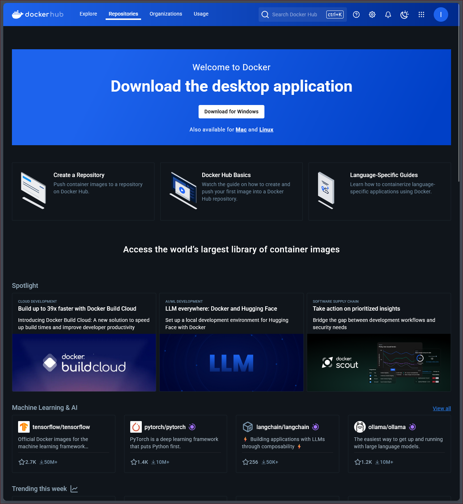
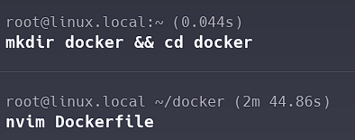
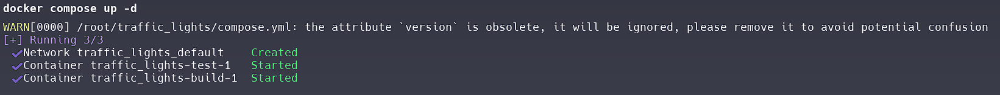
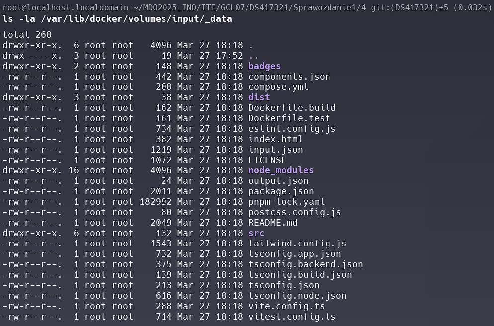
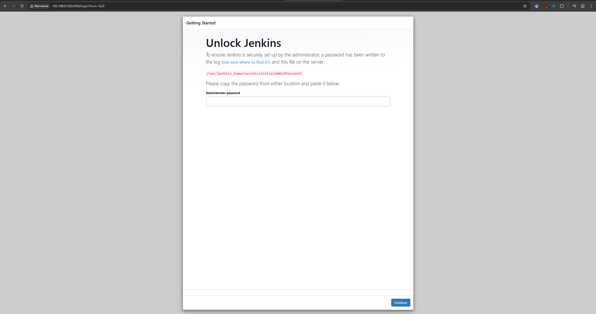

# CWL1

## 1. Generowanie kluczy ssh przy wykorzystaniu systemu ed25519, klucz `first` posiada passphrase


## 2. Dodanie kluczy do konta przy użyciu Github CLI


### Potwierdzenie dodania kluczy


### Dodanie kluczy do agenta SSH


## 3. Sklonowanie repozytorium przy użyciu SSH


## 4. Dodanie git hooka sprawdzającego prefix commita


### Treść skryptu

[commit-msg](./1/commit-msg)


### Nadanie uprawnień


### Test


## 5. Stworzenie sprawozdania


# CWL2

## 1. Instalacja dockera wg dokumentacji


### Test działania


## 2. Logowanie do dockerhub



## 3. Pobranie obrazów

### hello-world


### busybox


### ubuntu


### mysql


## 4. Uruchomienie kontenera `busybox`

### Połączenie w trybie interaktywnym, wywołanie numeru wersji


## 5. Uruchomienie kontenera `ubuntu`

### Prezentacja pid i aktualizacja pakietów


## 6. Stwórz własnoręcznego Dockerfile z naszym repo.




[Dockerfile](./2/Dockerfile)

```Dockerfile
FROM ubuntu:latest

RUN apt update && apt install -y git

WORKDIR /app

RUN git clone https://github.com/InzynieriaOprogramowaniaAGH/MDO2025_INO .

CMD ["/bin/bash"]
```

### Budowanie obrazu


### Uruchomienie kontenera ze zbudowanego obrazu


## 7. Prezentacja i wyczyszczenie kontenterów


## 8. Wyczyszczenie obrazów


## CWL3

### Wybór oprogramowania na zajęcia

Do zajęć wykorzystuje autorskie repozytorium [https://github.com/CALLmeDOMIN/traffic_lights](https://github.com/CALLmeDOMIN/traffic_lights)

## Klonowanie, instalacja dependencji, wykonanie skryptu build i test


## 1. Przeprowadzenie tych samych kroków w kontenerze


## 2. Pliki Dockerfile automatyzujące procesy

-   Dockerfile do budowania -
    [Dockerfile.build](./3/Dockerfile.build)
-   Dockerfile do przeprowadzenia testów jednostkowych -
    [Dockerfile.test](./3/Dockerfile.test)

## Budowanie obrazów


## Uruchomienie kontenerów


## Stworzenie docker compose, który automatyzuje proces tworzenia kontenerów

Plik [compose.yml](./3/compose.yml)



# CWL4

## 1. Stworzenie woluminów


## 2. Klonowanie repozytorium na wolumin wejściowy (input) przy użyciu dodatkowego kontenera (gitmp)

Przygotowanie [Dockerfile.git](./4/Dockerfile.git) do automatyzacji procesu budowania

### Budowanie


### Uruchomienie kontenera


### Sprawdzenie czy dane zostały dodane do woluminu



## 3. Kontener podstawowy z buildem (builder)

Przygotowanie [Dockerfile](./4/Dockerfile) do autoatyzacji procesu budowania i kopiowania wyniku do woluminu output

### Budowanie obrazu


### Uruchomienie kontenera


### Sprawdzenie czy dane zostały poprawnie przeniesione do woluminu


## 4. Eksponowanie portu

Stworzenie [Dockerfile.iperf](./4/Dockerfile.iperf) do automatyzacji procesu budowania obrazu

### Budowanie obrazu servera


### Uruchomienie kontenera i sprawdzenie działania


### Podłączenie kontenerem klienckim przy użyciu tego samego obrazu

Aby odszukać ip kontenera możemy wykorzystać komende `docker inspect` - IP znajduje się w polu `NetworkSettings`


### Stworzenie sieci mostkowej


### Uruchomienie kontenerów przy użyciu sieci


### Połączenie do kontenera z kontenera klienckiego


### Połączenie do kontenera z hosta


### Połączenie do kontenera spoza hosta

Połączenie z maszyny Windows (WSL2)


### Logi serwera

Przepusotowość jest prezentowana w logach serwera


## 5. Instalacja Jenkins na podstawie dokumentacji

### Utworzenie sieci


### Uruchomienie kontenera DIND


### Użycie Dockerfile z dokumentacji

Zapisanie Dockerfile z dokumentacji jako [Dockfile.jenkins](./4/Dockerfile.jenkins)

### Zbudowanie obrazu kontenera jenkins


### Uruchomienie kontenera jenkins


### Odpalenie localhost w przeglądarce

Odpalenie jenkins w przeglądarce, odblokowanie kodem z konsoli i utworzenie konta admina



