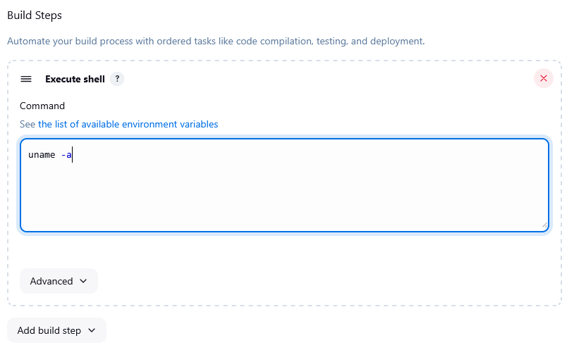
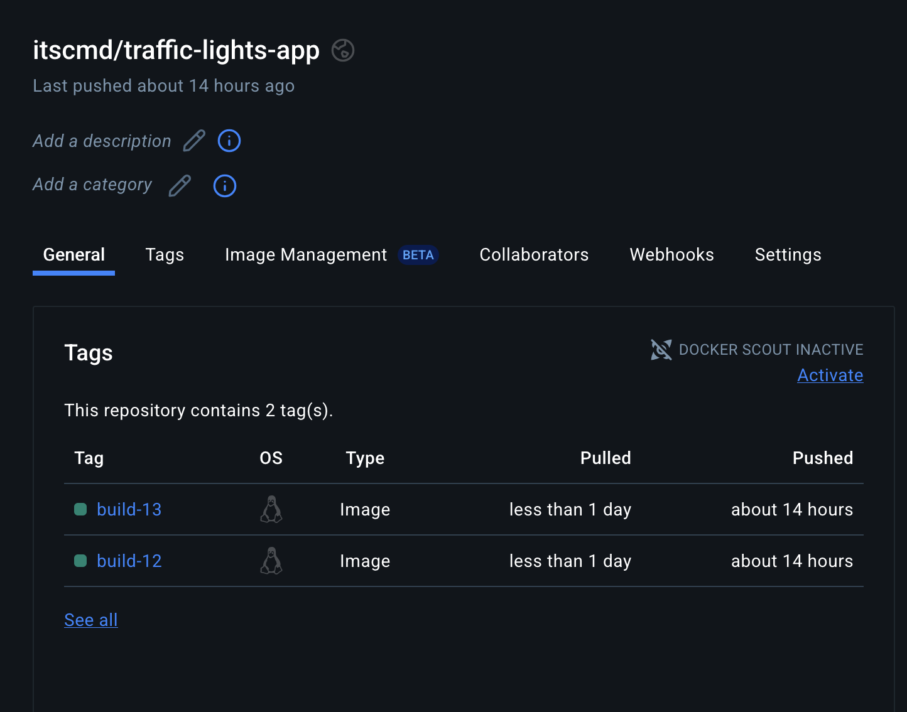
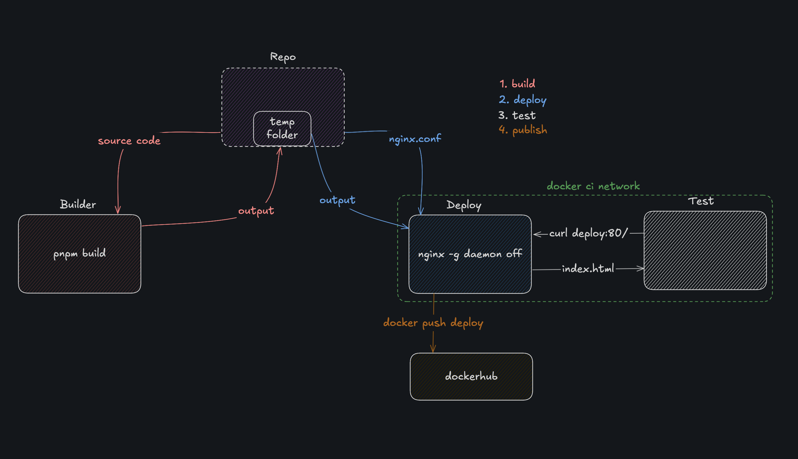

# CWL5

## 1. Utwórzenie instancji Jenkinsa

Zrobione w poprzednim sprawozdaniu - [link](../Sprawozdanie1/README.md#5-instalacja-jenkins-na-podstawie-dokumentacji)

## 2. Uruchomienie

## 2a. Projekt który wyświetla uname

### Utworzenie projektu

### Dodanie kroku budowania - execute shell

### Uruchomienie i logi

### 2b. Projekt który zwraca błąd, gdy godzina jest nieparzysta

### Utworzenie projektu

### Dodanie kroku budowania - execute shell

### Uruchomienie i logi

## 2c. Projekt który pobiera w projekcie obraz kontenera ubuntu

### Dodanie kroku budowania - execute shell

## 3. Obiekt typu pipeline

### Utworzenie obiektu typu pipeline i wpisanie kodu Jenkinsfile

Kod użyty w pipeline znajduje się [tutaj](./1/Jenkinsfile)

Poszczególne kroki pipeline'a wynokunją:
 - Checkout - clone repozytorium jedynie z moim branchem
 - Builder - zbudowanie obrazu buildera
 - Tester - zbudowanie obrazu testera

### Uruchomienie pipeline'a i logi

# CWL6/7

## 1. Budowa kontenerów do pipeline'a lokalnie

### Kontener 'builder'

Dockerfile można znaleźć [tutaj](./2/Dockerfile.build), aczkolwiek musi być uruchomiony w repozytorium

### Kontener 'deploy'

Dockerfile można znaleźć [tutaj](./2/Dockerfile.deploy), aczkolwiek też musi być uruchomiony w repozytorium. Dodatkowo korzystamy z prostej customowej konfiguracji [nginx.conf](./2/nginx.conf)

## 2. Test runetime'u aplikacji

### Utworzenie sieci testowej

### Uruchomienie kontenera nginx

### Curl do strony głównej

## 3. Push obrazu na dockerhub

## 4. Reprodukcja kroków w Jenkinsfile

Kopię Jenkinsfile można podejrzeć [tutaj](./2/Jenkinsfile) ale też na [docelowym repozytorium](https://github.com/CALLmeDOMIN/traffic_lights/blob/main/Jenkinsfile)

### Dodanie danych uwierzytelniających

### Uruchomienie pipeline'a i potwierdzenie że działa przy ponownym uruchomieniu (zastosowano unikalne nazwy obrazów i kontenerów oraz funkcję cleanWs())

### Widok na dockerhub'ie

### Poglądowy diagram pipeline'u

