# CWL8

## 1. Instalacja zarządcy Ansible

### Zapewnienie dostępności programów `tar` oraz `sshd`

### Ustawienie hostname na ansible-target

### Dodanie użytkownika anisble

### Instalacja ansible z repozytorium dystrybucji na głównej maszynie

### Wymiana kluczy pomiędzy główną maszyną a użytkownikiem `ansible` na maszynie `target`

### Logowanie bez hasła

## 2. Inwentaryzacja

### Wprowadzenie nazwy DNS dla obu maszyn i test przy użyciu `ping`

### Stworzenie pliku inwentaryzacji

## 3. Zdalne wywoływanie procedur

### Przygotowanie [ansible playbook](./1/remote-tasks.yml) <!-- TODO ADD FILE TO REPO

### Wyłączenie `sshd`

### Przeprowadzenie zdalnego wywołania procedur

### Przygotowanie [ansible playbook](./1/deploy.yml) do uruchomienia kontenera aplikacji <!-- TODO ADD FILE TO REPO

### Przeprowadzenie uruchomienia aplikacji poprzez ansible

# CWL9

## 1. Instalacja zarządcy Ansible

# CWL10

## 1. Instalacja zarządcy Ansible

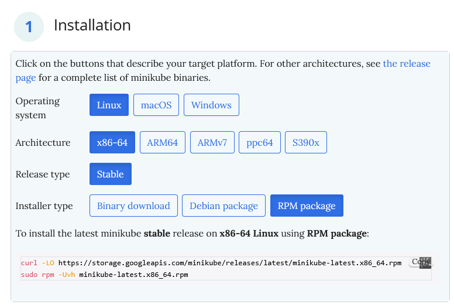
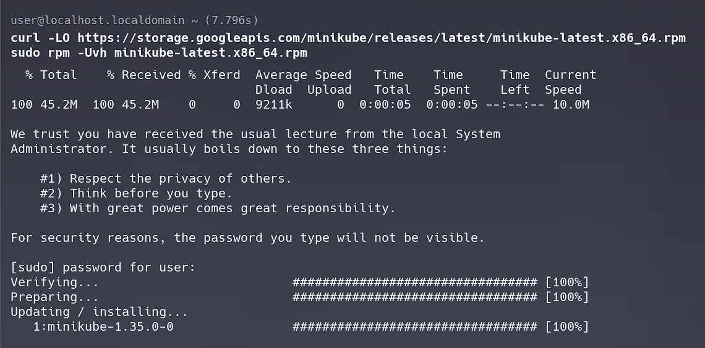
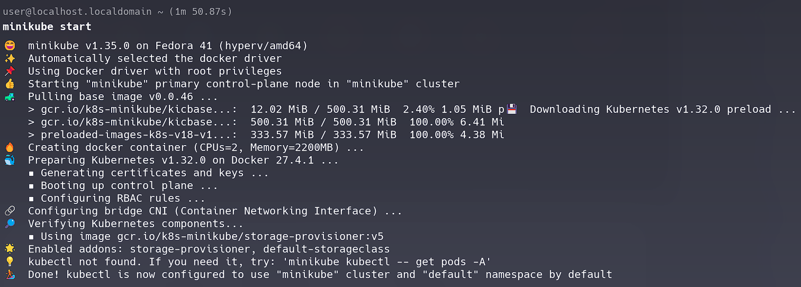
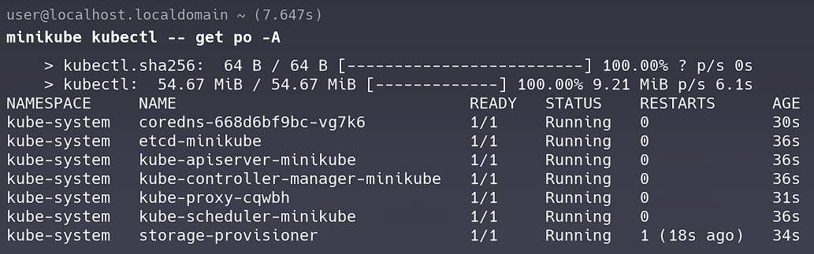
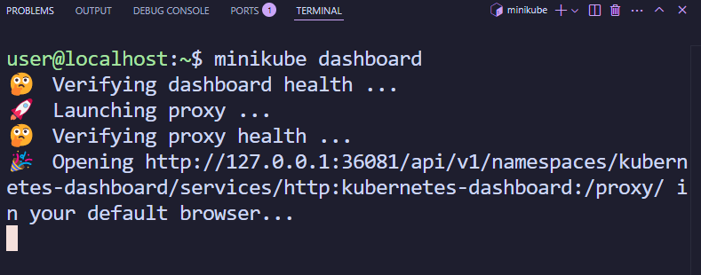
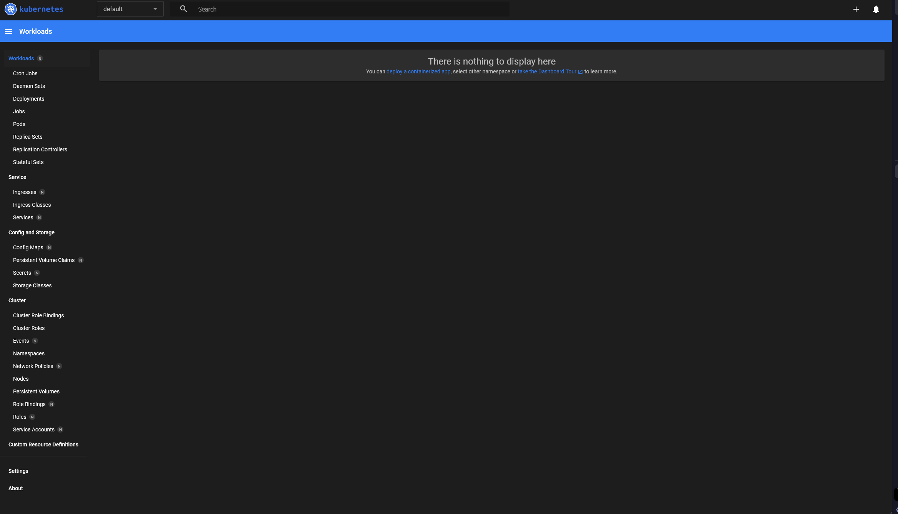
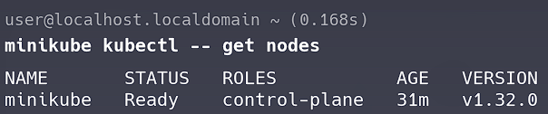
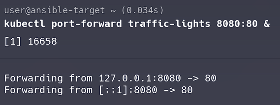
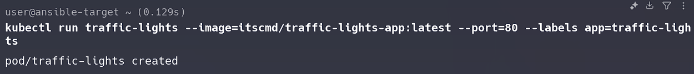
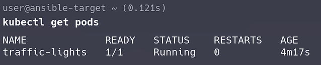
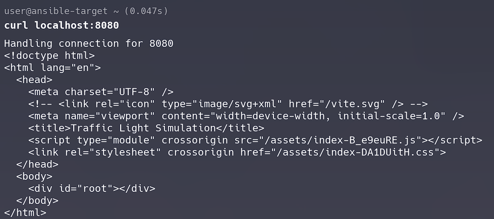
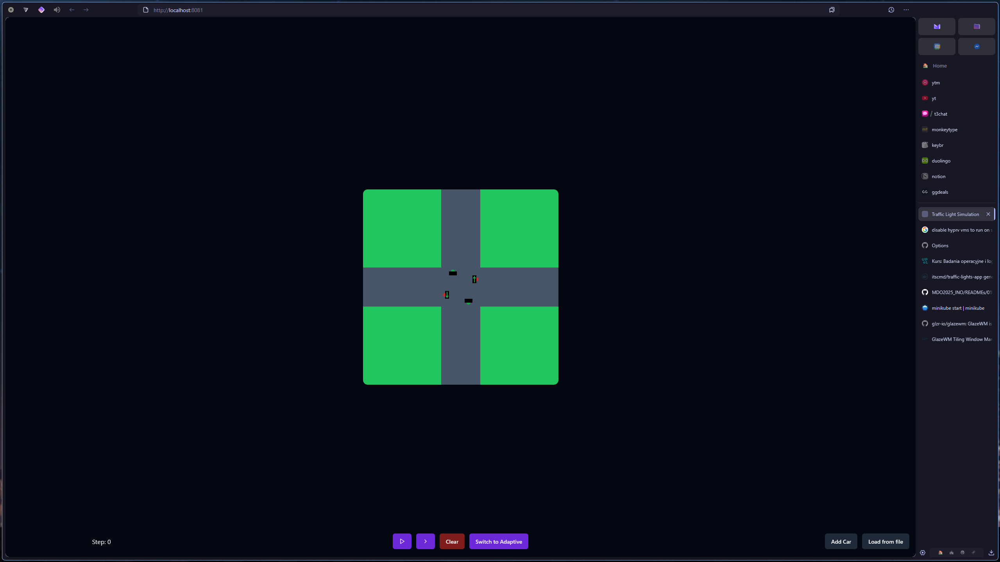
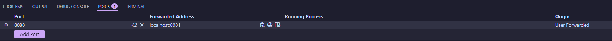
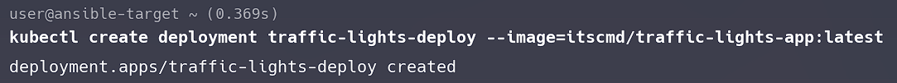
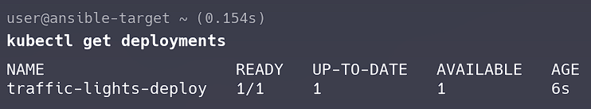
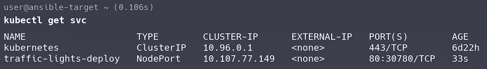

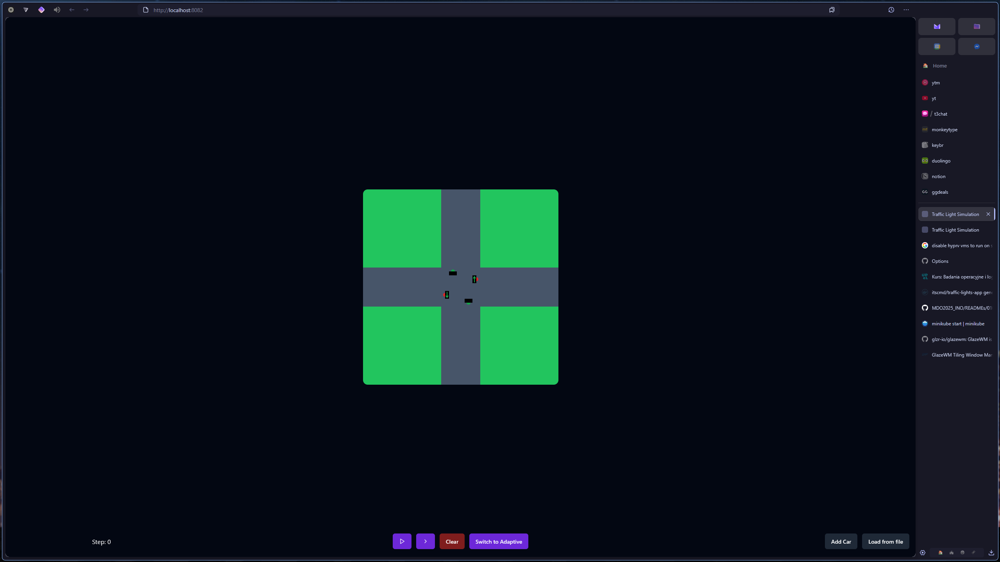
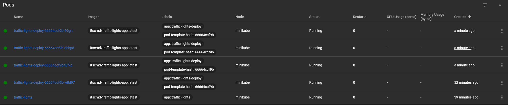
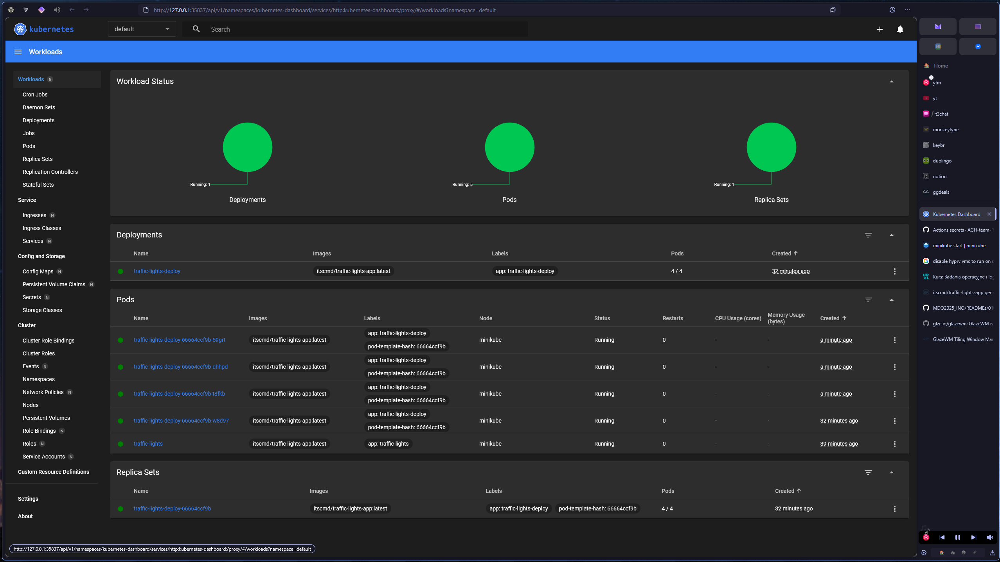
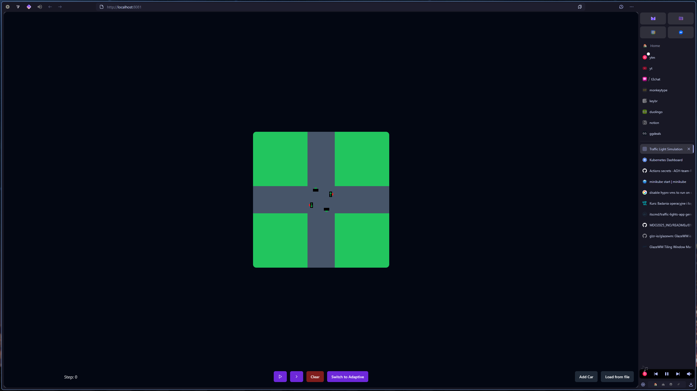
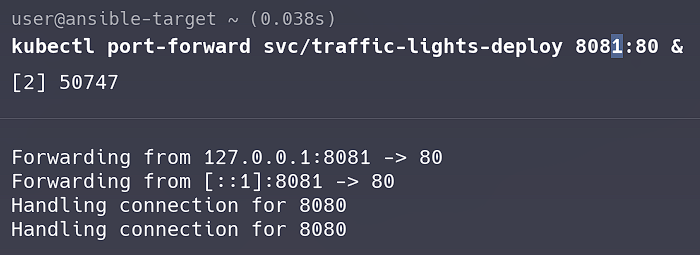

# CWL11

## 1. Instalacja zarządcy Ansible

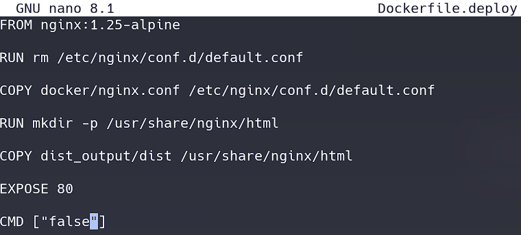
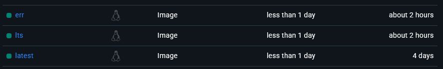
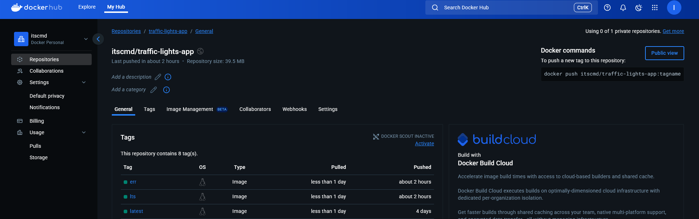
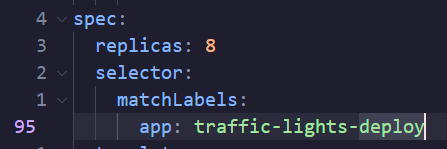
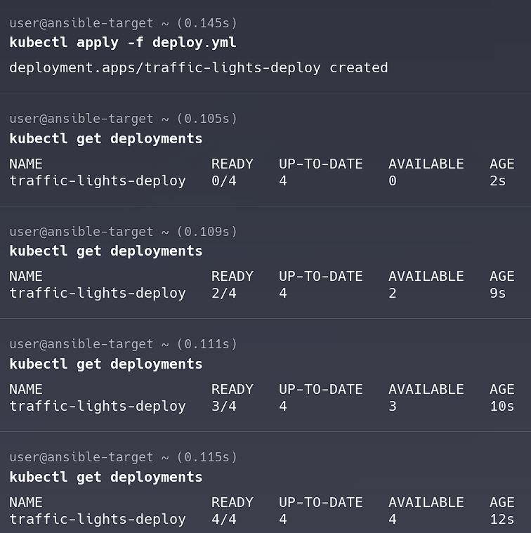

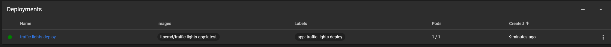
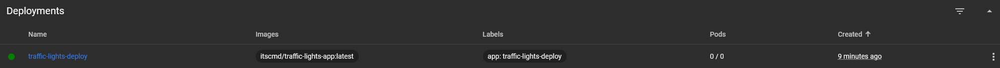
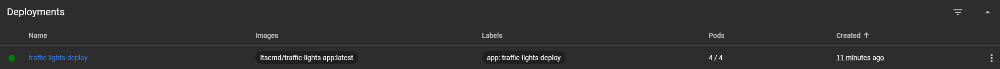
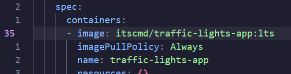
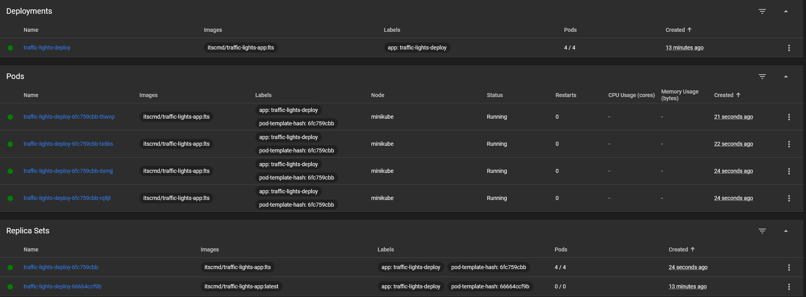
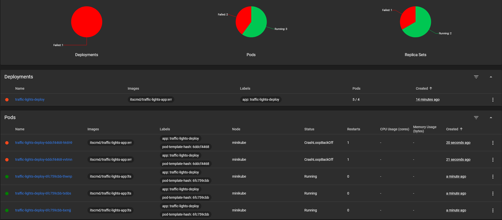
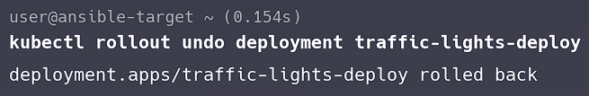
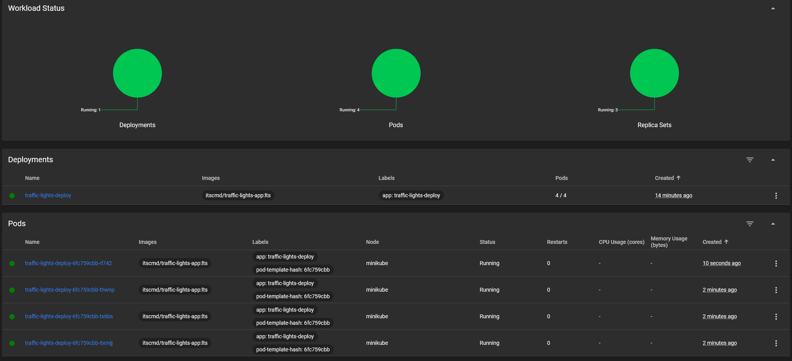
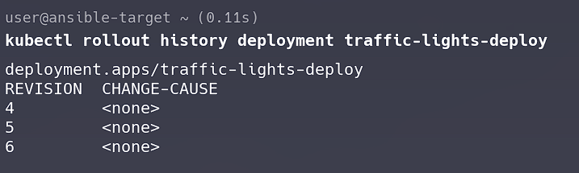
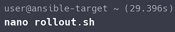

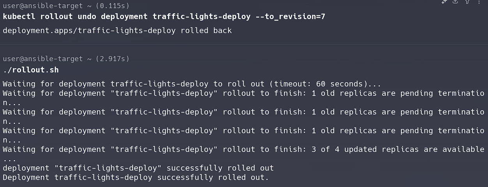
