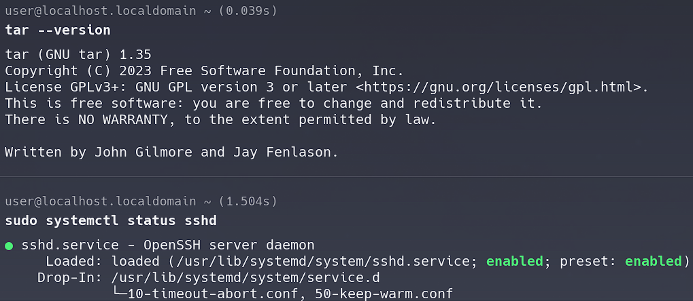
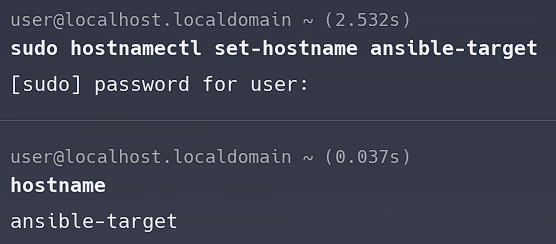
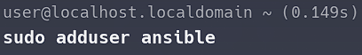
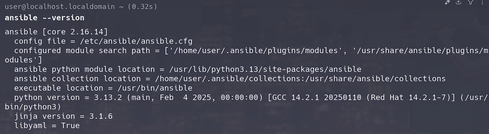
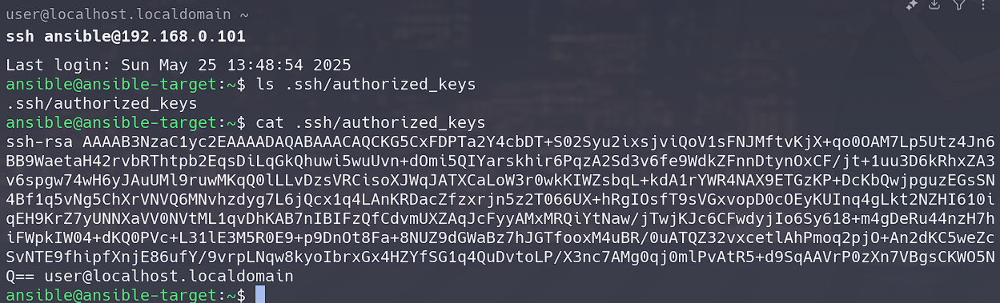
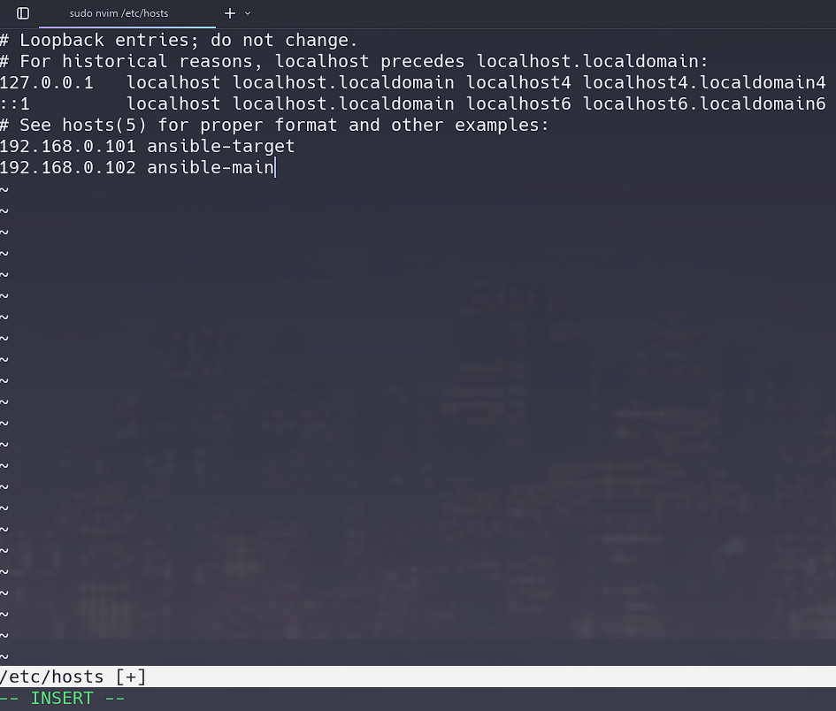
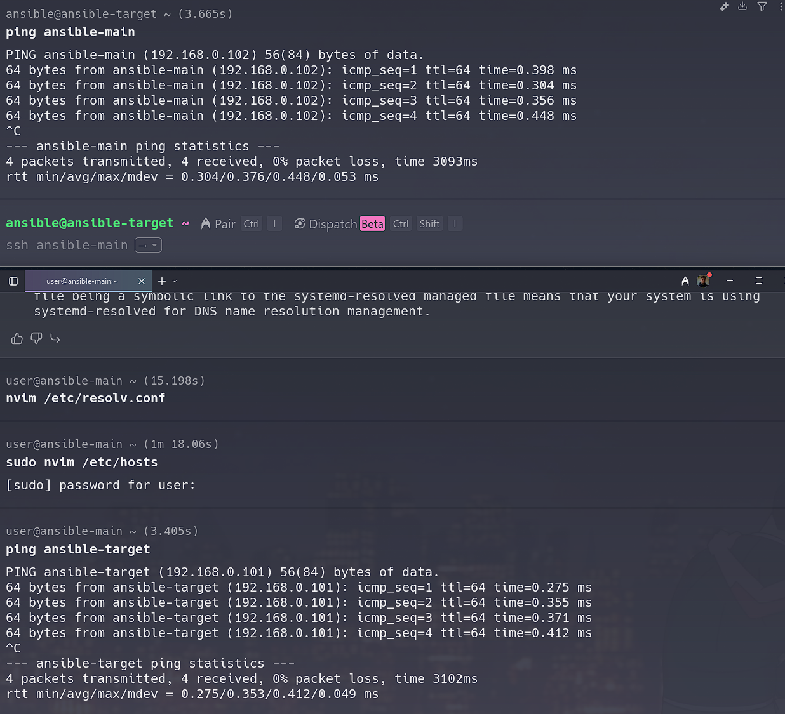
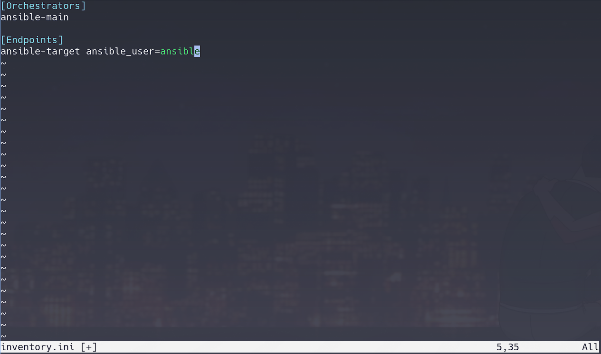
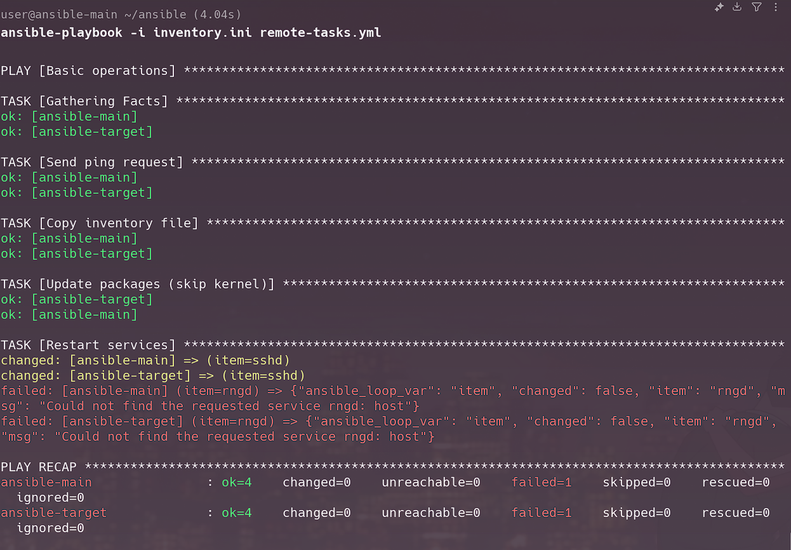
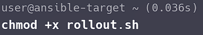

# CWL8

## 1. Instalacja zarządcy Ansible

### Zapewnienie dostępności programów `tar` oraz `sshd`

### Ustawienie hostname na ansible-target

### Dodanie użytkownika anisble

### Instalacja ansible z repozytorium dystrybucji na głównej maszynie

### Wymiana kluczy pomiędzy główną maszyną a użytkownikiem `ansible` na maszynie `target`

### Logowanie bez hasła

## 2. Inwentaryzacja

### Wprowadzenie nazwy DNS dla obu maszyn i test przy użyciu `ping`

### Stworzenie pliku inwentaryzacji

## 3. Zdalne wywoływanie procedur

### Przygotowanie [ansible playbook](./1/remote-tasks.yml) <!-- TODO ADD FILE TO REPO -->

### Wyłączenie `sshd`

### Przeprowadzenie zdalnego wywołania procedur

### Przygotowanie [ansible playbook](./1/deploy.yml) do uruchomienia kontenera aplikacji <!-- TODO ADD FILE TO REPO -->

### Przeprowadzenie uruchomienia aplikacji poprzez ansible

# CWL9

## 1. Instalacja zarządcy Ansible

<!-- TODO add pictures -->

# CWL10

## 1. Instalacja klastra Kubernetes

### Wybranie odpowiedniego instalatora

### Przeklejenie poleceń do terminala

### Uruchomienie klastra

### Automatyczne pobranie odpowiedniej wersji `kubectl`

### Uruchomienie dashboardu kubernetes z automatycznym przekierowaniem portu w VSCode

### Widok przeglądarki

## 2. Analiza posiadanego kontenera

Kontenerem używanym na zajęciach jest `nginx` wystawiający autorską aplikcję webową (wygenerowany pipelinem). [dockerhub](https://hub.docker.com/repository/docker/itscmd/traffic-lights-app/general)

## 3. Uruchamianie oprogramowania

### Uruchomienie poda korzystając z obrazu z dockerhub

### Sprawdzenie czy pod pracuje

### Wyprowadzenie portu

### Test działania poleceniem `curl`

### Test działania w przeglądarce

### Pobranie pliku wdrożenia

Plik zapisany [tutaj](./3/traffic-lights-deploy.yml)

### Próbne wdrożenie deploymentu

### Sprawdzenie statusu wdrożenia

### Przekierowanie portów oraz test w przeglądarce
W VSCode przekierowanie z 8081 na 8082  

### Widok minikube dashboard

# CWL11

## 1. Instalacja zarządcy Ansible

