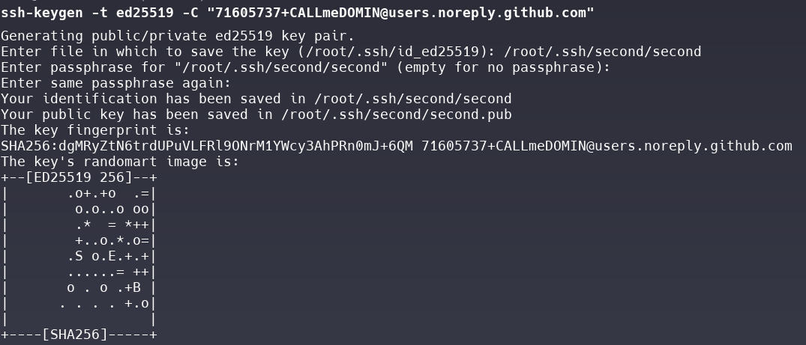
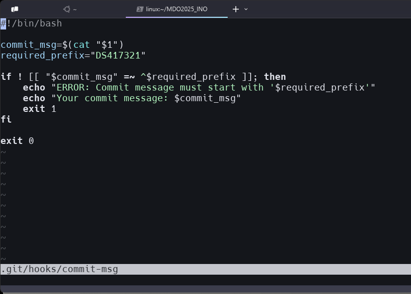

# 1. Generowanie kluczy ssh przy wykorzystaniu systemu ed25519, klucz `first` posiada passphrase

# 2. Dodanie kluczy do konta przy użyciu Github CLI

### Potwierdzenie dodania kluczy

### Dodanie kluczy do agenta SSH

# 3. Sklonowanie repozytorium przy użyciu SSH

# 4. Dodanie git hooka sprawdzającego prefix commita

### Treść skryptu

### Nadanie uprawnień

### Test

# 5. Stworzenie sprawozdania

