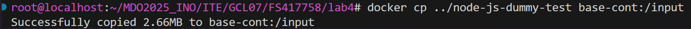
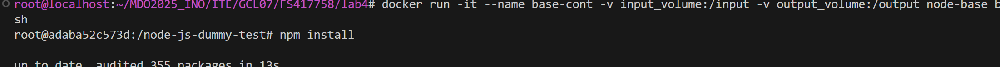
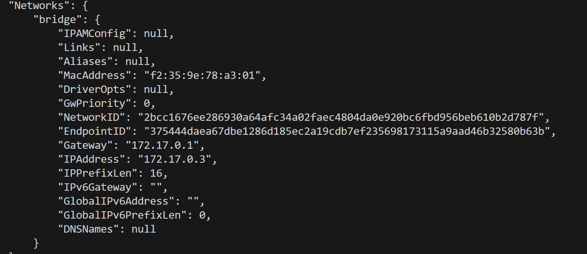
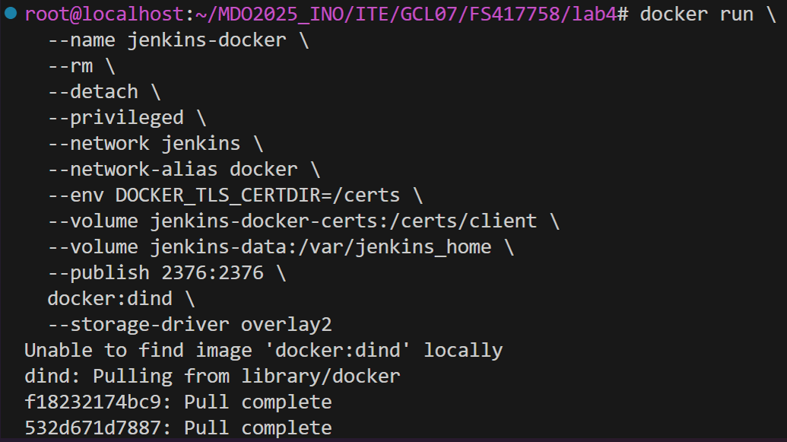

# Sprawozdanie 1 - Metodyki DevOps
## Filip Smoroń [FS417758]

## LAB 1 - Wprowadzenie, Git, Gałęzie, SSH
---
### Przygotowanie do zajęć
+ Przed rozpoczęciem zajęć skonfigurowałem środowisko pracy - utworzenie maszyny wirtualnej na Oracle VirtualBox, zainstalowanie systemu Fedora Minimal bez oprawy graficznej, przetestowanie komunikacji przesyłając przykładowe pliki 'test.txt' za pomocą polecenia scp.
Ostatnim krokiem było zainstalowanie wtyczki do Visual Studio Code - Remote-SSH, dzięki której można było się połączyć przez SSH bezpośrednio z Visual'a, co ułatwiło znacznie przyszłą pracę.
---
### Instalacja klienta Git i obsługi kluczy SSH
1. **Instalacja klienta Git**
```sh
sudo dnf install git
```
2. Generowanie dwóch kluczy SSH (inne niż RSA, w moim przypadku oba zabezpieczone hasłem)
   ```sh
   ssh-keygen -t ed25519 -C "mail" -f ~/.ssh/id_ed25519 "hasło"
   ```
   

    ```sh
   ssh-keygen -t ecdsa -b 521 -C "mail" -f ~/.ssh/id_ecdsa -N "hasło"
   ```
   

3. **Dodanie klucza do GitHub**
   - Skopiowanie klucza:
     ```sh
     cat ~/.ssh/id_ed25519.pub
     ```
     
   - Dodanie klucza na https://github.com/settings/keys

4. **Konfiguracja klucza SSH do użycia w GitHub**
   ```sh
   eval "$(ssh-agent -s)"
   ssh-add ~/.ssh/id_ed25519
   ```
   

#### Klonowanie repozytorium

1. **Klonowanie za pomocą HTTPS**
   ```sh
   git clone https://github.com/InzynieriaOprogramowaniaAGH/MDO2025_INO.git
   ```
   
2. **Sprawdzenie dostępu i klonowanie z użyciem SSH**
   ```sh
   git clone git@github.com:InzynieriaOprogramowaniaAGH/MDO2025_INO.git
   ```
   

3. **Konfiguracja 2FA** aktywacja w ustawieniach GitHub -> Security -> Two-Factor Authentication


#### Praca z gałęziami

1. **Przełączanie się na odpowiednie gałęzie**
   ```sh
   git checkout main
   git checkout GCL07
   ```
   
   

2. **Utworzenie nowej gałęzi**
   ```sh
   git checkout -b FS417758
   ```


3. **Utworzenie katalogu**
   ```sh
   mkdir GCL07/FS417758
   ```

#### Git Hook - Weryfikacja commit message

1. **Tworzenie pre-commit hooka**
   - Plik: `pre-commit`
   ```sh
   #!/bin/sh
   commit_msg=$(cat "$1")
   if ! echo "$commit_msg" | grep -q "FS417758"; then
       echo "Error: Commit message musi zaczyna się od FS417758"
       exit 1
   fi
   ```


2. **Dodanie skryptu do katalogu projektu**
   ```sh
   cp pre-commit GCL07/417758/
   chmod +x GCL07/FS417758/pre-commit
   ```

3. **Kopiowanie hooka do .git/hooks**
   ```sh
   cp GCL07/FS417758/pre-commit .git/hooks/pre-commit
   ```

#### Dodanie plików

1. **Dodanie plików do repozytorium**
   ```sh
   git add .
   git commit -m "417758 test hooka"
   git push origin FS417758
   ```
   
   
   ---

## LAB 2 - Git, Docker

### Zestawienie środowiska

#### Instalacja Dockera

1. **Instalacja Dockera na Fedorze**

    Można to zrobić tak:
   ```sh
   sudo dnf install docker
   sudo systemctl start docker
   sudo systemctl enable docker
   ```
   Ja to zrobiłem tak:
   

#### Rejestracja i pobieranie obrazów

1. **Rejestracja w Docker Hub**
2. **Pobranie obrazów**
   ```sh
   docker pull hello-world
   docker pull busybox
   docker pull fedora
   docker pull mysql
   ```

(Jak zamiast pull wpiszemy run to automatycznie nam pobierze jeśli nie mamy tych obrazów.)

   ```sh
   docker images
   ```
Aby sprawdzić obrazy


#### Uruchamianie kontenerów

1. **Uruchomienie kontenera z busybox**
   ```sh
   docker run busybox echo "hello from busybox"
   ```
   

2. **Podłączenie się do kontenera**
   ```sh
   docker run -it busybox sh
   ```
   

   Jeżeli chcemy sprawdzić opcje wpisujemy:
   ```sh
   busybox --help
   ```

3. **Uruchomienie kontenera systemowego (Fedora)**
   ```sh
   docker run -dit "nazwa" fedora
   docker exec -it "nazwa" bash
   ps aux
   ```
   
   

   Aktualizacja pakietów i wyjście
   ```sh
   dnf update && upgrade -y
   exit
   ```
   

#### Tworzenie Dockerfile

1. **Przykładowy Dockerfile**
   ```dockerfile
    FROM fedora:latest
    RUN dnf update -y && dnf install -y git vim curl
    WORKDIR /app
    COPY . /app
    RUN git clone https://github.com/InzynieriaOprogramowaniaAGH/MDO2025_INO.git
    CMD ["/bin/bash"]
   ```

2. **Budowanie i uruchamianie obrazu**
   ```sh
   docker build -t moj-kontener .
   docker run -it moj_kontener
   ```
   

#### Czyszczenie kontenerów i obrazów
   (brak screenów)
1. **Wyświetlenie uruchomionych kontenerów**
   ```sh
   docker ps -a
   ```

2. **Usunięcie kontenerów**
   ```sh
   docker rm $(docker ps -aq)
   ```
3. **Usunięcie obrazów**
   ```sh
   docker rmi $(docker images -q)
   ```

4. **Dodanie Dockerfile do repozytorium**
   ```sh
   git add .
   git commit -m "FS417758 dockerfile"
   git push origin FS417758
   ```

---

## LAB 3 - Dockerfiles, kontener jako definicja etapu

### Wybór oprogramowania

1. **Wybór repozytorium open-source zawierającego Makefile**
- Wybrano repozytorium: [irssi](https://github.com/irssi/irssi.git) oraz [node-js-dummy-test](https://github.com/devenes/node-js-dummy-test)
2. **Sklonowanie repozytorium**

   ```sh
   git clone https://github.com/irssi/irssi.git
   ```
   
3. **Instalacja potrzebnych zależności**
   ```sh
    dnf install -y meson gcc glib2-devel openssl-devel ncurses-devel utf8proc-devel perl-ExtUtils* cmake libgcrypt-config libgcrypt libotr-devel cap_enter-devel pkg-config
   ```
   
4. **Zbudowanie aplikacji i uruchomienie testów**   
   ```sh
    meson Build
    cd Build
    ninja
    ninja test
   ```
   

   

### Przeprowadzenie buildu w kontenerze

- Uruchomienie kontenera z obrazu Fedora
   ```sh
   docker run -it --rm fedora bash
   ```
- Sklonowanie repozytorium w kontenerze
   ```sh
   git clone https://github.com/irssi/irssi.git
   ```
- Instalacja potrzebnych zależności, zbudowanie aplikacji i uruchomienie testów tak jak poprzednio


### Automatyzacja procesu - Dockerfile

1. **Dockerfile do buildu (`irssi-build.Dockerfile`)**
   ```dockerfile
    FROM fedora
    RUN dnf -y update && dnf -y install git meson ninja* gcc glib2-devel utf8proc* ncurses* perl-Ext*
    RUN git clone https://github.com/irssi/irssi.git
    WORKDIR /irssi
    RUN meson Build
    RUN ninja -C /irssi/Build
   ```

2. **Dockerfile do testów (`irssi-test.Dockerfile`)**
   ```dockerfile
    FROM irssi-builder
    WORKDIR /irssi/Build
    RUN ninja test
   ```
   Budowanie obrazów:
   ```sh
   docker build -t irssi-builder -f ./irssi-build.Dockerfile .
   ```
   

   Docker stworzy obraz na podstawie podanego Dockerfile.

- Aby uruchomić kontener używamy komendy:
   ```sh
   docker run nazwa-kontenera
   docker run irssi-builder
   ```
- Aby pozwolić na testy, tworzymy obraz do testów
   ```sh
    docker build -t irssi-tester -f ./irssi-test.Dockerfile .
    ```
   Ten obraz jest przeznaczony do uruchamiania testów.

### Aplikacja w Node
- Uruchamiamy kontener interaktywnie
   ```sh
   sudo docker run --rm -it node /bin/bash
   ```
- Aktualizujemy pokiety w kontenerze
   ```sh
   apt-get update
   ```
- Klonujemy repozytorium node-js-dummy-test tak jak wcześniej za pomocą git clone
- Instalujemy zależności
   ```sh
   npm install
   ```
- Uruchamiamy testy
   ```sh
   npm run test
   ```
   
### Dockerfile do automatyzacji procesu
- Tworzymy pliki Dockerfile: node-build, node-test oraz node-deploy

**node-build.Dockerfile**
```Dockerfile
FROM node
RUN git clone https://github.com/devenes/node-js-dummy-test
WORKDIR /node-js-dummy-test
RUN npm install
```
**node-test.Dockerfile**
```Dockerfile
FROM node-builder
RUN npm test
```

**node-deploy.Dockerfile**
```Dockerfile
FROM node-builder
CMD ["npm","start"]
```
- Budowanie obrazów:
```sh
docker build -t node-builder -f ./node-build.Dockerfile .
docker build -t node-tester -f ./node-test.Dockerfile .
docker build -t node-deploy -f ./node-deploy.Dockerfile .
```

- Uruchomienie aplikacji:
```sh
docker run --rm node-deploy
```


---

## LAB 4 - Dodatkowa terminologia w konteneryzacji, instalacja Jenkinsa

- Zbudowanie obrazu kontenera z poprzednich labów.


#### Zachowywanie stanu

1. Przygotowanie woluminów wejściowego i wyjściowego oraz podłączenie ich do kontenera bazowego.

```sh
docker volume create input_volume
docker volume create output_volume
```


2. Uruchomienie kontenera

```
docker run -it --name base-cont -v input_volume:/input -v output_volume:/output node-base bash
```


3. Skopiowanie repozytorium do wolumina wejściowego przez docker cp
```sh
docker cp ../node-js-dummy-test base-cont:/input
```

4. Instalacja zależności i testowanie

```sh
npm install
```


```sh
npm test
```


5. Przeniesienie zbudowanego programu do woluminu wyjściowego

```sh
cp -r /input/node-js-dummy-test/ /output/
```

---

#### Eksponowanie portu

1. Pobranie obrazu iperf3
```sh
docker pull networkstatic/iperf3
```

     
   Uruchomienie:
```sh
docker run -it --name=perfcont -p 5201:5201 networkstatic/iperf3 -s
```


2. Zbadanie ruchu

```sh
docker inspect perfcont
```


3. Podłączenie się z drugiego kontenera

```sh
docker run -it --name=drugi networkstatic/iperf3 -c 192.168.100.62
```


4. Pobranie iperf3
```sh
dnf install iperf3
```


5. Łączenie się z hosta i zbadanie ruchu
```sh
iperf3 -c localhost -p 5201
```


6. Połączenie się spoza hosta przez cmd i zbadanie ruchu

```sh
.\iperf3.exe -c 192.168.100.62 -p 5201
```


7. Wyciągnięcie logów

```sh
docker logs perfcont > logs.txt
```

```
-----------------------------------------------------------
Server listening on 5201 (test #1)
-----------------------------------------------------------
^[[A^[[AAccepted connection from 172.17.0.1, port 34756
[  5] local 172.17.0.3 port 5201 connected to 172.17.0.1 port 34772
[ ID] Interval           Transfer     Bitrate
[  5]   0.00-1.00   sec   788 MBytes  6.61 Gbits/sec                  
[  5]   1.00-2.00   sec   675 MBytes  5.65 Gbits/sec                  
[  5]   2.00-3.00   sec   791 MBytes  6.64 Gbits/sec                  
[  5]   3.00-4.00   sec   826 MBytes  6.93 Gbits/sec                  
[  5]   4.00-5.00   sec   780 MBytes  6.54 Gbits/sec                  
[  5]   5.00-6.00   sec   824 MBytes  6.91 Gbits/sec                  
[  5]   6.00-7.00   sec   701 MBytes  5.88 Gbits/sec                  
[  5]   7.00-8.00   sec   740 MBytes  6.21 Gbits/sec                  
[  5]   8.00-9.00   sec   766 MBytes  6.43 Gbits/sec                  
[  5]   9.00-10.00  sec   810 MBytes  6.79 Gbits/sec                  
[  5]  10.00-10.01  sec  2.00 MBytes  3.74 Gbits/sec                  
- - - - - - - - - - - - - - - - - - - - - - - - -
[ ID] Interval           Transfer     Bitrate
[  5]   0.00-10.01  sec  7.52 GBytes  6.46 Gbits/sec                  receiver
-----------------------------------------------------------
Server listening on 5201 (test #2)
-----------------------------------------------------------
Accepted connection from 172.17.0.1, port 46836
[  5] local 172.17.0.3 port 5201 connected to 172.17.0.1 port 46846
[ ID] Interval           Transfer     Bitrate
[  5]   0.00-1.00   sec   829 MBytes  6.95 Gbits/sec                  
[  5]   1.00-2.00   sec   829 MBytes  6.96 Gbits/sec                  
[  5]   2.00-3.00   sec   927 MBytes  7.78 Gbits/sec                  
[  5]   3.00-4.00   sec   595 MBytes  4.99 Gbits/sec                  
[  5]   4.00-5.00   sec   587 MBytes  4.92 Gbits/sec                  
[  5]   5.00-6.00   sec   801 MBytes  6.73 Gbits/sec                  
[  5]   6.00-7.00   sec   745 MBytes  6.25 Gbits/sec                  
[  5]   7.00-8.00   sec   870 MBytes  7.29 Gbits/sec                  
[  5]   8.00-9.00   sec   830 MBytes  6.97 Gbits/sec                  
[  5]   9.00-10.00  sec   893 MBytes  7.49 Gbits/sec                  
[  5]  10.00-10.02  sec  4.63 MBytes  2.56 Gbits/sec                  
- - - - - - - - - - - - - - - - - - - - - - - - -
[ ID] Interval           Transfer     Bitrate
[  5]   0.00-10.02  sec  7.73 GBytes  6.63 Gbits/sec                  receiver
-----------------------------------------------------------
Server listening on 5201 (test #3)
-----------------------------------------------------------
Accepted connection from 192.168.100.54, port 54862
[  5] local 172.17.0.3 port 5201 connected to 192.168.100.54 port 54863
[ ID] Interval           Transfer     Bitrate
[  5]   0.00-1.00   sec  32.8 MBytes   273 Mbits/sec                  
[  5]   1.00-2.00   sec  43.9 MBytes   370 Mbits/sec                  
[  5]   2.00-3.00   sec  39.7 MBytes   332 Mbits/sec                  
[  5]   3.00-4.00   sec  48.1 MBytes   404 Mbits/sec                  
[  5]   4.00-5.00   sec  44.1 MBytes   369 Mbits/sec                  
[  5]   5.00-6.00   sec  46.0 MBytes   386 Mbits/sec                  
[  5]   6.00-7.00   sec  39.2 MBytes   328 Mbits/sec                  
[  5]   7.00-8.00   sec  41.9 MBytes   352 Mbits/sec                  
[  5]   8.00-9.00   sec  41.8 MBytes   351 Mbits/sec                  
[  5]   9.00-10.00  sec  37.3 MBytes   312 Mbits/sec                  
[  5]  10.00-10.01  sec  65.3 KBytes   160 Mbits/sec                  
- - - - - - - - - - - - - - - - - - - - - - - - -
[ ID] Interval           Transfer     Bitrate
[  5]   0.00-10.01  sec   415 MBytes   348 Mbits/sec                  receiver
-----------------------------------------------------------
Server listening on 5201 (test #4)
-----------------------------------------------------------

```
---

#### Instancja Jenkins

1. Wykonanie kolejno instrukcji instalacji Jenkinsa

```sh
docker network create jenkins
```


```sh
docker run --name jenkins-docker --rm --detach   --privileged --network jenkins --network-alias docker   --env DOCKER_TLS_CERTDIR=/certs   --volume jenkins-docker-certs:/certs/client   --volume jenkins-data:/var/jenkins_home   --publish 2376:2376   docker:dind --storage-driver overlay2
```

2. Utworzenie dockerfile 
```Dockerfile
FROM jenkins/jenkins:2.492.2-jdk17
USER root
RUN apt-get update && apt-get install -y lsb-release ca-certificates curl && \
    install -m 0755 -d /etc/apt/keyrings && \
    curl -fsSL https://download.docker.com/linux/debian/gpg -o /etc/apt/keyrings/docker.asc && \
    chmod a+r /etc/apt/keyrings/docker.asc && \
    echo "deb [arch=$(dpkg --print-architecture) signed-by=/etc/apt/keyrings/docker.asc] \
    https://download.docker.com/linux/debian $(. /etc/os-release && echo \"$VERSION_CODENAME\") stable" \
    | tee /etc/apt/sources.list.d/docker.list > /dev/null && \
    apt-get update && apt-get install -y docker-ce-cli && \
    apt-get clean && rm -rf /var/lib/apt/lists/*
USER jenkins
RUN jenkins-plugin-cli --plugins "blueocean docker-workflow"
```
3. Stworzenie kontenera
```sh
docker build -t myjenkins-blueocean:2.492.2-1 .
```
(brak screenów z powodu zacięcia się virtual boxa i przymusu ponownego wykonywania kroków kilkukrotnie)

```sh
docker run   --name jenkins-blueocean   --restart=on-failure   --detach   --network jenkins   --env DOCKER_HOST=tcp://docker:2376   --env DOCKER_CERT_PATH=/certs/client   --env DOCKER_TLS_VERIFY=1   --publish 8080:8080   --publish 50000:50000   --volume jenkins-data:/var/jenkins_home   --volume jenkins-docker-certs:/certs/client:ro   myjenkins-blueocean:2.492.2-1 
```


4. Działające kontenery

Komenda:
```sh
docker ps
```
Powinny być jenkins-blueocean oraz jenkins-docker

5. Po wejściu na localhost:8080 okno jenkinsa wymagajace hasła


Uzyskanie hasła za pomocą komendy
```sh
docker exec jenkins-blueocean cat /var/jenkins_home/secrets/initialAdminPassword
```

Po wpisaniu hasła instalujemy wtyczki


Tworzymy konto i możemy korzystać z jenkinsa


