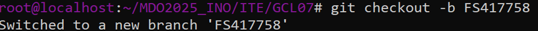

# Sprawozdanie 1 - Metodyki DevOps
## Filip Smoroń [FS417758]

## LAB 1 - Wprowadzenie, Git, Gałęzie, SSH
---
### Przygotowanie do zajęć
+ Przed rozpoczęciem zajęć skonfigurowałem środowisko pracy - utworzenie maszyny wirtualnej na Oracle VirtualBox, zainstalowanie systemu Fedora Minimal bez oprawy graficznej, przetestowanie komunikacji przesyłając przykładowe pliki 'test.txt' za pomocą polecenia scp.
Ostatnim krokiem było zainstalowanie wtyczki do Visual Studio Code - Remote-SSH, dzięki której można było się połączyć przez SSH bezpośrednio z Visual'a, co ułatwiło znacznie przyszłą pracę.
---
### Instalacja klienta Git i obsługi kluczy SSH
1. **Instalacja klienta Git**
```sh
sudo dnf install git
```
2. Generowanie dwóch kluczy SSH (inne niż RSA, w moim przypadku oba zabezpieczone hasłem)
   ```sh
   ssh-keygen -t ed25519 -C "mail" -f ~/.ssh/id_ed25519 "hasło"
   ```
   

    ```sh
   ssh-keygen -t ecdsa -b 521 -C "mail" -f ~/.ssh/id_ecdsa -N "hasło"
   ```
   

3. **Dodanie klucza do GitHub**
   - Skopiowanie klucza:
     ```sh
     cat ~/.ssh/id_ed25519.pub
     ```
     
   - Dodanie klucza na https://github.com/settings/keys

4. **Konfiguracja klucza SSH do użycia w GitHub**
   ```sh
   eval "$(ssh-agent -s)"
   ssh-add ~/.ssh/id_ed25519
   ```
   

#### Klonowanie repozytorium

1. **Klonowanie za pomocą HTTPS**
   ```sh
   git clone https://github.com/InzynieriaOprogramowaniaAGH/MDO2025_INO.git
   ```
   
2. **Sprawdzenie dostępu i klonowanie z użyciem SSH**
   ```sh
   git clone git@github.com:InzynieriaOprogramowaniaAGH/MDO2025_INO.git
   ```
   

3. **Konfiguracja 2FA** aktywacja w ustawieniach GitHub -> Security -> Two-Factor Authentication


#### Praca z gałęziami

1. **Przełączanie się na odpowiednie gałęzie**
   ```sh
   git checkout main
   git checkout GCL07
   ```
   
   

2. **Utworzenie nowej gałęzi**
   ```sh
   git checkout -b FS417758
   ```


3. **Utworzenie katalogu**
   ```sh
   mkdir GCL07/FS417758
   ```

#### Git Hook - Weryfikacja commit message

1. **Tworzenie pre-commit hooka**
   - Plik: `pre-commit`
   ```sh
   #!/bin/sh
   commit_msg=$(cat "$1")
   if ! echo "$commit_msg" | grep -q "FS417758"; then
       echo "Error: Commit message musi zaczyna się od FS417758"
       exit 1
   fi
   ```


2. **Dodanie skryptu do katalogu projektu**
   ```sh
   cp pre-commit GCL07/417758/
   chmod +x GCL07/FS417758/pre-commit
   ```

3. **Kopiowanie hooka do .git/hooks**
   ```sh
   cp GCL07/FS417758/pre-commit .git/hooks/pre-commit
   ```

#### Dodanie plików

1. **Dodanie plików do repozytorium**
   ```sh
   git add .
   git commit -m "417758 test hooka"
   git push origin FS417758
   ```
   
   
   ---

## LAB 2 - Git, Docker

### Zestawienie środowiska

#### Instalacja Dockera

1. **Instalacja Dockera na Fedorze**

    Można to zrobić tak:
   ```sh
   sudo dnf install docker
   sudo systemctl start docker
   sudo systemctl enable docker
   ```
   Ja to zrobiłem tak:
   

#### Rejestracja i pobieranie obrazów

1. **Rejestracja w Docker Hub**
2. **Pobranie obrazów**
   ```sh
   docker pull hello-world
   docker pull busybox
   docker pull fedora
   docker pull mysql
   ```

(Jak zamiast pull wpiszemy run to automatycznie nam pobierze jeśli nie mamy tych obrazów.)

   ```sh
   docker images
   ```
Aby sprawdzić obrazy


#### Uruchamianie kontenerów

1. **Uruchomienie kontenera z busybox**
   ```sh
   docker run busybox echo "hello from busybox"
   ```
   

2. **Podłączenie się do kontenera**
   ```sh
   docker run -it busybox sh
   ```
   

   Jeżeli chcemy sprawdzić opcje wpisujemy:
   ```sh
   busybox --help
   ```

3. **Uruchomienie kontenera systemowego (Fedora)**
   ```sh
   docker run -dit "nazwa" fedora
   docker exec -it "nazwa" bash
   ps aux
   ```
   
   

   Aktualizacja pakietów i wyjście
   ```sh
   dnf update && upgrade -y
   exit
   ```
   

#### Tworzenie Dockerfile

1. **Przykładowy Dockerfile**
   ```dockerfile
    FROM fedora:latest
    RUN dnf update -y && dnf install -y git vim curl
    WORKDIR /app
    COPY . /app
    RUN git clone https://github.com/InzynieriaOprogramowaniaAGH/MDO2025_INO.git
    CMD ["/bin/bash"]
   ```

2. **Budowanie i uruchamianie obrazu**
   ```sh
   docker build -t moj-kontener .
   docker run -it moj_kontener
   ```
   

#### Czyszczenie kontenerów i obrazów
   (brak screenów)
1. **Wyświetlenie uruchomionych kontenerów**
   ```sh
   docker ps -a
   ```

2. **Usunięcie kontenerów**
   ```sh
   docker rm $(docker ps -aq)
   ```
3. **Usunięcie obrazów**
   ```sh
   docker rmi $(docker images -q)
   ```

4. **Dodanie Dockerfile do repozytorium**
   ```sh
   git add .
   git commit -m "FS417758 dockerfile"
   git push origin FS417758
   ```

---

## LAB 3 - Dockerfiles, kontener jako definicja etapu

### Wybór oprogramowania

1. **Wybór repozytorium open-source zawierającego Makefile**
- Wybrano repozytorium: [irssi](https://github.com/irssi/irssi.git)
2. **Sklonowanie repozytorium**

   ```sh
   git clone https://github.com/irssi/irssi.git
   ```
   
3. **Instalacja potrzebnych zależności**
   ```sh
    dnf install -y meson gcc glib2-devel openssl-devel ncurses-devel utf8proc-devel perl-ExtUtils* cmake libgcrypt-config libgcrypt libotr-devel cap_enter-devel pkg-config
   ```
   
4. **Zbudowanie aplikacji i uruchomienie testów**   
   ```sh
    meson Build
    cd Build
    ninja
    ninja test
   ```
   

   

### Automatyzacja procesu - Dockerfile

1. **Dockerfile do buildu (`irssi-build.Dockerfile`)**
   ```dockerfile
    FROM fedora
    RUN dnf -y update && dnf -y install git meson ninja* gcc glib2-devel utf8proc* ncurses* perl-Ext*
    RUN git clone https://github.com/irssi/irssi.git
    WORKDIR /irssi
    RUN meson Build
    RUN ninja -C /irssi/Build
   ```

2. **Dockerfile do testów (`irssi-test.Dockerfile`)**
   ```dockerfile
    FROM irssi-builder
    WORKDIR /irssi/Build
    RUN ninja test
   ```

---
