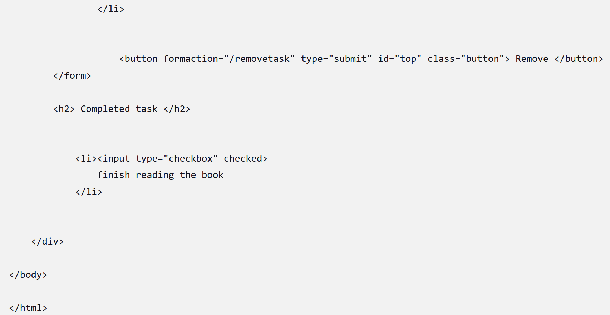
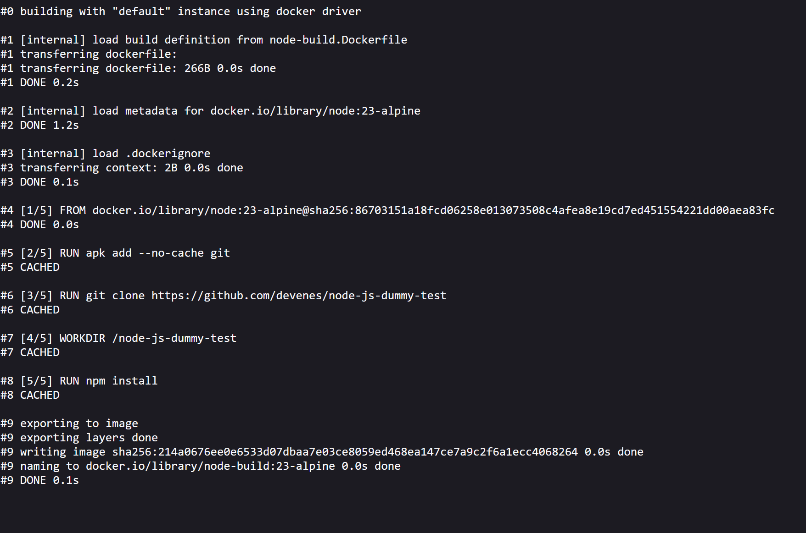

# Sprawozdanie 2
Filip Smoron [FS417758]
## Laboratoria 5 - Pipeline, Jenikns, Izolacja etapów

#### Instancja Jenkins

1. Wykonanie kolejno instrukcji instalacji Jenkinsa

```sh
docker network create jenkins
```


```sh
docker run --name jenkins-docker --rm --detach   --privileged --network jenkins --network-alias docker   --env DOCKER_TLS_CERTDIR=/certs   --volume jenkins-docker-certs:/certs/client   --volume jenkins-data:/var/jenkins_home   --publish 2376:2376   docker:dind --storage-driver overlay2
```

2. Utworzenie dockerfile 
```Dockerfile
FROM jenkins/jenkins:2.492.2-jdk17
USER root
RUN apt-get update && apt-get install -y lsb-release ca-certificates curl && \
    install -m 0755 -d /etc/apt/keyrings && \
    curl -fsSL https://download.docker.com/linux/debian/gpg -o /etc/apt/keyrings/docker.asc && \
    chmod a+r /etc/apt/keyrings/docker.asc && \
    echo "deb [arch=$(dpkg --print-architecture) signed-by=/etc/apt/keyrings/docker.asc] \
    https://download.docker.com/linux/debian $(. /etc/os-release && echo \"$VERSION_CODENAME\") stable" \
    | tee /etc/apt/sources.list.d/docker.list > /dev/null && \
    apt-get update && apt-get install -y docker-ce-cli && \
    apt-get clean && rm -rf /var/lib/apt/lists/*
USER jenkins
RUN jenkins-plugin-cli --plugins "blueocean docker-workflow"
```
3. Stworzenie kontenera
```sh
docker build -t myjenkins-blueocean:2.492.2-1 .
```
(brak screenów z powodu zacięcia się virtual boxa i przymusu ponownego wykonywania kroków kilkukrotnie)

```sh
docker run   --name jenkins-blueocean   --restart=on-failure   --detach   --network jenkins   --env DOCKER_HOST=tcp://docker:2376   --env DOCKER_CERT_PATH=/certs/client   --env DOCKER_TLS_VERIFY=1   --publish 8080:8080   --publish 50000:50000   --volume jenkins-data:/var/jenkins_home   --volume jenkins-docker-certs:/certs/client:ro   myjenkins-blueocean:2.492.2-1 
```


4. Działające kontenery

Komenda:
```sh
docker ps
```
Powinny być jenkins-blueocean oraz jenkins-docker

5. Po wejściu na localhost:8080 okno jenkinsa wymagajace hasła


Uzyskanie hasła za pomocą komendy
```sh
docker exec jenkins-blueocean cat /var/jenkins_home/secrets/initialAdminPassword
```

Po wpisaniu hasła instalujemy wtyczki


Tworzymy konto i możemy korzystać z jenkinsa


## Wstęp do jenkinsa

1. Wyświetlanie ```
uname   ```
```
unname -a
```
Polecenie to wyświetla informacje o systemie operacyjnym oraz sprzęcie.


2. Sprawdzanie czy godzina jest nieparzysta.

```sh
hour=$(date +%H)
if [ $(( hour % 2 )) -ne 0 ]; then
  echo "FAILURE: The hour is odd."
  exit 1
else
  echo "SUCCESS: The hour is even."
fi
```

Skrypt ten sprawdza, czy godzina jest parzysta i kończy się niepowodzeniem gdzy nie jest. 

3. Pobranie obrazu Ubuntu z Dockerhuba
```sh
docker pull ubuntu:latest
```


4. Obiekt typu Pipeline do klonowania repo
```sh
pipeline {
    agent any

    stages {
        stage('Klonowanie repozytorium') {
            steps {
                git branch: 'FS417758', url: 'https://github.com/InzynieriaOprogramowaniaAGH/MDO2025_INO.git'
            }
        }

        stage('Budowanie obrazu Docker') {
            steps {
                script {
                    sh 'docker build -t obraz_build -f ./ITE/GCL07/FS417758/lab3/node-build.Dockerfile .'
                }
            }
        }
    }
}
```


## Pipeline do wybranej aplikacji
### Node-js-dummy-test

#### DIND vs na Native Docker w CI
##### Docker-in-Docker (DinD)

Kontener CI uruchamia własny demon Dockera, umożliwiając izolowane budowanie i testowanie.

Zalety:

- Pełna izolacja środowiska

- Brak konfliktów między pipeline’ami

Wady:

- Wolniejsze budowanie (brak współdzielonego cache)

- Ryzyko bezpieczeństwa (kontener z uprawnieniami root)

###### Native Docker (via socket)

Kontener CI łączy się z Dockerem na hoście przez /var/run/docker.sock.

Zalety:

- Szybsze budowanie (wykorzystuje cache hosta)

- Prostsza konfiguracja

Wady:

- Mniejsza izolacja (kontenery działają na hoście)

- Potencjalne ryzyko bezpieczeństwa (dostęp do socketu = kontrola nad Dockerem)

1. Diagram UML

    Pipeline rozpoczyna się od pobrania kodu z SCM (GitHub)

    Kolejne etapy przetwarzają aplikację (build, testy)

    Aplikacja jest wdrażana w środowisku Docker (sieć + kontener)

    Wyniki są archiwizowane

    Zawsze następuje sprzątanie zasobów

2. Pipeline:
```sh
pipeline {
    agent any

    environment {
        BASE_DIR = 'MDO2025_INO/ITE/GCL07/FS417758/lab3'
        BUILD_VER = '1.0'
        NODE_VER = '23-alpine'
        IMG_BUILD = "node-build:${NODE_VER}"
        IMG_TEST = "node-test:v${BUILD_VER}"
        IMG_DEPLOY = "node-deploy:v${BUILD_VER}"
        NETWORK_NAME = 'app_net'
        PROJECT_DIR = 'MDO2025_INO/ITE/GCL07/FS417758/lab3'
    }

    stages {
        stage('Prepare') {
            steps {
                sh '''
                    rm -rf MDO2025_INO || true
                    git clone https://github.com/InzynieriaOprogramowaniaAGH/MDO2025_INO.git
                    cd MDO2025_INO
                    git checkout FS417758
                '''
            }
        }

        stage('Logs') {
            steps {
                dir("${BASE_DIR}") {
                    sh 'touch build.log'
                    sh 'touch test.log'
                }
            }
        }

        stage('Build') {
            steps {
                dir("${BASE_DIR}") {
                    sh 'docker build -f node-build.Dockerfile -t ${IMG_BUILD} . > build.log 2>&1'
                }
                archiveArtifacts artifacts: "${BASE_DIR}/build.log"
            }
        }

        stage('Tests') {
            steps {
                dir("${BASE_DIR}") {
                    sh 'docker build -f node-test.Dockerfile -t ${IMG_TEST} . > test.log 2>&1'
                }
                archiveArtifacts artifacts: "${BASE_DIR}/test.log"
            }
        }

        stage('Deploy') {
            steps {
                sh 'docker network create ${NETWORK_NAME} || true'
                dir("${BASE_DIR}") {
                    sh '''
                        docker build -f node-deploy.Dockerfile -t ${IMG_DEPLOY} .
                        docker rm -f app || true
                        docker run -d --rm --name app --network ${NETWORK_NAME} -p 3000:3000 ${IMG_DEPLOY}
                    '''
                }
                sleep(10)
            }
        }

        stage('Smoke Tests') {
            steps {
                script {
                    echo 'Running smoke tests...'
                    sh 'docker run --rm --network ${NETWORK_NAME} curlimages/curl curl -v http://app:3000' 
                }
            }
        }

        stage('Publish') {
            steps {
                dir("${PROJECT_DIR}") {
                    sh '''
                        mkdir -p artifacts_${BUILD_NUMBER}
                        tar -cvf artifacts_${BUILD_NUMBER}.tar *.log
                    '''
                    archiveArtifacts artifacts: "artifacts_${BUILD_NUMBER}.tar"
                }
            }
        }
    }

    post {
        always {
            echo 'Cleaning up Docker resources...'
            sh '''
                docker container prune -f || true
                docker rmi -f ${IMG_BUILD} ${IMG_TEST} ${IMG_DEPLOY} || true
                docker stop app || true
                docker network rm ${NETWORK_NAME} || true
            '''
        }
    }
}
```

Opis etapów:
   - Prepare

Ten etap przygotowuje środowisko pracy poprzez usunięcie ewentualnych istniejących plików, sklonowanie repozytorium GitHub i przejście do odpowiedniej gałęzi (FS417758). Gwarantuje to, że pipeline rozpoczyna pracę z aktualną i odpowiednią wersją kodu źródłowego.

   - Logs

Etap tworzy pliki dziennika (logów) dla procesów budowania i testowania. Pliki te są niezbędne do przechowywania informacji o przebiegu tych procesów, co umożliwia późniejszą analizę ewentualnych problemów.

   - Build

Ten fragment kodu definiuje etap budowania aplikacji, w którym tworzony jest obraz Dockera na podstawie pliku node-build.Dockerfile. Proces budowania jest rejestrowany w pliku build.log, który jest następnie archiwizowany jako artefakt. Ten etap zapewnia, że aplikacja jest poprawnie skompilowana i gotowa do dalszych etapów.

   - Tests

Ten fragment kodu definiuje etap testów, który jest kluczowym krokiem w procesie zapewniania jakości oprogramowania poprzez automatyzację testowania aplikacji. Obraz testowy jest budowany na podstawie pliku node-test.Dockerfile, a wyniki testów są zapisywane w pliku test.log i archiwizowane.

   - Deploy

Po pomyślnym zakończeniu testów, etap deploy automatycznie wdraża zbudowaną aplikację lub oprogramowanie na odpowiednie środowisko. Tworzona jest sieć Docker, budowany jest obraz deployowy, a następnie kontener z aplikacją jest uruchamiany na porcie 3000. Automatyzacja tego procesu eliminuje potrzebę ręcznego wdrażania, co z kolei przyspiesza cykl dostarczania oprogramowania.

   - Smoke Tests

Etap przeprowadza podstawowe testy smoke, aby zweryfikować, czy aplikacja została poprawnie wdrożona i jest dostępna. Wykorzystuje narzędzie curl do sprawdzenia odpowiedzi serwera działającego w kontenerze.




   - Publish

Etap ma na celu udostępnienie wytworzonych artefaktów, takich jak pliki logów, w formie spakowanego archiwum. Artefakty są nazywane z uwzględnieniem numeru builda, co ułatwia śledzenie wersji. Udostępnienie tych artefaktów umożliwia analizę procesu budowania i testowania.

   - Post (always)

Ta sekcja wykonuje się zawsze, niezależnie od wyniku poprzednich etapów. Jej zadaniem jest sprzątanie zasobów Dockera - usuwanie kontenerów, obrazów i sieci, aby zapewnić czyste środowisko dla kolejnych uruchomień pipeline'a.

W pipeline zastosowałem również zmienne środowiskowe aby ułatwić pisanie skryptu:

- BASE_DIR – ścieżka do projektu w repozytorium.

- BUILD_VER – wersja aplikacji, używana do tagowania obrazów Dockera.

- NODE_VER – wersja Node.js (u mnie 23-alpine) dla obrazów buildowych.

- IMG_BUILD/IMG_TEST/IMG_DEPLOY – nazwy obrazów Dockera do budowania, testów i deploy'owania.

- NETWORK_NAME – nazwa sieci Docker dla komunikacji między kontenerami.

- PROJECT_DIR – ścieżka do artefaktów.

#### Przy uruchamianiu pipeline używane są również dockerfile:

Użyte pliki Dockerfile

1. node-build.Dockerfile
dockerfile

```Dockerfile
FROM node:23-alpine
RUN apk add --no-cache git
RUN git clone https://github.com/devenes/node-js-dummy-test
WORKDIR /node-js-dummy-test
RUN npm install
```

Funkcja: Przygotowuje środowisko buildowe

Kluczowe kroki:

- Instalacja Gita

- Klonowanie repozytorium

- Instalacja zależności

2. node-test.Dockerfile
dockerfile

```Dockerfile
FROM node-build:23-alpine
WORKDIR /node-js-dummy-test
RUN npm run test
```

Funkcja: - Uruchamia testy aplikacji

Zależności: - Wykorzystuje zbudowany wcześniej obraz node-build

3. node-deploy.Dockerfile
dockerfile

```Dockerfile
FROM node-build:23-alpine
WORKDIR /node-js-dummy-test
CMD ["npm","start"]
```

Funkcja: - Uruchamia aplikację produkcyjnie

Działanie: - Używa tych samych zależności co build, ale uruchamia serwer

3. Uruchomienie Pipeline przy użyciu SCM

Aby uruchomić pipeline za pomocą SCM należy stworzyć Jenkinsfile na maszynie, następnie na Jenkinsie stworzyć nowy projekt i wybrać Pipeline a potem Pipeline script from SCM


Następnie uruchamiamy skrypt jak poprzednio, co powinno zwrócić takie same rezultaty.


4. Logi:

#### build.log:


#### test.log:

