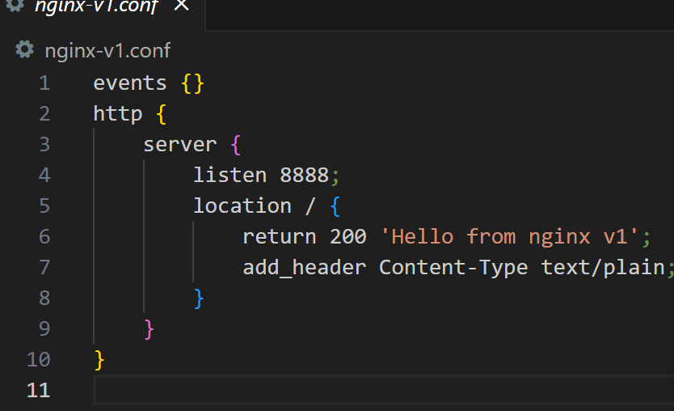
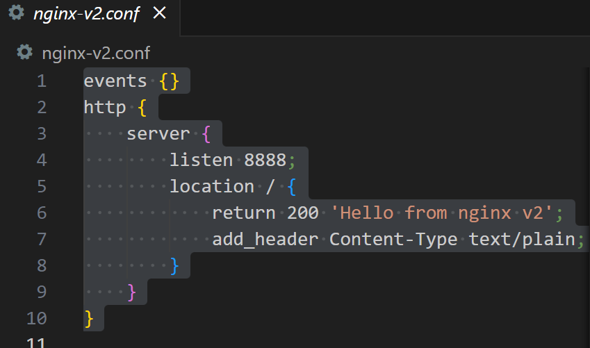
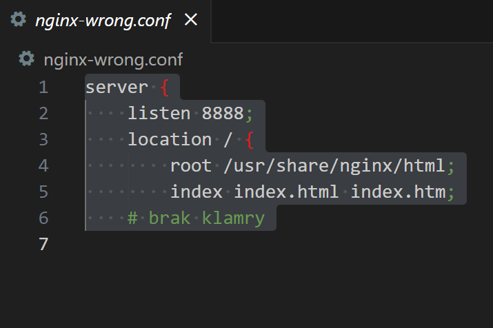
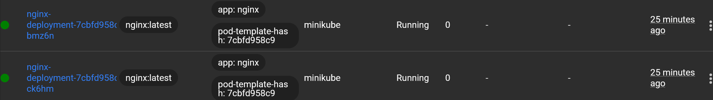
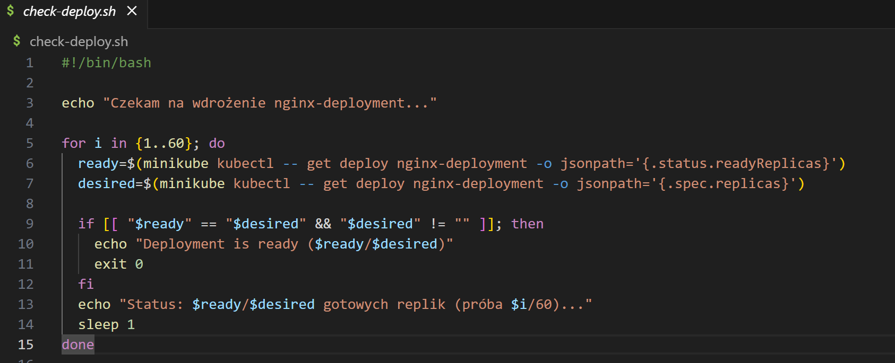

# Sprawozdanie 3
## Filip Smoroń [417758]

# Cel laboratorium

Celem zajęć było nabycie praktycznych umiejętności w pracy z narzędziem Ansible, które służy do automatyzowania zadań takich jak konfiguracja systemów, wdrażanie aplikacji czy zarządzanie infrastrukturą IT. Ansible działa bezagentowo, opiera się na protokole SSH, co oznacza, że nie wymaga instalowania dodatkowego oprogramowania na maszynach docelowych.

Oprócz pracy z Ansible, zadaniem było wykonać automatyczną instalację systemu operacyjnego wykorzystując plik odpowiedzi Anacondy. Następnie uruchamionie aplikacji (Nginx) w środowisku Kubernetes za pomocą Minikube. Kolejne kroki obejmowały skalowanie aplikacji, testowanie różnych strategii wdrożeniowych (Recreate, Rolling Update) oraz wykonanie rollbacku w przypadku nieudanej aktualizacji.

---

# Instalacja i konfiguracja Ansible

- Utworzono nową maszynę, z której uruchamiane były komendy Ansible.

- Zainstalowano niezbędne narzędzia, w tym m.in. Ansible, SSH, po czym wykonano migawkę systemu.


- Skonfigurowano połączenia SSH między maszynami, tak aby nie było potrzeby ręcznego podawania hasła.


- Zweryfikowano łączność pomiędzy maszynami poprzez komendę ping normalnie oraz wykonaną za pomocą Ansible.


ping.yml:
```sh
- name: Ping all hosts
  hosts: all
  become: false
  tasks:
    - name: Ping
      ansible.builting.ping:
```
inventory.ini:
```sh
[Orchestrators]
main ansible_host=192.168.100.62 ansible_user=root

[Endpoints]
ansible-target ansible-target=192.168.100.66 ansible_user=ansible
```
- Kopiowanie pliku inwentaryzacji na endpointy

copy-inventory.yml:
```sh
- name: Copy inventory to endpoints
  hosts: Endpoints
  become: yes
  tasks:
    - name: Copy inventory file
      copy:
        src: inventory.ini
        dest: /home/ansible/inventory.ini
        owner: ansible
        group: ansible
        mode: '0644'
```


- Restart usług, aktualizacja

restart.yml:
```sh
- name: Update and restart all services
  hosts: all
  become: true
  tasks:
    - name: Update all packages
      dnf:
        name: '*'
        state: latest
        update_cache: yes

    - name: Restart sshd
      service:
        name: sshd
        state: restarted

    - name: Restart rngd
      service:
        name: rngd
        state: restarted
      ignore_errors: yes
```


- Playbook, który uruchomi kontener nodejs_dummy_test oraz przeprowadzi potrzebne do tego instalacje.

main.yml:
```sh
---
- name: Deploy node-js-dummy-test container with all required tools
  hosts: Endpoints
  become: true
  vars:
    app_dir: /opt/nodejs-dummy-test
    docker_img: nodejs_dummy_img
    docker_container: nodejs_dummy_test

  tasks:
    - name: Install Docker and Docker Compose
      dnf:
        name:
          - moby-engine
          - docker-compose
          - git
          - python3-pip
        state: present

    - name: Install required Python packages for Ansible Docker modules
      pip:
        name:
          - requests
          - packaging
          - urllib3
          - six
        executable: pip3
    - name: Install Docker SDK for Python (required for Ansible Docker modules)
      pip:
        name: docker
        executable: pip3

    - name: Ensure Docker service is enabled and running
      service:
        name: docker
        enabled: yes
        state: started

    - name: Clone node-js-dummy-test repo
      git:
        repo: https://github.com/devenes/node-js-dummy-test.git
        dest: "{{ app_dir }}"
        version: master
        force: yes

    - name: Create Dockerfile for custom nodejs image
      copy:
        dest: "{{ app_dir }}/Dockerfile"
        content: |
          FROM node:16-alpine
          WORKDIR /app
          COPY package.json package-lock.json ./
          RUN npm ci --only=production
          COPY . .
          EXPOSE 3000
          CMD ["npm", "start"]

    - name: Build custom Docker image for node-js-dummy-test
      docker_image:
        name: "{{ docker_img }}"
        source: build
        build:
          path: "{{ app_dir }}"
          dockerfile: Dockerfile

    - name: Ensure old container is absent
      docker_container:
        name: "{{ docker_container }}"
        state: absent
        force_kill: yes

    - name: Run node-js-dummy-test container
      docker_container:
        name: "{{ docker_container }}"
        image: "{{ docker_img }}"
        state: started
        published_ports:
          - "3000:3000"
        env:
          NODE_ENV: production
        restart_policy: unless-stopped

    - name: Verify Docker container is running
      docker_container_info:
        name: "{{ docker_container }}"
      register: container_status

    - name: Container is running ✔
      debug:
        msg: "Docker container is running"
      when: container_status.container.State.Status == 'running'

    - name: Container failed to start ⚠
      debug:
        msg: "Docker container failed to start"
      when: container_status.container.State.Status != 'running'
```


- Po sprawdzeniu komendą docker ps widzimy, że kontener jest uruchomiony


---


# Podsumowanie części z Ansible i Docker

Wykorzystanie Ansible w zarządzaniu kontenerami Docker znacząco uprościło proces wdrażania aplikacji. Dzięki zastosowaniu playbooków możliwe było szybkie i powtarzalne przygotowanie środowiska, co ma kluczowe znaczenie przy dynamicznie zmieniających się wymaganiach. Każdy etap działań został udokumentowany przy pomocy zrzutów ekranu.

---

# Nienadzorowana instalacja systemu

- Zainstalowano system Fedora na nowej maszynie wirtualnej.
- Otrzymano i zmodyfikowano plik `anaconda-ks.cfg` w celu automatyzacji instalacji.
```sh
sudo nano root/anaconda-ks.cfg
```

```sh
# Generated by Anaconda 41.35
# Generated by pykickstart v3.58
#version=DEVEL
# Generated by Anaconda

# Źródło instalacji (Fedora 41 x86_64)
url --mirrorlist=https://mirrors.fedoraproject.org/mirrorlist?repo=fedora-41&arch=x86_64
repo --name=updates --mirrorlist=https://mirrors.fedoraproject.org/mirrorlist?repo=updates-released-f41&arch=x86_64

# Podstawowe ustawienia
keyboard --vckeymap=us --xlayouts='us'
lang en_US.UTF-8
timezone Europe/Warsaw --utc
network --bootproto=dhcp --device=eth0 --onboot=on --hostname=fedora-pipeline

# Hasła
rootpw --iscrypted --allow-ssh $y$j9T$pIxndr5sWvQJfna6.67PpWcQ$f1.GyOllELxxA7zpp6HQJfUbIFgPphGDPmWkFgwiyF/
user --groups=wheel --name=filip --password=1234 --plaintext --gecos="Filip Smoron"

# Inne
firewall --enabled --service=ssh
selinux --enforcing
firstboot --disable
reboot

# Partycjonowanie
ignoredisk --only-use=sda
autopart
clearpart --all --initlabel


%packages
@^server-product-environment
docker
git
wget
curl
vim
%end


%post --log=/var/log/kickstart-post.log
echo "### Konfiguracja Dockera i uruchomienie kontenera..." > /dev/tty1


systemctl enable docker


cat <<EOF > /etc/rc.d/rc.local
#!/bin/bash
/usr/bin/dockerd &
sleep 10
/usr/bin/docker pull devenes/node-js-dummy-test:latest
/usr/bin/docker run -d -p 80:3000 devenes/node-js-dummy-test:latest
EOF

chmod +x /etc/rc.d/rc.local
%end
```
- Plik konfiguracyjny zawierał ustawienia regionalne, konfigurację sieci, użytkowników, listę pakietów oraz skrypty postinstalacyjne.
- W ramach `post` dodano automatyczne uruchamianie Dockera oraz pobranie i uruchomienie kontenera z aplikacją.
- Plik Kickstart został umieszczony na GitHubie, aby umożliwić jego zdalne wykorzystanie podczas instalacji.
- Podczas startu systemu zmodyfikowano wpis GRUB-a, wskazując ścieżkę do pliku KS na GitHubie.


- Po restarcie rozpoczęto automatyczną instalację z wykorzystaniem wskazanego pliku konfiguracyjnego.

Podsumowanie: 
Podczas zajęć przeprowadzono automatyczną instalację systemu Fedora z wykorzystaniem pliku Kickstart (anaconda.ks) pobranego z repozytorium GitHub. Plik ten zawierał wszystkie niezbędne ustawienia instalacyjne, w tym: schemat partycjonowania, konfigurację użytkowników, listę instalowanych pakietów (m.in. Docker, Git) oraz skrypt uruchamiający kontener automatycznie po starcie systemu. Instalacja została zainicjowana z poziomu programu rozruchowego GRUB, z użyciem parametru inst.ks=, który wskazywał lokalizację pliku Kickstart.

---

# Wdrażanie aplikacji za pomocą Kubernetes – Część 1

- Zainstalowano i skonfigurowano Minikube – narzędzie umożliwiające lokalne uruchomienie klastra Kubernetes.
```sh
curl -LO https://storage.googleapis.com/minikube/releases/latest/minikube-linux-amd64
```
```sh
sudo install minikube-linux-amd64 /usr/local/bin/minikube
```
uruchomienie:
```sh
minikube start
```

- Skonfigurowano `kubectl` – narzędzie linii poleceń do zarządzania klastrami Kubernetes.
```sh
sudo snap install kubectl --classic
```
- Uruchomiono dashboard Kubernetes dla łatwiejszej obserwacji.
```sh
minikube dashboard
```


- Przygotowano alias ułatwiający korzystanie z `kubectl`.
```sh
alias kubectl="minikube kubectl --"
```
- Utworzono pliki `Deployment` i `Service` dla aplikacji Nginx, które następnie zostały zastosowane w klastrze.
```sh
[filip@fedora ~]$ cat nginx-deployment.yaml 
apiVersion: apps/v1
kind: Deployment
metadata:
  name: nginx-deployment
  annotations:
      kubernetes.io/change-cause: "Strategia Recreate i obraz v1"
spec:
  replicas: 2
  revisionHistoryLimit: 5
  selector:
    matchLabels:
      app: nginx
  strategy:
    type: Recreate
  template:
    metadata:
      labels:
        app: nginx
    spec:
      containers:
      - name: nginx
        image: custom-nginx:v1
        imagePullPolicy: Never
        ports:
        - containerPort: 8888
[filip@fedora ~]$ cat nginx-service.yaml 
apiVersion: v1
kind: Service
metadata:
  name: nginx-service
spec:
  type: NodePort
  selector:
    app: nginx
  ports:
  - port: 80
    targetPort: 8888
    nodePort: 30081
```
Zastosowanie za pomocą komendy:
```sh
kubectl apply -f {plik}
```


- Zweryfikowano poprawność wdrożenia, sprawdzając status podów i serwisów.


Można zweryfikować komendą:

```sh
kubectl get services
```
oraz
```sh
kubectl get pods
```

- Umożliwiono dostęp do aplikacji z zewnątrz przy pomocy `port-forward` i nasłuchiwania portów.


- Sprawdzenie działania


---

# Wdrażanie aplikacji za pomocą Kubernetes – Część 2

- Przygotowano trzy różne wersje obrazu Nginx: podstawową, ze zmienioną treścią oraz zawierającą błąd.



- Zbudowano obrazy wewnątrz środowiska docker (docker-env).

- Stworzono deploymenty i serwisy dla poszczególnych wersji aplikacji(kod wyżej - poprzednia część).


- Przeprowadzono testy skalowania replik deploymentów.


(nie zwracać uwagi na custom-nginx w podach)

- Wdrożono aktualizację obrazu z wersji v1 do v2, a następnie do wersji wrong.


Aktualizację wdraża się poprzez kubectl apply deployment, tak jak poprzednio
- Obserwowano historię rolloutów oraz status bieżącego wdrożenia, wdrożono poprzednią aktualizację.

Sprawdzanie historii:
```sh
kubectl rollout history deployment/nginx-deployment
```


Przeprowadzenie rollbacku do wcześniejszej wersji, w której nie wystąpił błąd można wykonać za pomocą komendy:
```sh
kubectl rollout undo deployment/nginx-deployment
```
lub do konkretnej wersji:
```sh
kubectl rollout undo deployment/nginx-deployment --to-revision={wersja}
```

- Opracowano plik testujący czas wdrożenia (np. poniżej 60 sekund).



- Zmieniano strategie wdrażania (Recreate, RollingUpdate z parametrami `maxSurge` i `maxUnavailable`).

Recreate:


RollingUpdate:


---

# Wnioski

Zastosowanie różnych strategii wdrożeniowych w Kubernetes pozwala dopasować sposób aktualizacji aplikacji do określonych wymagań:

- **Rolling Update** umożliwia aktualizację bez przestojów, ale istnieje ryzyko częściowego wdrożenia błędnej wersji.
- **Recreate** zapewnia czyste przejście między wersjami, jednak wiąże się z chwilowym brakiem dostępności aplikacji.

Dzięki przeprowadzonym ćwiczeniom można było zdobyć doświadczenie w pracy z nowoczesnymi narzędziami automatyzującymi procesy DevOps.
