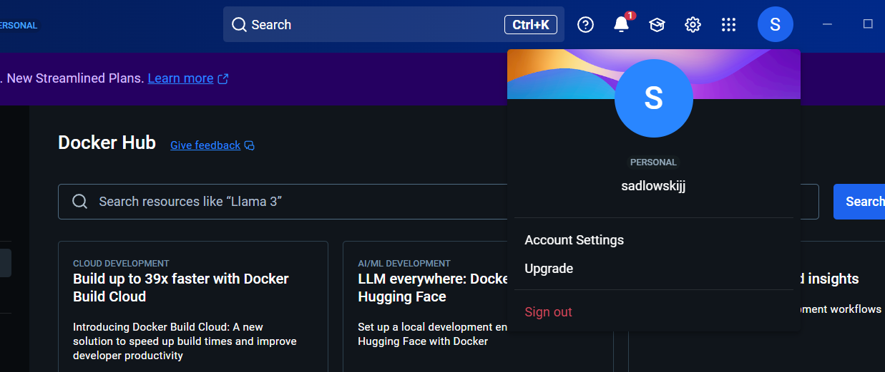
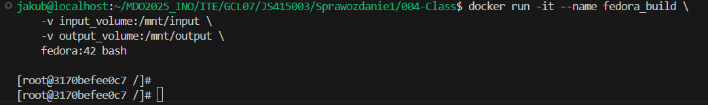

# Sprawozdanie 1

## 001-Class
Niestety źle przemyślałem sprawę i w przypadku pierwszych laboratoriów zapomniałem robić screenów więc postarałem się zrobić później takie screeny które pokazują, że zainstalowałem odpowiednie rzeczy i ustawiłem na githubie.

1. Zainstaluj klienta Git i obsługę kluczy SSH
     

2. Sklonowanie repozytorium za pomocą HTTPS i personal access token.

    Najpierw sklonowałem repozytorium za pomocą HTTPS i później dodałem personal access token do githuba.
    

3. Upewnij się w kwestii dostępu do repozytorium jako uczestnik i sklonuj je za pomocą utworzonego klucza SSH, zapoznaj się [dokumentacją](https://docs.github.com/en/authentication/connecting-to-github-with-ssh/generating-a-new-ssh-key-and-adding-it-to-the-ssh-agent).
   - Utwórz dwa klucze SSH, inne niż RSA, w tym co najmniej jeden zabezpieczony hasłem
   

   - Skonfiguruj klucz SSH jako metodę dostępu do GitHuba
   

   - Sklonuj repozytorium z wykorzystaniem protokołu SSH

   Po sklonowaniu przeze mnie repozytorium za pomocą HTTPS musiałem później zmienić URL zdalnego repozytorium na mojej maszynie stosując komendę:
    
    ```bash
    git remote set-url origin NOWY_URL
    ```

    Efektem tego później są zmienione URL.

    

   - Skonfiguruj 2FA
   

4. Przełącz się na gałąź ```main```, a potem na gałąź swojej grupy


5. Utwórz gałąź o nazwie "inicjały & nr indeksu" np. ```KD232144```. Miej na uwadze, że odgałęziasz się od brancha grupy!
    Na poprzednim screenie widać że utworzyłem gałąź ze swoimi inicjałami.

6. Rozpocznij pracę na nowej gałęzi
   - W katalogu właściwym dla grupy utwórz nowy katalog, także o nazwie "inicjały & nr indeksu" np. ```KD232144```
   

   - Dodaj ten skrypt do stworzonego wcześniej katalogu.

        Na poprzednim screenie już widać, że plik jest w folderze.

   - Skopiuj go we właściwe miejsce, tak by uruchamiał się za każdym razem kiedy robisz commita.

        Tutaj przykład, że rzeczywiście hook działa dobrze.
        

   - Umieść treść githooka w sprawozdaniu.
    ```bash
    commit_msg=$(cat "$1")

    if ! [[ "$commit_msg" =~ ^JS415003.* ]]; then
        echo "ERROR: Commit message musi zaczynać się od 'JS415003'"
        echo "Twoja wiadomość: $commit_msg"
        exit 1
    fi

    exit 0
    ```

## 002-Class
1. Instalacja Dockera na Fedorze
 

2. Rejestracja na Docker Hub
 

3. Pobranie obrazów

    Pobranie każdego z nich to użycie komendy "docker pull [obraz]".
     

4. Uruchom kontener z obrazu `busybox`
   - Pokaż efekt uruchomienia kontenera
   - Podłącz się do kontenera **interaktywnie** i wywołaj numer wersji

    
   
   Wersja busyboxa ukazała mi się dopiero po wpisaniu komendy "busybox --help".

5. Uruchom "system w kontenerze" (czyli kontener z obrazu `fedora` lub `ubuntu`)
   - Zaprezentuj `PID1` w kontenerze i procesy dockera na hoście
   - Zaktualizuj pakiety
   - Wyjdź

     

6. Tworzenie Dockerfile i testowanie działania
    - Treść Dockerfile 

    

    - Budowanie i uruchomienie z pliku Dockerfile

    

7. Sprawdzenie czy kontener się utworzył i czy jest wyłączony.

    

    Po sprawdzeniu wyczyszczenie kontenera.

    

8. Czyszczenie obrazu.

    

9. Dodanie plików do folderu.

    

## 003-Class
* Znajdź repozytorium z kodem dowolnego oprogramowania

Ja wykorzystałem na te laboratoria repozytoria pokazywane przez pana na zajęciach: irssi i node.

* Sklonuj niniejsze repozytorium, przeprowadź build programu (doinstaluj wymagane zależności)


* Uruchom testy jednostkowe dołączone do repozytorium


    A tutaj historia komend:

    

### Przeprowadzenie buildu w kontenerze
Ponów ww.  proces w kontenerze, interaktywnie.
1. Wykonaj kroki `build` i `test` wewnątrz wybranego kontenera bazowego. Tj. wybierz "wystarczający" kontener, np ```ubuntu``` dla aplikacji C lub ```node``` dla Node.js
	* uruchom kontener
	* podłącz do niego TTY celem rozpoczęcia interaktywnej pracy
	* zaopatrz kontener w wymagania wstępne (jeżeli proces budowania nie robi tego sam)
    

	* sklonuj repozytorium

        
	* Skonfiguruj środowisko i uruchom *build*

        Tutaj po kolei tylko dodawałem zależności do komendy do pobrania.
        

        Tutaj zestawienie wszystkich komend użytych przeze mnie na kontenerze.
        

2. Stwórz dwa pliki `Dockerfile` automatyzujące kroki powyżej, z uwzględnieniem następujących kwestii:
	* Kontener pierwszy ma przeprowadzać wszystkie kroki aż do *builda*

        [Dockerfile.irssibld](./003-Class/Dockerfile.irssibld)

        [Dockerfile.nodebld](./003-Class/Dockerfile.nodebld)

        
        
        Tutaj po kolei kroki tworzenia obrazu irssi i niżej pokażę że kontenery rzeczywiście się uruchamiają i testy przechodzą.

        Tutaj w przypadku node.
        

	* Kontener drugi ma bazować na pierwszym i wykonywać testy (lecz nie robić *builda*!)

        [Dockerfile.irssitest](./003-Class/Dockerfile.irssitest)

        [Dockerfile.nodetest](./003-Class/Dockerfile.nodetest)

        Tworzenie obrazu dla irssi.
        

        Tutaj dla node.
        
3. Wykaż, że kontener wdraża się i pracuje poprawnie. Pamiętaj o różnicy między obrazem a kontenerem. Co pracuje w takim kontenerze?

    Tutaj pokazanie utworzonych kontenerów i ich poprawnej pracy za pomocą sprawdzenia czy testy się uruchamiają.
    
    
    

    A żeby odpowiedziec na pytanie, to w takim kontenerze pracuje minimalne środowisko potrzebne dla działania danych repozytoriów.

## 004-Class
### Zachowywanie stanu
* Przygotuj woluminy wejściowy i wyjściowy, o dowolnych nazwach, i podłącz je do kontenera bazowego, z którego rozpoczynano poprzednio pracę

    Na początku przygotowałem dwa woluminy.
    

    Później podłączyłem moje woluminy do kontenera fedora_build.
    

    Kolejny krok to wstępne przygotowanie kontenera fedora.
    

    Sklonowanie repozytorium irssi na wolumin wejściowy.
    

    Tutaj sprawdzenie czy repozytorium sklonowało się poprawnie.
    

* Uruchom kontener, zainstaluj niezbędne wymagania wstępne (jeżeli istnieją), ale *bez gita*
* Sklonuj repozytorium na wolumin wejściowy (opisz dokładnie, jak zostało to zrobione)
* Uruchom build w kontenerze - rozważ skopiowanie repozytorium do wewnątrz kontenera
* Zapisz powstałe/zbudowane pliki na woluminie wyjściowym, tak by były dostępne po wyłączniu kontenera.
* Pamiętaj udokumentować wyniki.
* Ponów operację, ale klonowanie na wolumin wejściowy przeprowadź wewnątrz kontenera (użyj gita w kontenerze)
* Przedyskutuj możliwość wykonania ww. kroków za pomocą `docker build` i pliku `Dockerfile`. (podpowiedź: `RUN --mount`)