# Sprawozdanie 2

## 005-Class, 006-Class, 007-Class

### Utworzenie instancji Jenkinsa

- Uruchom obraz Dockera który eksponuje środowisko zagnieżdżone

    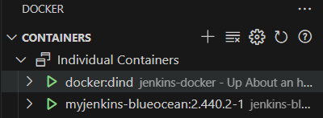
    

- Przygotuj obraz blueocean na podstawie obrazu Jenkinsa (czym się różnią?)

    Na poprzednie sprawozdanie przygotowywałem już setup Jenkinsa z Dockerfila i tutaj jego zawartość. 
    [Dockerfile.jenkins](./Dockerfile.jenkins)

    Blue Ocean nie zastępuje Jenkinsa, ale jest jego rozszerzeniem, oferującym nowocześniejszy interfejs dla tych samych podstawowych funkcji.

- Zaloguj się i skonfiguruj Jenkins
    
    Screen na dowód pomyślnego logowania i konfiguracji, nie posiadam screenów podczas pierwszego logowania.

    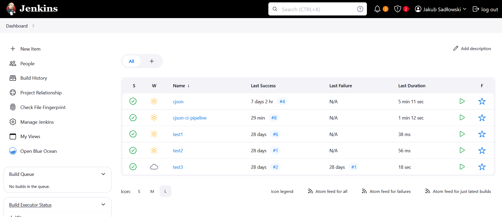

* Konfiguracja wstępna i pierwsze uruchomienie
  * Utwórz projekt, który wyświetla `uname`
    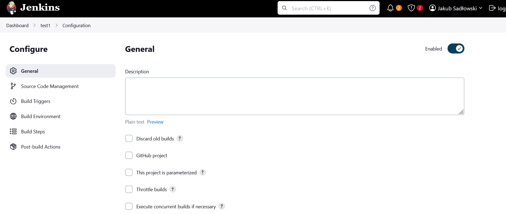
    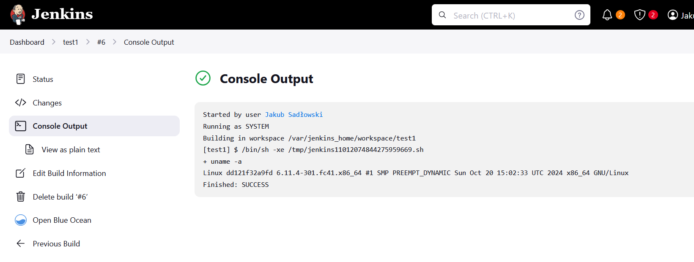
  * Utwórz projekt, który zwraca błąd, gdy... godzina jest nieparzysta
    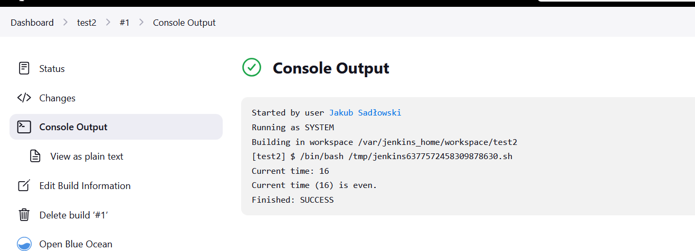
    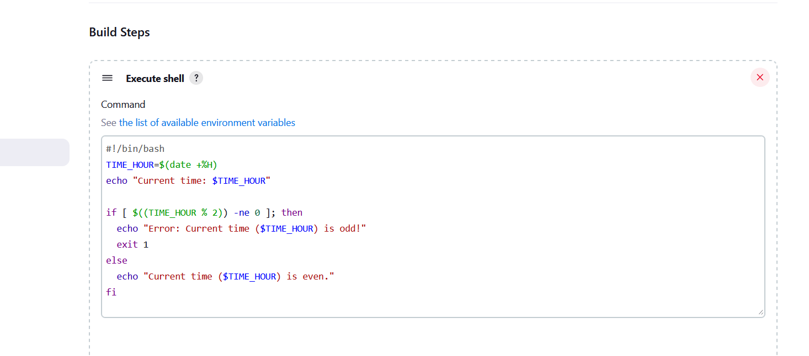
  * Pobierz w projekcie obraz kontenera `ubuntu` (stosując `docker pull`)
    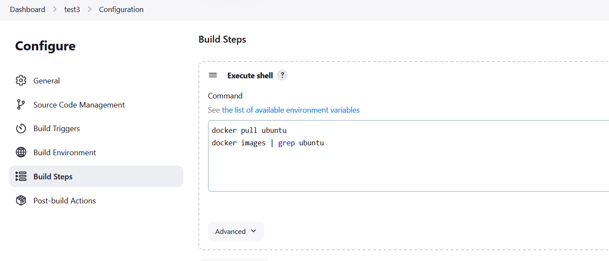
    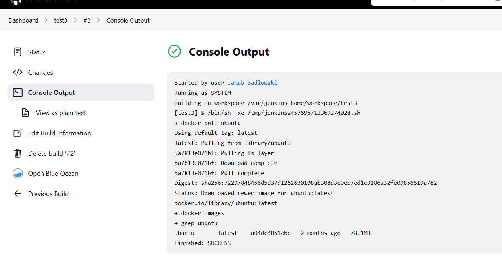

* Utwórz nowy obiekt typu `pipeline`
   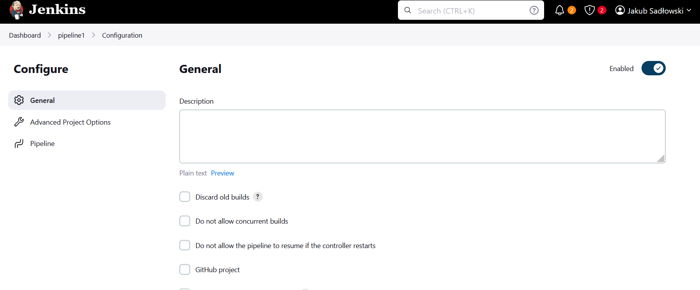 
* Wpisz treść *pipeline'u* bezpośrednio do obiektu (nie z SCM - jeszcze!)
    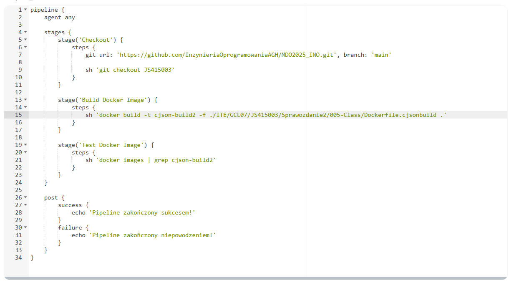
* Zrób *checkout* do swojego pliku Dockerfile (na osobistej gałęzi) właściwego dla *buildera* wybranego w poprzednim sprawozdaniu programu
* Zbuduj Dockerfile
    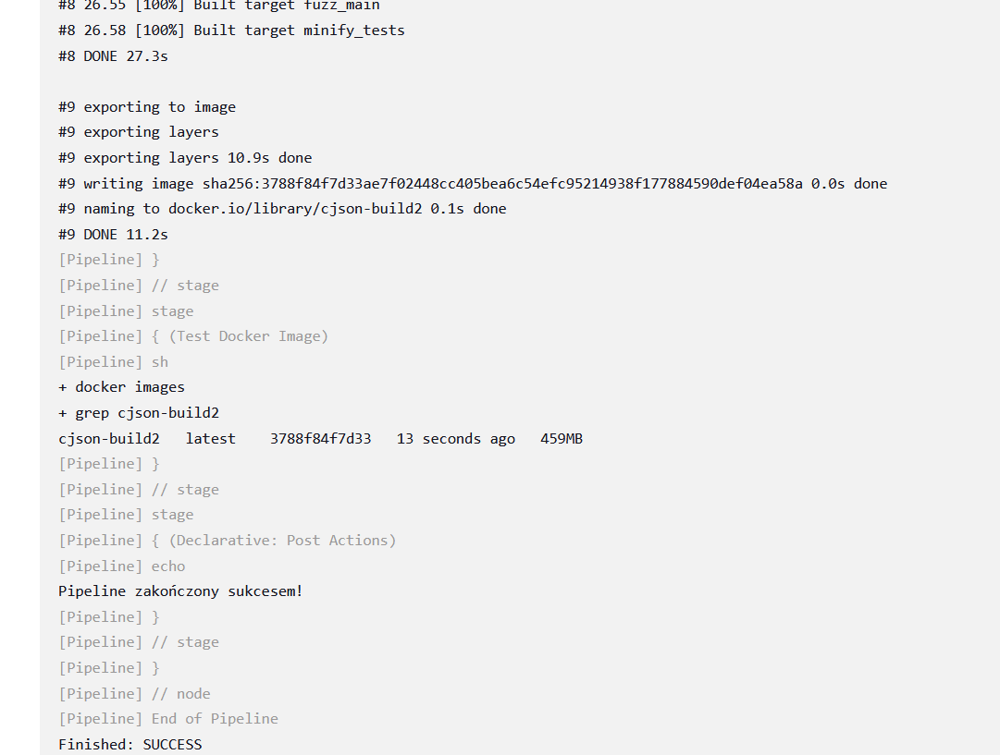
    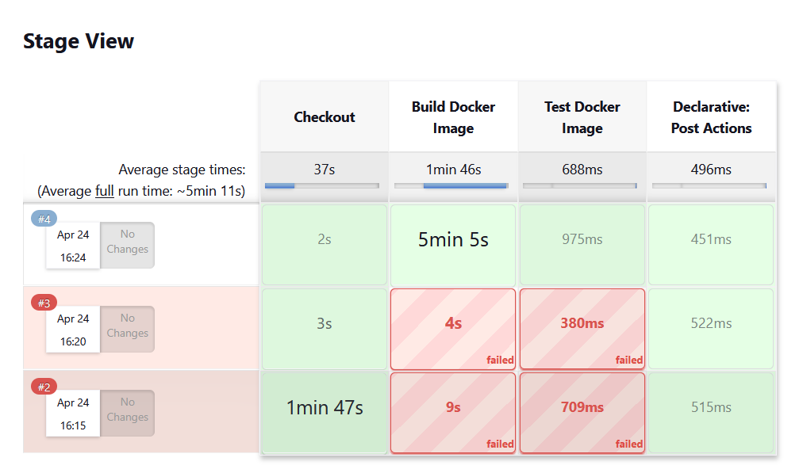
* Uruchom stworzony *pipeline* drugi raz
    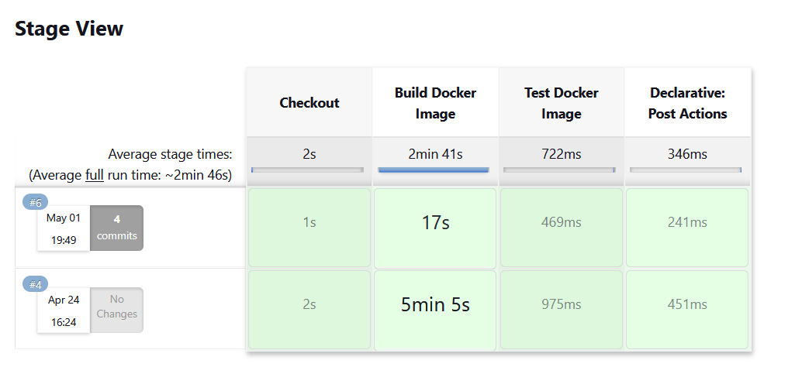

### Kompletny pipeline
Tutaj Jenkinsfile z całym zdefiniowanym pipelinem oraz jego ustawienia na jenkinsie.

[Jenkinsfile](./Jenkinsfile)

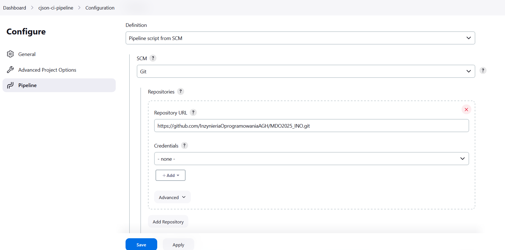
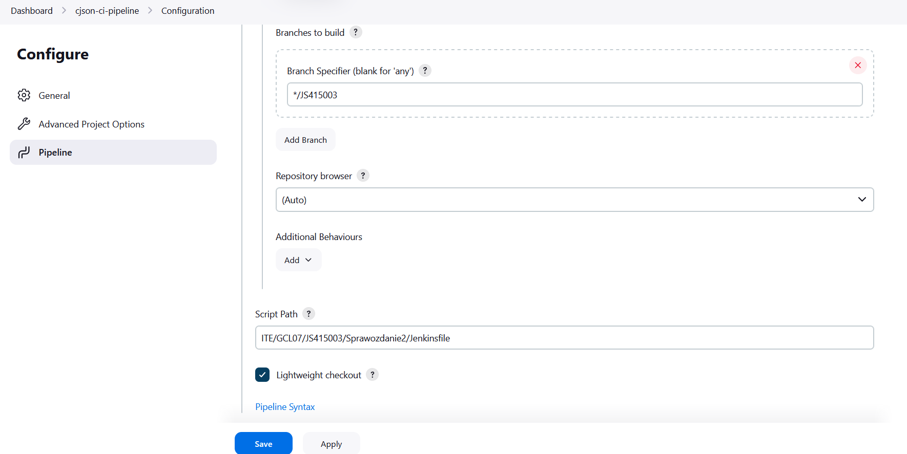

*  Zdefiniowany wewnątrz Jenkinsa obiekt projektowy *pipeline*, realizujący następujące kroki:
  * Kontener `Builder`
    
    [Dockerfile.cjsonbuild](./Dockerfile.cjsonbuild)
    ```dockerfile
    FROM fedora:42

    RUN dnf update -y && \
        dnf install -y \
        git \
        gcc \
        make \
        cmake \
        && dnf clean all

    WORKDIR /cjson-build

    RUN git clone https://github.com/DaveGamble/cJSON.git .

    RUN mkdir build && cd build && \
        cmake -DENABLE_CJSON_TEST=On -DBUILD_SHARED_AND_STATIC_LIBS=On .. && \
        make -j$(nproc)
    ```

    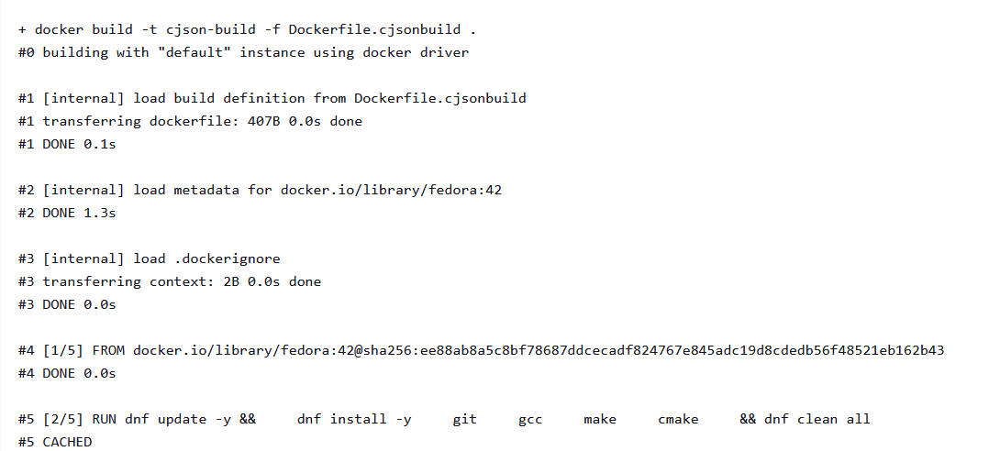
    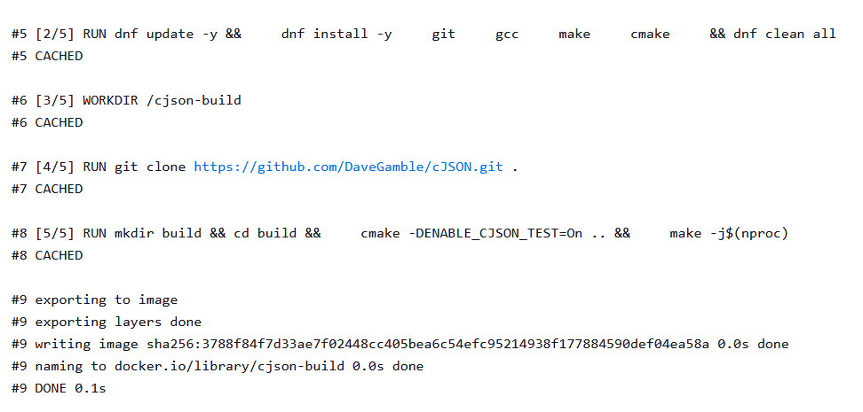
    
  * Obraz testujący, w ramach kontenera `Tester`

    [Dockerfile.cjsontest](./Dockerfile.cjsontest)
    ```dockerfile
    FROM cjson-build

    WORKDIR /cjson-build/build

    CMD ["make", "test"]
    ```
  * `Deploy`

    [Dockerfile.cjsondeploy](./Dockerfile.cjsondeploy)
    ```dockerfile
    FROM fedora:42

    COPY --from=cjson-build /cjson-build/build/libcjson.so /usr/lib/
    COPY --from=cjson-build /cjson-build/cJSON.h /usr/include/

    RUN ldconfig

    COPY example.c /app/example.c
    WORKDIR /app

    RUN dnf install -y gcc && \
        gcc -o example example.c -lcjson && \
        dnf remove -y gcc && \
        dnf clean all

    CMD ["./example"]
    ```
  * `Publish`
    * Przygotowanie wersjonowanego artefaktu, na przykład:
      * Instalator
      * NuGet/Maven/NPM/JAR
      * ZIP ze zbudowanym runtimem
    * Opracuj odpowiednią postać redystrybucyjną swojego artefaktu i/lub obrazu (przygotuj instalator i/lub pakiet, ewentualnie odpowiednio uporządkowany obraz kontenera Docker)
      * Musi powstać co najmniej jeden z tych elementów
      * Jeżeli ma powstać artefakt, dodaj go jako pobieralny obiekt do rezultatów „przejścia” *pipeline’u* Jenkins (https://www.jenkins.io/doc/pipeline/steps/core/).
    * Opcjonalnie, krok `Publish` (w przypadku podania parametru) może dokonywać promocji artefaktu na zewnętrzne *registry*