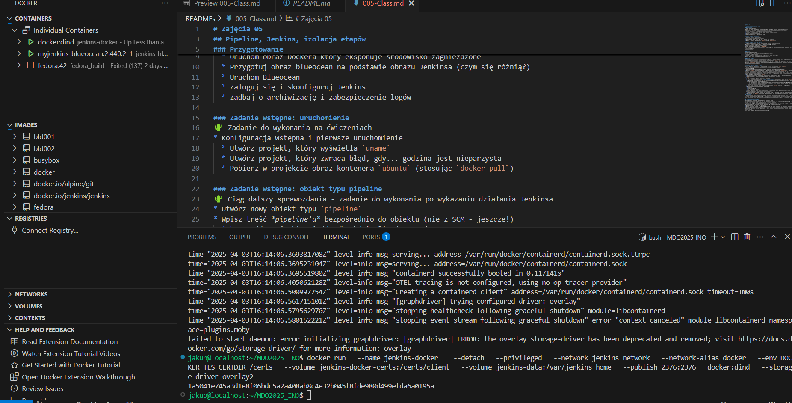

# Sprawozdanie 2

## 005-Class, 006-Class, 007-Class

### Utworzenie instancji Jenkinsa

- Uruchom obraz Dockera który eksponuje środowisko zagnieżdżone

    
    

- Przygotuj obraz blueocean na podstawie obrazu Jenkinsa (czym się różnią?)

    Na poprzednie sprawozdanie przygotowywałem już setup Jenkinsa z Dockerfila i tutaj jego zawartość. 
    [Dockerfile.jenkins](./Dockerfile.jenkins)

    Blue Ocean nie zastępuje Jenkinsa, ale jest jego rozszerzeniem, oferującym nowocześniejszy interfejs dla tych samych podstawowych funkcji.

- Zaloguj się i skonfiguruj Jenkins
    
    Screen na dowód pomyślnego logowania i konfiguracji, nie posiadam screenów podczas pierwszego logowania.

    

* Konfiguracja wstępna i pierwsze uruchomienie
  * Utwórz projekt, który wyświetla `uname`
    
    
  * Utwórz projekt, który zwraca błąd, gdy... godzina jest nieparzysta
    
    
  * Pobierz w projekcie obraz kontenera `ubuntu` (stosując `docker pull`)
    
    

* Utwórz nowy obiekt typu `pipeline`
    
* Wpisz treść *pipeline'u* bezpośrednio do obiektu (nie z SCM - jeszcze!)
    
* Zrób *checkout* do swojego pliku Dockerfile (na osobistej gałęzi) właściwego dla *buildera* wybranego w poprzednim sprawozdaniu programu
* Zbuduj Dockerfile
    
    
* Uruchom stworzony *pipeline* drugi raz
    

### Kompletny pipeline

### Diagramy

* Aktywności

  

* Wdrożeniowy

  

Tutaj Jenkinsfile z całym zdefiniowanym pipelinem oraz jego ustawienia na jenkinsie.

[Jenkinsfile](./Jenkinsfile)

```groovy
pipeline {
    agent any

    environment {
        VERSION = "v${BUILD_NUMBER}"
        CJSON_BUILD = "cjson-build:${VERSION}"
        CJSON_TEST = "cjson-test:${VERSION}"
        CJSON_DEPLOY = "cjson-deploy:${VERSION}"
        PACKAGE_NAME = "cjson-package-${VERSION}"
    }

    stages {
        stage('Cleanup') {
            steps {
                sh '''
                    docker container ls -a -q | xargs -r docker rm -f
                    docker volume ls -q | xargs -r docker volume rm -f
                    docker builder prune --all --force
                    docker images -q | grep -E 'cjson-(build|test|deploy)' | xargs -r docker rmi -f
                '''
            }
        }

        stage('Checkout') {
            steps {
                git url: 'https://github.com/DaveGamble/cJSON.git', branch: 'master'

                dir('project_files') {
                    git url: 'https://github.com/InzynieriaOprogramowaniaAGH/MDO2025_INO.git', branch: 'main'
                    sh 'git checkout JS415003 || echo "Branch not found, continuing with main"'
                }

                sh '''
                    mkdir -p dockerfiles
                    cp project_files/ITE/GCL07/JS415003/Sprawozdanie2/Dockerfile.cjsonbuild dockerfiles/
                    cp project_files/ITE/GCL07/JS415003/Sprawozdanie2/Dockerfile.cjsontest dockerfiles/
                    cp project_files/ITE/GCL07/JS415003/Sprawozdanie2/Dockerfile.cjsondeploy dockerfiles/

                    cp dockerfiles/Dockerfile.cjsonbuild ${WORKSPACE}/
                    cp dockerfiles/Dockerfile.cjsontest ${WORKSPACE}/
                    cp dockerfiles/Dockerfile.cjsondeploy ${WORKSPACE}/
                '''

                sh '''
                    cat > example.c << 'EOT'
#include <stdio.h>
#include <stdlib.h>
#include "cJSON.h"

int main() {
    const char *json_string = "{\\"name\\":\\"cJSON\\", \\"version\\":\\"${VERSION}\\", \\"status\\":\\"deployed\\"}";
    cJSON *json = cJSON_Parse(json_string);

    if (json == NULL) {
        printf("Error parsing JSON\\n");
        return 1;
    }

    cJSON *name = cJSON_GetObjectItemCaseSensitive(json, "name");
    cJSON *version = cJSON_GetObjectItemCaseSensitive(json, "version");
    cJSON *status = cJSON_GetObjectItemCaseSensitive(json, "status");

    printf("Library: %s\\nVersion: %s\\nStatus: %s\\n",
        name->valuestring, version->valuestring, status->valuestring);

    cJSON_Delete(json);
    return 0;
}
EOT
                    sed -i "s/\\\${VERSION}/${VERSION}/g" example.c
                '''
            }
        }

        stage('Build') {
            steps {
                sh 'docker build -t ${CJSON_BUILD} -f Dockerfile.cjsonbuild .'
                sh 'docker tag ${CJSON_BUILD} cjson-build:latest'
                sh 'echo "Build completed at $(date)" > build_time.log'
                archiveArtifacts artifacts: 'build_time.log', fingerprint: true
            }
        }

        stage('Test') {
            steps {
                sh 'docker build -t ${CJSON_TEST} -f Dockerfile.cjsontest .'
                sh 'docker tag ${CJSON_TEST} cjson-test:latest'
                sh '''
                    docker run --name cjson-test-container ${CJSON_TEST} > test_results_${VERSION}.log 2>&1 || \
                    echo "Tests failed with exit code $?" >> test_results_${VERSION}.log
                '''
                sh 'docker cp cjson-test-container:/cjson-build/build/Testing . || echo "Testing directory not found"'
                sh 'docker rm cjson-test-container || true'
                archiveArtifacts artifacts: "test_results_${VERSION}.log", fingerprint: true
                archiveArtifacts artifacts: 'Testing/**/*', fingerprint: true, allowEmptyArchive: true
            }
        }

        stage('SmokeTest') {
    steps {
        sh 'docker build --no-cache -t ${CJSON_DEPLOY} -f Dockerfile.cjsondeploy .'
        sh 'docker run --rm --name cjson-smoke-test ${CJSON_DEPLOY} > smoke_test_${VERSION}.log'
        archiveArtifacts artifacts: "smoke_test_${VERSION}.log", fingerprint: true
    }
}

        stage('Deploy') {
    steps {
        sh '''
            docker rm -f cjson-build-container || true
            docker run --name cjson-build-container -d ${CJSON_BUILD} tail -f /dev/null

            mkdir -p ${PACKAGE_NAME}/lib
            mkdir -p ${PACKAGE_NAME}/include
            mkdir -p ${PACKAGE_NAME}/docs

            docker cp cjson-build-container:/cjson-build/build/libcjson.so.1.7.18 ${PACKAGE_NAME}/lib/ || echo "libcjson.so.1.7.18 not found"
            if [ -f ${PACKAGE_NAME}/lib/libcjson.so.1.7.18 ]; then
                (cd ${PACKAGE_NAME}/lib/ && ln -sf libcjson.so.1.7.18 libcjson.so.1 && ln -sf libcjson.so.1 libcjson.so)
            fi

            docker cp cjson-build-container:/cjson-build/build/libcjson.a ${PACKAGE_NAME}/lib/ || echo "libcjson.a not found"
            docker cp cjson-build-container:/cjson-build/cJSON.h ${PACKAGE_NAME}/include/
            docker cp cjson-build-container:/cjson-build/README.md ${PACKAGE_NAME}/docs/
            docker cp cjson-build-container:/cjson-build/LICENSE ${PACKAGE_NAME}/docs/
            docker cp cjson-build-container:/cjson-build/CHANGELOG.md ${PACKAGE_NAME}/docs/ || echo "CHANGELOG.md not found"

            cat > ${PACKAGE_NAME}/README.txt << 'EOT'
cJSON Library Package ${VERSION}
===========================

This package contains:
- Dynamic library in lib/
- Static library in lib/
- Header files in include/
- Documentation in docs/

To use:
1. Copy libcjson.so* to your system library path or application directory
2. Copy cJSON.h to your include path
3. Compile with -lcjson flag

Example: gcc -o myapp myapp.c -I./include -L./lib -lcjson
EOT
            sed -i "s/\\\${VERSION}/${VERSION}/g" ${PACKAGE_NAME}/README.txt

            docker stop cjson-build-container
            docker rm cjson-build-container

            tar -czvf ${PACKAGE_NAME}.tar.gz ${PACKAGE_NAME}/
        '''
    }
}

        stage('Publish') {
            steps {
                script{
                    archiveArtifacts artifacts: "${PACKAGE_NAME}.tar.gz", fingerprint: true
                }
            }
        }
    }

    post {
        success {
            echo "Pipeline completed successfully! The cJSON library has been built, tested, packaged and published as version ${VERSION}"
        }
        failure {
            echo "Pipeline failed! Check the logs for details."
        }
        always {
            sh '''
                echo "=== Cleaning up containers and temporary files ==="
                docker rm -f cjson-build-container || true
                docker rm -f cjson-test-container || true
                rm -rf ${PACKAGE_NAME} || true
                echo "=== Cleanup done ==="
            '''
        }
    }
}
```


*  Zdefiniowany wewnątrz Jenkinsa obiekt projektowy *pipeline*, realizujący następujące kroki:
  * Kontener `Builder`
    
    [Dockerfile.cjsonbuild](./Dockerfile.cjsonbuild)
    ```dockerfile
    FROM fedora:42

    RUN dnf update -y && \
        dnf install -y \
        git \
        gcc \
        make \
        cmake \
        && dnf clean all

    WORKDIR /cjson-build

    RUN git clone https://github.com/DaveGamble/cJSON.git .

    RUN mkdir build && cd build && \
        cmake -DENABLE_CJSON_TEST=On -DBUILD_SHARED_AND_STATIC_LIBS=On .. && \
        make -j$(nproc)
    ```

    
    
    
  * Obraz testujący, w ramach kontenera `Tester`

    [Dockerfile.cjsontest](./Dockerfile.cjsontest)
    ```dockerfile
    FROM cjson-build:latest

    WORKDIR /cjson-build/build

    CMD ["make", "test"]
    ```
    

  * `Deploy`

    [Dockerfile.cjsondeploy](./Dockerfile.cjsondeploy)
    ```dockerfile
    FROM fedora:42

    COPY --from=cjson-build /cjson-build/build/libcjson.so /usr/lib/
    COPY --from=cjson-build /cjson-build/cJSON.h /usr/include/

    RUN ldconfig

    COPY example.c /app/example.c
    WORKDIR /app

    RUN dnf install -y gcc && \
        gcc -o example example.c -lcjson && \
        dnf remove -y gcc && \
        dnf clean all

    CMD ["./example"]
    ```
    

  * `Publish`
    
    Zbudowana paczka na linuxa z biblioteką cjson jest eksponowana jako artefakt.

  * `Przetestowanie działania pipeline`

    Jak widać na screenie poniżej wszystkie etapy przebiegły pomyślnie.

    

    A tutaj poniżej przetestowanie już gotowej paczki na osobnej maszynie z ubuntu.

    

    Kod użyty do testu z oficjalnego README.

    ```c
    #include <stdio.h>

    #include <stdlib.h>

    #include "cJSON.h"


    char *create_monitor(void)

    {

        const unsigned int resolution_numbers[3][2] = {

            {1280, 720},

            {1920, 1080},

            {3840, 2160}

        };


        char *string = NULL;

        cJSON *name = NULL;

        cJSON *resolutions = NULL;

        cJSON *resolution = NULL;

        cJSON *width = NULL;

        cJSON *height = NULL;

        size_t index = 0;


        cJSON *monitor = cJSON_CreateObject();

        if (monitor == NULL)

        {

            goto end;

        }


        name = cJSON_CreateString("Awesome 4K");

        if (name == NULL)

        {

            goto end;

        }

        cJSON_AddItemToObject(monitor, "name", name);


        resolutions = cJSON_CreateArray();

        if (resolutions == NULL)

        {

            goto end;

        }

        cJSON_AddItemToObject(monitor, "resolutions", resolutions);


        for (index = 0; index < 3; ++index)

        {

            resolution = cJSON_CreateObject();

            if (resolution == NULL)

            {

                goto end;

            }

            cJSON_AddItemToArray(resolutions, resolution);


            width = cJSON_CreateNumber(resolution_numbers[index][0]);

            if (width == NULL)

            {

                goto end;

            }

            cJSON_AddItemToObject(resolution, "width", width);


            height = cJSON_CreateNumber(resolution_numbers[index][1]);

            if (height == NULL)

            {

                goto end;

            }

            cJSON_AddItemToObject(resolution, "height", height);

        }


        string = cJSON_Print(monitor);

        if (string == NULL)

        {

            fprintf(stderr, "Failed to print monitor.\n");

        }


    end:

        cJSON_Delete(monitor);

        return string;

    }


    int main(void)

    {

        char *monitor_json = create_monitor();

        if (monitor_json == NULL)

        {

            fprintf(stderr, "Error creating monitor JSON.\n");

            return EXIT_FAILURE;

        }


        printf("%s\n", monitor_json);

        free(monitor_json);

        return EXIT_SUCCESS;

    }
    ```

## Objaśnienie etapów

### Checkout/Clone

Etap Checkout służy do pobrania kodu źródłowego i plików konfiguracyjnych niezbędnych do procesu budowania. Podczas tego etapu klonowane jest repozytorium cJSON z GitHub, klonowane jest repozytorium przedmiotowe z GitHub, kopiowane są pliki Dockerfile potrzebne do budowy, testowania i wdrażania, a także tworzony jest przykładowy plik C do testowania biblioteki cJSON. Na tym etapie przygotowywane są wszystkie niezbędne pliki źródłowe i konfiguracyjne, które będą używane w kolejnych etapach procesu CI.

### Build

Etap Build odpowiada za zbudowanie biblioteki cJSON. W ramach tego etapu tworzony jest obraz Docker cjson-build na podstawie Dockerfile.cjsonbuild, tworzony jest tag "latest" dla zbudowanego obrazu, zapisywany jest znacznik czasu budowy do pliku build_time.log, który następnie jest archiwizowany jako artefakt. Ten etap kompiluje kod źródłowy biblioteki cJSON, tworząc biblioteki statyczne i dynamiczne, wykorzystując do tego dedykowany obraz Docker zawierający wszystkie niezbędne narzędzia.

### Test

Etap Test ma na celu uruchomienie testów dla zbudowanej biblioteki. W ramach tego etapu tworzony jest obraz Docker cjson-test na podstawie Dockerfile.cjsontest,uruchamiany jest kontener testowy, a wyniki testów zapisywane są do pliku test_results_v.log. Ten etap weryfikuje, czy zbudowana biblioteka działa poprawnie.

### SmokeTest

Etap SmokeTest służy do przeprowadzenia prostego testu funkcjonalnego zbudowanej biblioteki. W ramach tego etapu tworzony jest obraz Docker cjson-deploy na podstawie Dockerfile.cjsondeploy oraz uruchamiana jest przykładowa aplikacja w kontenerze. Ten etap sprawdza, czy zbudowana biblioteka może być poprawnie zintegrowana z przykładową aplikacją i czy wykonuje podstawowe funkcje, stanowiąc szybki test funkcjonalny po kompilacji.

### Deploy

Etap Deploy ma na celu przygotowanie pakietu z biblioteką cJSON gotowego do dystrybucji. W ramach tego etapu uruchamiany jest kontener build w trybie detached, tworzona jest struktura katalogów dla pakietu, kopiowane są biblioteki, pliki nagłówkowe i dokumentacja z kontenera, tworzone są odpowiednie dowiązania symboliczne dla bibliotek, generowany jest plik README.txt z instrukcjami użycia, a wszystkie pliki pakowane są do archiwum tar.gz. Ten etap przygotowuje bibliotekę do dystrybucji, tworząc pakiet zawierający wszystkie niezbędne pliki i dokumentację.

### Publish

Etap Publish służy do publikacji zbudowanego pakietu jako artefaktu Jenkins. W ramach tego etapu archiwizowane jest utworzone archiwum tar.gz jako artefakt Jenkins. Ten etap sprawia, że zbudowany pakiet jest dostępny do pobrania z Jenkins jako artefakt, co umożliwia łatwe udostępnianie lub dalsze wykorzystanie biblioteki.