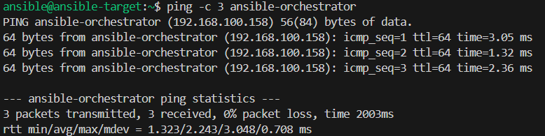
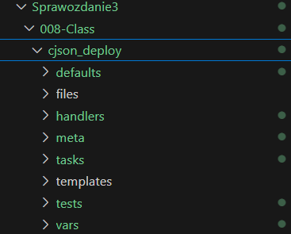

# Sprawozdanie 3

## 008-Class

Pierwszym zadaniem była instalacja zarządcy ansible na głównej maszynie fedory na której były robione wszystkie poprzednie zadania oraz nowej maszyny nie posiadającej zainstalowanego ansible.

Na poniższym zrzucie ekranu widać instalacje wszystkich potrzebnych dependencji do wykonania kolejnych zadań na maszynie ansible-target.

Tutaj instalacja ansible na maszynie ansible-orchestrator (maszyna główna z fedorą).

Włączenie migawki dla maszyny ansible-target.

Tutaj pokazanie końcowego efektu po odpowiednim przydzieleniu rozwiązywania nazw maszyn w DNS oraz połączenie się głównej maszyny z ansible-target. 

Poniżej komendy użyte do przydzielenia nowych hostname innych niż localhost.

Przypisanie odpowiednich ip w pliku etc/hosts.

Test łączności z ansible-orchestrator do ansible-target.

Tutaj też test łączności, ale przypadek odwrotny.

Plik inwentaryzacji [inventory.yml](008-Class/inventory.yml)

Wykonanie komendy ansible pingall wykonane pomyślnie.

Tutaj wykonanie komendy pingall ale za pomocą playbooka ansible. [pingall-playbook.yml](008-Class/playbooks/pingall-playbook.yml)

Komenda dokonująca update pakietów za pomocą ansible playbook. [update-playbook.yml](008-Class/playbooks/update-playbook.yml)

Restart uslugi rngd i sshd. [restartsshd-playbook.yml](008-Class/playbooks/restartsshd-playbook.yml)

Odpięcie karty sieciowej od maszyny.

Wysłanie żądania do maszyny z wyłączoną kartą sieciową.

Kolejnym etapem było wysłanie utworzonego artefaktu z pipelina do maszyny ansible-target w moim przypadku dla biblioteki cJSON była spakowana biblioteka, którą musiałem przesłać na maszynę.

Utworzenie szkieletu za pomocą ansible-galaxy.

Wszystkie kroki pomyślnie wykonane dla playbooka deploy_cjson.yml. [deploy_cjson.yml](008-Class/deploy_cjson.yml)

