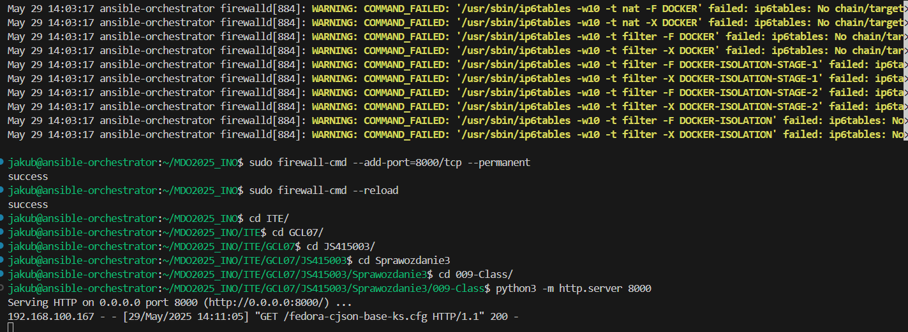
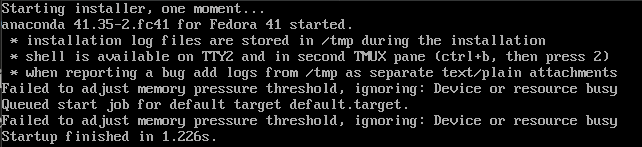
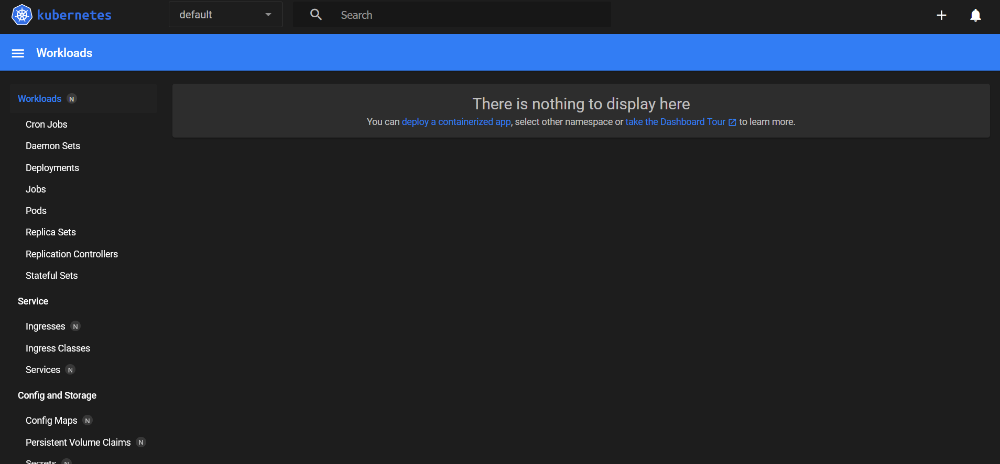
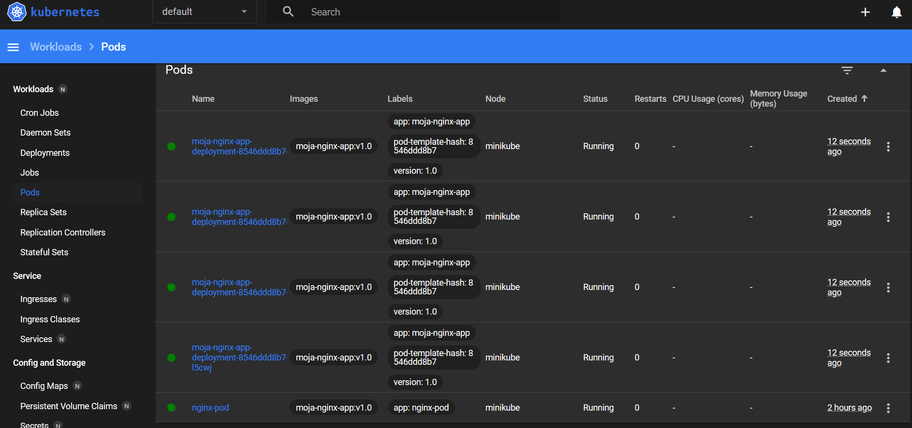
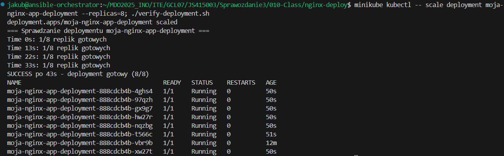
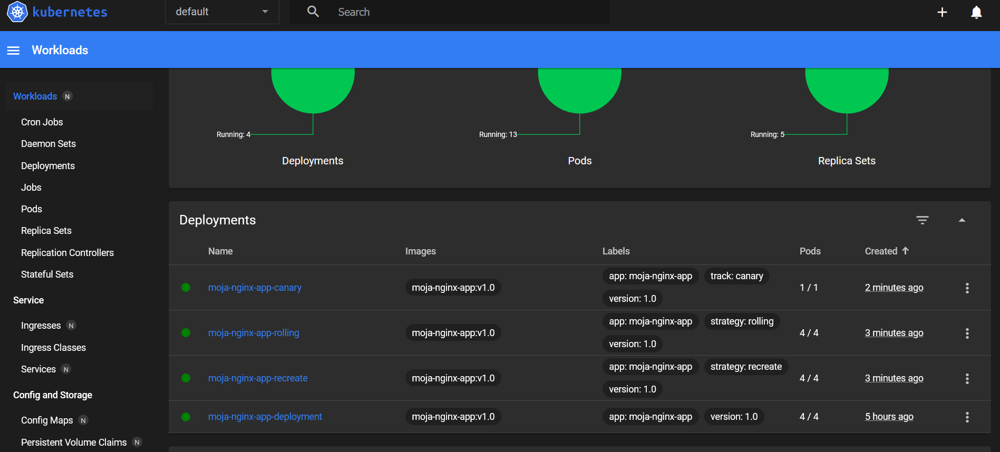

# Sprawozdanie 3

## 008-Class

Pierwszym zadaniem była instalacja zarządcy ansible na głównej maszynie fedory na której były robione wszystkie poprzednie zadania oraz nowej maszyny nie posiadającej zainstalowanego ansible.

Na poniższym zrzucie ekranu widać instalacje wszystkich potrzebnych dependencji do wykonania kolejnych zadań na maszynie ansible-target.


Tutaj instalacja ansible na maszynie ansible-orchestrator (maszyna główna z fedorą).


Włączenie migawki dla maszyny ansible-target.


Tutaj pokazanie końcowego efektu po odpowiednim przydzieleniu rozwiązywania nazw maszyn w DNS oraz połączenie się głównej maszyny z ansible-target. 


Poniżej komendy użyte do przydzielenia nowych hostname innych niż localhost.


Przypisanie odpowiednich ip w pliku etc/hosts.


Test łączności z ansible-orchestrator do ansible-target.


Tutaj też test łączności, ale przypadek odwrotny.


Plik inwentaryzacji [inventory.yml](008-Class/inventory.yml)


Wykonanie komendy ansible pingall wykonane pomyślnie.


Tutaj wykonanie komendy pingall ale za pomocą playbooka ansible. [pingall-playbook.yml](008-Class/playbooks/pingall-playbook.yml)


Komenda dokonująca update pakietów za pomocą ansible playbook. [update-playbook.yml](008-Class/playbooks/update-playbook.yml)


Restart uslugi rngd i sshd. [restartsshd-playbook.yml](008-Class/playbooks/restartsshd-playbook.yml)


Odpięcie karty sieciowej od maszyny.


Wysłanie żądania do maszyny z wyłączoną kartą sieciową.


Kolejnym etapem było wysłanie utworzonego artefaktu z pipelina do maszyny ansible-target w moim przypadku dla biblioteki cJSON była spakowana biblioteka, którą musiałem przesłać na maszynę.

Utworzenie szkieletu za pomocą ansible-galaxy.


Wszystkie kroki pomyślnie wykonane dla playbooka deploy_cjson.yml. [deploy_cjson.yml](008-Class/deploy_cjson.yml)


## 009-Class

Celem tych zajęć było zainstalowanie nowej maszyny za pomocą odpowiednio napisanego pliku kickstart, aby znajdowały się na niej odpowiednie pliki z wcześniejszego pipelina.

Skopiowanie pliku anaconda [anaconda-ks.cfg](009-Class/anaconda-ks.cfg) z maszyny głównej za pomocą komendy scp.


Uruchomienie instalatora netinst dla fedory.


Udostępnienie pliku kickstart [fedora-cjson-base-ks.cfg](009-Class/fedora-cjson-base-ks.cfg) przez serwer http. Dla portu 8000 musiałem również wyłączyć firewall aby móc uzyć pliku.


Tutaj pokazanie, że plik jest widziany przez maszynę docelową.


Tutaj jak podaję ścieżkie do pliku kickstart, ale rozmawiałem z panem i mi pan pomógł rozwiązać problem i tutaj jest po prostu zrzut ekranu co robiłem źle ponieważ ten parametr powinien być podawany po quiet.


Tutaj uruchomienie instalacji.




System pomyślnie zainstalowany z podstawową konfiguracją.


## 010-Class

Celem tych laboratoriów była instalacja kontenera kubernetes oraz wdrożenie kontenera z wybrana aplikacją na kubernetes w moim przypadku było to nginx.

Pobrania kontenera minikube.


Uruchomienie kontenera minikube za pomocą minikube start.


Ustawienie aliasu.


Uruchomienie dashboarda kubernetes.



Plik dockerfile [Dockerfile.v1](010-Class/nginx-deploy/Dockerfile.v1) z moją aplikacją oraz po kolei kroki z załadowaniem obrazu aplikacji do kubernetes.


Uruchomienie poda z aplikacją oraz port forwarding i efekt końcowy.


Kolejnym krokiem były pliki wdrożenia napisane w yamlu do postawienia aplikacji. 

[nginx-deployment.yml](010-Class/nginx-deploy/nginx-deployment.yml)

[nginx-service.yml](010-Class/nginx-deploy/nginx-service.yml)


Efekt wdrożenia deploymentu.



## 011-Class
Celem tego laboratorium było testowanie funkcji skalowania ilości podów i działania kubernees w przypadku błędnych implementacji oraz zastosowanie różnych strategii wdrożeń.

Pierwsze kroki to implementacja dockerfile plików z czego w moim przypadku zrobiłem dwa, ponieważ nei miałem pojęcia co mam jeszcze dodać w nowym obrazie, ponieważ swoją własną implementację strony w nginx miałem już na poprzednie laboratoria więc mam podstawową wersję obrazu i wadliwą tylko.

[Dockerfile.v1](010-Class/nginx-deploy/Dockerfile.v1)

[Dockerfile.v2](010-Class/nginx-deploy/Dockerfile.v2)

Utworzenie obrazów.


Kolejne kroki to zwiększenie ilości replik do 8.



Zmniejszenie do 1 repliki.


Zmniejszenie do 0 replik.


Przywrócenie do pierwotnego stanu 4 replik.


Uruchomienie deploymentu z obrazem, który kończy się z błędem.


Sprawdzenie czy wdrożenie zadziałało i przywrócenie stanu do poprzedniego działającego deploymentu.


### Strategie wdrożeń

Canary
```yaml
apiVersion: apps/v1
kind: Deployment
metadata:
  name: moja-nginx-app-canary
  labels:
    app: moja-nginx-app
    track: canary
    version: "1.0"
spec:
  replicas: 1
  selector:
    matchLabels:
      app: moja-nginx-app
      version: "1.0"
  template:
    metadata:
      labels:
        app: moja-nginx-app
        version: "1.0"
        track: canary
    spec:
      containers:
        - name: moja-nginx-app
          image: moja-nginx-app:v1.0
          imagePullPolicy: Never
          ports:
            - containerPort: 80
              name: http
          livenessProbe:
            httpGet:
              path: /
              port: 80
            initialDelaySeconds: 5
            periodSeconds: 30
            timeoutSeconds: 3
            failureThreshold: 3
          readinessProbe:
            httpGet:
              path: /
              port: 80
            initialDelaySeconds: 5
            periodSeconds: 10
            timeoutSeconds: 3
            failureThreshold: 3
          resources:
            requests:
              memory: "64Mi"
              cpu: "50m"
            limits:
              memory: "128Mi"
              cpu: "100m"
      restartPolicy: Always
```

Recreate
```yaml
apiVersion: apps/v1
kind: Deployment
metadata:
  name: moja-nginx-app-recreate
  labels:
    app: moja-nginx-app
    strategy: recreate
    version: "1.0"
spec:
  replicas: 4
  strategy:
    type: Recreate
  selector:
    matchLabels:
      app: moja-nginx-app
      version: "1.0"
  template:
    metadata:
      labels:
        app: moja-nginx-app
        version: "1.0"
        strategy: recreate
    spec:
      containers:
        - name: moja-nginx-app
          image: moja-nginx-app:v1.0
          imagePullPolicy: Never
          ports:
            - containerPort: 80
              name: http
          livenessProbe:
            httpGet:
              path: /
              port: 80
            initialDelaySeconds: 5
            periodSeconds: 30
            timeoutSeconds: 3
            failureThreshold: 3
          readinessProbe:
            httpGet:
              path: /
              port: 80
            initialDelaySeconds: 5
            periodSeconds: 10
            timeoutSeconds: 3
            failureThreshold: 3
          resources:
            requests:
              memory: "64Mi"
              cpu: "50m"
            limits:
              memory: "128Mi"
              cpu: "100m"
      restartPolicy: Always
```

Rolling Update

```yaml
apiVersion: apps/v1
kind: Deployment
metadata:
  name: moja-nginx-app-rolling
  labels:
    app: moja-nginx-app
    strategy: rolling
    version: "1.0"
spec:
  replicas: 4
  strategy:
    type: RollingUpdate
    rollingUpdate:
      maxUnavailable: 2
      maxSurge: 25%
  selector:
    matchLabels:
      app: moja-nginx-app
      version: "1.0"
  template:
    metadata:
      labels:
        app: moja-nginx-app
        version: "1.0"
        strategy: rolling
    spec:
      containers:
        - name: moja-nginx-app
          image: moja-nginx-app:v1.0
          imagePullPolicy: Never
          ports:
            - containerPort: 80
              name: http
          livenessProbe:
            httpGet:
              path: /
              port: 80
            initialDelaySeconds: 5
            periodSeconds: 30
            timeoutSeconds: 3
            failureThreshold: 3
          readinessProbe:
            httpGet:
              path: /
              port: 80
            initialDelaySeconds: 5
            periodSeconds: 10
            timeoutSeconds: 3
            failureThreshold: 3
          resources:
            requests:
              memory: "64Mi"
              cpu: "50m"
            limits:
              memory: "128Mi"
              cpu: "100m"
      restartPolicy: Always
```

Wdrożenie strategii


Sprawdzenie czy wdrożenia przbiegły pomyślnie.

