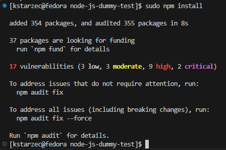

# Sprawozdanie z laboratoriów 
Karolina Starzec

## **Laboratorium 1**

## 1. Instalacja Gita i obsługi kluczy SSH
Zainstalowano system kontroli wersji Git oraz skonfigurowano obsługę kluczy SSH na systemie Fedora. Następnie dla potwierdzenia poprawności konfiguracji, wykonałam komendy:

### Sprawdzenie wersji Gita
```bash
git --version
```

### Sprawdzenie połączenia SSH z GitHubem
```bash
ssh -T git@github.com
```


## 2. Klonowanie repozytorium prze SSH

Po udanej konfiguracji klucza SSH, sklonowano repozytorium: 

```bash
git clone git@github.com:InzynieriaOprogramowaniaAGH/MDO2025_INO.git
```
## 3. Tworzenie gałęzi

### Przełączenie się na gałąź mojej grupy:
```bash
git checkout main
git checkout GCL07
```
### Utworzenie własnej gałęzi `KS415019` na bazie gałęzi grupowej:

```bash
git checkout -b KS415019
```


## 4. Praca na mojej gałęzi

W folderze grupy `GCL07` utworzono podkatalog `KS415019`.

### Napisano Git Hooka `commit-msg` zawierający następującą treść:

```bash
#!/bin/sh
MSG_FILE=$1
COMMIT_MSG=$(cat "$MSG_FILE")

if ! echo "$COMMIT_MSG" | grep -q "^KS415019"; then
  echo "Błąd: Każdy commit message musi zaczynać się od \"KS415019\"" >&2
  exit 1
fi

exit 0
```
### Umieszczenie hooka w katalogu oraz aktywacja
Plik `commit-msg` został dodany do katalogu `KS415019`, a następnie skopiowany do `.git/hooks/` i nadano mu uprawnienia do wykonania:

```bash
cp commit-msg ../../../.git/hooks/
chmod +x ../../../.git/hooks/commit-msg
```


### Test działania hooka – niepoprawny commit

Próba wykonania commita bez prefiksu zakończyła się błędem:

```bash
git commit -m "ok"
```


### Test działania hooka – poprawny commit

Wykonano commit z poprawnym prefixem:

```bash
git commit -m "KS415019: dodanie hooka"
```
## 4. Wysłanie zmian do zdalnego repozytorium

```bash
git push --set-upstream origin KS415019
```


## **Laboratorium 2**

## 1. Instalacja Dockera
Docker został zainstalowany na systemie Fedora.

```bash
sudo dnf install -y docker
```
## 2. Rejestracja w DockerHub i przeglądanie obrazów
Zarejestrowano konto i zapoznano się z obrazami: `ubuntu`, `busybox`, `fedora`, `mysql`, `hello-world`.

```bash
docker login
```


## 3. Pobranie obrazów
```bash
sudo docker pull hello-world
sudo docker pull busybox
sudo docker pull ubuntu
sudo docker pull fedora
sudo docker pull mysql
```


## 4. Uruchomienie kontenera z busybox
```bash
sudo docker run busybox echo "Kontener busybox działa!"
``` 


## 5. Interaktywne połączenie z kontenerem busybox i wywołanie numeru wersji

```bash
sudo docker exec -it busybox sh
```


## 6. Uruchomienie systemu w kontenerze (Ubuntu)
```bash
sudo docker run --name ubuntu -dit ubuntu bash
sudo docker ps
```
 


### PID1 w kontenerze:

```bash
sudo docker exec -it ubuntu bash
ps aux
```
  


### Procesy dockera na hoście:

```bash
ps aux | grep docker
```


### Aktualizacja pakietów w kontenerze Ubuntu:

```bash
apt update && apt upgrade -y
```


## 7. Stworzenie pliku Dockerfile

```bash
FROM ubuntu:latest

LABEL maintainer="Karolina Starzec"

RUN apt update && apt install -y git && rm -rf /var/lib/apt/lists/*

WORKDIR /app

RUN git clone https://github.com/InzynieriaOprogramowaniaAGH/MDO2025_INO

CMD ["bash"]
```

## 8. Budowa własnego obrazu z Dockerfile

```bash
sudo docker build -t obraz .
```
 


## 9. Uruchomienie kontenera z własnego obrazu

```bash
sudo docker run --name Kontener -it obraz
```
### Weryfikacja obecności repozytorium i gita

```bash
ls /app
git --version
```
 


## 10. Usunięcie kontenerów i wyczyszczenie obrazów:
### Wyświetlenie obrazów:

```bash
sudo docker images
```


### Usunięcie kontenerów:
```bash
sudo docker stop $(sudo docker ps -q)
sudo docker rm $(sudo docker ps -aq)
```
### Usunięcie obrazów:

```bash
sudo docker rmi $(sudo docker images -q)
```


## **Laboratorium 3**

## 1. Wybór repozytorium

Wybrane repozytorium: **[dummy-nodejs-todc](https://github.com/todogroup/dummy-nodejs-todc)**  
## 2. Klonowanie repozytorium i instalacja zależności

### Klonowanie repozytorium
```bash
git clone https://github.com/todogroup/dummy-nodejs-todc.git
```


### Instalacja zależności
```bash
cd dummy-nodejs-todc
sudo dnf install nodejs
sudo npm install
```



### Weryfikacja wersji node i npm

```bash
node --version
npm --version
``` 


### Uruchomienie testów 

```bash
npm test
```


## 3. Praca w kontenerze (Node.js)

```bash
sudo docker run -it --rm node:22.14.0 bash
```
 


### Wewnątrz kontenera:
Sklonowanie repozytorium:
```bash
git clone https://github.com/todogroup/dummy-nodejs-todc.git
```
Instalacja zależności:
```bash
npm install
```


Test dla potwierdzenia poprawności działania aplikacji:
```bash
npm test
```


## 6. Stworzenie dwóch plików Dockerfile 

### Dockerfile.build
Pierwszy Dockerfile.build ma za zadanie przygotować środowisko do kompilacji aplikacji. Obejmuje to wybór obrazu bazowego (np. node:22.14.0), utworzenie katalogu roboczego, pobranie kodu źródłowego z repozytorium, instalację wymaganych zależności oraz wykonanie procesu budowania aplikacji, jeśli jest on zdefiniowany.

```Dockerfile
FROM node:22.14.0
RUN git clone https://github.com/devenes/node-js-dummy-test
WORKDIR /node-js-dummy-test
RUN npm install
```
### Budowanie kontenera buildowego:
```bash
sudo docker build -t kontener_build -f ./Dockerfile.build .
```


### Dockerfile.test
Drugi Dockerfile.test służy do uruchomienia testów.

```Dockerfile
FROM kontener_build
RUN npm test
```
### Budowanie kontenera testowego:

```bash
sudo docker build -t kontener_test -f ./Dockerfile.test .
```


## 7. Sprawdzenie działania

### Sprawdzeie listy dostępnych obrazów:

```bash
sudo docker images
```


### Uruchomienie kontenera buildowego w trybie interaktywnym:

```bash
sudo docker run -it --rm kontener_build bash
```

### Sprawdzenie katalogu node_modules:

```bash
ls -l node_modules
```


### Uruchomienie kontenera testowego w trybie interaktywnym:

```bash
sudo docker run --rm kontener_test bash
```
### Wykonanie testu:

```bash
npm test
```


## **Laboratorium 4**

## 1. Zachowywanie stanu
### Utworzono wolumin wejściowy in_vol i wyjściowy out_vol.

```bash
 sudo docker volume create in_vol
 sudo docker volume create out_vol
```


### Uruchomiono kontener bazowy oraz podłączono go do woluminów

```bash
 sudo docker run -it -v in_vol:/input -v out_vol:/output --name kontenerlab4 node:slim /bin/bash
```


### Sklonowanie repozytorium na wolumin wejściowy in_vol

Po sprawdzeniu lokalizacji pliku za pomocą:
```bash
 sudo docker volume inspect in_vol
```


W odpowiednim katalogu przełączono się na root, aby sklonować repozytorium bezpośrednio do woluminu:

```bash
 git clone https://github.com/devenes/node-js-dummy-test.git
```


### Instalacja zależności w kontenerze

```bash
npm install
```


### Zapisanie plików na woluminie in_vol

```bash
cp -r /input/ /output
```
### Weryfikacja poprawności

```bash
ls -l /var/lib/docker/volumes/in_vol/_data
ls -l /var/lib/docker/volumes/out_vol/_data
```


### Klonowanie repozytorium na wolumin wewnątrz kontenera

Instalacja gita wewnątrz kontenera:
```bash
sudo apt update && apt install git
```


Różnica w stosunku do poprzedniej metody jest taka, że wcześniej przechodziło się do /var/lib/docker/volumes/in_vol/_data na hoście i tam wykonywało git clone. Teraz wszystko odbywa się wewnątrz kontenera.

### Możliwość wykonania ww. kroków za pomocą docker build i pliku Dockerfile. 
Zamiast klonować repozytorium i budować projekt „ręcznie” wewnątrz kontenera, wszystkie te kroki można zdefiniować w pliku Dockerfile i uruchomić za pomocą polecenia docker build. Dzięki temu proces jest w pełni zautomatyzowany. Mechanizm RUN --mount pozwala np. bezpiecznie korzystać z kluczy SSH do prywatnych repozytoriów, unikając ich trwałego zapisania w warstwach obrazu. Dodatkowo, w wieloetapowej konfiguracji  można oddzielić etap instalacji i kompilacji od finalnego obrazu, co zmniejsza rozmiar i zwiększa bezpieczeństwo gotowego kontenera.

## 2. Eksportowanie portu


### Pobrano iperf3:
```bash
sudo dnf -y install iperf3
```


###  Uruchomieno serwer wewnątrz nowego kontenera:
```bash
sudo docker run --name serwer1 -p 5201:5201 networkstatic/iperf3 -s
```
### Sprawdzono jego lokalizację:

```bash
sudo docker inspect -f '{{range.NetworkSettings.Networks}}{{.IPAddress}}{{end}}' serwer1
```


### Nawiązano połączenie z drugiego kontenera:

```bash
sudo docker run --name klient1  networkstatic/iperf3 -c 172.17.0.3
```


### Utworzono sieć mostkową:

```bash
sudo docker network create --driver bridge siec
```


### Ponownie uruchomiono nowe kontenery z użyciem sieci:

Kontener serwerowy:
```bash
sudo docker run --rm -it --name serwer --network siec networkstatic/iperf3 -s
```
Kontener klienta:
```bash
sudo docker run --rm -it --name klient --network siec networkstatic/iperf3 -c serwer
```


Wykazano przepustowość na poziomie około 28.1 Gbit/s.

## 3. Instalacja Jenkinsa

W celu uruchomienia środowiska Jenkins z dostępem do Dockera, wykorzystano kontener w trybie uprzywilejowanym z mapowaniem portów 8080 i 50000 (komunikacja z agentami), a także woluminami do zachowania danych Jenkinsa (jenkins_home) oraz umożliwienia Jenkinsowi korzystania z Dockera hosta poprzez mapowanie gniazda /var/run/docker.sock.

```bash
sudo docker run --priviliged --name jenkins-dind -d -p 8080:8080 -p 50000:50000 \
-v jenkins_home:/var/jenkins_home -v /var/run/docker.sock:/var/run/docker.sock \
jenkins/jenkins:lts
```


Kontener jenkins-dind został uruchomiony poprawnie.
```bash
sudo docker ps
```


Poprawne połączenie się i dostęp do ekranu logowania:


