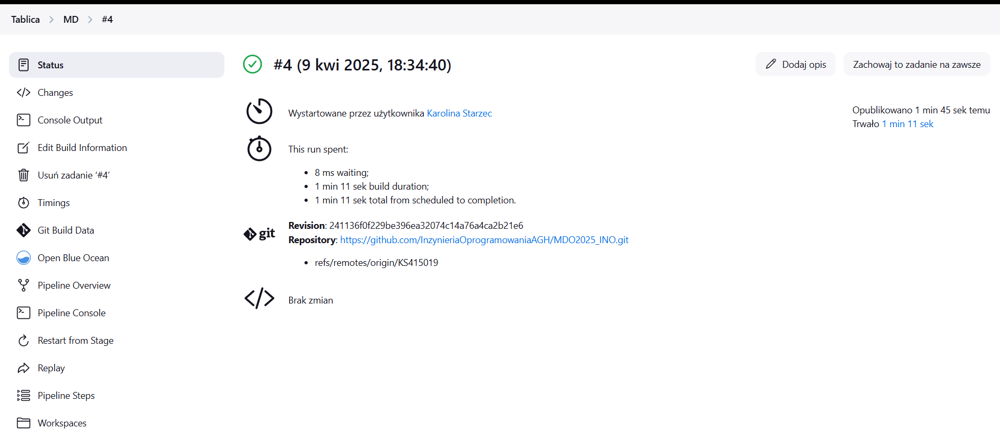
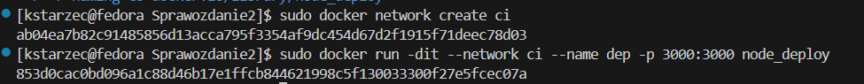

# Sprawozdanie
Karolina Starzec

## LAB 5
Celem laboratorium było zapoznanie się z konfiguracją oraz uruchamianiem środowiska Jenkins, a także z podstawami automatyzacji procesów CI/CD.

### 1. Instalacja Jenkinsa

Stworzenie sieci mostokowej:
```bash
sudo docker network create jenkins
```


W celu umożliwienia Jenkinsowi budowania i uruchamiania kontenerów wewnątrz własnego środowiska, uruchomiono kontener typu Docker-in-Docker (docker:dind) z odpowiednimi uprawnieniami i wolumenami:

```bash
sudo docker run --name jenkins-docker --rm --detach --privileged \
  --network jenkins --network-alias docker \
  --env DOCKER_TLS_CERTDIR=/certs \
  --volume jenkins-docker-certs:/certs/client \
  --volume jenkins-data:/var/jenkins_home \
  --publish 2376:2376 docker:dind --storage-driver overlay2
```


Utworzenie Dockerfile.jenkins:

```bash
FROM jenkins/jenkins:2.492.2-jdk17
USER root
RUN apt-get update && apt-get install -y lsb-release ca-certificates curl && \
    install -m 0755 -d /etc/apt/keyrings && \
    curl -fsSL https://download.docker.com/linux/debian/gpg -o /etc/apt/keyrings/docker.asc && \
    chmod a+r /etc/apt/keyrings/docker.asc && \
    echo "deb [arch=$(dpkg --print-architecture) signed-by=/etc/apt/keyrings/docker.asc] \
    https://download.docker.com/linux/debian $(. /etc/os-release && echo \"$VERSION_CODENAME\") stable" \
    | tee /etc/apt/sources.list.d/docker.list > /dev/null && \
    apt-get update && apt-get install -y docker-ce-cli && \
    apt-get clean && rm -rf /var/lib/apt/lists/*
USER jenkins
RUN jenkins-plugin-cli --plugins "blueocean docker-workflow"
```

Zbudowanie obrazu:
```bash
sudo docker build -t myjenkins-blueocean:2.492.2-1 --file Dockerfile.jenkins .
```


Uruchomienie kontenera:

```bash
sudo docker run \
  --name jenkins-blueocean \
  --restart=on-failure \
  --detach \
  --network jenkins \
  --env DOCKER_HOST=tcp://docker:2376 \
  --env DOCKER_CERT_PATH=/certs/client \
  --env DOCKER_TLS_VERIFY=1 \
  --publish 8080:8080 \
  --publish 50000:50000 \
  --volume jenkins-data:/var/jenkins_home \
  --volume jenkins-docker-certs:/certs/client:ro \
  myjenkins-blueocean:2.492.2-1

```

Z uwagi na brak zrzutu ekranu sprawdzenie poprawnego działania:
```bash
sudo docker ps -a
```


### 2. Uruchomienie Jenkinsa w przeglądarce

Wpisanie adresu maszyny w przeglądarce:
```bash
http://192.168.0.104:8080
```
Wyświeliło nam się okno pierwszego logowania. Po wspianiu hasła, które zostało sprawdzdone w initialAdminPassword uzyskalismy dostęp do możliwości zainstalowania wtyczek.


### 3. Projekt uname
Wybrano opcje Nowy projekt -> Ogólny projekt. W krokach budowania w sekcji Dodaj krok budowania wybrano Dodaj powłokę i wpisano:

```bash
uname -a
```


Uruchomienie projektu:


Sprawdzenie logów:


### 4. Projekt zwracający błąd przy nieparzystej godzinie

Stworzono projekt w analogiczny sposób:

```bash
HOUR=$(date +%H)
if [ $((10#$HOUR % 2)) -ne 0 ]; then
  echo "Błąd: godzina jest nieparzysta ($HOUR)"
  exit 1
else
  echo "Godzina jest parzysta ($HOUR) – OK"
fi

```

Sprawdzenie działania oraz logów konsoli:


### 5. Projekt pobierający obraz kontenera ubuntu

Analogiczny spsób działania do poprzednich projektów.

```bash
docker pull ubuntu
```
Logi konsoli:


### 6. Stworzenie pipline

Po stworzeniu nowego projektu wybieramy pipline. W pierwszym etapie następuje klonowanie repozytorium przedmiotowego mojej gałęzi KS415019. Następnie pipeline przechodzi do katalogu ITE/GCL07/KS415019/Sprawozdanie1, gdzie usuwa istniejący obraz kontener_build, czyści pamięć podręczną buildera Dockera i buduje nowy obraz kontener_build na podstawie pliku Dockerfile.build.

```bash
pipeline {
    agent any

    stages {
        stage('Clone repository') {
            steps {
                git branch: 'KS415019', url: 'https://github.com/InzynieriaOprogramowaniaAGH/MDO2025_INO.git'
            }
        }
        stage('Build'){
            steps {
                dir('ITE/GCL07/KS415019/Sprawozdanie1') {
                    sh 'docker rmi -f kontener_build'
                    sh 'docker builder prune --force --all'
                    sh 'docker build -t kontener_build -f Dockerfile.build .'
                }
            }
        }
    }
}
```
Uruchomiono go kilka razy dla sprawdzenia poprawności działania:



## LAB 6 

Celem laboratorium było zaprojektowanie i wdrożenie kompletnego procesu CI z wykorzystaniem Jenkinsa i Dockera.

### 1. Stworzenie kontenerów
Zaprojektowano trzy osobne obrazy Dockera odpowiadające kolejno za budowanie, testowanie i uruchamianie aplikacji Node.js. Każdy z obrazów został przygotowany na podstawie osobnego pliku Dockerfile.

### Dockerfile.nodebuild:
W etapie budowania użyto pełnego obrazu node:22.10, który zawiera wszystkie potrzebne narzędzia (takie jak npm, git i kompilatory) do klonowania repozytorium oraz instalacji zależności aplikacji.
```bash
FROM node:22.10
RUN git clone https://github.com/devenes/node-js-dummy-test
WORKDIR /node-js-dummy-test
RUN npm install
```
Budowa obrazu:
```bash
sudo docker build -f ./Dockerfile.nodebuild -t node_builder .
```


### Dockerfile.nodetest:
Zastosowano obraz node_builder, czyli wcześniej zbudowany obraz z zainstalowanymi paczkami, co pozwala uniknąć ich ponownej instalacji i zapewnia zgodność środowiska testowego z tym, w którym aplikacja była budowana.
```bash
FROM node_builder
WORKDIR /node-js-dummy-test
CMD ["npm", "test"]
```
Budowa obrazu:
```bash
sudo docker build -f ./Dockerfile.nodetest -t node_test .
```


### Dockerfile.nodedeploy:
Dla etapu wdrożenia użyto lekkiego obrazu node:22.10-slim, który zawiera jedynie minimalny zestaw komponentów potrzebnych do uruchomienia aplikacji, dzięki czemu końcowy obraz produkcyjny jest mniejszy i bezpieczniejszy.
```bash
FROM node:22.10-slim
WORKDIR /app
COPY node_modules/ ./node_modules/
COPY package.json ./
COPY src/ ./src/
COPY views/ ./views/
CMD ["npm", "start"]
```
Budowa obrazu:
```bash
sudo docker build -f Dockerfile.nodedeploy -t node_deploy .
```


Następnie stworzono kontener tymczasowy, aby skopiować katalogi node_modules, src, views oraz package.json.

```bash
sudo docker create --name temp_builder node_builder
```


Kopiowanie potrzebnych katalogów na hosta:

```bash
sudo docker cp temp_builder:/node-js-dummy-test/node_modules ./node_modules
sudo docker cp temp_builder:/node-js-dummy-test/package.json .
sudo docker cp temp_builder:/node-js-dummy-test/src ./src
sudo docker cp temp_builder:/node-js-dummy-test/views/ ./views
```
Usunięcie temp_builder:

```bash
sudo docker rm temp_builder
```


### 2. Uruchomienie kontenera deploy
Stworzenie sieci: 
```bash
sudo docker network create ci
```
Uruchomienie kontenera dep w trybie interaktywnym z mapowaniem portu i przypisaną siecią:
```bash
sudo docker run -dit --network ci --name dep -p 3000:3000 node_deploy
```


### 3. Test curl
Przetestowanie za pomocą polecenia curl w oddzielnym kontenerze podłączonym do tej samej sieci Docker. Otrzymana odpowiedź potwierdza poprawne działanie aplikacji i dostępność interfejsu użytkownika na porcie 3000.

```bash
sudo docker run --rm --network ci curlimages/curl curl http://dep:3000
```


### 4. Push
Obraz node_deploy został otagowany jako kstarzec/node_deploy, a następnie opublikowany w Docker Hub za pomocą polecenia docker push.

```bash
sudo docker tag node_deploy kstarzec/node_deploy
sudo docker push kstarzec/node_deploy
```


### 5. Tworzenie artefaktu zip
Przygotowano wersję aplikacji w formacie ZIP jako alternatywny sposób dystrybucji. Spakowano wszystkie potrzebne pliki i katalogi (node_modules, src, views, package.json) do archiwum app.zip.

```bash
zip -r app.zip node_modules src views package.json
```


## LAB 7
### 1. Jenkinsfile

```bash
pipeline {
    agent any

    environment {
        IMAGE_BUILD = 'node_builder'
        IMAGE_TEST = 'node_test'
        IMAGE_DEPLOY = 'node_deploy'
        DOCKERHUB_REPO = 'kstarzec/node_deploy'
        ZIP_BASE = 'app'
        VERSION = "v${BUILD_NUMBER}"
        IMAGE_TAG = "kstarzec/node_deploy:v${BUILD_NUMBER}"
    }

    stages {
        stage('Clone') {
            steps {
                git branch: 'KS415019', url: 'https://github.com/InzynieriaOprogramowaniaAGH/MDO2025_INO'
            }
        }

        stage('Cleaning') {
            steps {
                dir('ITE/GCL07/KS415019/Sprawozdanie2') {
                    sh '''
                        docker container ls -a -q | xargs -r docker rm -f
                        docker volume ls -q | xargs -r docker volume rm -f
                        docker network ls -q --filter type=custom | xargs -r docker network rm -f
                        docker builder prune --all --force
                        docker images -q | sort -u | grep -vE '^(node:22\\.10|node:22\\.10-slim)$' | xargs -r docker rmi -f
                    '''
                }
            }
        }

        stage('Build') {
            steps {
                dir('ITE/GCL07/KS415019/Sprawozdanie2') {
                    sh 'docker build -f Dockerfile.nodebuild -t $IMAGE_BUILD .'
                }
            }
        }

        stage('Test') {
            steps {
                dir('ITE/GCL07/KS415019/Sprawozdanie2') {
                    sh 'docker build -f Dockerfile.nodetest -t $IMAGE_TEST .'
                }
            }
        }

        stage('Deploy') {
            steps {
                dir('ITE/GCL07/KS415019/Sprawozdanie2') {
                    sh '''
                        docker create --name temp_builder $IMAGE_BUILD
                        docker cp temp_builder:/node-js-dummy-test/node_modules ./node_modules
                        docker cp temp_builder:/node-js-dummy-test/package.json .
                        docker cp temp_builder:/node-js-dummy-test/src ./src
                        docker cp temp_builder:/node-js-dummy-test/views ./views
                        docker rm temp_builder
                        docker build -f Dockerfile.nodedeploy -t $IMAGE_DEPLOY:$VERSION .
                    '''
                }
            }
        }

        stage('SmokeTest') {
            steps {
                dir('ITE/GCL07/KS415019/Sprawozdanie2') {
                    sh '''
                        docker network create ci || true
                        docker run -dit --network ci --name deploy -p 3000:3000 $IMAGE_DEPLOY:$VERSION
                        sleep 5
                        docker run --rm --network ci curlimages/curl curl http://deploy:3000
                        docker stop deploy
                        docker rm deploy
                        docker network rm ci
                    '''
                }
            }
        }

        stage('Publish') {
            steps {
                dir('ITE/GCL07/KS415019/Sprawozdanie2') {
                    withCredentials([usernamePassword(credentialsId: 'dockerhub-credentials2', usernameVariable: 'DOCKER_USER', passwordVariable: 'DOCKER_PASS')]) {
                        sh '''
                            docker run --rm -v $PWD:/app -w /app debian bash -c "apt-get update && apt-get install -y zip && zip -r ${ZIP_BASE}-${VERSION}.zip node_modules/ src/ views/ package.json"
                        '''
                        archiveArtifacts artifacts: "${ZIP_BASE}-${VERSION}.zip", onlyIfSuccessful: true

                        sh '''
                            echo "$DOCKER_PASS" | docker login -u "$DOCKER_USER" --password-stdin
                            docker tag $IMAGE_DEPLOY:$VERSION $IMAGE_TAG
                            docker push $IMAGE_TAG
                        '''
                    }
                }
            }
        }
    }
}
```
Pipeline został zdefiniowany w pliku Jenkinsfile i składa się z następujących etapów:

### Clone
Jenkins klonuje przedmiotowe repozytorium z mojej gałęzi KS415019, które zawiera strukturę projektu wraz z plikami Dockerfile.

### Cleaning
W tej fazie czyszczone są wszystkie zbędne zasoby Dockera, takie jak kontenery, wolumeny, sieci niestandardowe oraz nieużywane obrazy, aby zapewnić świeże środowisko do budowy aplikacji.

### Build
Tworzony jest obraz node_builder z pliku Dockerfile.nodebuild, który odpowiada za pobranie kodu źródłowego oraz instalację zależności aplikacji Node.js.

### Test
Budowany jest obraz node_test zawierający testy jednostkowe. Testy są uruchamiane w osobnym kontenerze.

### Deploy
Na podstawie plików skopiowanych z kontenera node_builder (takich jak node_modules, package.json, src, views) budowany jest końcowy obraz node_deploy. Obraz ten zawiera w pełni gotową do uruchomienia aplikację.

### SmokeTest
Uruchamiana jest instancja aplikacji w kontenerze, a w osobnym kontenerze wykonywany jest curl w celu sprawdzenia, czy aplikacja odpowiada na porcie 3000. Po pozytywnym teście wszystkie kontenery i sieć ci są usuwane.

### Publish
Tworzony jest wersjonowany plik .zip z aplikacją jako alternatywna forma dystrybucji. Równocześnie obraz node_deploy z aktualnym numerem wersji jest publikowany w Docker Hub przy użyciu danych uwierzytelniających przechowywanych w Jenkinsie. 

### 2. Pipline from SCM 
 Dzięki zastosowaniu pliku Jenkinsfile wersjonowanego w repozytorium Git, konfiguracja pipeline'a jest automatycznie pobierana razem z kodem źródłowym projektu, co ułatwia śledzenie zmian i zapewnia spójność procesu CI z rozwojem aplikacji.


### Test działania

Widoczna wersja artefaktu:


Ponowne uruchomienie:


Obecność wersjonowanych tagów w repozytorium Docker Hub potwierdza, że pipeline poprawnie buduje i publikuje obrazy node_deploy na każdym etapie wdrożenia.

