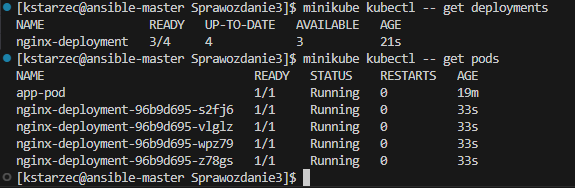
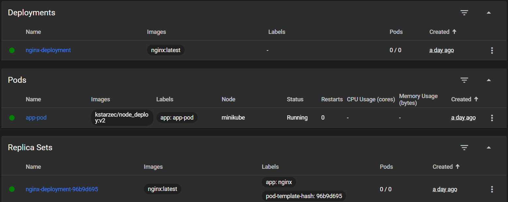
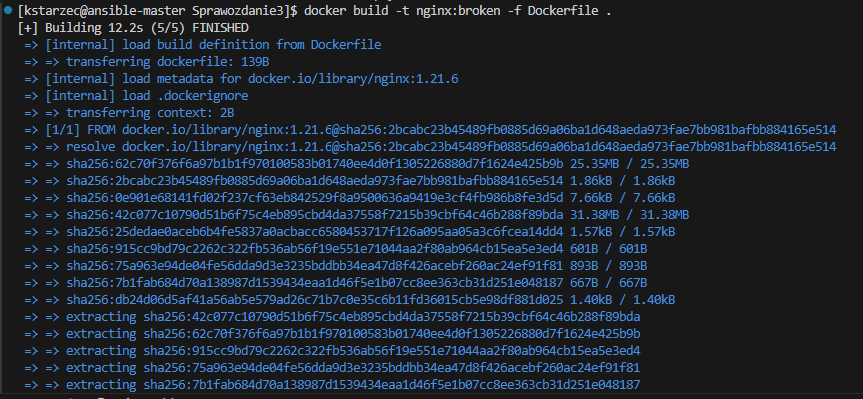
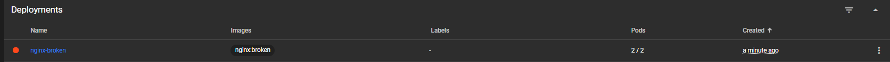

# Sprawozdanie
Karolina Starzec

## LAB 8
Celem laboratorium było praktyczne poznanie Ansible do automatyzacji konfiguracji i wdrażania oprogramowania. Skonfigurowano środowisko z dwiema maszynami, przygotowano pliki inwentaryzacyjne, wymieniono klucze SSH oraz utworzono playbooki do zadań administracyjnych i wdrożeniowych.

## Przygotowanie środowiska

### Konfiguracja maszyny docelowej

Utworzono nową maszynę wirtualną z systemem Fedora 41. Podczas instalacji ustawiono hostname `ansible-target` oraz utworzono użytkownika `ansible`. Zainstalowano wymagane pakiety `tar` i `openssh-server`:


Wykonano migawkę systemu:


### Konfiguracja maszyny głównej

Na głównej maszynie (z systemem Fedora) zainstalowano Ansible z oficjalnego repozytorium:


### Konfiguracja sieci

Sprawdzono adres IP maszyny `ansible-target`, który będzie używany do połączenia SSH:


## Wymiana kluczy SSH

Na głównej maszynie wygenerowano parę kluczy SSH do połączenia z `ansible-target`:


Następnie zestawiono pierwsze połączenie SSH i skopiowano klucz publiczny:


## Inwentaryzacja systemów

### Konfiguracja hostname

W obu maszynach ustawiono czytelne i jednoznaczne nazwy hostów za pomocą `hostnamectl`:

- Maszyna główna (orchestrator): `ansible-master`
- Maszyna docelowa (endpoint): `ansible-target`

  


### Modyfikacja pliku /etc/hosts

W celu zapewnienia rozpoznawania nazw hostów bez użycia adresów IP, zaktualizowano plik `/etc/hosts`, przypisując nazwy do odpowiednich adresów:

```text
192.168.0.194 ansible-target
192.168.0.104 ansible-master
```


### Plik inwentaryzacyjny

Na maszynie głównej utworzono plik `inventory.ini`, w którym zdefiniowano grupy maszyn: `Orchestrators` i `Endpoints`, z przypisaniem odpowiednich nazw hostów oraz użytkowników:

```ini
[Orchestrators]
ansible-master ansible_user=kstarzec ansible_ssh_private_key_file=/home/kstarzec/.ssh/id_rsa_ansible

[Endpoints]
ansible-target ansible_user=ansible ansible_ssh_private_key_file=/home/kstarzec/.ssh/id_rsa_ansible

```

### Test połączenia

W celu weryfikacji łączności pomiędzy orchestratorami i endpointami wykonano polecenie ping w Ansible:

```bash
ansible -i inventory.ini all -m ping
```

Poprawna odpowiedź w formie `"ping": "pong"` świadczy o prawidłowym połączeniu oraz braku potrzeby podawania hasła:


## Zdalne wywoływanie procedur


### Treść playbooka `ping.yaml`

```yaml
- name: Playbook
  hosts: Endpoints
  gather_facts: yes
  tasks:
    - name: Ping 
      ansible.builtin.ping:

- name: Skopiuj plik inventory.ini na Endpoints
  hosts: Endpoints
  gather_facts: yes
  tasks:
    - name: Skopiuj plik inwentaryzacji
      ansible.builtin.copy:
        src: inventory.ini
        dest: /tmp/inventory.ini

- name: Aktualizacja systemu + restart usług
  hosts: Endpoints
  become: true
  tasks:
    - name: Aktualizacja pakietów
      ansible.builtin.package:
        name: "*"
        state: latest

    - name: Restart usługi sshd
      ansible.builtin.service:
        name: sshd
        state: restarted

    - name: Restart usługi rngd
      ansible.builtin.service:
        name: rngd
        state: restarted
```

### Uruchomienie playbooka

```bash
ansible-playbook -i inventory.ini ping.yaml
```


---


### Instalacja pakietu `rngd` (przygotowanie do restartu)

Na etapie przygotowań zainstalowano pakiet **rngd** na maszynie docelowej:


---

## Zarządzanie stworzonym artefaktem (kontener Docker)

Artefaktem z pipeline’u jest obraz **`kstarzec/node-deploy:v2`** umieszczony w Docker Hub.  
Cały proces – od instalacji Dockera, przez uruchomienie aplikacji, aż po sprzątanie – został zamknięty w **roli Ansible** przygotowanej poleceniem:

```bash
ansible-galaxy init kstarzec
```


###  `roles/kstarzec/tasks/main.yml`

```yaml
---
# Upewnij się, że nie ma starego kontenera na porcie 3000
- name: Usuń poprzedni kontener, jeśli istnieje
  community.docker.docker_container:
    name: node_app
    state: absent

# Instalacja Dockera
- name: Instalacja Dockera
  ansible.builtin.package:
    name:
      - docker
      - docker-compose
    state: present

# Uruchomienie i włączenie usługi Docker
- name: Uruchomienie i włączenie usługi Docker
  ansible.builtin.service:
    name: docker
    state: started
    enabled: true

# Pobranie obrazu z Docker Hub
- name: Pull obrazu z Docker Hub
  community.docker.docker_image:
    name: kstarzec/node-deploy
    tag: v2
    source: pull

# Uruchomienie kontenera
- name: Uruchomienie kontenera
  community.docker.docker_container:
    name: node_app
    image: kstarzec/node-deploy:v2
    published_ports:
      - "3000:3000"
    state: started

# Weryfikacja działania aplikacji
- name: Weryfikacja działania aplikacji
  ansible.builtin.uri:
    url: http://localhost:3000
    return_content: yes
  register: response
  retries: 5
  delay: 3
  until: response.status == 200

# Zatrzymanie kontenera
- name: Zatrzymanie kontenera
  community.docker.docker_container:
    name: node_app
    state: stopped

# Usunięcie kontenera
- name: Usunięcie kontenera
  community.docker.docker_container:
    name: node_app
    state: absent
```

###  `deploy.yml`

```yaml
---
# Instalacja zależności Pythona (np. requests)
- name: Zainstaluj bibliotekę requests (Python 3)
  hosts: all
  become: true
  tasks:
    - name: Install python3-requests
      ansible.builtin.package:
        name: python3-requests
        state: present

# Uruchom rolę kstarzec (do Docker deploy)
- name: Deploy
  hosts: all
  become: true
  collections:
    - community.docker
  roles:
    - kstarzec
```

---

#### • Aktualizacja pakietów + restart usług


---
## Instalacja nienadzorowana Fedory 41 (LAB 9)
---

###  Uruchomienie instalatora z plikiem Kickstart

W parametrze wiersza GRUB przekazano ścieżkę do pliku
`anaconda-ks.cfg` przechowywanego w repozytorium GitHub:


---

### Kod pliku `anaconda-ks.cfg`

```kickstart
#version=DEVEL
url --mirrorlist=http://mirrors.fedoraproject.org/mirrorlist?repo=fedora-41&arch=x86_64
repo --name=updates --mirrorlist=http://mirrors.fedoraproject.org/mirrorlist?repo=updates-released-f41&arch=x86_64
repo --name=docker-ce-stable --baseurl=https://download.docker.com/linux/fedora/41/x86_64/stable

lang en_US.UTF-8
keyboard --vckeymap=us --xlayouts='us'
timezone Europe/Warsaw --utc

# Sieć
network --bootproto=dhcp --hostname=autoinstall

# Dysk – czyść wszystko
clearpart --all --initlabel
autopart --type=lvm
bootloader --location=mbr --boot-drive=sda

firstboot --disable

# Użytkownicy
rootpw --lock
user --groups=wheel --name=kstarzec \
     --password=$y$j9T$m00KAZsQBljCtxk/gFRuj.xF$9g8.QGqnCJfoE8zqnENdTXha63AD8RYUA8NM18W0V1D \
     --iscrypted --gecos="Karolina Starzec"

# Pakiety
%packages
@^server-product-environment
docker-ce
docker-ce-cli
containerd.io
%end

# Konfiguracja po instalacji
%post --log=/root/post-install.log --interpreter=/bin/bash
# Włącz Docker przy starcie
systemctl enable docker

# Jednostka systemd do uruchamiania aplikacji Node
cat > /etc/systemd/system/node-app.service <<'EOF'
[Unit]
Description=Start Node.js To-Do App
After=docker.service
Requires=docker.service

[Service]
ExecStart=/usr/bin/docker run --rm -p 3000:3000 kstarzec/node_deploy:v2
Restart=always

[Install]
WantedBy=multi-user.target
EOF

systemctl enable node-app
%end

# Automatyczny restart po instalacji
reboot
```

---

### Pierwszy start i uruchomienie kontenera

Po zakończeniu instalator przeładowuje system, włącza **docker** oraz
jednostkę `node-app.service`. Kontener jest natychmiast widoczny
w `docker ps`:


---

### Tryb ratunkowy Anacondy

W jednej z prób instalacja kończyła się pętlą restartów i lądowała
w powłoce `anaconda root@autoinstall` — błąd nie był replikowany na
innej maszynie, co sugeruje problem lokalny ze środowiskiem VM:


Po odtworzeniu instalacji na innym host-hypervisorze — proces przeszedł poprawnie.


# LAB 10 – Wdrażanie aplikacji w Minikube

---

## 1. Uruchomienie klastra

```bash
minikube start --driver=docker
```

---

## 2. Konfiguracja aliasu *minikubectl*

```bash
alias minikubectl="minikube kubectl --"
```

## 3. Dashboard i stan klastra

```bash
minikube dashboard 
```


---

## 4. Jednopodowe wdrożenie (app-pod)

```bash
minikube kubectl run app-pod \
  --image=kstarzec/node_deploy:v2 \
  --port=3000 \
  --labels=app=app-pod
```


### 4.1  Sprawdzenie statusu

```bash
minikube kubectl -- get pods
```


### 4.2  Logi aplikacji

```bash
minikube kubectl -- logs pod/app-pod
```


### 4.3  Udostępnienie aplikacji (port-forward)

```bash
minikube kubectl -- port-forward pod/app-pod 5000:3000
```


Przeglądarka → `http://localhost:5000`


### 4.4  Widok Pod-a w Dashboard


##  Zmiana kontekstu → przykładowy deployment NGINX 

Po zweryfikowaniu aplikacji Node przechodzimy do demonstracyjnego wdrożenia **NGINX** – użyjemy pliku `nginx-deployment.yaml`, przeskalujemy do **4 replik**, wystawimy usługę i sprawdzimy łączność.

---

## 5. Deployment + Service (NGINX)

### 5.1  Plik `nginx-deployment.yaml` (4 repliki)

```yaml
apiVersion: apps/v1
kind: Deployment
metadata:
  name: nginx-deployment
spec:
  replicas: 4
  selector:
    matchLabels:
      app: nginx
  template:
    metadata:
      labels:
        app: nginx
        version: 4rep
    spec:
      containers:
        - name: nginx
          image: nginx:latest
          ports:
            - containerPort: 80
```

### 5.2  Utworzenie pierwszego deploymentu (4 repliki)

```bash
minikube kubectl apply -f nginx-deployment.yaml
```


```bash
minikube kubectl -- get deployments
minikube kubectl -- get pods
minikube kubectl --  rollout status deployment/nginx-deployment
```

  


### 5.3  `replicas: 0` – wyzerowanie deploymentu

```bash
minikube kubectl -- get deployments
minikube kubectl -- get pods
minikube kubectl --  rollout status deployment/nginx-deployment
```




> **0/0** ⇒ wszystkie Pody NGINX usunięte; ReplicaSet pozostaje w historii z liczbą 0.

---

### 5.4  `replicas: 1` 

```bash
minikube kubectl -- get deployments
minikube kubectl -- get pods
minikube kubectl --  rollout status deployment/nginx-deployment
```


> Minimalna, ale w pełni działająca instancja; obok wciąż działa **app-pod** z aplikacją Node.

---

### 5.5  `replicas: 4` – stan bazowy (testowy)

```bash
minikube kubectl -- get deployments
minikube kubectl -- get pods
minikube kubectl --  rollout status deployment/nginx-deployment 
```

  

  


> **4** repliki to wyjściowa konfiguracja dla dalszych eksperymentów.

---

### 5.6  `replicas: 8` – skalowanie w górę


```bash
minikube kubectl -- get deployments
minikube kubectl -- get pods
minikube kubectl --  rollout status deployment/nginx-deployment
```


> Klaster bez przestoju rozszerzył deployment do **ośmiu** Podów.

---

### 6. Histroia wdrożeń 

```bash
minikube kubectl -- rollout history deployment/nginx-deployment
```


### 7.1 Dockerfile z celowym błędem 

```bash
FROM nginx:1.21.6
ENTRYPOINT ["/bin/false"]
```

 Symulacja błędnego wdrożenia – obraz **`nginx:broken`**

Aby sprawdzić, jak Kubernetes reaguje na niepoprawny obraz, zbudowano lokalnie
własny tag **`nginx:broken`** :
```bash
docker build -t nginx:broken -f Dockerfile .
```



Następnie zastosowano nowy Deployment `nginx-broken.yaml` z 2 replikami:

```bash
minikube kubectl -- apply -f nginx-broken.yaml
```

#### Dashboard – natychmiastowa awaria
 
 
 


Równoległe wersje  — `nginx-deploy-v1` i `v2`

Aby przetestować równoległe utrzymywanie **dwóch nowych wersji obrazu NGINX**, utworzono dwa osobne
pliki YAML:

```yaml
apiVersion: apps/v1
kind: Deployment
metadata:
  name: nginx-deployment-v1
spec:
  replicas: 2
  selector:
    matchLabels:
      app: nginx
  template:
    metadata:
      labels:
        app: nginx
        version: v1
    spec:
      containers:
        - name: nginx
          image: nginx:1.21.6
          ports:
            - containerPort: 80
```

```yaml
apiVersion: apps/v1
kind: Deployment
metadata:
  name: nginx-deployment-v2
spec:
  replicas: 2
  selector:
    matchLabels:
      app: nginx
  template:
    metadata:
      labels:
        app: nginx
        version: v2
    spec:
      containers:
        - name: nginx
          image: nginx:1.23.3
          ports:
            - containerPort: 80
```

```bash
minikube kubectl -- apply -f nginx-deployment-v1.yaml
minikube kubectl -- apply -f nginx-deployment-v2.yaml
```

---
 
 


### 7. Automatyczna walidacja rollout-u – skrypt `deployment.sh`

Aby zautomatyzować sprawdzanie, czy rollout zakończył się pomyślnie,
napisano prosty skrypt Bash.  Co `5 s` pyta `kubectl rollout status`
o podany deployment i po **60 s** przerywa, jeśli nie ma sukcesu.

```bash
#!/bin/bash
DEPLOYMENT=nginx-deployment   # nazwa deploymentu
TIMEOUT=60                    # maks. 60 s czekania
INTERVAL=5                    # odstęp 5 s
ELAPSED=0

echo "Sprawdzam status wdrożenia dla $DEPLOYMENT..."

while [ $ELAPSED -lt $TIMEOUT ]; do
  STATUS=$(minikube kubectl -- rollout status deployment/$DEPLOYMENT 2>&1)
  echo "$STATUS"
  if echo "$STATUS" | grep -q "successfully rolled out"; then
    echo "Wdrożenie zakończone sukcesem."
    exit 0
  fi
  sleep $INTERVAL
  ELAPSED=$((ELAPSED + INTERVAL))
done

echo "Przekroczono czas oczekiwania. Wdrożenie się nie zakończyło."
exit 1
```

Uruchomienie skryptu po zmianie YAML-a
(dla `nginx-deployment`) daje wynik:

