# LAB 5 - Jenkins pipeline
## Zadanie 1 
Utworzenie 2 projektów. Pierwszy polegał na wyświetlenie polecenia uname. Drugi polegał na napisaniu skryptu, który zwraca błąd, gdy godzina jest nieparyzsta. \
Pierwszy projekt:
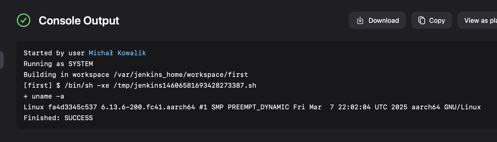
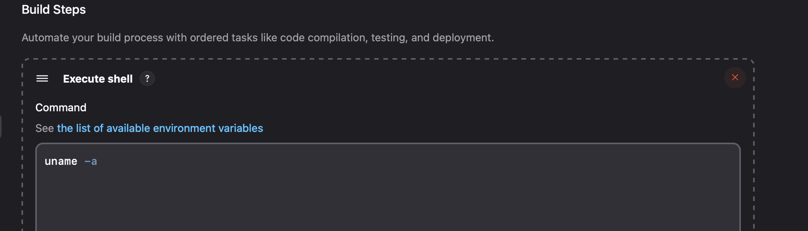
Drugi projekt: 
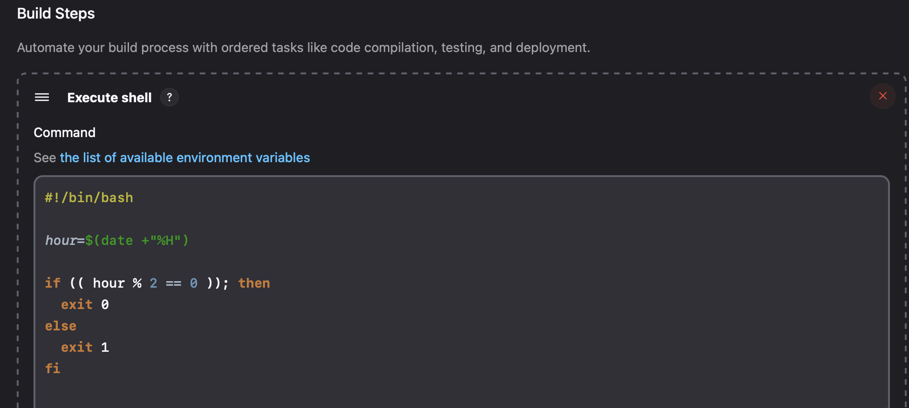
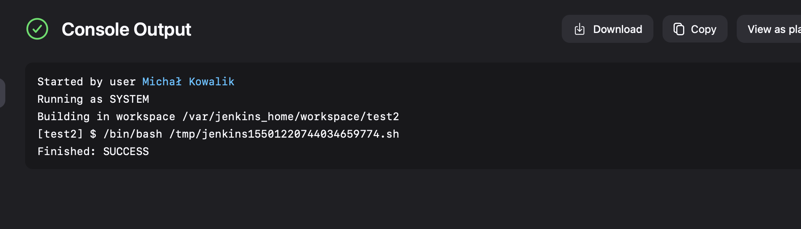
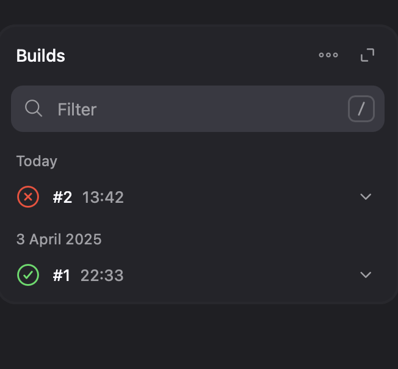

# LAB 6/7 - Pipeline do własnego projektu
## Wykorzystanie projektu nodedummytest.js 
Diagram:

Dodany credentials:

Stworzony [Jenkinsfile](dockers/Jenkinsfile) z wykorzystaniem następujących plików:
* [Builder](dockers/Dockerfile.builder) - budowanie środowiska
* [Test](dockers/Dockerfile.test) - uruchamianie testów
* [Deploy](dockers/Dockerfile.deploy) - przygotowanie do wdrozenia

Screany z pomyślnie wykonanych kroków:
* Clone 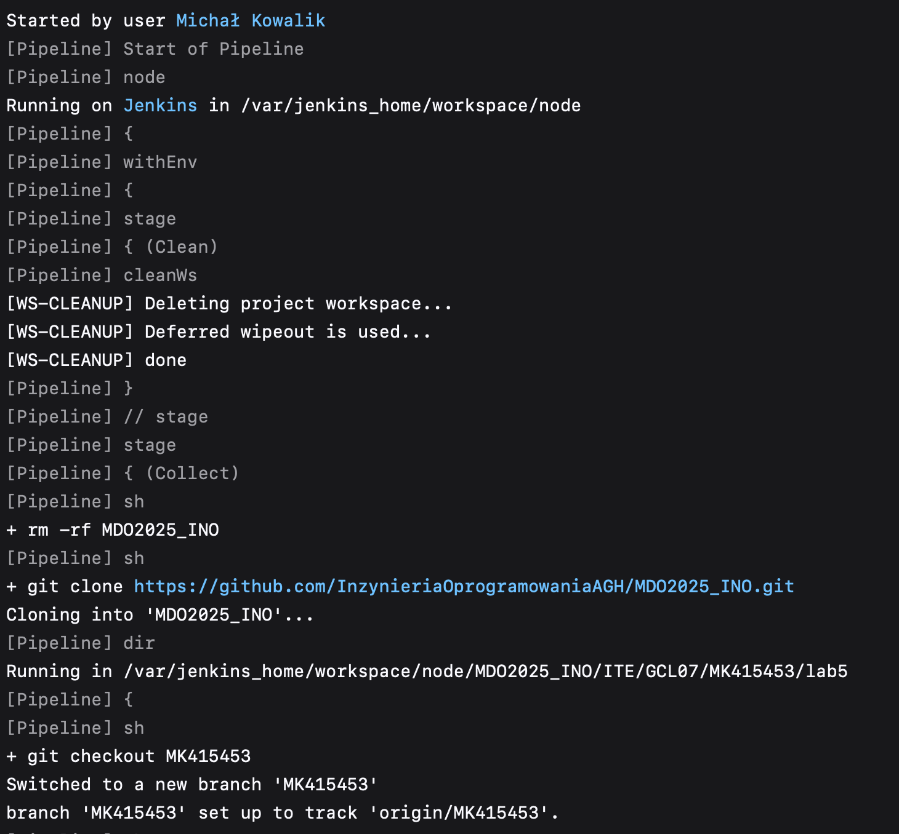
* Build 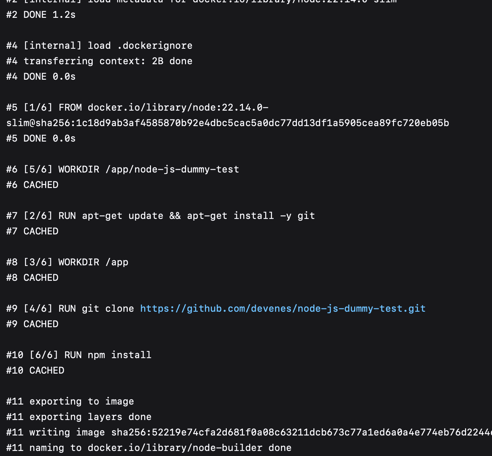
* Test 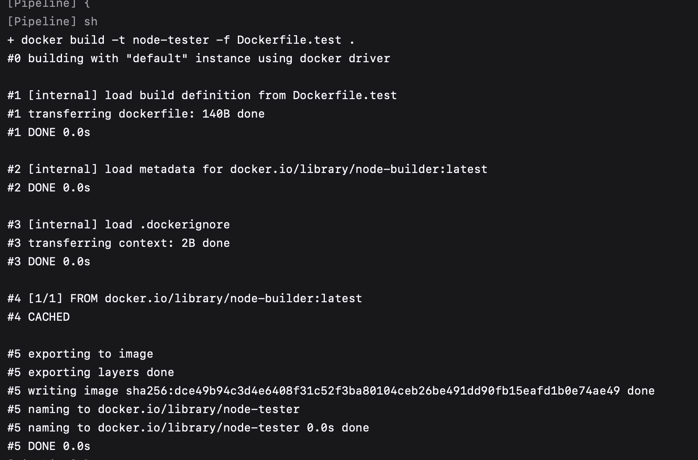
* Deploy 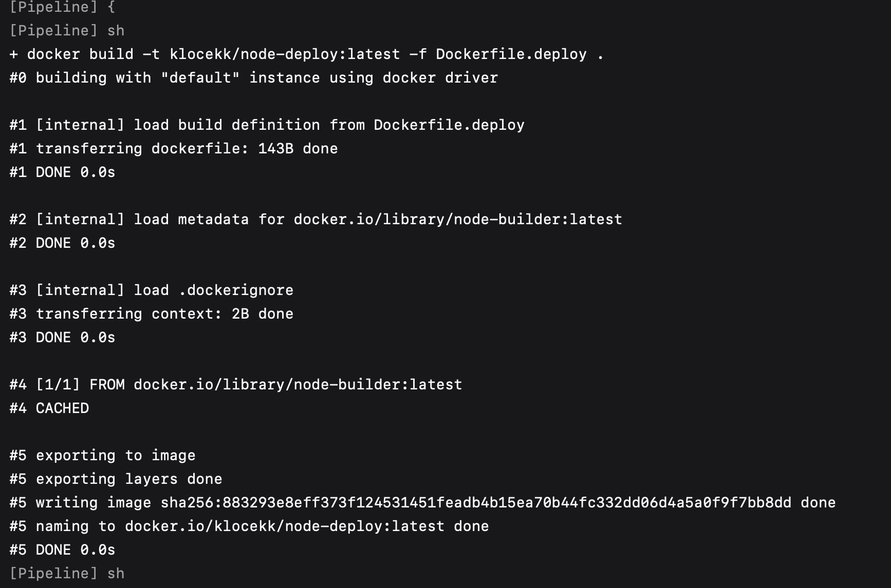
* Curl 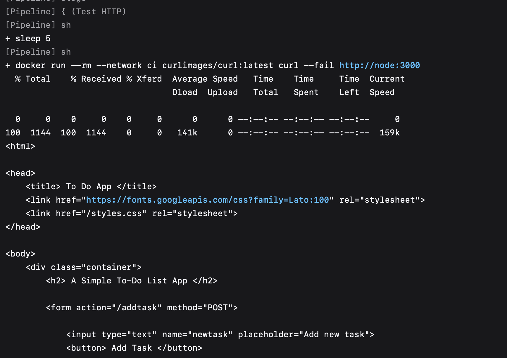
* Artefakt 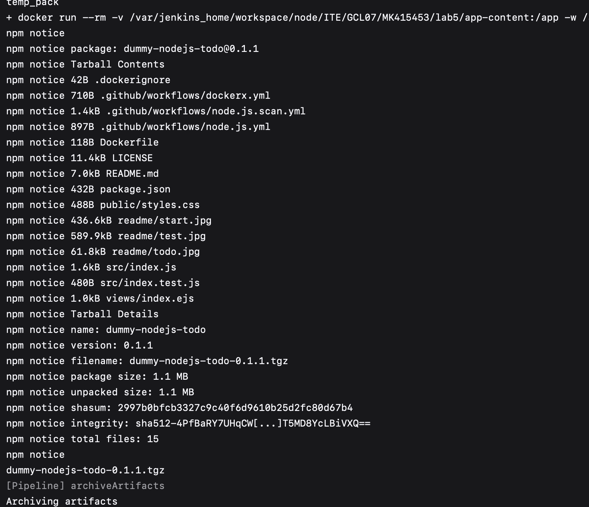
* Dockerhub 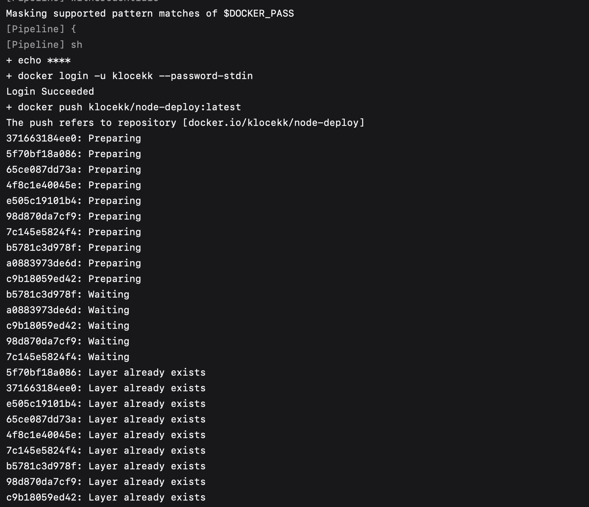
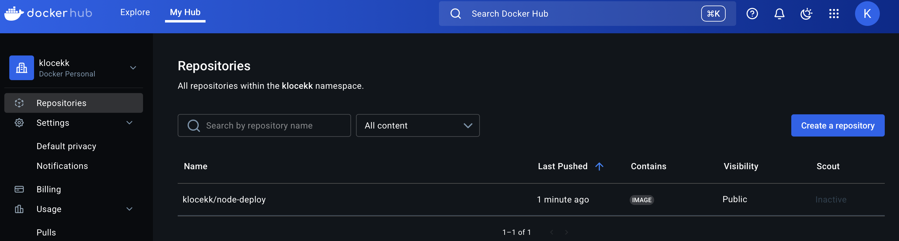
* Done 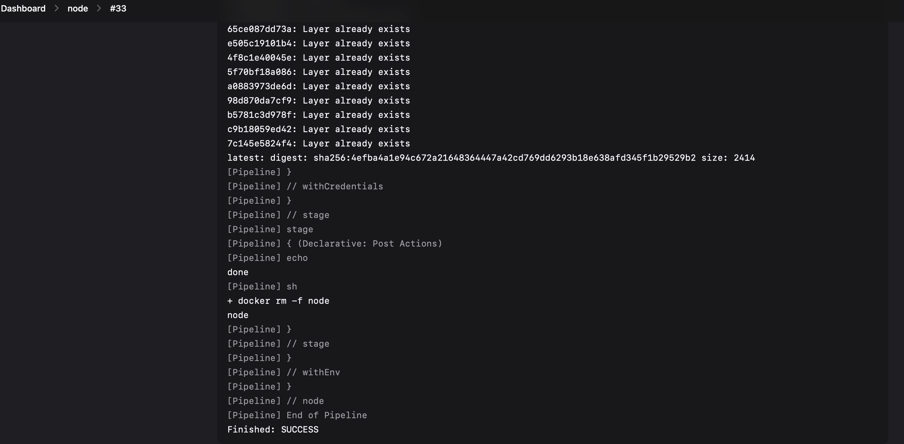
* Zakończony pipeline 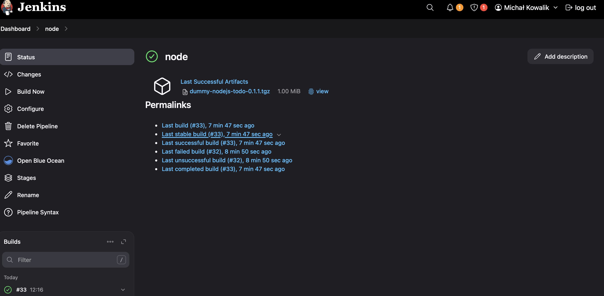
* Sprawdzenie czy dobrze się wszystko czyści, czyli uruchomienie pipeline jeszcze raz 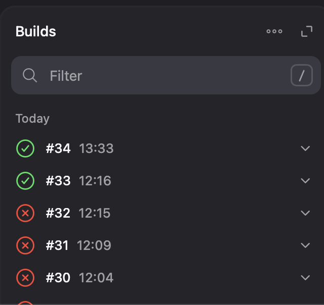

# Dyskusja - omówienie etapów pipeline'u
## Stage: Clean

Na tym etapie środowisko robocze jest czyszczone z poprzednich danych. Pozwala to uniknąć problemów wynikających z pozostałości po wcześniejszych buildach, zapewniając czysty start całego procesu.

## Stage: Collect
Etap odpowiedzialny za przygotowanie środowiska. Usuwa istniejące kopie repozytorium, klonuje je ponownie, przełącza się na odpowiedni branch i tworzy pliki logów. Dzięki temu mamy pewność, że pracujemy na świeżym, aktualnym kodzie w stabilnym środowisku.

## Stage: Build
Na tym etapie budowany jest obraz kontenera na podstawie [Dockerfile.builder](dockers/Dockerfile.builder). Celem jest utworzenie środowiska, w którym aplikacja może być kompilowana lub przygotowywana do testowania. Jest to kluczowy krok dla weryfikacji poprawności środowiska buildowania.

## Stage: Test
Ten etap odpowiada za przygotowanie kontenera testowego. Budowany jest obraz przy użyciu [Dockerfile.test](dockers/Dockerfile.test), który pozwala uruchamiać automatyczne testy. Jest to ważny punkt kontrolny pozwalający wykryć błędy przed wdrożeniem.

## Stage: Deploy
Obraz aplikacji jest budowany z użyciem [Dockerfile.deploy](dockers/Dockerfile.deploy), uruchamiany w kontenerze oraz podłączany do utworzonej wcześniej sieci. Umożliwia to działanie aplikacji w warunkach przypominających środowisko produkcyjne.

## Stage Test HTTP
Weryfikacja dostępności aplikacji. Kontener curl sprawdza, czy endpoint HTTP aplikacji jest aktywny i odpowiada. To proste, ale bardzo przydatne sprawdzenie końcowej funkcjonalności po wdrożeniu.

## Stage Artefact
Zawartość aplikacji jest kopiowana z kontenera i pakowana jako plik .tgz. Taki artefakt użyty jest potem do dalszego wdrażania, archiwizacji i publikacji w systemach dystrybucyjnych.

## Stage: Publish
Gotowy obraz aplikacji jest logowany i wypychany do DockerHub. To pozwala na łatwe udostępnienie i ponowne wykorzystanie obrazu w innych środowiskach — np. produkcyjnym lub testerskim.

## Post Actions
Po zakończeniu całego pipeline’u wyświetlana jest informacja końcowa, sygnalizująca jego zakończenie. W fazie cleanup automatycznie usuwany jest uruchomiony kontener aplikacji, co pozwala na zwolnienie zasobów systemowych. Dzięki temu nie ma potrzeby ręcznego czyszczenia środowiska — co w przeszłości prowadziło do nieoczekiwanych problemów z brakiem miejsca na maszynie wirtualnej. Automatyzacja tego kroku zapobiega też potencjalnym konfliktom przy kolejnych uruchomieniach.