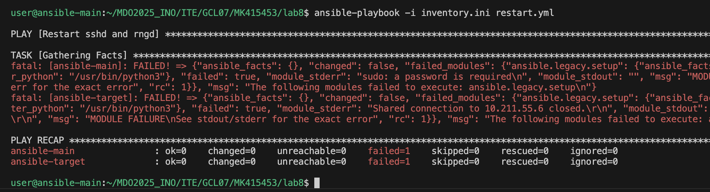

# Sprawozdanie 3 – Ansible, Kickstart oraz Kubernetes

## Lab 8 – Ansible

### Instalacja
Stworzono nową maszynę wirtualną z systemem Fedora, na której zainstalowano serwer OpenSSH.  
  

Na „starej” maszynie zainstalowano Ansible, a nazwę hosta zmieniono z `localhost` na `ansible-main`.  
  

Wygenerowano klucze SSH i wymieniono je między użytkownikami, aby możliwe było połączenie przez SSH bez podawania hasła. Dodatkowo dodano wpisy domenowe maszyn do pliku `/etc/hosts`, aby nie podawać adresów IP przy każdym połączeniu.  
  

### Inwentaryzacja
Stworzono plik inwentaryzacji, dzięki któremu przeprowadzono polecenie `ping` do wszystkich hostów zdefiniowanych w pliku.  
[Plik `inventory.ini`](files/lab8/inventory.ini)  

### Playbook
- **Ping wszystkich hostów**  
  Utworzono playbook w formacie YAML, który wykonuje polecenie `ping` na wszystkich maszynach.  
  [Plik `pingpong.yml`](files/lab8/pingpong.yml)  
  

- **Kopiowanie pliku inwentaryzacji**  
  Playbook `copycat.yml` kopiuje plik inwentaryzacji na zdalne hosty. Po ponownym uruchomieniu ansible sprawdza, czy plik już istnieje i nie wprowadza niepotrzebnych zmian.  
  [Plik `copycat.yml`](files/lab8/copycat.yml)  
  

- **Restart usług SSHD oraz RNGD**  
  Playbook [restart.yml](files/lab8/restart.yml) restartuje usługi `sshd` oraz `rngd`. Początkowo napotkano błąd związany z brakiem hasła dla użytkownika root. Problem rozwiązano przez umieszczenie zaszyfrowanego hasła w katalogu `host_vars` [pliku](files/lab8/host_vars/ansible-main.yml) oraz uruchomienie komendy z opcją `--ask-vault-password`.  
    
  Należało również zainstalować usługę `rngd`, aby playbook mógł się wykonać poprawnie.  
    
  

- **Przykład uruchomienia ze wyłączonym serwerem SSH**  
  

### Zarządzanie utworzonym artefaktem
Utworzono rolę `deploy_docker_app`, która pozwala na wdrożenie aplikacji w kontenerze Docker.  
  
Pliki roli zostały uzupełnione w katalogach:
- [vars](files/lab8/deploy_docker_app/vars/main.yml)
- [tasks](files/lab8/deploy_docker_app/tasks/main.yml)

Następnie uruchomiono playbook [deploy_app_docker.yml](files/lab8/deply_app_docker.yml), aby zdeployować aplikację w kontenerze Docker.  

---

## Lab 9 – Kickstart

### Nienadzorowana instalacja systemu Fedora
Pobrano plik `anaconda-ks.cfg` z „starej” maszyny i zmodyfikowano go, dodając potrzebne pakiety oraz repozytoria wymagane do uruchomienia aplikacji.  
[Plik `anaconda-ks.cfg`](files/lab9/anaconda-ks.cfg)

Następnie użyto tego pliku do instalacji nowej maszyny z obrazu `Fedora-everything.iso`.  
  
Proces instalacji odbywał się automatycznie:  
  
  

Po zakończeniu instalacji uruchomiony kontener HTTP poprawnie serwował statyczny plik `index.html`.  

---

## Lab 10, 11 – Kubernetes

### Wdrażanie na zarządzalne kontenery: Kubernetes (1)
Na zajęciach wykorzystano gotowy obraz NGINX. Uruchomiono Pod z tym obrazem, a następnie zweryfikowano status i działanie usługi.  

### Wdrażanie na zarządzalne kontenery: Kubernetes (2)
Przygotowano dwie wersje własnych obrazów Docker z różnymi plikami `index.html`, oraz trzeci obraz, który celowo powoduje błąd.  
- [Plik `v1.Dockerfile`](files/lab1011/v1.Dockerfile)  
- [Plik `v2.Dockerfile`](files/lab1011/v2.Dockerfile)  
- [Plik `fail.Dockerfile`](files/lab1011/fail.Dockerfile)

Obrazy zbudowano i wypchnięto do Docker Hub:  
  
  

#### Wersja 1
- Zedytowano plik [Deployment.yaml](files/lab1011/Deployment.yaml) (poprzednie materiały z laboratorium).  
  
  
- Uruchomiono Deployment z 8 Podami (wersja 1).  
  
- Zmieniono liczbę Podów z 8 na 1:  
    
- Zmieniono liczbę Podów z 1 na 0 (skalowanie do zera):  
  
- Przywrócono domyślną liczbę 4 Podów:  
  
- Przeprowadzono port-forwarding, aby uzyskać dostęp do serwowanej strony:  
    
  

#### Wersja 2
- Zastosowano obraz z wersją 2, uruchomiono Deployment i Dashboard.  
    
  
- Przeprowadzono port-forwarding i zweryfikowano zawartość strony:  
    
  

#### Wersja fail
- Deployment z obrazem [fail.Dockerfile](files/lab1011/fail.Dockerfile) zakończył się statusem `CrashLoopBackOff`, ponieważ kontener natychmiast ulegał awarii.  
    
    
  

#### Przywrócenie poprzednio działającej wersji
Użyto komendy `kubectl rollout undo`, aby przywrócić ostatnią działającą wersję Deploymentu.  
  

### Kontrola wdrożenia
Wygenerowano skrypt [check_deploy.sh](files/lab1011/check_deploy.sh) (za pomocą narzędzia Claude.ai), który umożliwia automatyczną weryfikację stanu Deploymentu.  

---

## Dyskusja
1. **Automatyzacja konfiguracji (Ansible)**  
   Dzięki zastosowaniu Ansible mozna znacząco uprościć zarządzanie wieloma maszynami – od instalacji oprogramowania, przez kopiowanie plików, aż po restartowanie usług.

2. **Nienadzorowana instalacja (Kickstart)**  
   Plik Kickstart umożliwił jednolitą i powtarzalną instalację systemu Fedora bez ingerencji użytkownika.

3. **Wdrożenia kontenerowe (Kubernetes)**  
   Podczas pracy z Kubernetesem poznano podstawy definiowania Deploymentów, skalowania Podów oraz mechanizmy przywracania poprzednich wersji aplikacji.

