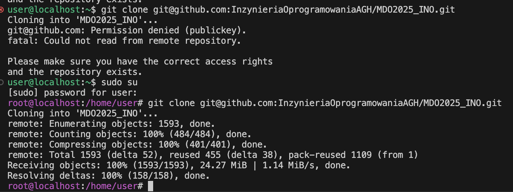
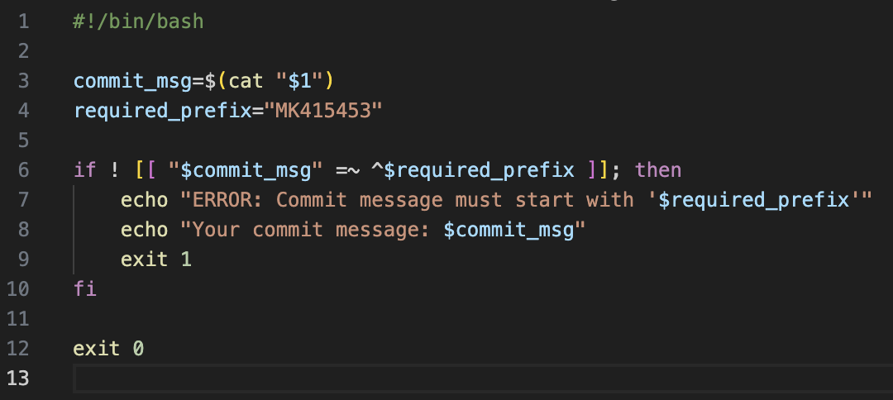
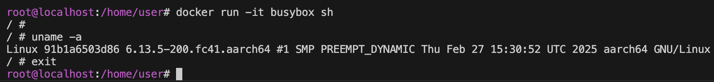
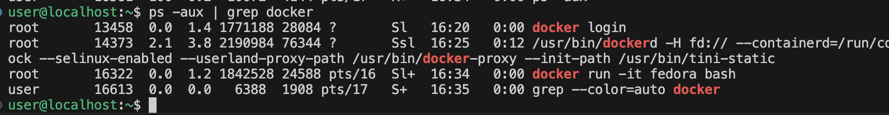
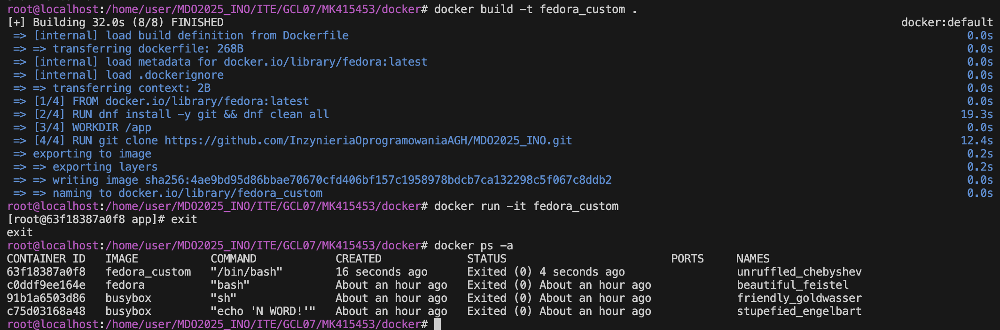
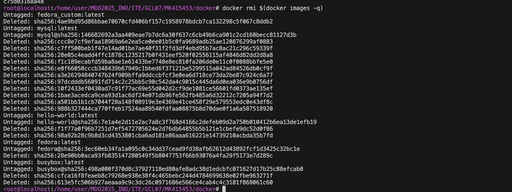
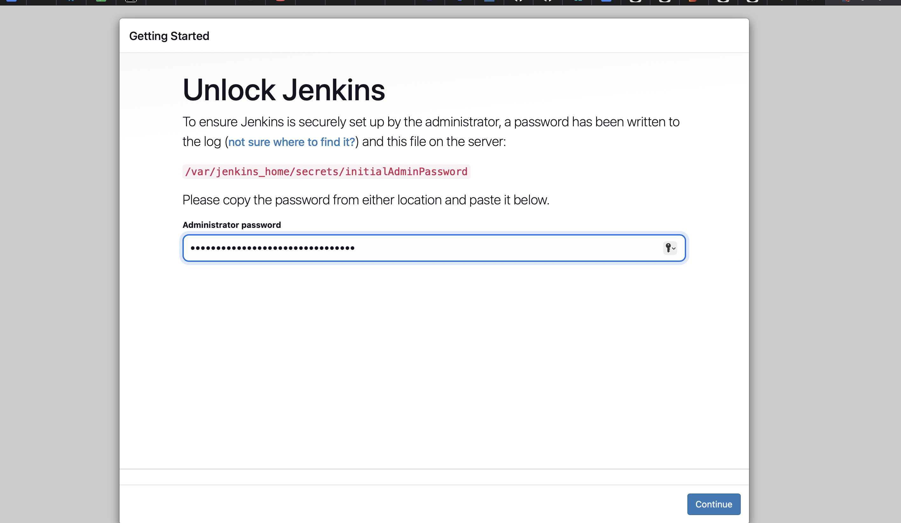

# Sprawozdanie 1
## Zajęcia 1
### Przedmowa
Na pierwszych dwóch zajęciach niestety z mojej niewiedzy korzystałem z super user'a zamiast user'a. Na drugich zajęciach zapytałem prowadzącego o bład w commicie i przy okazji naprawę mojego błędu (przerpaszam za bycie debilem : D ).
### Zainstalowany został system fedora serwer, wygenerowany został klucz SSH przy uzyciu systemu ed25519

### Klucz ten został podpiety pod konto github, aby móc zdalnie łączyć się repozytorium na githubie

### Następnie sklonowano repozytorium podanego przez prowadzacego

### Dodanie git hooka, który sprawdze prefix commita (inicjały oraz numer albumy)

### Nadanie uprawnień dla pliku commit-msg

### Sprawdzenie testowego commita

## Zajęcia 2
### Przed zajęciami
Instalacja oraz rejestracja na dockerhubie.

### Pobranie obrazów: hello-world, busybox, fedora, mysql

### Uruchomienie busybox

### Interaktywne uruchomienie busybox'a i wywołanie numeru wersji

### Stworzenie [Dockerfile](docker/Dockerfile), który klonuje nasze repo

### Budowanie obrazu, uruchomienie kontenera, wyświetlenie 

### Wyczyszczenie obrazów

## Zajęcia 3
Do zajęć wykorzystano repozytorium zaproponowane przez prowadzącego: irssi oraz nodejsdummy

### Sklonowanie repozytorium z node'm oraz uruchomienie testu

### Powtórzenie ww. kroków na kontenerze
[docker do budowania](docker/Dockerfile.nodebld) \
[docker do testów](docker/Dockerfile.nodetest) 

### Zrobienie tego samego z irssi
[docker do budowania](docker/Dockerfile.irssbld) \
[docker do testów](docker/Dockerfile.irssitest)

## Zajęcia 4
### Tworzenie woluminów

### [Dockerfile](docker/Dockerfile.base) dla kontenera
### Uruchomienie kontenera ze zrobienionym bind mount'em z lokalnym katalogiem, a następnie uruchomienie aplikacji noda

### Uruchomienie serwera iperf (iperf3)

### network create
Stworzenie nowej sieci mostkowej

### Przepustowość komunikacji
odwołanie za pomocą IP

Za pomocą nazwy

### Wyciągnięcie logów

### Instalacja Jenkins 
* bez DIND, bo nie umiem czytać, a na następnych zajęciach dowiedziałem się po co on jest : D *

Instalacja pakietów

Po zalogowaniu

## Wnoski i dyskusja
