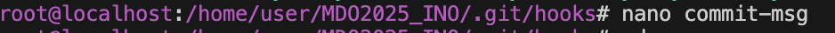
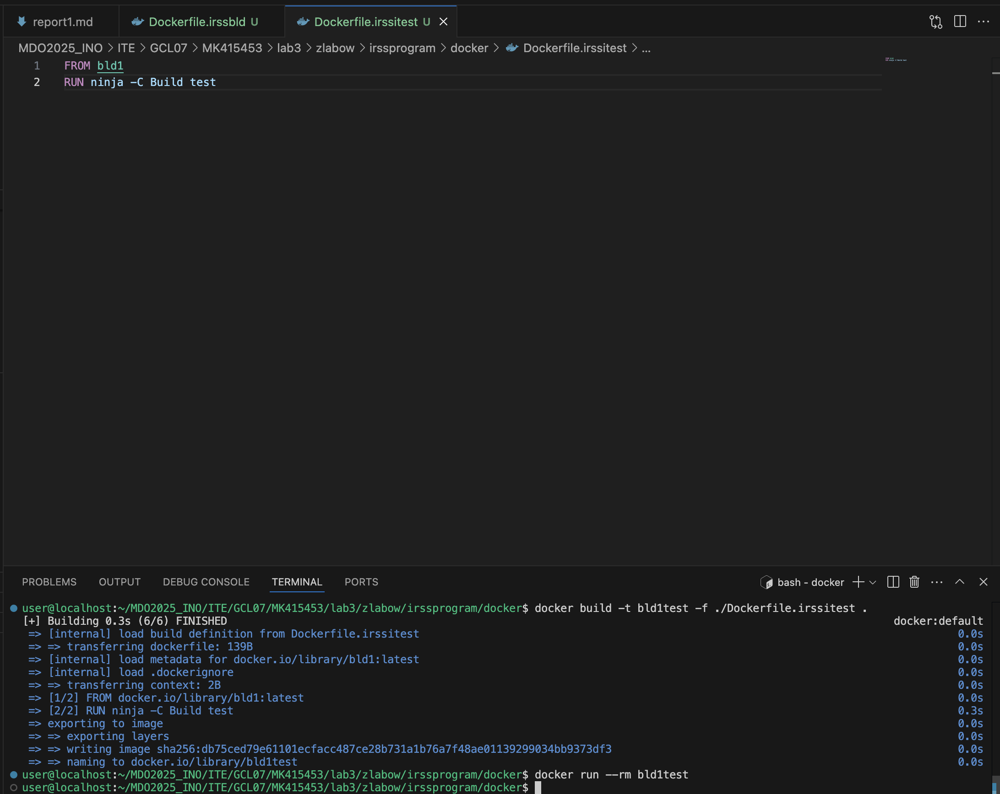
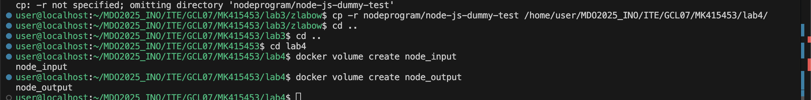
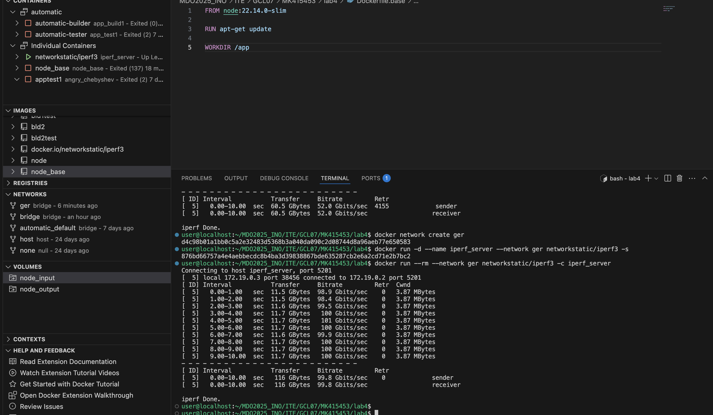
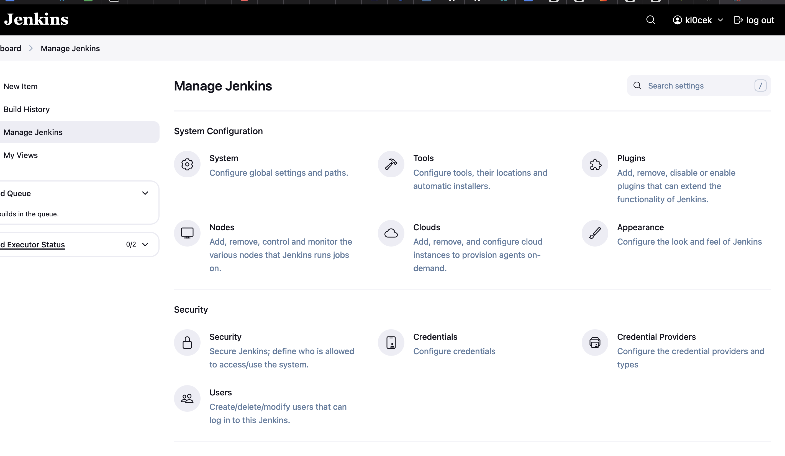

# Sprawozdanie 1
## Zajęcia 1
### Przedmowa
Na pierwszych dwóch zajęciach niestety z mojej niewiedzy korzystałem z super user'a zamiast user'a. Na drugich zajęciach zapytałem prowadzącego o bład w commicie i przy okazji naprawę mojego błędu (przepraszam za bycie debilem).
### Zainstalowany został system fedora serwer, wygenerowany został klucz SSH przy uzyciu systemu ed25519

### Klucz ten został podpiety pod konto github, aby móc zdalnie łączyć się repozytorium na githubie

### Następnie sklonowano repozytorium podanego przez prowadzacego

### Dodanie git hooka, który sprawdze prefix commita (inicjały oraz numer albumy)

### Nadanie uprawnień dla pliku commit-msg

### Sprawdzenie testowego commita

## Zajęcia 2
### Przed zajęciami
Instalacja oraz rejestracja na dockerhubie.

### Pobranie obrazów: hello-world, busybox, fedora, mysql

### Uruchomienie busybox

### Interaktywne uruchomienie busybox'a i wywołanie numeru wersji

### Stworzenie [Dockerfile](docker/Dockerfile), który klonuje nasze repo

### Budowanie obrazu, uruchomienie kontenera, wyświetlenie 

### Wyczyszczenie obrazów

## Zajęcia 3
Do zajęć wykorzystano repozytorium zaproponowane przez prowadzącego: irssi oraz nodejsdummy

### Sklonowanie repozytorium z node'm oraz uruchomienie testu

### Powtórzenie ww. kroków na kontenerze
[docker do budowania](docker/Dockerfile.nodebld) \
[docker do testów](docker/Dockerfile.nodetest) 

### Zrobienie tego samego z irssi
[docker do budowania](docker/Dockerfile.irssbld) \
[docker do testów](docker/Dockerfile.irssitest)

## Zajęcia 4
### Tworzenie woluminów

### [Dockerfile](docker/Dockerfile.base) dla kontenera
### Uruchomienie kontenera ze zrobienionym bind mount'em z lokalnym katalogiem, a następnie uruchomienie aplikacji noda

### Uruchomienie serwera iperf (iperf3)

### network create
Stworzenie nowej sieci mostkowej

### Przepustowość komunikacji
odwołanie za pomocą IP

Za pomocą nazwy

### Wyciągnięcie logów

### Instalacja Jenkins 
* bez DIND, bo nie umiem czytać, a na następnych zajęciach dowiedziałem się po co on jest : D *

Instalacja pakietów

Po zalogowaniu

## Wnioski i dyskusja
### Z zajęć 3
* Konteneryzacja oferuje istotne zalety w postaci spójnego środowiska wykonawczego i łatwości wdrażania co likwiduje problemu z kompatybilnościami, jednak wiąże się z większym rozmiarem dystrybucji i potencjalnymi problemami bezpieczeństwa.
* Buildowanie natomiast ma mniejszy rozmiar spowodawany tylko kodem wykonawczym. Posiada lepsze dopasowanie do specyficznych środowisk jak i łatwiejszą interacje z istniejącymi systemami. Jednak moze wywoływać potencjalne konflikty z innymi zainstalowanymi komponentami oraz wymagać dodatkowej konfiguracji przez użytkownika końcowego.
* Program nadaje się do publikowania jako kontener, jeśli: jest złożoną aplikacją z wieloma zależnościami,
ma być uruchamiany w różnych środowiskach i
użytkownik końcowy oczekuje prostego wdrożenia "click-and-run". \
Natomiast dystrybucja jako artefakt jest bardziej odpowiednia gdy: program jest biblioteką lub komponentem integrowanym z innymi systemami,
docelowe środowisko jest ściśle kontrolowane oraz
istotna jest optymalizacja rozmiaru dystrybucji
### Z zajęć 4
Usługi w rozumieniu systemu, kontenera i klastra
* Implementacja usługi SSHD w kontenerze umożliwia zdalny dostęp do środowiska kontenera. Po odpowiedniej konfiguracji w Dockerfile i ekspozycji portu, można uzyskać dostęp do kontenera podobnie jak do zwykłego serwera. \
Zalety tego rozwiązania: bezpośredni do powłoki i systemu plików, łatwy transfer plików, szyfrowana komunikacja, możliwość interaktywnej diagnostyki i debugowania. \
Wady: zwiększenie powierzchni ataku, komplikacje z zarządzaniem kluczami SSH, dodatkowe zuzycie zasobów, sprzeczne z filozowią orkiestracji kontenerów \
Alternatywne podejścia, takie jak docker exec czy narzędzia specyficzne dla klastrów, są zazwyczaj bardziej zgodne z paradygmatem konteneryzacji.

## LLM Uzywanie sztucznej inteligencji:

* Trobleshooting - który skutkowal stratą czasu poniewaz chat mało potrafi, a zapytanie prowadzącego zawsze powodowało szybsze i poprawaniejsze rozwiązanie mojego problemu. 
* Wytłumaczenie teoretecznej wiedzy z danego tematu:
> Prompt: Wytłumacz mi co to / po co / dlaczego 

* Jednakze potem (czwarte zajęcia) odkryłem ładnie napisaną dokumentacje i uwierzyłem w nią, co poprawiło szybkość zdobywania wiedzy. 

