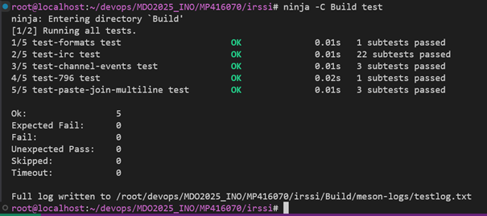
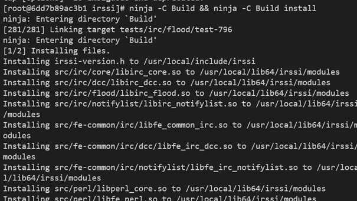

# Sprawozdanie 1

## Instalacja klienta Git i SSH
Po instalacji systemu operacyjnego Fedora Linux 41 (Server Edition) doinstalowujemy paczki z których będziemy korzystać.

Instalacja Git: 
``` sudo dnf install git ```

Instalacja SSH-Server
``` sudo dnf install openssh-server```

Sprawdzamy czy ssh działa poprawanie poprzez sprawdzenie statusu:
```sudo systemctl status sshd```

Jeśli status to active (running) oznacza to że wszystko działa poprawnie. 


Następnie łączymy się zdalnie z klienta do serwera, poprzez komendę:
```ssh USER_NAME@REMOTE_SERVER_ADDRESS```

## Klonowanie repozytorium z github
Następny wykonany krok to pobranie przedmiotowego repozytorium. Możemy to zrobić przy użyciu komendy:
```git clone https://PAT@github.com/InzynieriaOprogramowaniaAGH/MDO2025_INO.git```

Możemy sprawdzić w jaki sposób jesteśmy połączeni do repozytorium za pomocą polecenia:
```git remote -v ```

## Tworzenie kluczy SSH i dodawanie do konta GitHub
Aby utworzyć klucze bezpiecznego połączenia używamy komendy: 
```ssh-keygen -t ed25519 -C "your_github_email@example_domain.com"```

Korzystamy z szyfrowania ed25519. Domyślnie klucze zapisywane są w folderze ~/.ssh, ale program pozwala na zmianę ich miejsca. Należy przy tym pamiętać że musimy je później dodać do ssh-agent. Możemy również dodać passphrase co jest zalecane. Kopiujemy całą treść klucza publicznego.

Logujemy się do serwisu GitHub i przechodzimy do ustawień. W zakładce SSH and GPG keys klikamy przycisk New SSH key i wklejamy zawartość wcześniej skopiowanego klucza publicznego.

Prawidłowo dodany klucz powinien wyglądać tak:


## Klonowanie repozytorium za pomocą SSH

Aby sklonować repo za pomocą SSH używamy:
```git clone git@github.com:InzynieriaOprogramowaniaAGH/MDO2025_INO.git```

Żeby zweryfikować czy jesteśmy połączeni z repozytorium za pomocą SSH, możemy wpisać:
```git remote -v```


## Gałęzie w Git

Praca na osobnych gałęziach jest jedną z podstaw pracowania w środowisku git. Umożliwia to pracowanie nad konkretnym zadaniem, bez przeszkadzania innym developerom, piszących swoje części kodu.

Domyślną gałęzią w git jest main  jednak gdy tak nie jest, możemy się na nią przełączyć korzystając z komendy:
```git checkout main```

Aby sprawdzić na jakiej gałęzi obecnie się znajdujemy wpisujemy : 
```git branch```
Podświetlona na zielono gałąź to ta na której sie znajdujemy.


Aby otworzyć nową gałąź korzystamy z komendy git checkout z parametrem -b:
```git checkout -b MP416070```

## Utworzenie Git Hooka

Kolejny krok to utworzenie Git Hooka sprawdzającego czy każdym z naszych commit message, zaczyna się od odpowiednich inicjałów. Aby to zrobić należy wybrać plik o odpowiedniej nazwie, aby skrypt wykonał się po odpowiedniej komendzie. W tym przypadku to commit-msg.sample. Teraz trzeba napisać odpowiedni skrypt i zmienić nazwę na commit-msg, pamiętając że plik ma znajdować się w katalogu .git/hooks.

#!/bin/bash

commit_msg_file=$1
prefix="MP416070"

if ! grep -q "^$prefix" "$commit_msg_file"; then
    echo "Błąd: Commit message musi zaczynać się od: $prefix"
    exit 1
fi

## Tworzenie commit'a i wysyłanie na GitHub

Aby stworzyć commita możemy zrobić to w następujący sposób.

Sprawdzamy który pliki zostały zmienione i/lub dodane za pomocą:
``` git status ```

Jeśli zobaczymy pliki o czerwonym kolorze tekstu, oznacza to że te zmiany nie są dodane tzn. nie zostaną uwzględnione gdy będziemy tworzyć commit. Aby je dodać korzystamy z komendy:

```git add .```

Tutaj . oznacza że dodajemy wszystkie zmienione pliki, aby dodać konkretny plik zamiast wszystkich zmieionych, zmieniamy . na nazwe pliku. 

Następnie tworzymy commit zawierający dodane zmiany : 
```git commit -m "MP416070 :  message"``

To polecenie tworzy commit ale póki co jest on tylko lokalnie na naszej maszynie. Aby wysłać go na github należy 'wypchnąć' zmiany za pomocą komendy : 
``` git push ```


Nasze wypchnięte zmiany możemy teraz włączyć do innej gałęzi. Najpierw musimy przełączyć się na gałąź do której chcemy wciągnąć te zmiany, np:

```git checkout GCL07 ```

Teraz za pomocą komendy git merge pobieramy zmiany z wybranej przez nas gałęzi:

```git merge MP416070```

Przykładowy wynik wciągniętych zmian:


## Instalacja Dockera 

Docker to platforma służąca do zarządzania kontenerami. Instalujemy ją poleceniem :
``` sudo dnf install docker ```
Możemy teraz się zalogować lub zarejestrować do serwisu Docker Hub, aby w pełni móc korzystać z platformy Docker.


## Pobieranie obrazów konternerów 

Do pobrania obrazów konternerów na lokalną maszynę posłuży nam komenda docker pull. Aby pobrać odpowiedni obraz wpisujemy tą komendę i nazwę obrazu np. :
```
docker pull hello-world
docker pull busybox
docker pull ubuntu:latest
docker pull mysql
```

Aby zobaczyć pobrane obrazy:
``` docker images```

## Uruchamianie kontenerów 

Aby uruchomić kontener korzystame z komendy:
``` docker run busybox ```

Kontener został uruchomiony ale odrazu zamknięty, po wpisaniu komendy docker ps nie zobaczymy żadnego uruchomionego kontenera. Dzieje się tak ponieważ nie przypisaliśmy terminala dla busybox'a. 
Aby to naprawić, możemy skorzystać z parametru -t przypisującego terminal, oraz parametru -i oznaczającego uruchomienie kontenera w trybie interaktywnym, czyli będziemy znajdować się "w środku" kontenera po jego uruchomieniu. 
```docker run -it busybox```

Pracując wewnątrz kontenera sprawdzamy jego wersję.

Uruchamianie innych obrazów przebiega podobnie np. ubuntu:
```docker run -it ubuntu```

Dla testu sprawdzamy działające procesy oraz aktualizujemy pakiety.


## Tworzenie własnych obrazów

Możemy stworzyć własny obraz poprzez stworzenie pliku Dockerfile.

Aby utworzyć kontener, który pobierze repozytorium naszego przedmiotu z GitHub, możemy stworzyć następujący plik:

```

FROM fedora:latest

# Autor obrazu (dobrze jest go dodać)
LABEL maintainer="Michal majkel@student.agh.edu.pl"

# Aktualizacja pakietów 
RUN dnf update -y && dnf install -y git

# Ustawiamy katalog roboczy wewnątrz kontenera
WORKDIR /app

RUN git clone https://github.com/InzynieriaOprogramowaniaAGH/MDO2025_INO.git

CMD ["/bin/bash"]
```

Następnie budujemy obraz w katalogu w który znajduje się nasz Dockerfile wpisujemy komende :
```docker build -t my-image .```


Parametr -t oznacza tag naszego obrazu, czyli jego nazwę i ewentualnie wersję.

Po zbudowaniu obrazu uruchamiamy go oraz sprawdzamy czy nasze repo zostało poprawnie pobrane: 

```docket run -it my-image```


## Przykładowe usuwanie konternerów i obrazów

Aby zobaczyć wszystkie kontenery (uruchomione i zatrzymane) komenda :
```docker ps -a```

Do usunięcia ich wykorzystujemy komendę docker rm i ID kontenera, np.:

```docker rm 30yuefgfd99433a```


Do wyświetlenia obrazów, wykorzystujemy komendę:
```docker images```

A do usuwania docker rmi i ID obrazu lub jego nazwy, np.
```docker rmi ubuntu:latest```


## Dockerfiles i konteneryzacja - laboratorium 3

### Wybór oprogramowania

Do wykonania ćwiczenia zostało wybrane oprogramowanie irssi zaproponowane przez prowadzącego.

Aby rozpocząć pracę sklonowano repozytorium irssi z github:

```git clone https://github.com/irssi/irssi```

## Instalacja zależności

Następnie doinstalowano wymagane zależności aby umożliwić kompilacje aplikacji:
``` sudo dnf -y install gcc glib2-devel openssl-devel perl-devel ncurses-devel meson ninja```


Po zainstalowaniu zależności, zbudowano projekt przy użyciu meson oraz skompilowano przy pomocy ninja :


Następnie uruchomiono testy w celu sprawdzenia poprawności działania:




Następnie przechodzimy do powtórzenia tych samych kroków jednak w kontenerze.
Pobieramy obraz fedore i tworzymy interaktywny kontener:

```docker pull fedora:latest```


```docker run -it --name lab3 fedora:latest /bin/bash```

Wewnątrz kontenera pobieramy wszystkie niezbędne zależności: 


```dnf -y install gcc glib2-devel openssl-devel ncurses-devel meson ninja```

```dnf -y install perl-ExtUtils-Embed```

Inicjalizujemy i konfigurujemy projekt przy pomocy komendy meson Build:


Następnie kompilujemy oraz instalujemy projekt komendą 
```ninja -C Build && ninja -C Build install```




Oraz uruchamiamy testy jednostkowe w celu weryfikacji poprawności kompilacji:

```ninja -C Build test```


Historia poleceń wewnątrz kontenera:
```
1  dnf -y install gcc glib2-devel openssl-devel ncurses-devel meson ninja
    2  meson Build
    3  git 
    4  dnf -y git
    5  dnf -y install git
    6  git clone https://github.com/irssi/irssi
    7  ls
    8  cd ir
    9  cd irssi/
   10  meson Build
   11  dnf install perl-ExtUtils-Embed
   12  meson Build
   13  ninja -C Build && ninja -C Build install
   14  ninja -C Build test
```

## Budowanie kontenerów na podstawie Dockerfile

Został stworzony plik Dockerfile automatyzujący przedstawiony powyżej proces. Utworzony plik Dockerfile przedstawiwa sie następująco :

```
FROM fedora:latest

#pobranie wymaganych pakietow i repo
RUN dnf -y install \
gcc \
glib2-devel \
openssl-devel \
ncurses-devel \
meson \
ninja \
git \
perl-ExtUtils-Embed 

WORKDIR /app

COPY . /app

RUN meson setup builddir
RUN ninja -C builddir
```

Następnie budujemy kontener na podstawie utworzonego Dockerfile, robimy to wykonując polecenie:

```docker build -t build_image -f Dockerfile.build .```


Tworzymy drugi plik Dockerfile.test na podstawie którego tworzony jest drugi kontener.

```
FROM build_image

WORKDIR /app

CMD ninja -C builddir test
```

Budowanie drugiego obrazu:

```docker build -f Dockerfile.test . -t test_image```


### Uruchomienie kontenera

Aby przedstawiony plik Dockerfile.build zadziałał musi znajdować się on w tym samym folderze co plik meson.build w tym przypadku w folderze ./irssi/

Uruchamiamy kontener poleceniem:

```docker run --rm --name test_container test_image```


## Laboratorium 4 - Dodatkowa terminologia w konteneryzacji, instancja Jenkins

### Utworzenie wolumiów wejściowego i wyjściowego

```
docker volume create input_volume
docker volume create output_volume
```

## Utworzenie kontenera bazowego na podstawie poprzedniego ćwiczenia (bez git)

```
FROM fedora:latest

#pobranie wymaganych pakietow i repo
RUN dnf -y install \
gcc \
glib2-devel \
openssl-devel \
ncurses-devel \
meson \
ninja \
perl-ExtUtils-Embed 

WORKDIR /app

CMD ["/bin/bash"]

```


## Uruchomienia kontenera bazowego wraz z utworzonymi woluminami

docker run -it --name build-container \ 
-v input_volume:/mny/input \ 
-v output_volume:/mnt/output \ 
build_image_no_git /bin/bash


## Sklonowanie repozytorium spoza kontenera na wolumin wejściowy

Repozytorium zostało skopiowane poprzez bezpośrednie sklonowanie repozytorium do ścieżki powiązanej z woluminem komendą: 

```
sudo git clone https://github.com/irssi/irssi $(docker volume inspect --format '{{ .Mountpoint }}' input_volume)
```

## Uruchmoienie build'a wewnątrz repo korzystając z woluminu wejściowego

```
cd mny/input/
meson setup builddir
ninja -C builddir
```


## Przekopiowanie utworzonego katalogu builldir do woluminu wyjściowego 
```
cp -r /mny/input/builddir /mnt/output
```


## Weryfikacja poprwaności działania zapisanie w woluminie wyjściowym przy pomocy innego kontenera 
```
docker run --rm -v output_volume:/mnt/output alpine ls /mnt/output
```


Podsumowując najpierw skopiowano cały katalog builddir (wraz ze wszystkimi plikami i podkatalogami) z katalogu /mny/input do katalogu wyjściowego /mnt/output. Ten katalog jest podłączony jako wolumin Dockera, czyli dane są przechowywane poza kontenerem. Następnie uruchomiono nowy kontener Dockera (alpine), montując ten sam wolumin output_volume jako /mnt/output. Wewnątrz kontenera jest wyświetlana zawartość tego katalogu, co pozwala upewnić się, że dane zostały poprawnie skopiowane i zapisane w woluminie.


Można wykonać przedstawione wcześniej kroki bezpośrednio w trakcie budowania obrazu Dockera za pomocą instrukcji RUN z opcją --mount w pliku Dockerfile. Mechanizm ten pozwala na podmontowanie zewnętrznych woluminów lub katalogów tymczasowych na czas budowania obrazu. W tym podejściu katalog builddir dostępny lokalnie na komputerze jest tymczasowo montowany w kontenerze budującym obraz, a jego zawartość kopiowana jest do docelowej lokalizacji wewnątrz kontenera. Pozwala to na efektywne wykorzystanie danych podczas budowania obrazu bez konieczności trwałego kopiowania ich do kontekstu budowania.

## Eksportowanie portu

Zainstalowano iperf3 na hoście. Następnie uruchomiono dwa kontenery oraz na każdym z nich zainstalowano iperf3.

```
docker run --rm --tty -i --name pierwszy fedora bash
docker run --rm --tty -i --name drugi fedora bash
```


## Komunikacja pomiędzy utworzonymi kontenerami 

Po zainstalowaniu iperf3 na obu kontenerach zbadano ruch pomiędzy nimi. Na pierwszym kontenerze uruchomiono server:
```
iperf3 -s
```

Natomiast na kliencie :
```
iperf3 -c 172.17.0.2
```


Ruch sieciowy zadziałał poprawnie

## Utworzenie dedykowanej sieci mostkowej

```
docker network create my_network
```


## Uruchomienie kontenerów w utworzonej wcześniej sieci
```
docker run --rm --tty -i -- network=my_network --name pierwszy fedora bash
docker run --rm --tty -i -- network=my_network --name drugi fedora bash
```


Możliwe jest komunikowanie się wewnątrz tej samej sieci za pomocą nazw dlatego po włączeniu servera :
```
iperf3 -s
```

Na kliencie zadziałają obie komendy :
```
iperf3 -c pierwszy
iperf3 -c 172.17.0.2
```


## Połączenie z serwerem iperf3 w kontenerze z hosta

Żeby połączyć się z serwerem z hosta, wystarczy że podamy ip naszego serwera, DNS nie zadziała, ponieważ host i kontenery nie są w obrębie tej samej sieci mostkowanej

```
iperf3 -c 172.18.0.2
```


Przepustowości przesyłu danych widoczne i przedstawione są na screenach znajdujących się w sprawozdaniu.

## Instalacja Jenkins

Instalacja skonteneryzowanej wersji Jenkins z pomocnikiem DIND i inicjalizacja

Tworzymy sieć aby Jenkins i DIND widziały się przez sieć Dockera.
```
docker network create jenkins
```

### Tworzymy pomocniczy kontener DIND
```
docker run --privileged --name jenkins-dind -d -p 8080:8080 -v jenkins_home:/var/jenkins_home -v /var/run/docker.sock:/var/run/docker.sock jenkins/jenkins:lts
```


### Następnie tworzymy kontener Jenkins  
```
docker run --rm --name jenkins-blueocean \
  --network jenkins \
  -u root \
  -d \
  -p 8080:8080 -p 50000:50000 \
  -v jenkins-data:/var/jenkins_home \
  -v jenkins-docker-certs:/certs/client:ro \
  -e DOCKER_HOST=tcp://jenkins-docker:2376 \
  -e DOCKER_CERT_PATH=/certs/client \
  -e DOCKER_TLS_VERIFY=1 \
  jenkins/jenkins:lts
```


### Hasło do odblokowania Jenkins 

Hasło do odblokowania Jenkins można sprawdzić przy pomocy komendy: 

```
docker logs jenkins-blueocean
```

Przy pomocy tego klucza możemy zalogować się na Jenkins który jest hostowany na porcie :8080.


