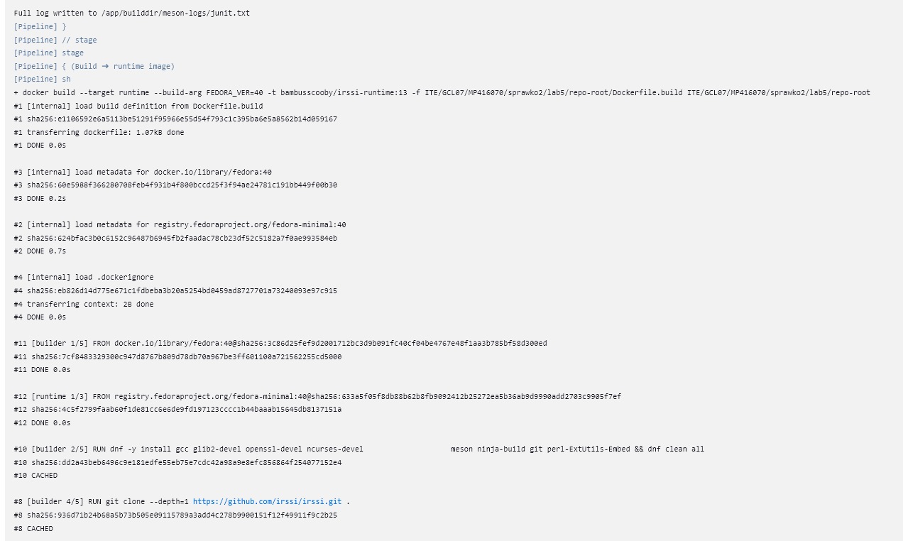

# Pipeline, Jenkins, izolacja etapów

Używając kontenerów z poprzednich zajęć po zalgowaniu się do Jenkins przy pomocy hasła, które można sprawdzić za pomocą komedy: 
```
docker logs jenkins-blueocean
```

Należy pobrano polecane wtyczki oraz utworzono użytkownika, po wykonaniu tych kroków strona Jenkins powinna wyglądać następująco :


Teraz do istniejącego Jenkinsa dodamy plugin BlueOcean. Blue Ocean to po prostu rozszerzony interfejs Jenkinsa z dodatkowymi wtyczkami. Ma nowoczesny bardziej przejrzysty UI wraz z możliwością podglądnięcia pipelino'ow graficznie. 
Na głównej stronie Jenkins'a wybieramy Zarządzaj Jenkinsem -> Dostępne wtyczki, wyszukujemy Blue Ocean oraz instalujemy. Po zainstalowaniu w głównym menu pojawiła się zakładka Open Blue Ocean.


Następnie w lewym górnym rogu wybieramy Nowy Projekt -> Ogólny Projekt i tworzymy nowy projekt. 
W konfiguracji przechodzimy do zakładaki Kroki budowania -> Dodaj krok budowania oraz dodajemy komendę:
```
uname -a 
```

Zapisujemy projeky. Po przekierowaniu po lewej stronie klikamy Uruchom, po chwili w zakładce Builds pojawi się nowe zadanie. Przechodzimy do zadania i z lewego menu wybieramy Logi konsoli. W logach powinniśmy otrzymać następujący wynik.


Następnie przystępujemy do tworzenia projektu który zwraca błąd o godzinie nieparzystej. Tak jak w poprzednim przypadku tworzymy nowy projekt w sekcji Dodaj kroki budowania wpisujemy:
```
current_hour=$(date +%H)
hour=$((current_hour + 0))

if [ $((hour % 2)) -ne 0 ]; then
  echo " Obecna godzina ($hour) jest nieparzysta – kończę z błędem!"
  exit 1
else
  echo " Obecna godzina ($hour) jest parzysta – wszystko OK."
fi

```

Po uruchomieniu widzimy że zadanie zakończyło się błędem. W logach możemy sprawdzić kod błędu gdzie widać że wszystko działa jak należy (zadanie zostało uruchomione o godzinie 19).


## Tworzenie projektu pobierającego Ubuntu

Pojawiły się pewne problemy. Aby możliwe było używanie Dockera w projektach Jenkins, szczególnie gdy Jenkins działa w kontenerze, trzeba zadbać o to, żeby kontener Jenkinsa miał dostęp do silnika Dockera. Ponieważ Jenkins sam działa w kontenerze, nie ma natywnie dostępu do polecenia docker, dlatego musimy ten dostęp zapewnić. Jest to możliwe przez użycie tzw. DIND – czyli Docker-in-Docker. W tym podejściu uruchamiasz osobny kontener docker:dind, który sam w sobie działa jako niezależny silnik Dockera. Jenkins nie wykonuje operacji lokalnie, tylko komunikuje się z tym pomocniczym kontenerem przez sieć – używając zmiennych środowiskowych takich jak DOCKER_HOST. Aby to działało, potrzebny jest też dostęp do certyfikatów TLS, ponieważ docker:dind domyślnie wymaga szyfrowanego połączenia. Kontener Jenkinsa musi mieć zainstalowanego klienta Dockera oraz dostęp do tych certyfikatów, zwykle poprzez zamontowany wolumin.

Konieczne jest także doinstalowanie klienta docker wewnątrz kontenera Jenkins. 
```
docker exec -it jenkins-blueocean bash

apt update
apt install -y docker.io
```
Po tej instalacji możliwe jest wywoływanie komendy docker wewnątrz Jenkinsa – np. w projektach, skryptach lub pipeline’ach – ale te komendy nie wykonują się wewnątrz kontenera, tylko są przekazywane dalej do zewnętrznego silnika Dockera (w tym przypadku DIND,  z którym Jenkins łączy się przez zmienne środowiskowe (DOCKER_HOST, DOCKER_CERT_PATH)).

Po wykonaniu tych kroków możemy używać dockera poprzez projekty i pipelin'y w jenkinsie (czyli docker w dockerze).

W kolejnym projekcie pobieramy obraz docker'a komendą:

```
docker pull ubuntu
```


### Tworzenie pipeline'u

Wybieramy Nowy Projekt -> Pipeline, a następnie w zakładce Pipeline script implementujemy skrypt którego kod wygąda następująco:


```
pipeline {
    agent any

    environment {
        REPO_URL = 'https://github.com/InzynieriaOprogramowaniaAGH/MDO2025_INO.git'
        BRANCH = 'MP416070'
        IMAGE_NAME = 'Dockerfile.build_bez_git'
        DOCKERFILE_DIR = 'ITE/GCL07/MP416070/sprawko1/lab4/'
    }

    stages {
        stage('Clone repository') {
            steps {
                git branch: "${BRANCH}", url: "${REPO_URL}"
            }
        }

        stage('Build Docker image from lab4/Dockerfile') {
            steps {
                
                dir("${DOCKERFILE_DIR}") {
                    sh 'ls -la'
                    sh 'cat Dockerfile.build_bez_git'
                    sh 'docker build -f Dockerfile.build_bez_git -t builder-bez-git .'
                }
            }
        }
    }

    post {
        success {
            echo '✔ Docker image built successfully!'
        }
        failure {
            echo '❌ Something went wrong.'
        }
    }
}

```

Klonując brancha z odpowiedniego repozytorium, a następnie budując Dockerfile'a , z którego korzystaliśmy przy poprzednim sprawozdaniu.

Po wielu nieudanych próbach, pipeline działa. Nauczyłem się, że nazwa obrazu docker'a musi być lowercase i nie może zawierać _ czy wielkich liter.


```
docker build -f Dockerfile.build_bez_git -t builder-bez-git .
```


Po drugim uruchomieniu stworzonego pipeline'u, wszystko działa bez zarzutu.


## Kompletny pipeline: wymagane składniki

Jako oprogramowanie dla którego tworzony będzie pipeline po ustaleni z prowadzącym zajęcia zostało wybrano oprogramowanie irsii.
Przygotowane pliki Dockerfile.build, Dockerfile.test oraz Jenkinsfile zostały wypchnięte na Github.


### PLIK Dockerfile.build
Dockerfile.build — obraz „Dependencies + irssi”. Startuję od Fedory, doinstalowuję kompilatory i narzędzia (gcc, meson, ninja, git itp.), a następnie w tym samym kontenerze klonuję bieżące źródła irssi (git clone --depth 1 …) i buduję je (meson setup builddir && ninja -C builddir). Powstaje kompletny, uruchamialny artefakt.

```
# ─── Builder: Fedora + zależności + klon IRSSI ─────────────────────────────────
FROM fedora:latest

RUN dnf -y install \
        gcc glib2-devel openssl-devel ncurses-devel \
        meson ninja git perl-ExtUtils-Embed \
    && dnf clean all

WORKDIR /app

# pobieramy najnowsze źródła IRSSI (1 commit depth, szybciej)
RUN git clone --depth 1 https://github.com/irssi/irssi.git .

# konfiguracja + kompilacja
RUN meson setup builddir && \
    ninja -C builddir
```

### PLIK Dockerfile.test
ARG BASE oraz FROM ${BASE}; rzeczywisty tag przekazuję później z Jenkins-a. Dzięki temu tester dziedziczy dokładnie tę wersję buildera, którą chwilę wcześniej zbudował pipeline, a nie jakiś przypadkowy „latest”. W praktyce eliminuje to ryzyko, że testy wystartują na nieaktualnej lub niezgodnej konfiguracji.

```
# ─── Tester: dziedziczy po wskazanym obrazie buildera ──────────────────────────
ARG BASE
FROM ${BASE}

WORKDIR /app
CMD ninja -C builddir test
```

### PLIK Jenkinsfile 
Pipeline działana trzech etapach:

1. Checkout - klon repozytorium i przełączenie na moją gałąź MP416070

2. Build - builder – docker build -f Dockerfile.build -t irssi/builder:${BUILD_NUMBER}. Każdy przebieg dostaje własny, niepowtarzalny tag (numer builda).

3. Build - tester – drugi docker build; przez --build-arg BASE=irssi/builder:${BUILD_NUMBER} przekazuję świeżo utworzony obraz do Dockerfile.test, więc tester jest stuprocentowo zgodny z builderem.

4. Test – uruchamiam kontener testera (docker run --rm irssi/tester:${BUILD_NUMBER}) i wykonuję meson test -C /app/builddir, wymuszając pełne logowanie (--print-errorlogs --logbase junit).
```
/*
 * Pipeline: buduje obraz buildera (Fedora + irssi) → buduje obraz testera
 * → uruchamia testy Meson i archiwizuje logi.
 *
 * Plik leży w katalogu:
 *   ITE/GCL07/MP416070/sprawko2/lab5/repo-root/Jenkinsfile
 */
pipeline {
    agent any

    environment {
        // Katalog z Dockerfile’ami (relatywnie od root repo)
        DOCKER_DIR     = 'ITE/GCL07/MP416070/sprawko2/lab5/repo-root'
        // Unikalne tagi: irssi/builder:42, irssi/tester:42, …
        BUILDER_IMG    = "irssi/builder:${BUILD_NUMBER}"
        TESTER_IMG     = "irssi/tester:${BUILD_NUMBER}"
    }

    stages {
        stage('Checkout') {
            steps { checkout scm }
        }

        /* ─────────────── Build: builder image ─────────────── */
        stage('Build ➜ builder image') {
            steps {
                sh """
                  docker build  \
                         -f ${DOCKER_DIR}/Dockerfile.build \
                         -t ${BUILDER_IMG} \
                         ${DOCKER_DIR}
                """
            }
        }

        /* ─────────────── Build: tester image ──────────────── */
        stage('Build ➜ tester image') {
            steps {
                sh """
                  docker build  \
                         -f ${DOCKER_DIR}/Dockerfile.test  \
                         --build-arg BASE=${BUILDER_IMG}   \
                         -t ${TESTER_IMG}                  \
                         ${DOCKER_DIR}
                """
            }
        }

        /* ─────────────── Test inside tester ───────────────── */
        stage('Test') {
            steps {
                sh """
                  docker run --rm ${TESTER_IMG} \
                    /bin/bash -c "meson test -C /app/builddir --print-errorlogs --logbase junit" \
                    | tee test.log
                """
            }
        }
    }

    /* ─────────────── Artefakty & raporty ─────────────────── */
    post {
        always {
            archiveArtifacts artifacts: '**/test.log', allowEmptyArchive: true
            junit            testResults: '**/builddir/meson-logs/*.xml',
                              allowEmptyResults: true
        }
    }
}

```

W Jenkinsie utworzyłem nowy projekt typu Pipeline w trybie Pipeline script from SCM. Wpisałem publiczny URL repozytorium (https://github.com/InzynieriaOprogramowaniaAGH/MDO2025_INO.git), wskazałem gałąź MP416070, a w polu Script Path podałem dokładną ścieżkę do Jenkinsfile-a (ITE/GCL07/MP416070/sprawko2/lab5/repo-root/Jenkinsfile). 


## Krok Deploy

Po kilku godzinach prób i błędów deploy został zrealizowany w sposób następujący. Zaczynamy od obrazu „buildera”. W tym etapie do kontenera trafia pełny tool-chain: kompilatory, Meson, Ninja, nagłówki deweloperskie, Git i wszystkie pakiety niezbędne do przeprowadzenia kompilacji Irssi. Builder jest ciężki – zawiera setki megabajtów narzędzi, których potrzebujemy wyłącznie podczas budowania i testowania. Kiedy proces kompilacji dobiega końca i Meson instaluje Irssi do katalogu /usr, builder staje się źródłem artefaktów dla kolejnego etapu. 
Drugi etap to „runtime”. Dzięki technice multi-stage copy-on-build przenosimy z buildera tylko komplet plików z /usr: binarium irssi, wszystkie niezbędne biblioteki współdzielone oraz katalogi zasobów. Runtime bazuje na ultralekkiej dystrybucji fedora-minimal, która zawiera jedynie glibc i loader dynamiczny; opcjonalnie dokładamy drobne, wyłącznie uruchomieniowe paczki ncurses i openssl. W efekcie obraz produkcyjny zajmuje zaledwie kilkadziesiąt megabajtów, ma minimalną powierzchnię ataku (brak kompilatorów i plików nagłówkowych) i ściąga się błyskawicznie na każdy host z Dockerem. Tym właśnie różni się od buildera: jest pozbawiony wszystkiego, czego nie potrzebuje proces uruchomieniowy.
Oprócz tego  wprowadziliśmy trzeci artefakt – wersjonowany plik tar.gz. Podczas kroku Package pipeline tworzy tymczasowy kontener z buildera i kopiuje z niego zainstalowane pliki do katalogu /artifact, po czym pakuje je w archiwum nazwane np. irssi-10.tar.gz. Wewnątrz znajdują się dokładnie te same pliki, które trafiły do runtime: usr/bin/irssi oraz odpowiadające mu biblioteki w usr/lib64. Dzięki temu ci, którzy nie chcą lub nie mogą korzystać z kontenerów, mogą rozpakować tarball w dowolnym systemie niestrzeżonym przez menedżera pakietów i od razu uruchomić klienta IRC. Tarball jest również częścią artefaktów Jenkinsa, więc każda kompilacja zostawia trwały, podpisany numerem builda ślad binarny.

Pipeline zawiera w pełni zautomatyzowany, powtarzalny krok Deploy, bo wszystkie operacje – od budowy buildera, przez testy, po wytworzenie runtime i smoke-test irssi --version – są deterministyczne i oznaczone tagiem równym numerowi bieżącego builda. Ten sam kod źródłowy w repozytorium zawsze wygeneruje identyczny runtime i identyczny plik .tar.gz, a ewentualna regresja zostanie natychmiast wykryta przez testy jednostkowe Mesona lub przez smoke-test runtime. Dzięki publikacji obrazów w Docker Hub oraz archiwizacji tarballa w Jenkinsie rezultat każdego przebiegu jest dostępny publicznie i można go w każdej chwili odtworzyć lub zrolbackować do wcześniejszego taga. Krótko mówiąc: multi-stage build usuwa zbędny balast, tarball daje alternatywny sposób dystrybucji.

### Pliki Dockerfile.build i Jenkinsfile po wdrożeniu kroku Deploy oraz Publish

```
# ── stage 1: build ─────────────────────────────────────────
ARG FEDORA_VER=40               # jedna zmienna dla obu stage’y
FROM fedora:${FEDORA_VER} AS builder
RUN dnf -y install gcc glib2-devel openssl-devel ncurses-devel \
                   meson ninja-build git perl-ExtUtils-Embed && dnf clean all
WORKDIR /app
RUN git clone --depth=1 https://github.com/irssi/irssi.git .
RUN meson setup builddir -Dprefix=/usr && ninja -C builddir install

# ── stage 2: runtime ───────────────────────────────────────
FROM registry.fedoraproject.org/fedora-minimal:${FEDORA_VER} AS runtime
# kopiujemy tylko to, co zainstalował Meson
COPY --from=builder /usr /usr
# irssi potrzebuje tych binarnych zależności w runtime
RUN microdnf -y install ncurses openssl && microdnf clean all
ENTRYPOINT ["irssi"]
```

```
/*
 *
 * Plik leży w katalogu:
 *   ITE/GCL07/MP416070/sprawko2/lab5/repo-root/Jenkinsfile
 */
pipeline {
    agent any

    environment {
        DOCKER_USER = 'bambusscooby'
        // Katalog z Dockerfile’ami (relatywnie od root repo)
        DOCKER_DIR     = 'ITE/GCL07/MP416070/sprawko2/lab5/repo-root'
        // Unikalne tagi: irssi/builder:42, irssi/tester:42, …
        BUILDER_IMG    = "${DOCKER_USER}/irssi-builder:${BUILD_NUMBER}"
        TESTER_IMG     = "${DOCKER_USER}/irssi/tester:${BUILD_NUMBER}"
        RUNTIME_IMG  = "${DOCKER_USER}/irssi-runtime:${BUILD_NUMBER}"
        TAR_NAME     = "irssi-${BUILD_NUMBER}.tar.gz"
    }

    stages {
        stage('Checkout') {
            steps { checkout scm }
        }

        /* ─────────────── Build: builder image ─────────────── */
        stage('Build ➜ builder image') {
            steps {
                sh """
                  docker build  --target builder \
                        --build-arg FEDORA_VER=40 \
                         -f ${DOCKER_DIR}/Dockerfile.build \
                         -t ${BUILDER_IMG} \
                         ${DOCKER_DIR}
                """
            }
        }

        /* ─────────────── Build: tester image ──────────────── */
        stage('Build ➜ tester image') {
            steps {
                sh """
                  docker build  \
                         -f ${DOCKER_DIR}/Dockerfile.test  \
                         --build-arg BASE=${BUILDER_IMG}   \
                         -t ${TESTER_IMG}                  \
                         ${DOCKER_DIR}
                """
            }
        }

        /* ─────────────── Test inside tester ───────────────── */
        stage('Test') {
            steps {
                sh """
                  docker run --rm ${TESTER_IMG} \
                    /bin/bash -c "meson test -C /app/builddir --print-errorlogs --logbase junit" \
                    | tee test.log
                """
            }
        }

        /* --------  build runtime image -------- */
        stage('Build ➜ runtime image') {
            steps {
                sh """
                docker build --target runtime \
                            --build-arg FEDORA_VER=40 \
                            -t ${RUNTIME_IMG} \
                            -f ${DOCKER_DIR}/Dockerfile.build \
                            ${DOCKER_DIR}
                """
            }
            }


            
        stage('Smoke-test runtime') {
            steps {
                sh """
                docker run --rm ${RUNTIME_IMG} irssi --version
                """
            }
        }

        /* --------  package tarball -------- */
        stage('Package ➜ tar.gz artifact') {
            steps {
                sh """
                cid=\$(docker create ${BUILDER_IMG})             # tymczasowy kontener
                
                mkdir -p .out
                docker cp \${cid}:/usr .out/          # ← kopiujemy całe /usr
                docker rm \${cid}

                tar -czf ${TAR_NAME} -C .out usr 
                """
            }
        }

        stage('Publish images') {
            environment {
                DOCKERHUB  = credentials('dockerhub-creds')   // token+login zapisany w Jenkinsie
            }
            steps {
                sh """
                echo \$DOCKERHUB_PSW | docker login \
                        -u \$DOCKERHUB_USR --password-stdin

                docker push ${BUILDER_IMG}
                docker push ${RUNTIME_IMG}
                """
            }
        }
    }

    /* ─────────────── Artefakty & raporty ─────────────────── */
    post {
        always {
            archiveArtifacts artifacts: '**/test.log', allowEmptyArchive: true
            junit            testResults: '**/builddir/meson-logs/*.xml',
                              allowEmptyResults: true
            archiveArtifacts artifacts: "${TAR_NAME}", allowEmptyArchive: false
        }
    }
}
```

### Kompletny powtarzalny pipeline


## Krok Publish

W kroku Publish chodzi przede wszystkim o to, by rezultat naszej pracy trafił w niezmienionej postaci do miejsca, z którego każdy będzie mógł go natychmiast pobrać. W praktyce oznacza to wypchnięcie wszystkich artefaktów binarnych do dwóch równoległych repozytoriów: obrazy na Docker Hub, a plik tar.gz zachowujemy jako artefakt Jenkinsa. Decyzja o takich dwóch kanałach publikacji nie jest przypadkowa. Docker Hub pełni rolę publicznego rejestru: dowolny host z Dockerem może wykonać docker pull bambusscooby/irssi-runtime:10 i w kilka sekund ma gotowe, samowystarczalne środowisko. Z kolei artefakt w Jenkinsie jest przechowywany razem z metadanymi builda (commit SHA, numer joba, logi testów), więc stanowi nieusuwalny ślad binarny odpowiadający konkretnej wersji źródeł.

Sposób wypychania obrazów jest równie przemyślany. Posługujemy się tokenem zapisanym w Jenkins Credentials Store, a logowanie do rejestru wykonujemy przez docker login na stdin – dzięki temu hasło nigdy nie pojawia się w logu konsoli. Obrazy tagujemy numerem ${BUILD_NUMBER} nadawanym przez Job, czyli monotonicznie rosnącym identyfikatorem. Taki tag jest niemutowalny: raz opublikowany obraz z numerem 10 pozostanie obrazem 10 na zawsze; jeśli pipeline zostanie uruchomiony ponownie, wygeneruje obraz 11 z nową sumą kontrolną.

Pipeline gwarantuje powtarzalność publikacji, ponieważ etap Publish zostaje uruchomiony dopiero po przejściu wszystkich wcześniejszych testów jakości – testów jednostkowych Mesona, smoke-testu runtime i ewentualnego sukcesu w pakowaniu tarballa. Jeżeli cokolwiek pójdzie nie tak, sekcja post z artefaktami wciąż zachowa logi, ale kod nigdy nie dotrze do rejestru. Dzięki temu Docker Hub zawiera wyłącznie obrazy, które przeszły kompletną walidację; nie ma ryzyka, że wadliwa kompilacja nadpisze poprzednią dobrą wersję. Ponadto sam skrypt publishujący jest niezmienny między buildami: ta sama komenda docker push ${RUNTIME_IMG} wykonuje się w identycznym środowisku buildera Dockera, co oznacza, że rezultat zależy wyłącznie od wejściowego kontekstu (czyli artefaktów buildera).

### Obrazy na DockerHUB


### Pobranie obrazu runtime z DockerHUB oraz test działania


## Pełna lista kontrolna

 #### Aplikacja została wybrana - zaakceptowana przez prowadzącego

 #### Licencja potwierdza możliwość swobodnego obrotu kodem na potrzeby zadania - TAK

 #### Wybrany program buduje się - zostało to wykazane w poprzednim sprawozdaniu

 #### Przechodzą dołączone do niego testy - zostało to wykazane w poprzednim sprawozdaniu

#### Wybrano kontener bazowy lub stworzono odpowiedni kontener wstepny (runtime dependencies) & Build został wykonany wewnątrz kontenera

```
stage('Build ➜ builder image') {
            steps {
                sh """
                  docker build  --target builder \
                        --build-arg FEDORA_VER=40 \
                         -f ${DOCKER_DIR}/Dockerfile.build \
                         -t ${BUILDER_IMG} \
                         ${DOCKER_DIR}
                """
            }
        }
```


####  Testy zostały wykonane wewnątrz kontenera (kolejnego)
```
stage('Build ➜ tester image') {
            steps {
                sh """
                  docker build  \
                         -f ${DOCKER_DIR}/Dockerfile.test  \
                         --build-arg BASE=${BUILDER_IMG}   \
                         -t ${TESTER_IMG}                  \
                         ${DOCKER_DIR}
                """
            }
        }
```

```
stage('Test') {
            steps {
                sh """
                  docker run --rm ${TESTER_IMG} \
                    /bin/bash -c "meson test -C /app/builddir --print-errorlogs --logbase junit" \
                    | tee test.log
                """
            }
        }
```


####  Logi z procesu są odkładane jako numerowany artefakt, niekoniecznie jawnie & Zdefiniowano kontener typu 'deploy' pełniący rolę kontenera, w którym zostanie uruchomiona aplikacja (niekoniecznie docelowo - może być tylko integracyjnie)





#### Zdefiniowano, jaki element ma być publikowany jako artefakt & Następuje weryfikacja, że aplikacja pracuje poprawnie (smoke test) poprzez uruchomienie kontenera 'deploy'

```
stage('Package ➜ tar.gz artifact') {
            steps {
                sh """
                cid=\$(docker create ${BUILDER_IMG})             # tymczasowy kontener
                
                mkdir -p .out
                docker cp \${cid}:/usr .out/          # ← kopiujemy całe /usr
                docker rm \${cid}

                tar -czf ${TAR_NAME} -C .out usr 
                """
            }
        }
```

```
stage('Smoke-test runtime') {
            steps {
                sh """
                docker run --rm ${RUNTIME_IMG} irssi --version
                """
            }
        }
```


#### Krok Publish 

```
stage('Publish images') {
            environment {
                DOCKERHUB  = credentials('dockerhub-creds')   // token+login zapisany w Jenkinsie
            }
            steps {
                sh """
                echo \$DOCKERHUB_PSW | docker login \
                        -u \$DOCKERHUB_USR --password-stdin

                docker push ${BUILDER_IMG}
                docker push ${RUNTIME_IMG}
                """
            }
        }
```


Pozostałe kroki z listy kontrolnej zostały opisane oraz wyjaśnione wyżej w sekcjach dyskusyjnych kroków Deploy oraz Publish.