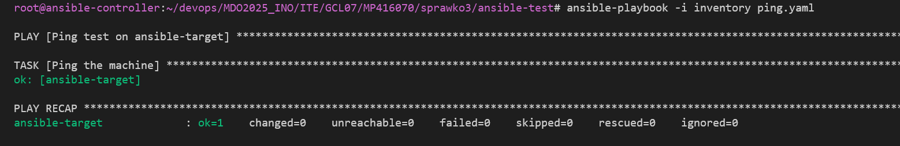
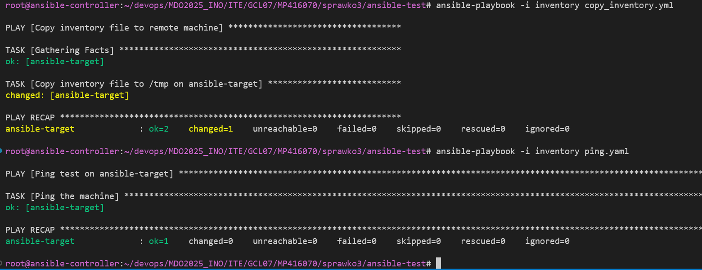
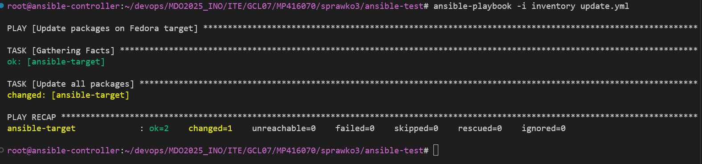
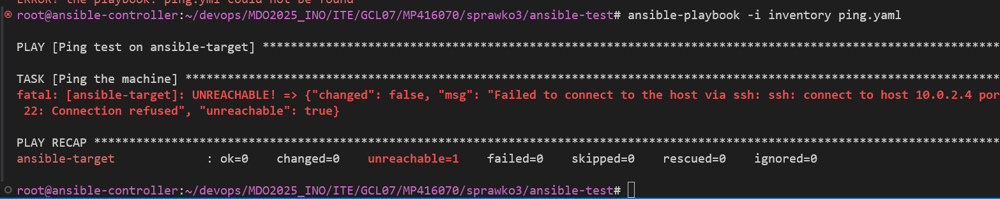
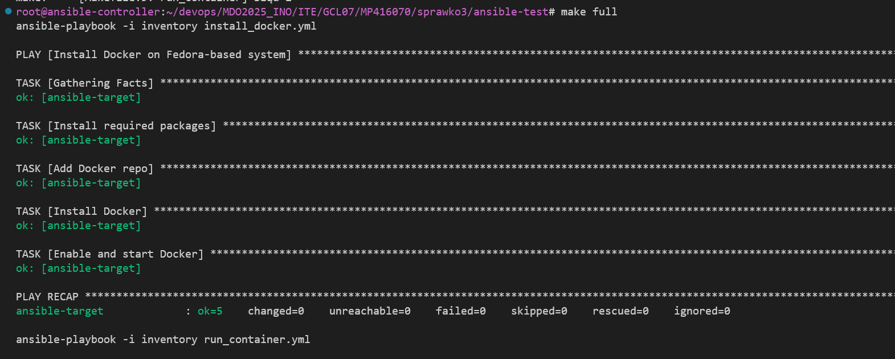
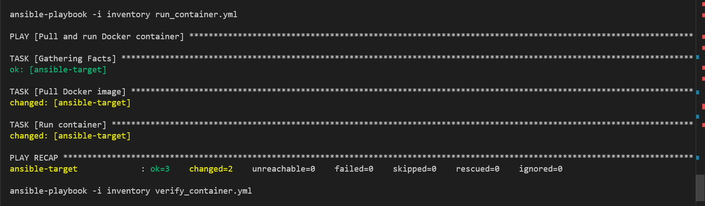
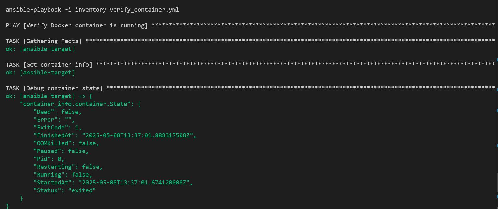
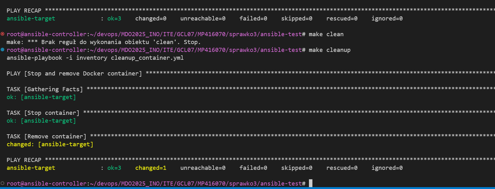

# Automatyzacja i zdalne wykonywanie poleceń za pomocą Ansible

Do przeprowadzenia laboratoriów utworzono drugą maszyne wirtualną ansible-target (na systemie Fedora) oraz przygotowano ją do pracy aby umożliwić komunikację pomiędzy maszynami wirtualnymi. Nadano obu maszynom hostame (ansible-target oraz ansible-controller). Następnie wygenerowano nowy klucz SSH, aby umożliwić bezhasłowe logowanie do maszyny ansible-target.

### Wygenerowanie nowego klucza SSH na maszynie głównej (ansible-controller)

```
ssh-keygen -t rsa -b 4096 -f ~/.ssh/nowy_klucz_ansible
```

### Skopiowanie klucza publicznego na maszynę docelową (ansible-target)

```
ssh-copy-id -i ~/.ssh/nowy_klucz_ansible.pub ansible@ansible-target
```

### Instalacja Ansible na ansible-controller

```
sudo apt update
sudo apt install ansible -y
```

Następnie wprowadzono nazwy DNS w pliku /etc/hosts na obu maszynach wirtualnych aby ułatwić komunikację i aby możliwe było używanie nazw hostów zamiast adresów IP. Wystatczy w pliku /etc/hosts dodać następującą linijke :

```
10.0.2.4   ansible-target
```

### Utworzenie pliku inventory z definicją hosta

Utworzono plik inventory aby zdefiniować target dla playbooków ansible.
Treść pliku wygląda następująco:

```
[targets]
ansible-target ansible_host=10.0.2.4 ansible_user=ansible ansible_ssh_private_key_file=~/.ssh/nowy_klucz_ansible
```
### Utworzenie pliku ping.yaml czyli prostego playbooka

Utworzono prosty plik aby przetestować czy host docelowy jest osiągalny przez ansible

```
- name: Ping test on ansible-target
  hosts: targets
  gather_facts: no
  tasks:
    - name: Ping the machine
      ansible.builtin.ping:
```
A następnie uruchomiono playbook jak i sprawdzono działanie.

```
ansible-playbook -i inventory ping.yaml
```



### Skopiowanie pliku inventory na hosta docelowego 

Utworzono nowy playbook kopiujący plik inventory na hosta docelowego 

```
- name: Copy inventory file to remote machine
  hosts: targets
  tasks:
    - name: Copy inventory file to /tmp on ansible-target
      ansible.builtin.copy:
        src: inventory
        dest: /tmp/inventory_copy
```

Po uruchomieniu playbooka komendą:

```
ansible-playbook -i inventory copy_inventory.yml
```

Opercja zostaje wykonana pomyślnie a plik jest widoczony w katalogu docelowym na hoście - powtórne uruchominie playbooka ping również przechodzi pomyślnie.



Następnym krokiem było utworznie playbooka aktualizującego pakiety.  użytkownik ansible potrzebuje hasła, żeby użyć sudo, a Ansible nie może go podać. Aby rozwiązać ten problem możemy zezwolić użytkownikowi ansible na użycie sudo bez hasła, logujemy się na ansible-target: 

```
ssh ansible@ansible-target
```

Uruchamiamy plik visudo:

```
sudo visudo
```

oraz na końcu pliku dodajemy:

```
ansible ALL=(ALL) NOPASSWD: ALL
```

Oznacza to, że użytkownik ansible może używać sudo bez hasła – dokładnie tego potrzebuje Ansible.

Po aktualizacji playbook może zdalnie aktualizować pakiety.

```
ansible-playbook -i inventory update.yml
```



Następnie tworzymy playbook restartujący usługi sshd oraz rngd. Treść playbooka:

```
- name: Restart services on ansible-target
  hosts: targets
  become: true
  tasks:
    - name: Restart sshd
      ansible.builtin.service:
        name: sshd
        state: restarted

    - name: Restart rngd
      ansible.builtin.service:
        name: rngd
        state: restarted
        enabled: yes
```


### Przeprowadzenie operacji względem maszyny z wyłączonym serwerem SSH

Sprawdzamy działanie ansible, kiedy usługa sshd jest nieaktywna na hoścoe docelowym, w tym celu wyłączamy usługę sshd na ansible-target oraz przy pomocy playbooka próbujemy wykonać polecenie ping.

Otrzymujemy komunikat, że host jest nieosiągalny więc wszystko działa jak powinno.



### Zarządzanie stworzonym artefaktem przez ansible 

Utworzono nowe playbooki odpowiadające za:
 - Instalacja Dockera za pomocą Ansible
 - Uruchomienie kontenera z obrazu z Docker Hub
 - Zweryfikowanie łączności z kontenerem
 - Zatrzymanie i usunięcie kontenera

Zawartość plików prezentuje sie następująco :

```
- name: Install Docker on Fedora-based system
  hosts: targets
  become: true
  tasks:
    - name: Install required packages
      ansible.builtin.dnf:
        name:
          - dnf-plugins-core
          - device-mapper
          - device-mapper-persistent-data
          - lvm2
        state: present

    - name: Add Docker repo
      ansible.builtin.get_url:
        url: https://download.docker.com/linux/fedora/docker-ce.repo
        dest: /etc/yum.repos.d/docker-ce.repo

    - name: Install Docker
      ansible.builtin.dnf:
        name:
          - docker-ce
          - docker-ce-cli
          - containerd.io
        state: latest

    - name: Enable and start Docker
      ansible.builtin.service:
        name: docker
        state: started
        enabled: true

```

```
- name: Pull and run Docker container
  hosts: targets
  become: true
  tasks:
    - name: Pull Docker image
      community.docker.docker_image:
        name: bambusscooby/irssi-runtime
        tag: "11"
        source: pull

    - name: Run container
      community.docker.docker_container:
        name: irssi-container
        image: bambusscooby/irssi-runtime:11
        state: started
        detach: true

```
```
- name: Verify Docker container is running
  hosts: targets
  become: true
  tasks:
    - name: Get container info
      community.docker.docker_container_info:
        name: irssi-container
      register: container_info

    - name: Debug container state
      ansible.builtin.debug:
        var: container_info.container.State

```


```
- name: Stop and remove Docker container
  hosts: targets
  become: true
  tasks:
    - name: Stop container
      community.docker.docker_container:
        name: irssi-container
        state: stopped

    - name: Remove container
      community.docker.docker_container:
        name: irssi-container
        state: absent

```

Utworzono także plik Makefile który automatyzuje proces, przy pomocy komendy 'make full' uruchamia playbooki w kolejnosci:
Install_docker -> run_docker -> verify_container

Natomiast przy użyciu 'make clean' uruchamia playbook usuwający kontener.








