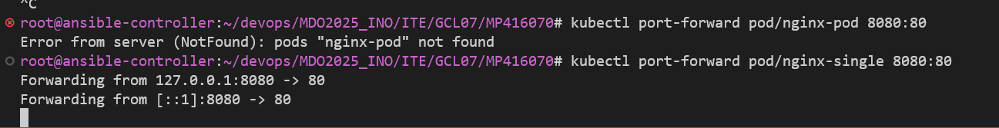

# Automatyzacja i zdalne wykonywanie poleceń za pomocą Ansible

Do przeprowadzenia laboratoriów utworzono drugą maszyne wirtualną ansible-target (na systemie Fedora) oraz przygotowano ją do pracy aby umożliwić komunikację pomiędzy maszynami wirtualnymi. Nadano obu maszynom hostame (ansible-target oraz ansible-controller). Następnie wygenerowano nowy klucz SSH, aby umożliwić bezhasłowe logowanie do maszyny ansible-target.

### Wygenerowanie nowego klucza SSH na maszynie głównej (ansible-controller)

```
ssh-keygen -t rsa -b 4096 -f ~/.ssh/nowy_klucz_ansible
```

### Skopiowanie klucza publicznego na maszynę docelową (ansible-target)

```
ssh-copy-id -i ~/.ssh/nowy_klucz_ansible.pub ansible@ansible-target
```

### Instalacja Ansible na ansible-controller

```
sudo apt update
sudo apt install ansible -y
```

Następnie wprowadzono nazwy DNS w pliku /etc/hosts na obu maszynach wirtualnych aby ułatwić komunikację i aby możliwe było używanie nazw hostów zamiast adresów IP. Wystatczy w pliku /etc/hosts dodać następującą linijke :

```
10.0.2.4   ansible-target
```

### Utworzenie pliku inventory z definicją hosta

Utworzono plik inventory aby zdefiniować target dla playbooków ansible.
Treść pliku wygląda następująco:

```
[targets]
ansible-target ansible_host=10.0.2.4 ansible_user=ansible ansible_ssh_private_key_file=~/.ssh/nowy_klucz_ansible
```
### Utworzenie pliku ping.yaml czyli prostego playbooka

Utworzono prosty plik aby przetestować czy host docelowy jest osiągalny przez ansible

```
- name: Ping test on ansible-target
  hosts: targets
  gather_facts: no
  tasks:
    - name: Ping the machine
      ansible.builtin.ping:
```
A następnie uruchomiono playbook jak i sprawdzono działanie.

```
ansible-playbook -i inventory ping.yaml
```


### Skopiowanie pliku inventory na hosta docelowego 

Utworzono nowy playbook kopiujący plik inventory na hosta docelowego 

```
- name: Copy inventory file to remote machine
  hosts: targets
  tasks:
    - name: Copy inventory file to /tmp on ansible-target
      ansible.builtin.copy:
        src: inventory
        dest: /tmp/inventory_copy
```

Po uruchomieniu playbooka komendą:

```
ansible-playbook -i inventory copy_inventory.yml
```

Opercja zostaje wykonana pomyślnie a plik jest widoczony w katalogu docelowym na hoście - powtórne uruchominie playbooka ping również przechodzi pomyślnie.


Następnym krokiem było utworznie playbooka aktualizującego pakiety.  użytkownik ansible potrzebuje hasła, żeby użyć sudo, a Ansible nie może go podać. Aby rozwiązać ten problem możemy zezwolić użytkownikowi ansible na użycie sudo bez hasła, logujemy się na ansible-target: 

```
ssh ansible@ansible-target
```

Uruchamiamy plik visudo:

```
sudo visudo
```

oraz na końcu pliku dodajemy:

```
ansible ALL=(ALL) NOPASSWD: ALL
```

Oznacza to, że użytkownik ansible może używać sudo bez hasła – dokładnie tego potrzebuje Ansible.

Po aktualizacji playbook może zdalnie aktualizować pakiety.

```
ansible-playbook -i inventory update.yml
```


Następnie tworzymy playbook restartujący usługi sshd oraz rngd. Treść playbooka:

```
- name: Restart services on ansible-target
  hosts: targets
  become: true
  tasks:
    - name: Restart sshd
      ansible.builtin.service:
        name: sshd
        state: restarted

    - name: Restart rngd
      ansible.builtin.service:
        name: rngd
        state: restarted
        enabled: yes
```


### Przeprowadzenie operacji względem maszyny z wyłączonym serwerem SSH

Sprawdzamy działanie ansible, kiedy usługa sshd jest nieaktywna na hoścoe docelowym, w tym celu wyłączamy usługę sshd na ansible-target oraz przy pomocy playbooka próbujemy wykonać polecenie ping.

Otrzymujemy komunikat, że host jest nieosiągalny więc wszystko działa jak powinno.


### Zarządzanie stworzonym artefaktem przez ansible 

Utworzono nowe playbooki odpowiadające za:
 - Instalacja Dockera za pomocą Ansible
 - Uruchomienie kontenera z obrazu z Docker Hub
 - Zweryfikowanie łączności z kontenerem
 - Zatrzymanie i usunięcie kontenera

Zawartość plików prezentuje sie następująco :

```
- name: Install Docker on Fedora-based system
  hosts: targets
  become: true
  tasks:
    - name: Install required packages
      ansible.builtin.dnf:
        name:
          - dnf-plugins-core
          - device-mapper
          - device-mapper-persistent-data
          - lvm2
        state: present

    - name: Add Docker repo
      ansible.builtin.get_url:
        url: https://download.docker.com/linux/fedora/docker-ce.repo
        dest: /etc/yum.repos.d/docker-ce.repo

    - name: Install Docker
      ansible.builtin.dnf:
        name:
          - docker-ce
          - docker-ce-cli
          - containerd.io
        state: latest

    - name: Enable and start Docker
      ansible.builtin.service:
        name: docker
        state: started
        enabled: true

```

```
- name: Pull and run Docker container
  hosts: targets
  become: true
  tasks:
    - name: Pull Docker image
      community.docker.docker_image:
        name: bambusscooby/irssi-runtime
        tag: "11"
        source: pull

    - name: Run container
      community.docker.docker_container:
        name: irssi-container
        image: bambusscooby/irssi-runtime:11
        state: started
        detach: true

```
```
- name: Verify Docker container is running
  hosts: targets
  become: true
  tasks:
    - name: Get container info
      community.docker.docker_container_info:
        name: irssi-container
      register: container_info

    - name: Debug container state
      ansible.builtin.debug:
        var: container_info.container.State

```


```
- name: Stop and remove Docker container
  hosts: targets
  become: true
  tasks:
    - name: Stop container
      community.docker.docker_container:
        name: irssi-container
        state: stopped

    - name: Remove container
      community.docker.docker_container:
        name: irssi-container
        state: absent

```

Utworzono także plik Makefile który automatyzuje proces, przy pomocy komendy 'make full' uruchamia playbooki w kolejnosci:
Install_docker -> run_docker -> verify_container

Natomiast przy użyciu 'make clean' uruchamia playbook usuwający kontener.


\

pozdrawiam

# Pliki odpowiedzi dla wdrożeń nienadzorowanych

## Cel zadania
Utworzyć źródło instalacji nienadzorowanej dla systemu operacyjnego hostującego nasze oprogramowanie
Przeprowadzić instalację systemu, który po uruchomieniu rozpocznie hostowanie naszego programu

W pierwszym kroku zainstalowano system Fedora Server, a następnie po 'czystej' instalacji pobrano plik odpowiedzi z lokalizacji '/root/anaconda-ks.cfg`, który następnie zmodyfikowano o :

### Wzmiankę o repo oraz skąd je pobrać:
```
url --mirrorlist=http://mirrors.fedoraproject.org/mirrorlist?repo=fedora-38&arch=x86_64

repo --name=update --mirrorlist=http://mirrors.fedoraproject.org/mirrorlist?repo=updates-released-f38&arch=x86_64
```

### Zapewnienie że plik odpowiedzi formatuje dysk 

```
clearpart --all
```

### Ustawienie hostaname na inny niż domyślny

Całościowy plik odpowiedzi po modyfikacji wygląda następująco:

```
# Keyboard layouts
keyboard --vckeymap=pl --xlayouts='pl'

# System language
lang pl_PL.UTF-8

# Instalation source (Fedora 38 mirrors)
url --mirrorlist=http://mirrors.fedoraproject.org/mirrorlist?repo=fedora-38&arch=x86_64
# Updates repository
repo --name=updates --mirrorlist=http://mirrors.fedoraproject.org/mirrorlist?repo=updates-released-f38&arch=x86_64

# Network information
network --bootproto=dhcp --ipv6=auto --activate --hostname=harambe.localdomain


# Partitioning
ignoredisk --only-use=sda
clearpart --all --initlabel        
autopart                           

# System timezone
timezone Europe/Warsaw --utc

# Run the Setup Agent on first boot
firstboot --enable

# Root password (zaszyfrowany)
rootpw --iscrypted --allow-ssh $y$j9T$k3bQKxtopLwWyUKwD0BDo46H$QhGDBD...
# Użytkownik zwykły
user --groups=wheel --name=user --gecos="user"

%packages
@^server-product-environment
%end

```

Następnie na podstawie utworzonego pliku odpowiedzi utworzono pomocniczy obraz .iso za pomocą komedy:
```
genisoimage -output ks.iso -volid KS -joliet -rock ks.cfg
```

Oraz w VirtualBoxie dodano ten pomocniczy plik .iso


Następnie uruchomiono maszynę wirtualną, w menu instalacyjnym należy wybrać „Install Fedora Server 38…” i nacisnąć klawisz "e" to przeniesie nas do edycji wpisu GRUB-a. Należy zmodyfikować ten wpis - w linijce zaczynającej się  od linux albo linuxefi na końcu lini należy dodać:

```
inst.ks=hd:sr1:/ks.cfg
```
lub podobny wpis zależnie od tego jak zamotowaliśmy nasze pomocnicze .iso.


Po wykonaniu tych kroków i rozpoczęciu instlacji przez Ctrl + X, instalacja przebiega automatycznie bez konieczności dalszej ingerencji ze strony administratora - bardzo przyjemne i wygodne swoją drogą.

### Dodanie do pliku odpowiedzi repozytoria i oprogramowanie potrzebne do uruchomienia programu, zbudowanego w ramach projektu - naszego pipeline'u.

Rozbudowujemy plik odpowiedzi, aby mieć w pełni nienadzorowaną instalację Fedory z Dockerem i automatycznym startem utworzonego w ramach pipeline'u obrazu. Dokonujemy modyfikacji pliku odpowiedzi, plik wygląda następująco :

```
# ---------------------------------------------------------------------------
# Fedora 38 Server – Kickstart z Docker CE i autostartem kontenera
# ---------------------------------------------------------------------------
keyboard --vckeymap=pl --xlayouts='pl'
lang pl_PL.UTF-8


url  --mirrorlist=http://mirrors.fedoraproject.org/mirrorlist?repo=fedora-38&arch=x86_64
repo --name=updates --mirrorlist=http://mirrors.fedoraproject.org/mirrorlist?repo=updates-released-f38&arch=x86_64


repo --name=docker-ce --baseurl=https://download.docker.com/linux/fedora/38/x86_64/stable

network --bootproto=dhcp --ipv6=auto --activate --hostname=harambe.localdomain


ignoredisk --only-use=sda
clearpart --all --initlabel
autopart

timezone Europe/Warsaw --utc


rootpw  --iscrypted --allow-ssh $y$j9T$k3bQKxtopLwWyUKwD0BDo46H$QhGDBDB0PK1l...
user    --groups=wheel --name=user --gecos="user"

# 1. Pakiety (Dockera + zależności dorzucamy tutaj)
%packages
@^server-product-environment
dnf-plugins-core
device-mapper
device-mapper-persistent-data
lvm2
docker-ce
docker-ce-cli
containerd.io
%end

# 2. Konfiguracje po zainstalowaniu plików 
%post --log=/root/ks-post.log --interpreter=/usr/bin/bash --erroronfail

cat >/etc/yum.repos.d/docker-ce.repo <<'EOF'
[docker-ce-stable]
name=Docker CE Stable - $basearch
baseurl=https://download.docker.com/linux/fedora/$releasever/$basearch/stable
enabled=1
gpgcheck=1
gpgkey=https://download.docker.com/linux/fedora/gpg
EOF

# ---  Instalacja / aktualizacja Dockera ---------------
dnf -y install docker-ce docker-ce-cli containerd.io

# ---  Włączenie usługi ----------------------
systemctl enable --now docker.service

# ---  Skrypt first-boot --------------------------------
cat >/usr/local/bin/setup-container.sh <<'EOSH'
#!/usr/bin/env bash
set -euo pipefail

/usr/bin/docker pull bambusscooby/irssi-runtime:11
/usr/bin/docker run -d --name irssi-container --restart=unless-stopped bambusscooby/irssi-runtime:11

systemctl disable firstboot-container.service
EOSH
chmod +x /usr/local/bin/setup-container.sh
restorecon -v /usr/local/bin/setup-container.sh  # SELinux

# ---  Jednostka systemd one-shot -------------------
cat >/etc/systemd/system/firstboot-container.service <<'EOUNIT'
[Unit]
Requires=docker.service
After=docker.service network-online.target
Wants=network-online.target

[Service]
Type=oneshot
ExecStart=/usr/local/bin/setup-container.sh
RemainAfterExit=yes

[Install]
WantedBy=multi-user.target
EOUNIT

systemctl enable firstboot-container.service

%end

reboot
```

W drugiej wersji pliku kickstartowego w pierwszej kolejności ustawiamy klawiature, język, czas, sieć, partycje i tworzymy użytkowników. Następnie instalujemy paczki na podstawie podanego wcześniej źródla pakietów bazowach (url, repo) oraz z repozytorium Dockera - konieczne do uruchomienia aplikacja z pipeline'u. 

Sekcja %post zawiera polecenia powłoki (bash), które zostaną wykonane zaraz po zakończeniu instalacji pakietów, ale jeszcze przed pierwszym uruchomieniem systemu.

Można tam: kopiować pliki, pisać własne skrypty, instalować dodatkowe rzeczy, przygotować konfigurację systemu. W tym przypadku :
dodajemy plik repozytorium Docker CE - tworzymy plik .repo, który mówi systemowi, gdzie znaleźć i jak pobierać pakiety Dockera z internetu. Dzięki temu dnf wie, skąd ściągać Dockera. Po tym upewnimy się, że Docker jest aktualny:

```
dnf -y update docker-ce docker-ce-cli containerd.io 
```
Przez systemctl zapewniamy włączenia Dockera przy każdym starcie systemu:
```
systemctl enable docker
```
Po uruchomieniu systemu Docker uruchomi się automatycznie. Tworzymy skrypt który uruchomi się tylko przy pierwszym starcie systemu, skrypt poczeka aż Docker się uruchomi => pobierze kontener z DockerHub => uruchamia go z odpowiednimi parametrami => dezaktywuje się aby więcej się nie uruchamiać.
```
cat >/usr/local/bin/setup-container.sh <<'EOSH'
...
EOSH
chmod +x /usr/local/bin/setup-container.sh
```

Skrypt tworzy jednostkę systemową (service) 
```
cat >/etc/systemd/system/firstboot-container.service <<'EOUNIT'
...
EOUNIT
```
w systemd (czyli systemie, który zarządza uruchamianiem wszystkiego po starcie systemu). Ta jednostka uruchomi skrypt raz, przy pierwszym starcie systemu. Skrypt włącza tę jednostkę:
```
systemctl enable firstboot-container.service
```
tak aby wystartowała automatycznie przy pierwszym starcie systemu.

Czyli idąc krok po kroku:

1. System startuje
2. Docker się uruchamia
3. firstboot-container.service widzi, że Docker już działa
4. firstboot-container.service uruchamia skrypt który:
  1. Pobiera obraz kontenera z DockerHub
  2. uruchamia go w tle
  3. dezaktywuje jednostkę systemd, żeby więcej nie uruchamiała się przy starcie.

Sekcja %post to kluczowy element dla pliku kickstartowego przy automatyzacji instalacji aplikacji z pipeline'u.

# Wdrażanie na zarządzalne kontenery: Kubernetes (1)

## Instalacje minikube


## Uruchomienie klastra


## Zaopatrzenie się w polecenie kubectl oraz dodanie aliasu


## Uruchamianie oprogramowania

```
minikube kubectl -- run nginx-pod --image=nginx --port=80 --labels app=nginx-deployment
```

Utworzony zostaje pod oraz następnie jest skalowany do 12 instancji, przez zakładke deployments w dashboard minikube.


## Wyprowadzenie portu




## Utworzenie pliku yaml oraz kubectl apply

```
apiVersion: apps/v1
kind: Deployment
metadata:
  name: nginx-deployment
  labels:
    app: nginx
spec:
  replicas: 1
  selector:
    matchLabels:
      app: nginx
  template:
    metadata:
      labels:
        app: nginx
    spec:
      containers:
        - name: nginx
          image: nginx:latest
          ports:
            - containerPort: 80

```


## Rozszerzenie pliku yaml o 4 repliki 

Zmieniamy część pliku replicas następująco :

```
spec:
  replicas: 4
```
