# Sprawozdanie

## 1. Instalacja Git i obsługa SSH

### Instalacja Git
```sh
sudo dnf install -y git
```
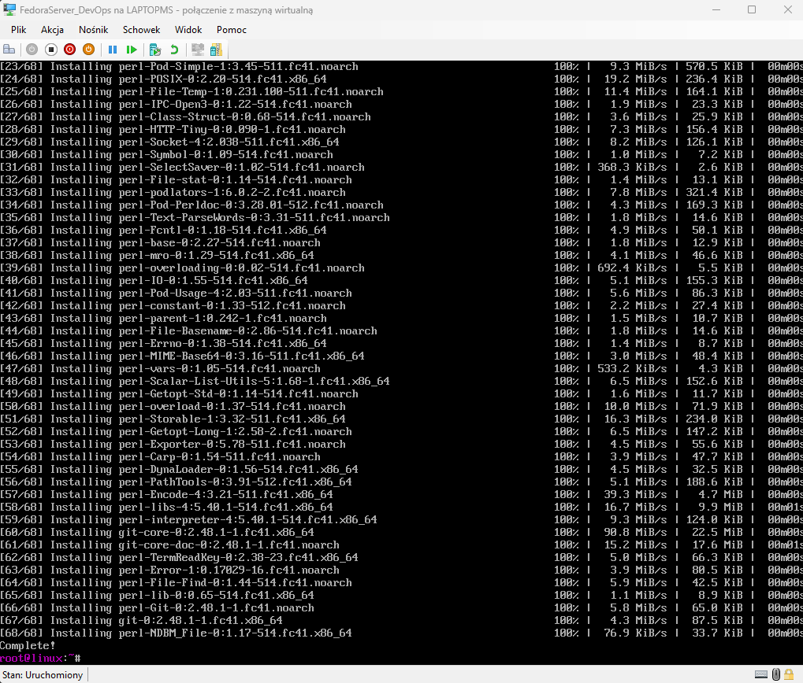

### Sprawdzenie działania SSH
#### Sprawdzenie adresu IP
```sh
ip a
```
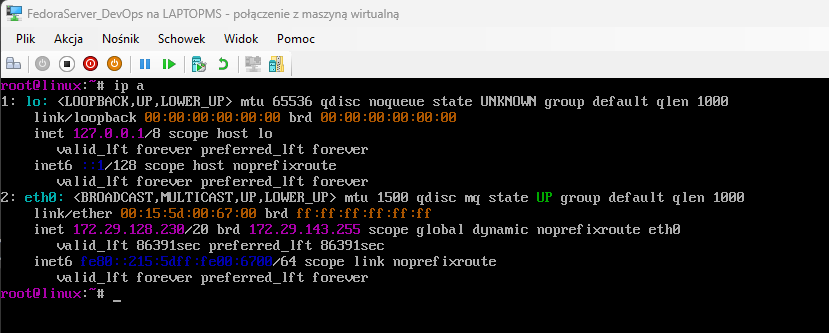

#### Połączenie z serwerem przez SSH
```sh
ssh uzytkownik@ip
```
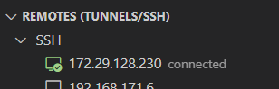

Jak widać, udało się podłączyć do serwera przez SSH.

---

## 2. Sklonowanie repozytorium przedmiotowego za pomocą HTTPS i personal access token

### Sklonowanie repozytorium przez HTTPS
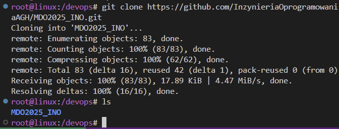

### Historia poleceń
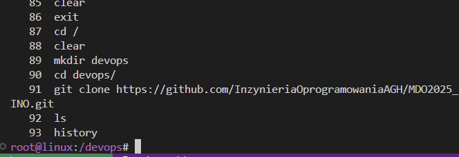

### Wygenerowanie kluczy SSH
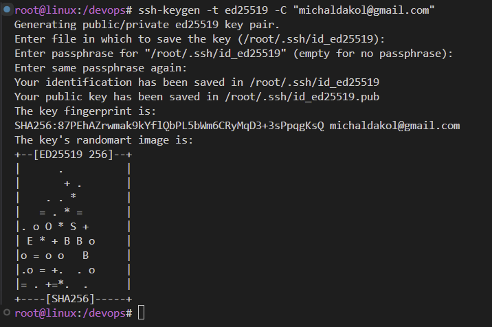
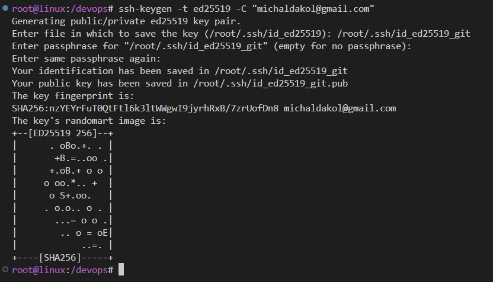

Klucz 1 i 2 (z hasłem)

### Historia poleceń
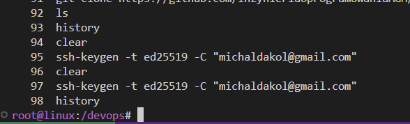

---

## 3. Skonfigurowanie dostępu na GitHubie i sklonowanie repozytorium za pomocą SSH

### Dodanie SSH-agenta i podpięcie kluczy
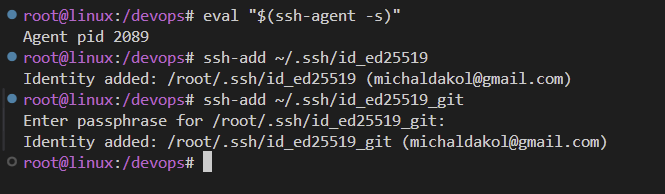

### Dodanie klucza SSH na GitHubie
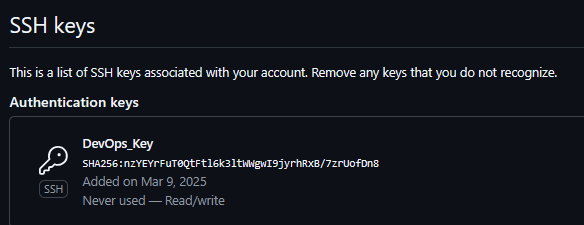

### Sklonowanie repozytorium za pomocą SSH
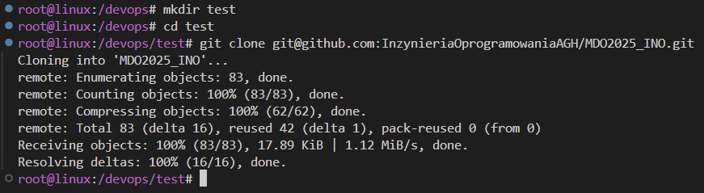

### Historia poleceń
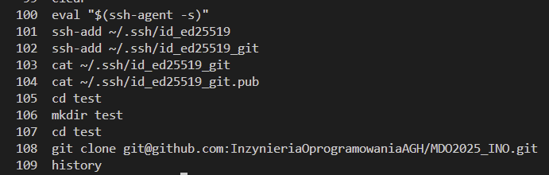

---

## 4. Przełączenie się na gałąź `main`, a potem na gałąź swojej grupy oraz utworzenie własnego brancha

### Przejście na odpowiednie gałęzie i stworzenie własnej gałęzi
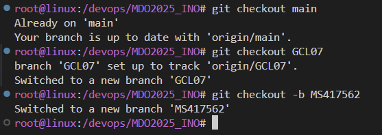

---

## 5. Rozpoczęcie pracy na nowej gałęzi

### Stworzenie katalogu na nowym branchu
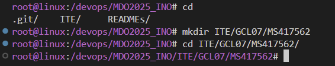

### Historia poleceń
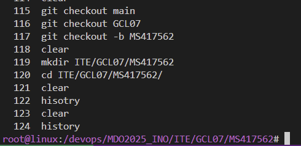

### Stworzenie Git Hooka
Plik `commit-msg`:
```sh
#!/bin/sh
FILE=$1
MSG=$(cat "$FILE")

if [[ ! $MSG =~ ^MS417562 ]]; then
    echo "ERROR: Invalid commit message. It has to begin with 'MS417562'."
    exit 1
fi
```
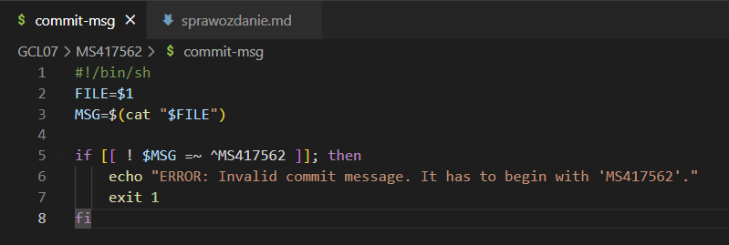

### Ustawienie dostępu
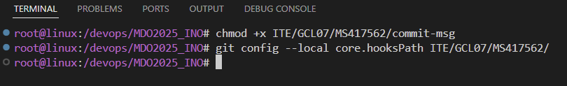

### Historia poleceń
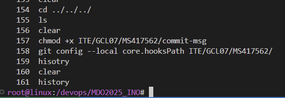

### Dodanie sprawozdania do katalogu
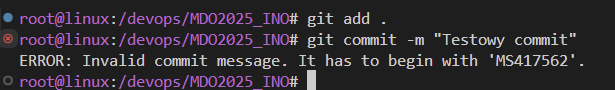


