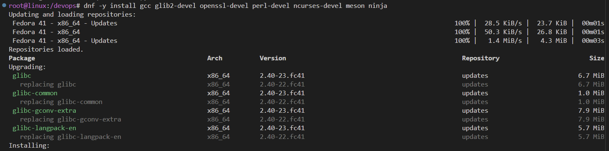
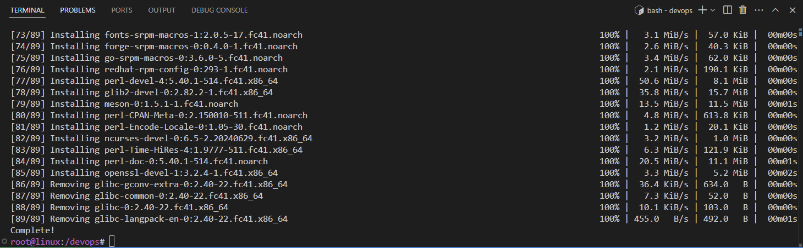
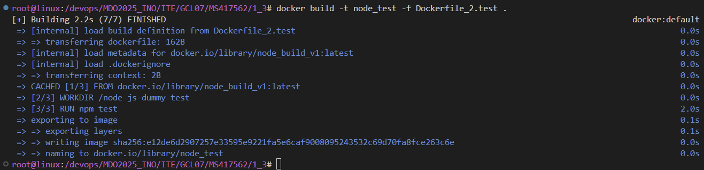

# ĆW 1 - Wprowadzenie, Git, Gałęzie, SSH

## 1. Instalacja Git i obsługa SSH

### Instalacja Git
```sh
sudo dnf install -y git
```


### Sprawdzenie działania SSH
#### Sprawdzenie adresu IP
```sh
ip a
```


#### Połączenie z serwerem przez SSH
```sh
ssh uzytkownik@ip
```


Jak widać, udało się podłączyć do serwera przez SSH.

---

## 2. Sklonowanie repozytorium przedmiotowego za pomocą HTTPS i personal access token

### Sklonowanie repozytorium przez HTTPS
```sh
git clone <link>
```


### Historia poleceń


### Wygenerowanie kluczy SSH
```sh
ssh-keygen -t <type> -C <mail>
```


Klucz 1 i 2 (z hasłem)

### Historia poleceń


---

## 3. Skonfigurowanie dostępu na GitHubie i sklonowanie repozytorium za pomocą SSH

### Dodanie SSH-agenta i podpięcie kluczy
```sh
eval "$(ssh-agent -s)"
ssh-add ~/.ssh/<key>
```


### Dodanie klucza SSH na GitHubie


### Sklonowanie repozytorium za pomocą SSH


### Historia poleceń


---

## 4. Przełączenie się na gałąź `main`, a potem na gałąź swojej grupy oraz utworzenie własnego brancha

### Przejście na odpowiednie gałęzie i stworzenie własnej gałęzi
```sh
git checkout <branch>
```


---

## 5. Rozpoczęcie pracy na nowej gałęzi

### Stworzenie katalogu na nowym branchu


### Historia poleceń


### Stworzenie Git Hooka
Plik `commit-msg`:
```sh
#!/bin/sh
FILE=$1
MSG=$(cat "$FILE")

if [[ ! $MSG =~ ^MS417562 ]]; then
    echo "ERROR: Invalid commit message. It has to begin with 'MS417562'."
    exit 1
fi
```


### Ustawienie dostępu
```sh
chmod +x <path>
git config --local core.hooksPath <path>
```


### Historia poleceń


### Dodanie sprawozdania do katalogu


### Test nieprawidłowego commita


### Poprawne wysłanie commita (na razie na root)


### Wysłanie zmian


Na koniec wysłanie aktualnej wersji tego sprawozdania na brancha

---

# ĆW 2 - Git, Docker

## 1. Zainstaluj Docker w systemie linuksowym

### Aktualizacja systemu
```bash
sudo dnf update -y
```


### Instalacja dockera (według dokumentacji)
```sh
sudo dnf -y install dnf-plugins-core
```


```sh
sudo dnf-3 config-manager --add-repo https://download.docker.com/linux/fedora/docker-ce.repo
```


```sh
dnf install docker-ce docker-ce-cli containerd.io docker-buildx-plugin docker-compose-plugin
```


```sh
systemctl enable --now docker
```


```sh
docker ps
```


## 2. Zaloguj się do Docker Hub

### Logowanie do dockera


## 3. Pobierz obrazy

### Ściągnięcie obrazów hello-world, busybox, fedora, mysql
```sh
docker pull hello-world
docker pull busybox
docker pull fedora
docker pull mysql
```


### Historia poleceń


## 4. Uruchom kontener z obrazu busybox

### Stworzenie kontenera z obrazu oraz sprawdzenie statusu na liście kontenerów
```sh
docker run -d --name <name> busybox
docker ps -a
```


### Uruchomienie kontenera w tybie interaktywnym i wypisanie numeru wersji
```sh
docker run -it --name <name> busybox sh
```
```sh
busybox | head -n 1
```


### Historia poleceń


## 5. Uruchomienie systemu w kontenerze

### Uruchomienie konteneru z obrazyu fedory i wypisanie wersji
```sh
docker run -it --name <name> fedora /bin/bash
```
```sh
cat /etc/os-release
```


### Pokazanie procesu o PID równym 1
```sh
ps aux
```


### Aktualizacja pakietów i wyjście
```sh
dnf upgrade

exit
```


## 6. Stworzenie własnego pliku Dockerfile i sklonowanie repo

### Stworzenie pliku Dockerfile
```Dockerfile
FROM ubuntu

RUN apt-get update && apt-get install -y git

WORKDIR /app
RUN git clone https://github.com/InzynieriaOprogramowaniaAGH/MDO2025_INO.git
```

### Zbudowanie obrazu na bazie pliku
```sh
docker build . -t <name>
```


### Uruchomienie kontenera na bazie obrazu
```sh
docker run -it <image_name>
```


### Wypisanie uruchomionych kontenerów
```sh
docker ps -a
```


### Zatrzymanie i wyczyszczenie kontenerów
```sh
docker stop <name>
docker rm <name>
```


### Historia poleceń


---

# ĆW 3 - Dockerfiles, kontener jako definicja etapu

## 1. Sklonowanie i wykonanie build i test na wybranym projekcie (na hoście)
### Praca na projekcie irssi

### Sklonowanie repo na hoście
```sh
git clone https://github.com/irssi/irssi
```


### Doinstalowanie potrzebnych bibliotek
```sh
dnf -y install gcc glib2-devel openssl-devel perl-devel ncurses-devel meson ninja
```



### Stworzenie builda aplikacji do katalogu Build
```sh
meson Build
ninja -C Build
```


### Doinstalowanie brakującej paczki 
```sh
dnf install perl-ExtUtils-Embed
```


### Powtórzenie generowania builda


### Uruchomienie testów aplikacji
```sh
ninja -C Build test
```


### Historia poleceń


## 2. Powtórzenie działań na kontenerze

### Uruchomienei kontenera na bazie obrazu fedory
```sh
docker run -it --name <name> fedore:latest /bin/bash
```


### Doinstalowanie bibliotek
```sh
dnf -y update && dnf -y install git ninja-build meson gcc glib2-devel openssl-devel ncurses-devel utf9proc-devel perl-ExtUtils-Embed
```


### Sklonowanie repo projektu
```sh
git clone https://github.com/irssi/irssi
```


### Przygotowanie katalogu Build dla meson
```sh
meson setup Build
```


### Zbudowanie aplikacji
```sh
ninja -C Build
```


### Uruchomienie testów
```sh
ninja -C Build test
```


### Historia poleceń


## 3. Przygotowanie plików Dockerfile do automatyzacji wcześniejszych kroków. Kontener pierwszy instaluje wszystko aż do build'a, a kontener drugi bazuje na pierwszym i uruchamia testy

### Plik Dockerfile do buildowania aplikacji
```Dockerfile
FROM fedora:latest

RUN dnf -y update && \
    dnf -y install git ninja-build meson gcc glib2-devel openssl-devel ncurses-devel utf8proc-devel perl-ExtUtils-Embed

RUN git clone https://github.com/irssi/irssi.git

WORKDIR /irssi

RUN meson setup Build

RUN ninja -C Build
```

### Zbudowanie obrazu
```sh
docker build -t <name> -f <Dockerfile> .
```


### Dockerfile do uruchamiania testów (bazujący na wcześniejszym obrazie)
```Dockerfile
FROM fedora_build_v1

WORKDIR /irssi

RUN ninja -C Build test
```

### Zbudowanie obrazu
```sh
docker build -t <name> -f <Dockerfile> .
```


### Stworzenie kontenera na podstawie obrazu. Wynik działania testów
```sh
docker run --rm --name <name> <image_name>
```


## 4. Stworzenie plików Dockerfile dla repo bazującego na node

### Dockerfile do budowania projektu
```Dockerfile
FROM node:latest

RUN apt-get update && git clone https://github.com/devenes/node-js-dummy-test.git

WORKDIR /node-js-dummy-test

RUN npm install
```

### Zbudowanie obrazu
```sh
docker build -t <name> -f <Dockerfile> .
```


### Dockerfile do testów
```Dockerfile
FROM node_build_v1

WORKDIR /node-js-dummy-test

RUN npm test
```

### Zbudowanie obrazu (obraz poprawnie się stworzył, więc testy przeszły)
```sh
docker build -t <name> -f <Dockerfile> .
```


---

# ĆW 4 - Dodatkowa terminologia w konteneryzacji, instancja Jenkins

## 1. Zachowywanie stanu

### Przygotowanie dwóch woluminów (vol_1 - wejściowy; vol_2 - wyjściowy). 
```sh
docker volume create vol_1
docker volume create vol_2
```


### Przygotowanie Dockerfile bez git'a do uruchomienia projektu
```Dockerfile
FROM node:20-slim

RUN apt-get update

CMD ["/bin/bash"]
```

### Zbudowanie obrazu
```sh
docker build -t <name> -f <Dockerfile> .
```


### Stworzenie kontenera na podstawie obrazu z podpięciem naszych woluminów. Wypisanie zawartości dla potwierdzenia podpięcia woluminów
```sh
docker run -it --name <name> -v vol_1:/vol_1 -v vol_2:/vol_2 <image_name> /bin/bash
```
```sh
ls
```


### Sklonowanie repozytorium na pierwszy wolumin (wejściowy). Ponieważ nie możemy skorzystać z git'a na głównym kontenerze, tworzymy kontener pomocniczy, który posiada git'a. Z jego poziomu klonujemy repo na podpiety wolumin. Dodajemy --rm, żeby kontener po zakończeniu zadania został usunięty.

### Pobranie obrazu alpine z gitem
```sh
docker pull alpine/git
```


### Stworzenie kontenera i sklonowanie repo
```sh
docker run --rm -v vol_1:/vol_1 alpine/git clone https://github.com/devenes/node-js-dummy-test.git /vol_1
```


### Podpięcie do shella głównego kontenera i sprawdzenie zawartości woluminu (pliki poprawnie sklonowane)


### Z poziomu głównego kontenera wywołanie builda na woluminie wejściowym
```sh
npm install
```


### Historia poleceń


### Kopiowanie powstałych plików na wolumin wyjściowy (node_modules). Sprawdzenie zawartości woluminu
```sh
cp -r /vol_1/node_modules /vol_2
ls vol_2
```


### Ponowienie operacji klonowania na wolumin wyjściowy za pomocą głównego kontenera (wykorzystanie Dockerfile)
```Dockerfile
FROM node:20

RUN apt-get update

WORKDIR /app

RUN git clone https://github.com/devenes/node-js-dummy-test.git 

VOLUME /vol_1
VOLUME /vol_2

CMD ["sh", "-c", "\
    cp -r /app/. /vol_1/ && \
    /bin/bash"]
```

### Zbudowanie obrazu, uruchomienie kontenera z podpiętymi woluminami i sprawdzenie zawartośco
```sh
docker build -t <name> -f <Dockerfile> .
docker run -it --name <name> -v vol_1:/vol_1 -v vol_2:/vol_2 <image_name> bash
```
```sh
ls
```


## 2. Eksponowanie portu

### Przygotowanie Dockerfile pod iperf3 serwerowy
```Dockerfile
FROM ubuntu:latest

RUN apt-get update && apt-get install -y iperf3

EXPOSE 5201

CMD ["iperf3", "-s"]
```

### Zbudowanie obrazu
```sh
docker build -t <name> -f <Dockerfile> .
```


### Uruchomienei kontenera (detached i z przekierowaniem portu iperf3 5201) na podstawie obrazu i sprawdzenie jego stanu
```sh
docker run -d -p 5201:5201 --name <name> <image_name>
docker ps -a
```


### Podpięcie do innego kontenera ( w tym przypadku fedora z lab2). Doinstalowanie iperf3
```sh
sudo dnf install -y iperf3
```


### Przetestowanie działania iperf3. Ponieważ działamy na domyślnej siecii, odwoływanie się po nazwach kontenerów nie działa. Musimy podawać adresy IP. Serwer iperf3 ma adres IP 172.17.0.2 i z nim próbujemy zbadać ruch
```sh
iperf3 -c <name>
iperf3 -c <ip>
```


### Do dalszych testów przygotowanie Dockerfile pod obraz iperf3 klienta
```Dockerfile
FROM ubuntu:latest

RUN apt-get update && apt-get install -y iperf3

CMD ["/bin/bash"]
```

### Zbudowanie obrazu
```sh
docker build -t <name> -f <Dockerfile> .
```


### Stworzenie własnej dedykowanej siecii mostkowej
```sh
docker network create <name>
```


### Uruchomienie kontenera iperf3 serwerowego z wystawionym portem, detached oraz podłączonego do naszej nowej siecii.
```sh
docker run -d --net=<net_name> -p 5201:5201 --name <name> <image_name>
```
### Następnie uruchomienie kontenera iperf3 klienckiego również podpiętego do nowej siecii. Jako polecenie testuje ruch z kontenerem serwerowym poprzez odwołanie do nazwy kontenera
```sh
docker run --rm  -it--net=<net_name> --name <name> <image_name> iperf3 -c <container_name>
```


### Test ruchu z poziomu hosta (możliwa potrzeba doinstalowania iperf3)
```sh
iperd3 -c localhost
```


### Test spoza hosta. Na potrzeby testów stworzenie konetenera na głównym komputerze z systemem Windows. Kontener na bazie obrazu ubuntu, doinstalowano iperf i upewniono się, że jest w tej samej siecii. 

```sh
iperf3 -c <ip> -p <port>
```


## 3. Instalacja Jenkins według dokumentacji

### Stworzenie nowej siecii i uruchomienie dockera na bazie obrazu docker:dind
```sh
docker network create jenkins

docker run \
  --name jenkins-docker \
  --rm \
  --detach \
  --privileged \
  --network jenkins \
  --network-alias docker \
  --env DOCKER_TLS_CERTDIR=/certs \
  --volume jenkins-docker-certs:/certs/client \
  --volume jenkins-data:/var/jenkins_home \
  --publish 2376:2376 \
  docker:dind \
  --storage-driver overlay2
```


### Sprawdzenie stanu kontenera
```sh
docker ps -a
```


### Przygotowanie Dockerfile na bazie oficjalnego Jenkins Docker image
```Dockerfile
FROM jenkins/jenkins:2.492.2-jdk17
USER root
RUN apt-get update && apt-get install -y lsb-release ca-certificates curl && \
    install -m 0755 -d /etc/apt/keyrings && \
    curl -fsSL https://download.docker.com/linux/debian/gpg -o /etc/apt/keyrings/docker.asc && \
    chmod a+r /etc/apt/keyrings/docker.asc && \
    echo "deb [arch=$(dpkg --print-architecture) signed-by=/etc/apt/keyrings/docker.asc] \
    https://download.docker.com/linux/debian $(. /etc/os-release && echo \"$VERSION_CODENAME\") stable" \
    | tee /etc/apt/sources.list.d/docker.list > /dev/null && \
    apt-get update && apt-get install -y docker-ce-cli && \
    apt-get clean && rm -rf /var/lib/apt/lists/*
USER jenkins
RUN jenkins-plugin-cli --plugins "blueocean docker-workflow"
```

### Zbudowanie obrazu
```sh
docker build -t myjenkins-blueocean:2.492.2-1 -f <Dockerfile> .
```


### Uruchomienie kontenera jenkinsa blueocean na podstawie obrazu. Sprawdzenie stanu kontenerów
```sh
docker run \
  --name jenkins-blueocean \
  --restart=on-failure \
  --detach \
  --network jenkins \
  --env DOCKER_HOST=tcp://docker:2376 \
  --env DOCKER_CERT_PATH=/certs/client \
  --env DOCKER_TLS_VERIFY=1 \
  --publish 8080:8080 \
  --publish 50000:50000 \
  --volume jenkins-data:/var/jenkins_home \
  --volume jenkins-docker-certs:/certs/client:ro \
  myjenkins-blueocean:2.492.2-1

  docker ps -a
```


### Odpalenie Jenkins w przeglądarce (adres maszyny)


### Wejście do konsoli jenkins dndi i odczytania hasła inicjacji admina
```sh
cat /var/jenkins_home/secrets/initialAdminPassword
```


### Stworzenie pierwszego administratora


### Udane uruchomienie i konfiguracja Jenkinsa
