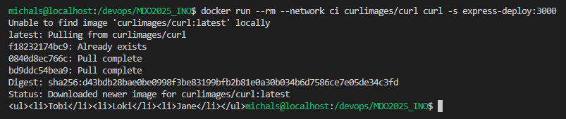

## LAB 6

Dockerfile

```sh
docker build -f build.Dockerfile -t express-build-img .
```


Dockerfile

```sh
docker build -f test.Dockerfile -t express-test-img .
```


Dockerfile

```sh
docker build -f deploy.Dockerfile -t express-deploy-img .
```


```sh
docker network create ci
```


```sh
docker run -dit --rm --network ci --name express-deploy -p 3000:3000 express-deploy-img
```





```sh
docker build -f deploy.Dockerfile -t msior/express-deploy-img:latest .
```


```sh
docker push msior/express-deploy-img:latest
```


