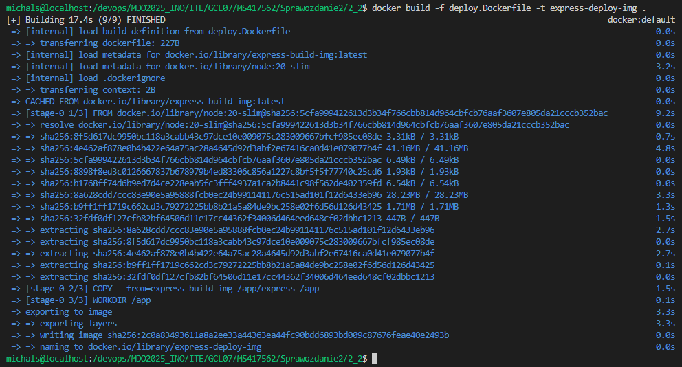
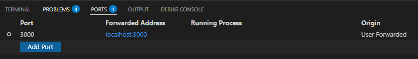
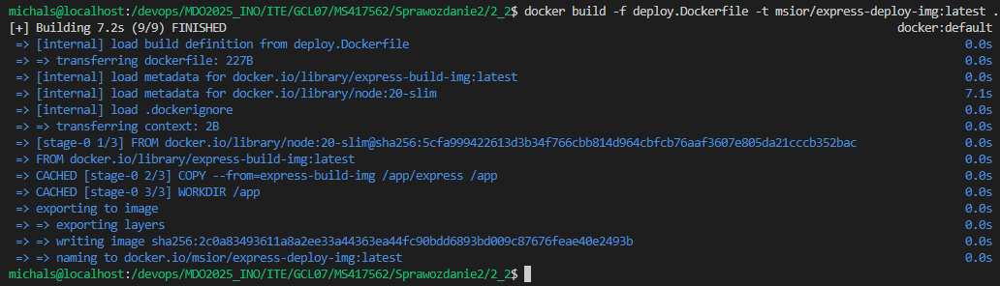
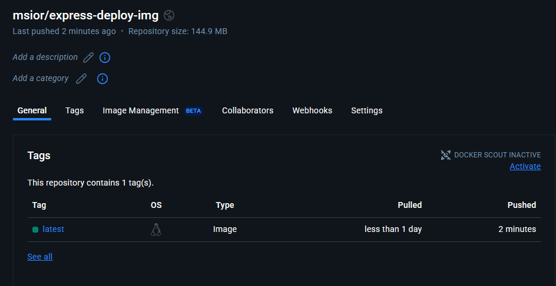
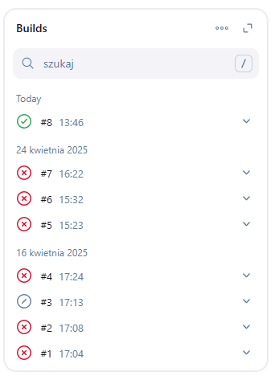
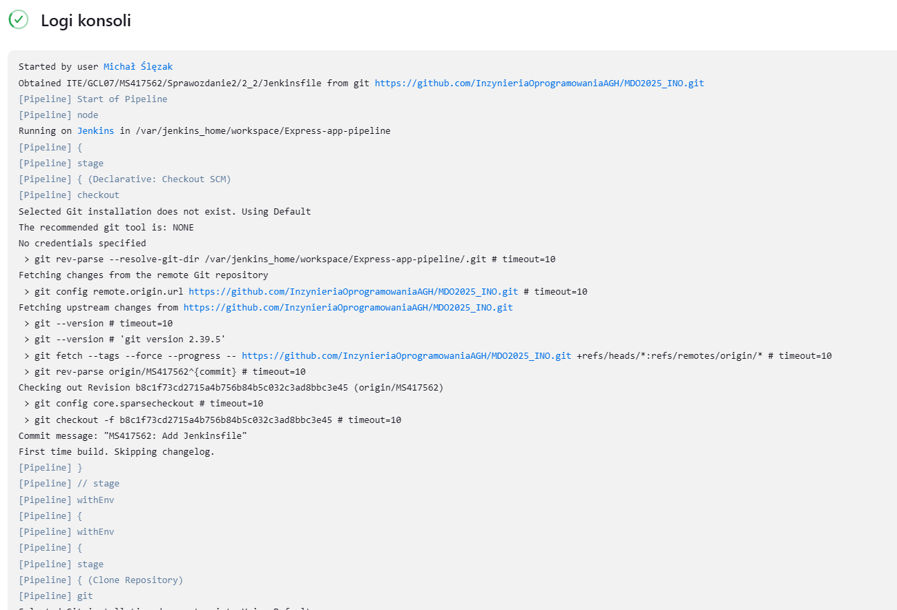

## LAB 6

Dockerfile

```sh
docker build -f build.Dockerfile -t express-build-img .
```


Dockerfile

```sh
docker build -f test.Dockerfile -t express-test-img .
```


Dockerfile

```sh
docker build -f deploy.Dockerfile -t express-deploy-img .
```


```sh
docker network create ci
```


```sh
docker run -dit --rm --network ci --name express-deploy -p 3000:3000 express-deploy-img
```

  
  
  
  
  


```sh
docker build -f deploy.Dockerfile -t msior/express-deploy-img:latest .
```
  


```sh
docker push msior/express-deploy-img:latest
```


```sh
pipeline {
    agent any

    environment {
        APP_DIR = 'ITE/GCL07/MS417562/Sprawozdanie2/2_2'
    }

    stages {
        stage('Clone Repository') {
            steps {
                git branch: 'MS417562', url: 'https://github.com/InzynieriaOprogramowaniaAGH/MDO2025_INO.git'
            }
        }

        stage('Cleaning') {
            steps {
                dir("${APP_DIR}") {
                    sh 'docker rmi -f express-build-img || true'
                    sh 'docker rmi -f express-test-img || true'
                    sh 'docker rmi -f msior/express-deploy-img || true'
                    sh 'docker builder prune --force --all || true'
                    sh 'docker network rm ci || true'
                    sh 'docker rm -f express-deploy || true'
                }
            }
        }

        stage('Build Build image') {
            steps {
                dir("${APP_DIR}") {
                    sh 'docker build -f build.Dockerfile -t express-build-img .'
                }
            }
        }

        stage('Build Test Image') {
            steps {
                dir("${APP_DIR}") {
                    sh 'docker build -f test.Dockerfile -t express-test-img .'
                }
            }
        }
        
        stage('Build Deploy Image') {
            steps {
                dir("${APP_DIR}") {
                    sh 'docker build -f deploy.Dockerfile -t msior/express-deploy-img:latest .'
                }
            }
        }

        stage('Run and Test App') {
            steps {
                dir("${APP_DIR}") {
                    sh '''
                        docker network create ci || true
                        docker run -dit --rm --network ci --name express-deploy -p 3000:3000 msior/express-deploy-img:latest
                        sleep 5
                        docker run --rm --network ci curlimages/curl curl -s --fail express-deploy:3000
                    '''
                }
            }
        }

        stage('Publish to Dockerhub') {
            steps {
                script {
                    withCredentials([usernamePassword(
                        credentialsId: 'dockerhub-creds',
                        usernameVariable: 'DOCKER_USER',
                        passwordVariable: 'DOCKER_PASS'
                    )]) {
                        sh "echo ${DOCKER_PASS} | docker login -u ${DOCKER_USER} --password-stdin"
                    }

                    docker.withRegistry('https://registry.hub.docker.com', 'dockerhub-creds') {
                        docker.image("msior/express-deploy-img:latest").push()
                    }
                }
            }
        }
    }
}
```

  
  
  
  
  



```sh
        stage('Create .tgz Artifact') {
            steps {
                dir("${APP_DIR}") {
                    sh '''
                        docker create --name temp_pack msior/express-deploy-img:latest
                        docker cp temp_pack:/app ./app-content
                        docker rm temp_pack
        
                        docker run --rm -v "$PWD/app-content":/app -w /app node:20 npm pack
                    '''
                    archiveArtifacts artifacts: 'app-content/*.tgz', fingerprint: true
                }
            }
        }
```




