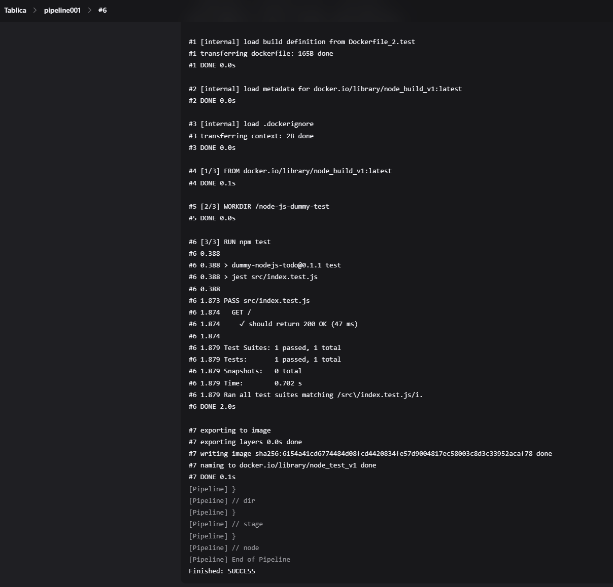

# ĆW 5 - Pipeline, Jenkins, izolacja etapów

## 1. Utwórz instancję Jenkins

#### Wykonane w sprawozdaniu 1 - [Sprawozdanie1](../Sprawozdanie1/README.md#3-instalacja-jenkins-według-dokumentacji)

## 2. Zadanie wstępne: uruchomienie

### - Projekt wyświetlający uname

#### Wybieramy nowy projekt


#### Nadajemy nazwę i typ "Ogólny projekt"


#### W krokach budowania wybieramy "Uruchom powłokę"


#### Jako polecenie wpisujemy
```sh
uname -a
```


#### Uruchamiamy i sprawdzamy wynik w logach konsoli


### Projekt zwracający błąd kiedy godzina jest nieparzysta

#### Tworzymy nowy projekt i wpisujemy polecenie
```sh
#!/bin/bash

current_hour=$(date +%H)
if [ $((current_hour % 2)) -ne 0 ]; then
  echo "BŁĄD: Godzina jest nieparzysta ($current_hour)"
  exit 1
fi
```


#### Sprawdzamy wynik w konsoli


### Projekt pobierający obraz kontenera ubuntu (docker pull)

#### Wpisujemy polecenie do nowego projektu
```sh
docker images 
docker pull ubuntu 
docker images
```


#### Sprawdzamy wynik w konsoli


## 3. Zadanie wstępne: obiekt typu pipeline

#### Tworzymy nowy projekt typu pipeline


#### Wybieramy Pipeline script i tworzymy nowy pipeline
```sh
pipeline {
    agent any

    stages {
        stage('Clean') {
            steps {
                cleanWs()
            }
        }
        
        stage('Clone') {
            steps {
                git url: 'https://github.com/InzynieriaOprogramowaniaAGH/MDO2025_INO.git', branch: 'main'
            }
        }
        
        stage('Checkout Branch') {
            steps {
                sh 'git checkout MS417562'
            }
        }
        
        stage('Remove Docker Images') {
            steps {
                sh 'docker rmi -f my-build-image my-test-image'
            }
        }
        
        stage('Clear Docker Cache') {
            steps {
                sh 'docker builder prune -a -f'
            }
        }
        
        stage('Build image') {
            steps {
                dir('ITE/GCL07/MS417562/Sprawozdanie1/1_3') {
                    sh 'docker build -f Dockerfile_2.build -t node_build_v1 .'
                }
            }
        }
        
        stage('Test image') {
            steps {
                dir('ITE/GCL07/MS417562/Sprawozdanie1/1_3') {
                    sh 'docker build -f Dockerfile_2.test -t node_test_v1 .'
                }
            }
        }
    }
}
```


#### Wyniki buildow pipeline'a


#### Pierwsze udane uruchomienie pipeline'a


#### Drugie udane uruchomienie (Potwierdzenie ponownego działania)


#### W etapie "Clear Docker Cache" cały cache jest czyszczony


# ĆW 6/7 - Pipeline własnego projektu

### Wykorzystany projekt to [Express.js](https://github.com/expressjs/express)

## Diagram 


## Przygotowanie procesu lokalnie

#### Obraz etapu Build
```Dockerfile
FROM node:20
WORKDIR /app
RUN git clone https://github.com/expressjs/express.git
WORKDIR /app/express
RUN npm install
```

#### Budowa obrazu
```sh
docker build -f build.Dockerfile -t express-build-img .
```


#### Obraz etapu Test
```Dockerfile
FROM express-build-img

WORKDIR /app/express

RUN npm test
```

#### Budowa obrazu
```sh
docker build -f test.Dockerfile -t express-test-img .
```


#### Obraz etapu Deploy
```Dockerfile
FROM node:20-slim

COPY --from=express-build-img /app/express /app

WORKDIR /app

CMD ["node", "examples/content-negotiation"]
```

#### Budowa obrazu
```sh
docker build -f deploy.Dockerfile -t express-deploy-img .
```


#### Stworzenie siecii ci
```sh
docker network create ci
```


#### Uruchomienie kontenera
```sh
docker run -dit --rm --network ci --name express-deploy -p 3000:3000 express-deploy-img
```
  


#### Sprawdzenie logów (wszystko działa)
  

#### Udostępnienie portów przez VSC
  

#### Test działania na przeglądarce
  

#### Uruchomienie kontenera który wykonuje curl na adres z naszym porjektem
```sh
docker run --rm --network ci curlimages/curl curl -s express-deploy:3000
```
  

#### Zbudowanie obrazu deploy pod nową nazwą (przygotowanie pod docker push na docker hub'a)
```sh
docker build -f deploy.Dockerfile -t msior/express-deploy-img:latest .
```
  

#### Zalogowanie się na docker'a


#### Docker push obrazu
```sh
docker push msior/express-deploy-img:latest
```


## Przygotowanie pipeline na Jenkins

#### Dodanie poświadczeń do docker huba


#### Stworzenie pipeline'a
```sh
pipeline {
    agent any

    environment {
        APP_DIR = 'ITE/GCL07/MS417562/Sprawozdanie2/2_2'
    }

    stages {
        stage('Clone Repository') {
            steps {
                git branch: 'MS417562', url: 'https://github.com/InzynieriaOprogramowaniaAGH/MDO2025_INO.git'
            }
        }

        stage('Cleaning') {
            steps {
                dir("${APP_DIR}") {
                    sh 'docker rmi -f express-build-img || true'
                    sh 'docker rmi -f express-test-img || true'
                    sh 'docker rmi -f msior/express-deploy-img || true'
                    sh 'docker builder prune --force --all || true'
                    sh 'docker network rm ci || true'
                    sh 'docker rm -f express-deploy || true'
                }
            }
        }

        stage('Build Build image') {
            steps {
                dir("${APP_DIR}") {
                    sh 'docker build -f build.Dockerfile -t express-build-img .'
                }
            }
        }

        stage('Build Test Image') {
            steps {
                dir("${APP_DIR}") {
                    sh 'docker build -f test.Dockerfile -t express-test-img .'
                }
            }
        }
        
        stage('Build Deploy Image') {
            steps {
                dir("${APP_DIR}") {
                    sh 'docker build -f deploy.Dockerfile -t msior/express-deploy-img:latest .'
                }
            }
        }

        stage('Run and Test App') {
            steps {
                dir("${APP_DIR}") {
                    sh '''
                        docker network create ci || true
                        docker run -dit --rm --network ci --name express-deploy -p 3000:3000 msior/express-deploy-img:latest
                        sleep 5
                        docker run --rm --network ci curlimages/curl curl -s --fail express-deploy:3000
                    '''
                }
            }
        }

        stage('Publish to Dockerhub') {
            steps {
                script {
                    withCredentials([usernamePassword(
                        credentialsId: 'dockerhub-creds',
                        usernameVariable: 'DOCKER_USER',
                        passwordVariable: 'DOCKER_PASS'
                    )]) {
                        sh "echo ${DOCKER_PASS} | docker login -u ${DOCKER_USER} --password-stdin"
                    }

                    docker.withRegistry('https://registry.hub.docker.com', 'dockerhub-creds') {
                        docker.image("msior/express-deploy-img:latest").push()
                    }
                }
            }
        }
    }
}
```
#### Wynik działania testów (wszystkie przeszły)
  

#### Wynik działania curl'a (Dane otrzymane)
  

#### Wysyłanie obrazu (U mnie trwało to z jakiegoś powodu 40 min dla obrazu ~80 MB)
  

#### Ddane zakończenie pipeline'a
  

#### Obraz znajduje się na docker-hub'ie
  

#### Historia buildów pipeline'a (Większość nieudanych prób to problemy z docker pushem lub miejscem na maszynie)


#### Dodanie etapu tworzenia artefaktu .tgz
```sh
        stage('Create .tgz Artifact') {
            steps {
                dir("${APP_DIR}") {
                    sh '''
                        docker create --name temp_pack msior/express-deploy-img:latest
                        docker cp temp_pack:/app ./app-content
                        docker rm temp_pack
        
                        docker run --rm -v "$PWD/app-content":/app -w /app node:20 npm pack
                    '''
                    archiveArtifacts artifacts: 'app-content/*.tgz', fingerprint: true
                }
            }
        }
```

#### Stworzenie pliku Jenkinsfile na naszym repo - [Jenkinsfile](2_2/Jenkinsfile)

#### Zmiana konfiguracji pipelnie na SCM - ustawienie repo, brancha i ścieżki do Jenkinsfile


#### Uruchomienie po zmianie konfiguracji. Jak widać na początku pobiera Jenkinsfile z repo


#### Kolejny udany build wraz z artefaktem (pipeline po raz kolejny poprawnie się wykonał)
