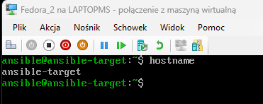
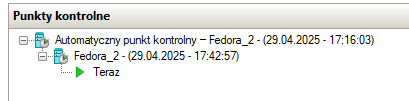
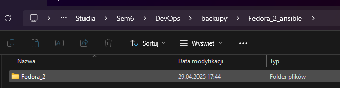
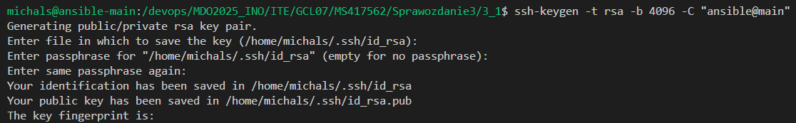
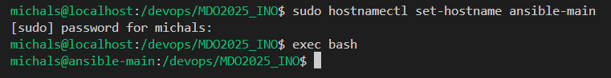
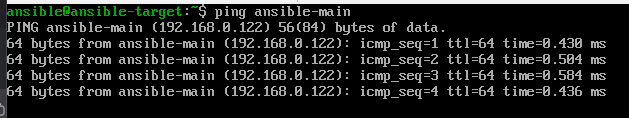
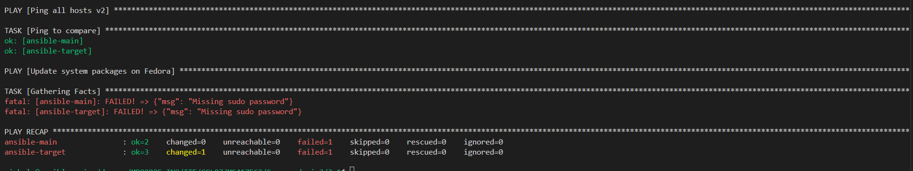
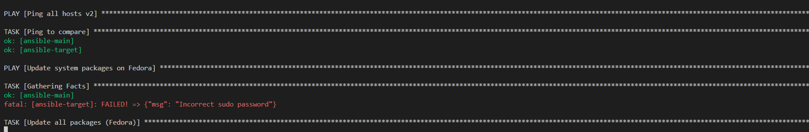
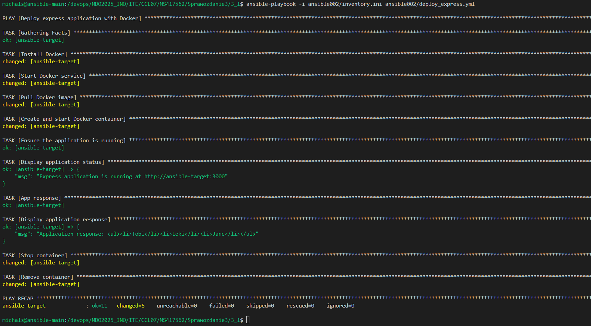

PPM i "Punkt kontrolny"



PPM i "Eksportuj"









Na dwoch maszynach





```yaml
- name: Ping all hosts
  hosts: all
  gather_facts: no
  tasks:
    - name: Ping
      ansible.builtin.ping:
```




Dodac w inventory.ini ansible_user i ansible_become_password
lub
--ask-become-pass



```
[Orchestrators]
ansible-main ansible_user=michals ansible_become_pass=123

[Endpoints]
ansible-target ansible_user=ansible ansible_become_pass=ansible
```


